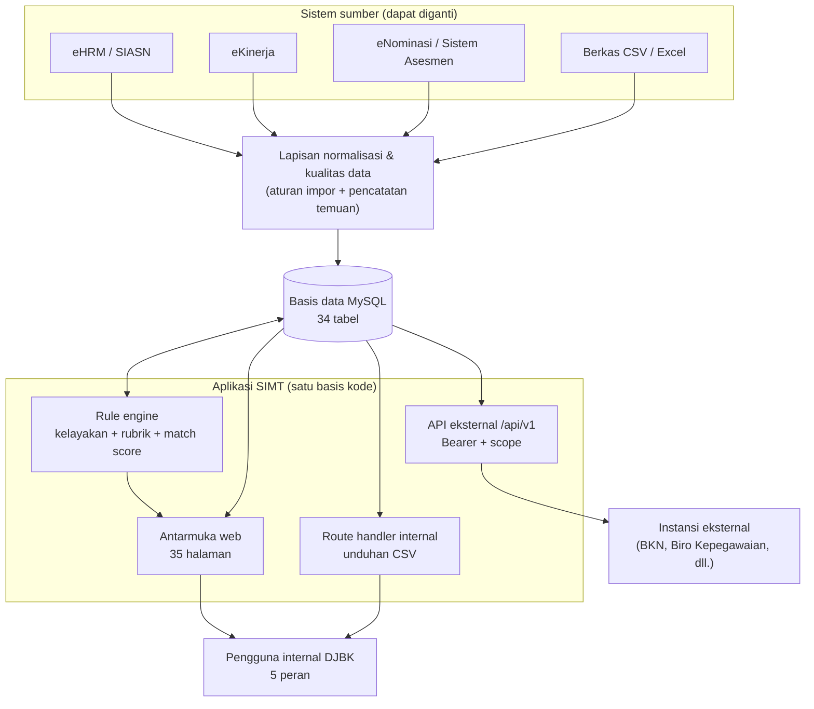
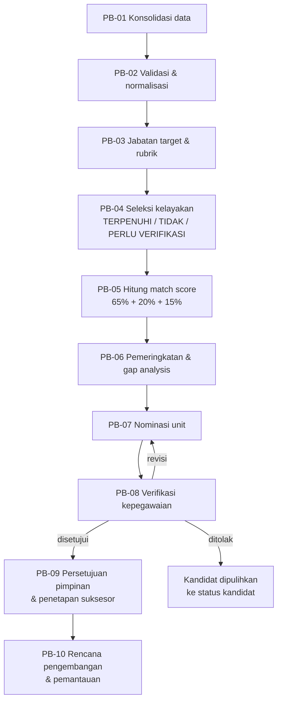
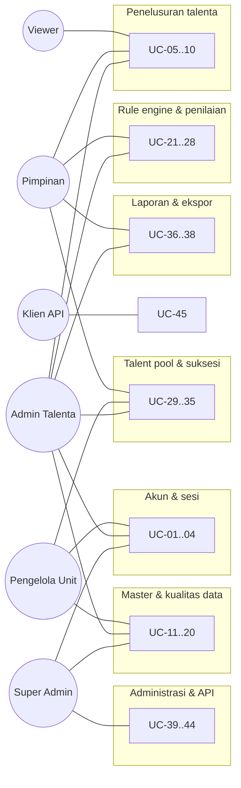
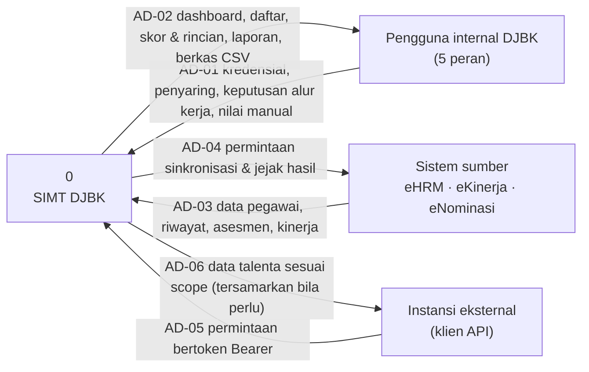
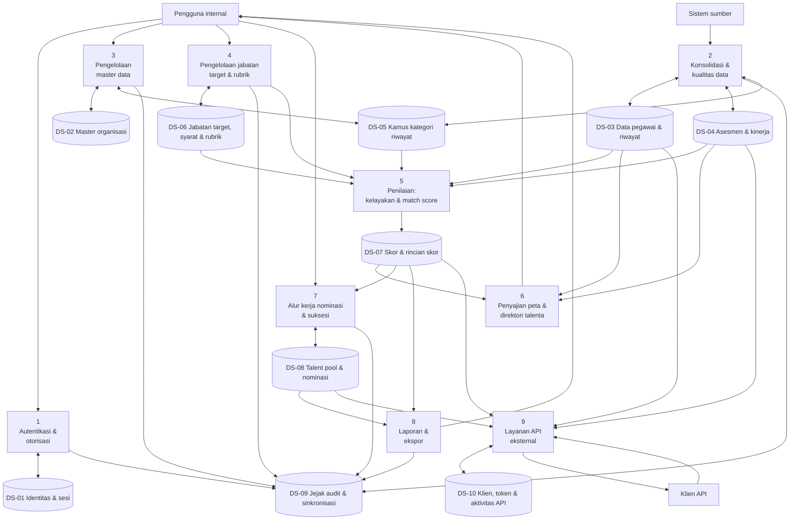
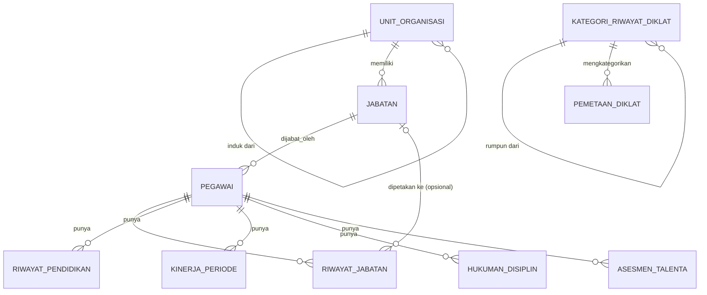
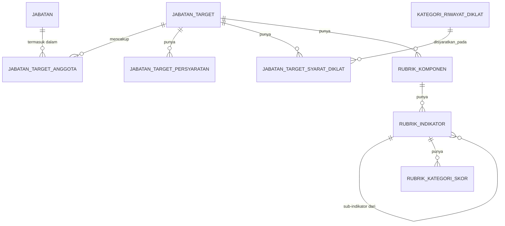
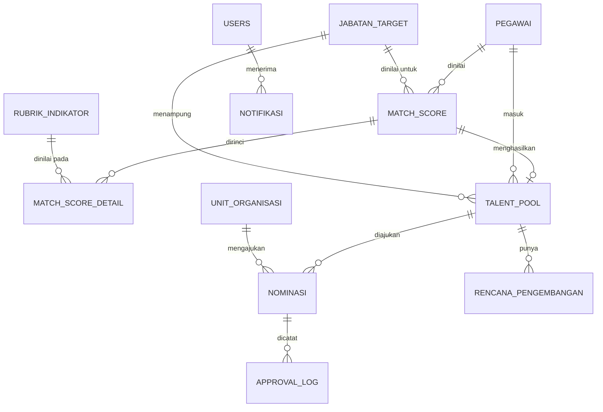
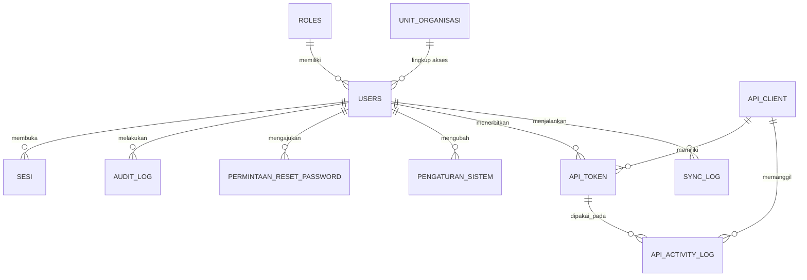

# SPESIFIKASI KEBUTUHAN PERANGKAT LUNAK (SRS)

## SIMT DJBK — Sistem Informasi Manajemen Talenta

**Instansi:** Direktorat Jenderal Bina Konstruksi, Kementerian Pekerjaan Umum
**Sistem:** SIMT DJBK — modul peningkatan fitur *karir.pu.go.id*
**Arsitektur:** Aplikasi web *full-stack* (Next.js App Router) + MySQL
**Versi dokumen:** 1.0
**Status:** disusun dari sistem yang **sudah berjalan** (Fase 0–11 selesai), bukan dari rancangan yang belum dibangun

---

> **Catatan untuk konversi ke Word.** Seluruh isi dokumen ini berupa teks & tabel Markdown yang aman disalin ke Word. Diagram disajikan **dua kali**: sebagai blok kode Mermaid (untuk dirender di [mermaid.live](https://mermaid.live) lalu ditempel sebagai gambar) **dan** sebagai tabel/uraian tekstual yang setara — jadi kalau blok Mermaid dilewati, isinya tidak hilang.

---

# 1. Pendahuluan

## 1.1. Tujuan Penulisan Dokumen

Dokumen Spesifikasi Kebutuhan Perangkat Lunak (*Software Requirements Specification*, SRS) ini menetapkan **apa** yang harus dilakukan SIMT DJBK, bukan **bagaimana** ia diimplementasikan di tingkat kode. Tujuannya empat:

1. **Menjadi rujukan tunggal kebutuhan** bagi pemilik proses (Bagian Kepegawaian dan Umum Setditjen Bina Konstruksi), pengembang, penguji, dan auditor — sehingga perbedaan tafsir diselesaikan di dokumen, bukan di tengah pembangunan.
2. **Menjadi dasar verifikasi & validasi.** Setiap kebutuhan fungsional pada §3.4.1 diberi pengenal unik agar dapat dirunut ke kasus uji dan ke keputusan bisnis yang melahirkannya (§3.4.3).
3. **Merekam keputusan yang sudah diambil beserta alasannya**, termasuk keputusan yang sengaja diambil sebagai *default* karena pemilik proses belum memutuskan. Keputusan semacam itu ditandai eksplisit agar tidak terbaca sebagai kesepakatan final.
4. **Menjadi bahan serah terima** (*handover*) kepada Tim IT DJBK untuk pemeliharaan lanjutan.

**Pembaca yang dituju:** pemilik proses & pemangku kepentingan kepegawaian DJBK, tim pengembang, tim penjaminan mutu, auditor internal, serta pihak ketiga yang akan mengonsumsi API eksternal.

**Kedudukan dokumen.** SRS ini **memampatkan dan menstrukturkan** dokumen yang lebih rinci yang sudah ada di repositori — `doc/PRD.md` (spesifikasi produk), `doc/ERD.md` (skema data), `doc/KERANGKA TALENT POOL.md` (rubrik penilaian), dan `phase.md` (rencana eksekusi & keputusan teknis). Bila terjadi perbedaan, **dokumen sumber di `doc/` tetap yang berlaku**; SRS ini tidak menggantikannya.

## 1.2. Lingkup Masalah

### 1.2.1. Masalah yang diselesaikan

DJBK memiliki **1.872 ASN** yang tersebar pada **48 unit kerja dan unit pelaksana teknis** (BP2JK dan BJKW), dengan **67% berstatus jabatan fungsional**. Data talenta pegawai sudah ada, tetapi **tersebar pada beberapa aplikasi** (eNominasi, eHRM, eKinerja) dan belum membentuk peta talenta yang dapat menjawab satu pertanyaan operasional:

> *"Siapa yang siap mengisi jabatan strategis X, secara cepat, objektif, dan terdokumentasi?"*

Akibat yang tercatat sebelum sistem ini dibangun: belum ada SOP manajemen talenta, belum ada talent pool terdokumentasi, belum ada dashboard talenta, dan belum ada mekanisme suksesi terstruktur.

### 1.2.2. Dalam lingkup

| # | Lingkup | Keterangan |
|---|---|---|
| L-1 | **Konsolidasi & kualitas data talenta** | Normalisasi data dari sistem sumber, pengukuran kelengkapan, antrian pembersihan, validasi riwayat oleh manusia |
| L-2 | **Master data** | Unit organisasi (hierarkis), jabatan, kategori riwayat diklat, rekam jejak hukuman disiplin |
| L-3 | **Rule engine penilaian** | Jabatan target, persyaratan kelayakan, rubrik berjenjang (Komponen → Indikator → Kategori Skor) yang dapat dikonfigurasi tanpa mengubah kode |
| L-4 | **Perhitungan kelayakan & match score** | Formula A (Nilai Talenta / Kotak 9) dan Formula B (match score per jabatan target), beserta rincian sampai sub-indikator |
| L-5 | **Peta talenta & perbandingan kandidat** | Grid 9 Kotak, sebaran Kinerja × Potensial, perbandingan 2–4 kandidat |
| L-6 | **Talent pool & workflow nominasi** | Pengajuan oleh unit, verifikasi kepegawaian, persetujuan pimpinan, penetapan suksesor, rencana pengembangan |
| L-7 | **Laporan & ekspor** | Gap analysis per indikator, rekap nominasi & approval, pusat ekspor CSV |
| L-8 | **Autentikasi, otorisasi, dan jejak audit** | Akun lokal, sesi berbasis basis data, RBAC 5 peran, pembatasan data per unit, audit log |
| L-9 | **API eksternal bertoken** | `/api/v1` *read-only* dengan autentikasi Bearer dan pembatasan cakupan (*scope*) per klien |

### 1.2.3. Di luar lingkup

| # | Di luar lingkup | Alasan |
|---|---|---|
| X-1 | Menggantikan atau mematikan eHRM, eNominasi, eKinerja | Sistem ini **mengonsumsi** data mereka, bukan menggantikan |
| X-2 | *Self-service portal* pegawai (pegawai melihat profilnya sendiri) | Dicatat sebagai kandidat fase panjang/opsional |
| X-3 | Modul kepegawaian di luar manajemen talenta (penggajian, cuti, presensi) | Bukan sasaran modul |
| X-4 | Penyimpanan berkas arsip (ijazah, sertifikat, SK) | Kolom `url_*` menyimpan **rujukan**; penyimpanan objeknya belum diputuskan |
| X-5 | Pengiriman surel otomatis | Transport surel belum diputuskan; alur Lupa Password menyatakan hal ini secara terbuka alih-alih menjanjikan surel yang tidak akan datang |
| X-6 | Sinkronisasi otomatis *real-time* dari sistem sumber | Mekanisme sumber produksi (berkas *batch* vs API/webhook) belum diputuskan pemilik sistem sumber |
| X-7 | Ekspor Excel (`.xlsx`) dan PDF | Format ekspor saat ini CSV; `.xlsx`/PDF menuntut pustaka tambahan dan pantas diputuskan sadar |

## 1.3. Definisi, Istilah dan Singkatan

### 1.3.1. Singkatan

| Singkatan | Kepanjangan |
|---|---|
| **ASN** | Aparatur Sipil Negara |
| **API** | *Application Programming Interface* |
| **BJKW** | Balai Jasa Konstruksi Wilayah |
| **BKN** | Badan Kepegawaian Negara |
| **BP2JK** | Balai Pelaksana Pemilihan Jasa Konstruksi |
| **BPSDM** | Badan Pengembangan Sumber Daya Manusia |
| **BUP** | Batas Usia Pensiun |
| **CSV** | *Comma-Separated Values* |
| **DFD** | *Data Flow Diagram* |
| **DJBK** | Direktorat Jenderal Bina Konstruksi |
| **DTM** | Data Talenta Manajemen (nama berkas data contoh) |
| **ERD** | *Entity Relationship Diagram* |
| **JFT** | Jabatan Fungsional Tertentu |
| **JPT** | Jabatan Pimpinan Tinggi |
| **MoU** | *Memorandum of Understanding* / Nota Kesepahaman |
| **PBJ** | Pengadaan Barang dan Jasa |
| **PDP** | Perlindungan Data Pribadi |
| **PIM** | Kepemimpinan (Diklat PIM II/III/IV) |
| **PKS** | Perjanjian Kerja Sama |
| **Plh** | Pelaksana Harian |
| **Plt** | Pelaksana Tugas |
| **PNS** | Pegawai Negeri Sipil |
| **Potkom** | Potensi dan Kompetensi |
| **PRD** | *Product Requirements Document* |
| **RBAC** | *Role-Based Access Control* |
| **SKP** | Sasaran Kinerja Pegawai |
| **SRS** | *Software Requirements Specification* |
| **TMT** | Terhitung Mulai Tanggal |
| **UPT** | Unit Pelaksana Teknis |

### 1.3.2. Definisi istilah

| Istilah | Definisi yang berlaku dalam dokumen ini |
|---|---|
| **Jabatan target** | Profil jabatan sasaran suksesi. Dapat mencakup **lebih dari satu** jabatan definitif sekaligus (mis. gabungan Kepala Balai BP2JK dan Kepala Subdirektorat Pengadaan) karena persyaratannya identik. Memiliki persyaratan kelayakan dan rubrik penilaiannya sendiri |
| **Rubrik** | Struktur penilaian berjenjang: **Komponen** (berbobot) → **Indikator** (berbobot) → **Kategori Skor**. Dapat dikonfigurasi per jabatan target dari antarmuka, tanpa mengubah kode |
| **Formula A** | Nilai Talenta generik = 50% Nilai Kinerja (Sumbu Y) + 50% Nilai Potensial (Sumbu X) |
| **Formula B** | Match score per jabatan target = 65% Potensi & Kompetensi + 20% Kualifikasi Jabatan + 15% Integritas & Moralitas |
| **Sumbu Y (Nilai Kinerja)** | Skor turunan predikat kinerja: Sangat Baik 100 · Baik 80 · Butuh Perbaikan 60 · Kurang 40 · Sangat Kurang 20 |
| **Sumbu X (Nilai Potensial)** | Memiliki **dua definisi yang keduanya sah**: (a) *generik* — nilai Potkom apa adanya dari sistem sumber, tidak terikat jabatan; (b) *per jabatan target* — komposit Formula B. Lihat SRS-F-PETA-02 |
| **Kotak 9** | Klasifikasi ASN pada 9 Kotak Manajemen Talenta berdasarkan pasangan (Sumbu Y, Sumbu X). **Selalu hasil hitung**, bukan kolom yang diisi bebas |
| **Kelayakan (*eligibility*)** | Pemeriksaan syarat minimal jabatan target, hasilnya `TERPENUHI` / `TIDAK_TERPENUHI` / `PERLU_VERIFIKASI_MANUAL`. **Terpisah** dari match score |
| **Talent pool** | Daftar kandidat untuk satu jabatan target beserta status alur kerjanya |
| **Suksesor** | Kandidat talent pool yang berstatus `DITETAPKAN` |
| **Potkom** | Nilai gabungan potensi & kompetensi hasil asesmen, skala 0–100 |
| **Kategori riwayat diklat** | Kamus kategori pelatihan berjenjang (rumpun Manajerial & Teknis). Keputusan "diklat ini termasuk kategori apa" diambil **manusia**, bukan pencocokan kata kunci |
| **Penugasan non-definitif** | Penugasan sebagai Plt atau Plh, dinilai pada sub-indikator Substansi Riwayat Jabatan |
| **Gagal tertutup** (*fail closed*) | Prinsip: data yang belum divalidasi **tidak** dianggap memenuhi syarat. Arah sebaliknya akan menaikkan skor pegawai yang datanya paling tidak lengkap |

## 1.4. Aturan Penomoran

Setiap kebutuhan, entitas, dan artefak diberi pengenal unik dan **tetap** (tidak digunakan ulang meskipun kebutuhannya dihapus).

### 1.4.1. Bentuk umum

```
<JENIS>-<KATEGORI>-<NOMOR>
```

### 1.4.2. Daftar jenis pengenal

| Jenis | Bentuk | Contoh | Keterangan |
|---|---|---|---|
| Kebutuhan fungsional | `SRS-F-<MODUL>-<nn>` | `SRS-F-RUBRIK-03` | `<MODUL>` mengikuti §1.4.3 |
| Kebutuhan non-fungsional | `SRS-NF-<KATEGORI>-<nn>` | `SRS-NF-SEC-02` | `<KATEGORI>` mengikuti §1.4.4 |
| Aktor | `AKT-<nn>` | `AKT-03` | Lihat §2.3 |
| Use case | `UC-<nn>` | `UC-12` | Lihat §3.1.2 |
| Proses bisnis | `PB-<nn>` | `PB-04` | Lihat §3.1.1 |
| Entitas data (logis) | `E-<nn>` | `E-07` | Lihat §3.2.1 |
| Penyimpan data (*data store*) | `DS-<nn>` | `DS-05` | Lihat §3.1.2 & §3.3.1 |
| Aliran data | `AD-<nn>` | `AD-11` | Lihat §3.1.2 |
| Lingkup | `L-<n>` / `X-<n>` | `L-3`, `X-5` | Lihat §1.2 |
| Batasan & asumsi terbuka | `AS-<nn>` | `AS-04` | Keputusan yang menunggu pemilik proses |

### 1.4.3. Kode modul untuk kebutuhan fungsional

| Kode | Modul |
|---|---|
| `AUTH` | Autentikasi, sesi, dan akun |
| `DASH` | Dashboard utama |
| `TALENTA` | Direktori & profil talenta |
| `PETA` | Peta talenta & perbandingan kandidat |
| `MASTER` | Master data (unit, jabatan, kategori diklat, disiplin) |
| `DATA` | Konsolidasi & kualitas data |
| `RUBRIK` | Jabatan target & rule engine |
| `SKOR` | Perhitungan kelayakan & match score |
| `POOL` | Talent pool & workflow nominasi |
| `BANG` | Rencana suksesi & pengembangan |
| `LAP` | Laporan & ekspor |
| `API` | API eksternal & pengelolaan klien/token |
| `ADM` | Administrasi sistem (pengguna, pengaturan, audit) |

### 1.4.4. Kode kategori untuk kebutuhan non-fungsional

| Kode | Kategori |
|---|---|
| `SEC` | Keamanan |
| `PRIV` | Kepatuhan & perlindungan data pribadi |
| `PERF` | Kinerja & skalabilitas |
| `AVAIL` | Ketersediaan, pencadangan, pemulihan |
| `AUD` | Kemampuan audit & keterjelasan hasil (*explainability*) |
| `USE` | Kebergunaan & aksesibilitas |
| `OPS` | Lingkungan operasional & pemeliharaan |
| `I18N` | Bahasa dan pelokalan |

### 1.4.5. Aturan prioritas

| Kode | Arti |
|---|---|
| **W** | *Wajib* — sistem tidak dapat dinyatakan selesai tanpa kebutuhan ini |
| **S** | *Sebaiknya* — bernilai tinggi, dapat ditunda satu iterasi |
| **O** | *Opsional* — dikerjakan bila sumber daya tersedia |

### 1.4.6. Penandaan status

| Tanda | Arti |
|---|---|
| ✅ | Sudah terimplementasi dan terverifikasi |
| ⚙️ | Terimplementasi dengan **keputusan *default*** yang masih menunggu konfirmasi pemilik proses |
| ⏳ | Belum diimplementasikan; sudah dirancang |
| ⛔ | Ditolak/ditunda dengan alasan tertulis |

## 1.5. Referensi

### 1.5.1. Dasar hukum & kebijakan

| # | Rujukan |
|---|---|
| R-1 | Undang-Undang Nomor 20 Tahun 2023 tentang Aparatur Sipil Negara |
| R-2 | Undang-Undang Nomor 27 Tahun 2022 tentang Perlindungan Data Pribadi |
| R-3 | Peraturan Pemerintah Nomor 11 Tahun 2017 tentang Manajemen PNS (dasar persyaratan jabatan) |
| R-4 | Peraturan Menteri PANRB Nomor 20 Tahun 2025 tentang Manajemen Talenta |
| R-5 | Peraturan BKN Nomor 3 Tahun 2023 tentang Manajemen Talenta ASN (dasar 9 Kotak & Nilai Talenta) |
| R-6 | Peraturan Kepala BKN Nomor 411 Tahun 2025 tentang Percepatan Pembangunan dan Penerapan Manajemen Talenta ASN |
| R-7 | Surat Edaran Menteri PUPR Nomor 15 Tahun 2021 |

### 1.5.2. Dokumen internal proyek

| # | Dokumen | Isi |
|---|---|---|
| R-8 | `doc/PRD.md` | Spesifikasi produk: tujuan, peran, alur proses, inventaris halaman, desain API, fase implementasi, 15 keputusan terbuka |
| R-9 | `doc/ERD.md` | Skema basis data (34 tabel), relasi, aturan bisnis level data |
| R-10 | `doc/KERANGKA TALENT POOL.md` | Rubrik penilaian talenta yang direplikasi rule engine |
| R-11 | `doc/BLUEPRINT READINESS - MODUL MANAJEMEN TALENTA.md` | Analisis kesiapan data & modul yang menjadi dasar rancangan |
| R-12 | `doc/manajemen talenta 27 juli utk tim SIM.md` | Konteks organisasi, peta pemangku kepentingan, peta jalan 3 tahap, Lampiran A (9 Kotak) & B (Rencana Suksesi) |
| R-13 | `doc/doc_tambahan_2/sample(1).md` | Rubrik per jabatan target, **Persyaratan Jabatan (lembar 6)**, dan contoh perhitungan berformula (lembar 7) |
| R-14 | `doc/doc_tambahan/` (00–04) + `DISPOSISI.md` | Paket Blueprint/FSD/SRD/DRD/Test Plan v1.0 Juli 2026 beserta disposisinya |
| R-15 | `doc/Data DTM - README.md` | Rekaman data contoh & catatan kualitas data dari sistem sumber |
| R-16 | `doc/sql/001` … `015` | DDL & data pengembangan; **sumber kebenaran skema** |
| R-17 | `phase.md` | Rencana eksekusi, spesifikasi `lib/scoring` yang dikunci, standar mutu interaksi, keputusan teknis |

---

# 2. Deskripsi Umum Aplikasi

## 2.1. Definisi Sistem Aplikasi

SIMT DJBK adalah **aplikasi web internal** untuk mengelola data talenta ASN DJBK, menjalankan penilaian kelayakan dan kecocokan terhadap jabatan target berbasis aturan, mengelola alur nominasi dan persetujuan suksesi, serta menyediakan laporan — ditambah **API eksternal bertoken** agar instansi terkait dapat menarik data talenta yang diizinkan.

### 2.1.1. Sifat sistem

| Sifat | Penetapan |
|---|---|
| **Berbasis aturan, bukan rekomendasi AI** | Seluruh hasil dapat ditelusuri ke aturan, bobot, dan bukti data. Tidak ada model prediktif |
| **Berdiri sendiri, hasilnya diekspos** | Sistem ini bukan bagian dari basis data *karir.pu.go.id*; hasil talent pool & match score diekspos balik melalui API/ekspor ⚙️ (AS-01) |
| **Read-heavy, tulis terkendali** | Mayoritas operasi berupa pembacaan teragregasi; setiap penulisan data penting melewati satu pintu tulis yang mencatat jejak audit |
| **Satu basis kode** | Antarmuka dan logika sisi peladen berada dalam satu aplikasi (Next.js App Router) |

### 2.1.2. Arsitektur tingkat tinggi



**Uraian setara (tabel), bila diagram tidak tersalin:**

| Lapisan | Isi | Menuju |
|---|---|---|
| Sistem sumber | eHRM/SIASN, eKinerja, eNominasi/Sistem Asesmen, berkas CSV/Excel | Lapisan normalisasi |
| Normalisasi & kualitas data | Aturan normalisasi + pencatatan temuan kualitas | Basis data |
| Basis data | MySQL, 34 tabel | Rule engine, antarmuka, kedua permukaan API |
| Rule engine | Kelayakan, rubrik berjenjang, match score | Antarmuka web |
| Antarmuka web | 35 halaman, sesi ber-cookie | Pengguna internal (5 peran) |
| Route handler internal | Unduhan CSV, sesi internal | Pengguna internal |
| API eksternal `/api/v1` | 4 *endpoint* baca, Bearer + *scope* | Instansi eksternal |

### 2.1.3. Teknologi

| Aspek | Penetapan |
|---|---|
| Kerangka aplikasi | Next.js (App Router) — antarmuka dan logika peladen dalam satu aplikasi |
| Antarmuka | React; komponen peladen sebagai bawaan, komponen klien hanya untuk bagian yang benar-benar interaktif |
| Gaya | Tailwind CSS dengan *design token* (CSS variable); tema terang & gelap wajib sejak awal |
| Basis data | MySQL 8.x |
| Akses basis data | Drizzle ORM + mysql2. Tipe TypeScript **diturunkan dari basis data** (introspeksi), bukan didefinisikan ulang, agar tidak ada skema paralel yang dapat menyimpang |
| Agregasi | Ditulis sebagai SQL (`GROUP BY`), bukan pengambilan seluruh baris lalu dihitung di aplikasi |

### 2.1.4. Batasan rancangan yang mengikat

| # | Batasan |
|---|---|
| B-1 | **Satu implementasi untuk setiap rumus bisnis.** Formula A, Formula B, klasifikasi Kotak 9, agregasi rubrik, dan aturan integritas hanya boleh ada di satu modul bersama yang dipakai antarmuka, route handler internal, API eksternal, dan pekerjaan terjadwal |
| B-2 | **Modul rumus bebas ketergantungan basis data**, agar dapat diuji sebagai fungsi murni |
| B-3 | **Nama tabel & kolom mengikuti ERD** (huruf kecil dengan garis bawah); perubahan skema dilakukan sebagai berkas SQL bernomor baru, bukan menyunting berkas yang sudah dieksekusi |
| B-4 | **Validasi masukan di batas sistem** (pengiriman formulir, route handler); data internal yang sudah tervalidasi tidak divalidasi ulang berlapis |
| B-5 | **Skor selalu 0–100.** Nilai dari sumber yang keluar rentang dipotong **saat impor**, sehingga tidak ada lapisan aplikasi yang perlu mengetahui soal pemotongan |
| B-6 | **Semua daftar berpaginasi, tersaring, dan terurut di sisi peladen** sejak awal — bukan "dioptimasi nanti" |

## 2.2. Fungsi Sistem Aplikasi

Fungsi utama sistem, dikelompokkan menurut modul. Rincian lengkap beserta pengenal ada di §3.4.1.

| Modul | Fungsi utama |
|---|---|
| **Autentikasi & akun** | Masuk dengan nama pengguna atau surel + sandi; sesi dengan tenggat diam dan tenggat mutlak; penghambat percobaan tebak sandi; pemaksaan ganti sandi untuk sandi yang dibuatkan administrator; pengelolaan perangkat aktif |
| **Dashboard** | Ringkasan sebaran Kotak 9, jumlah talenta per jenjang/unit, jabatan strategis kosong, kesehatan data, antrian pekerjaan yang menunggu |
| **Direktori & profil talenta** | Penelusuran pegawai dengan penyaringan berjenjang; profil 360° berisi biodata, data turunan NIP, skor kelengkapan data, posisi Kotak 9, riwayat asesmen, tren kinerja, match score per jabatan target sampai sub-indikator, riwayat jabatan/pendidikan/diklat, rekam jejak disiplin |
| **Peta talenta** | Grid 3×3 dengan jumlah & persentase, sebaran Kinerja × Potensial, penelusuran per sel; **pemilih jabatan target** yang mengganti dasar Sumbu X |
| **Perbandingan kandidat** | Perbandingan 2–4 pegawai berdampingan untuk satu jabatan target, termasuk radar per indikator |
| **Master data** | Hierarki unit organisasi; master jabatan; jabatan kosong & risiko kekosongan; kamus kategori riwayat diklat; rekam jejak hukuman disiplin |
| **Kualitas data** | Status konsolidasi per sumber; antrian pembersihan menurut nomor aturan normalisasi; pengukuran kelengkapan data berbobot; antrian validasi riwayat diklat & jenis penugasan |
| **Rule engine** | Pengelolaan jabatan target; persyaratan kelayakan; penyusun rubrik berjenjang dengan pemeriksaan bobot; simulasi & selisih sebelum perhitungan resmi; perhitungan ulang |
| **Penilaian** | Pemeriksaan kelayakan; perhitungan match score 65/20/15; penyimpanan rincian per indikator beserta sumber nilai dan penanda perlu ditinjau; pembekuan rubrik saat perhitungan |
| **Talent pool & nominasi** | Pengelolaan kandidat per jabatan target; pengajuan nominasi oleh unit; verifikasi kepegawaian; persetujuan pimpinan; penetapan & pembatalan suksesor; jejak persetujuan |
| **Rencana pengembangan** | Rencana diklat/rotasi/mentoring/penugasan per suksesor beserta target selesai dan status |
| **Inbox** | Daftar tugas yang menunggu peran pengguna, dipisah dari notifikasi |
| **Laporan & ekspor** | Gap analysis kebutuhan pengembangan per indikator; rekap nominasi & waktu proses; pusat ekspor CSV; penampil audit log |
| **API eksternal** | Empat *endpoint* baca dengan autentikasi Bearer, penegakan *scope*, penyamaran data personal, pembatasan laju, dan pencatatan aktivitas |
| **Administrasi** | Pengelolaan pengguna & peran; parameter sistem yang dapat diubah tanpa pemasangan ulang; pengelolaan klien & token API |

## 2.3. Pengguna Aplikasi

### 2.3.1. Aktor internal

| ID | Aktor | Representasi organisasi | Wewenang utama |
|---|---|---|---|
| **AKT-01** | **Super Admin** | Tim IT DJBK | Kelola pengguna & peran, master unit/jabatan, parameter sistem, klien & token API, penampil audit log |
| **AKT-02** | **Admin Talenta** | Pengelola Kepegawaian, Bagian Kepegawaian & Umum (*Champion*) | Konsolidasi data, jabatan target & rubrik, talent pool, verifikasi nominasi, rencana pengembangan, laporan |
| **AKT-03** | **Pengelola Unit** | Penyedia data — staf kepegawaian Balai/BP2JK/Direktorat | Validasi riwayat pegawai unitnya, pengajuan nominasi kandidat dari unitnya |
| **AKT-04** | **Pimpinan** | Dirjen, Sesditjen, Para Direktur | Dashboard, profil talenta, perbandingan kandidat, laporan; persetujuan tahap akhir & rencana suksesi |
| **AKT-05** | **Viewer** | Pembina kebijakan (Biro Kepegawaian & Ortala, BPSDM) | Akses baca terbatas ke dashboard & laporan ringkas |

### 2.3.2. Aktor eksternal

| ID | Aktor | Cara akses |
|---|---|---|
| **AKT-06** | **Klien API instansi eksternal** | `Authorization: Bearer <token>` ke `/api/v1`. **Tidak** memakai peran internal dan tidak masuk melalui antarmuka |
| **AKT-07** | **Sistem sumber** | Menyediakan data melalui berkas/antarmuka yang mekanismenya belum diputuskan (AS-02) |

### 2.3.3. Karakteristik pengguna

| Aspek | Keterangan |
|---|---|
| Kemampuan teknis | Bervariasi: staf kepegawaian terbiasa dengan aplikasi kepegawaian; pimpinan pemakai sesekali |
| Frekuensi pemakaian | Admin Talenta & Pengelola Unit harian; Pimpinan berkala; Viewer sesekali |
| Perangkat | Peramban desktop sebagai utama; pimpinan sering mengakses melalui tablet/telepon sehingga tata letak wajib responsif |
| Bahasa | Bahasa Indonesia sepenuhnya |
| Toleransi kesalahan | **Rendah** — keluaran sistem menjadi dasar keputusan kepegawaian atas nama orang, sehingga angka yang salah lebih berbahaya daripada angka yang tidak ada |

### 2.3.4. Matriks wewenang ringkas

Legenda: **B** = baca · **T** = tulis/ubah · **—** = tanpa akses

| Modul | Super Admin | Admin Talenta | Pengelola Unit | Pimpinan | Viewer |
|---|:--:|:--:|:--:|:--:|:--:|
| Dashboard | B | B | B | B | B |
| Direktori & profil talenta | B | B | B (unitnya) | B | B |
| Peta talenta | B | B | — | B | B |
| Perbandingan kandidat | — | B | — | B | — |
| Master unit & jabatan | B/T | B (jabatan T) | — | — | — |
| Hukuman disiplin | B/T | B/T | — | — | — |
| Kategori riwayat diklat | B/T | B/T | — | — | — |
| Validasi riwayat pegawai | B/T | B/T | B/T (unitnya) | — | — |
| Jabatan target & rubrik | B/T | B/T | — | B | — |
| Talent pool | B | B/T | B/T (ajukan) | B/T (tetapkan) | — |
| Nominasi & verifikasi | B | B/T | B/T (ajukan) | B/T (setujui) | — |
| Rencana pengembangan | B | B/T | — | B/T | — |
| Laporan & ekspor | B | B/T | — | B | — |
| Audit log | B | — | — | — | — |
| Pengguna & pengaturan sistem | B/T | — | — | — | — |
| Klien & token API | B/T | — | — | — | — |

> **Catatan (AS-03).** Terdapat selisih antara gerbang baca yang terpasang di beberapa halaman dan matriks di PRD §6. Selisih itu belum diselesaikan pemilik proses dan tercatat sebagai asumsi terbuka; matriks di atas menyatakan **maksud rancangan**.

## 2.4. Kebutuhan Non Fungsional

Ringkasan; daftar lengkap beserta pengenal ada di §3.4.2.

### 2.4.1. Keamanan

| Aspek | Ketetapan |
|---|---|
| **Autentikasi** | Akun lokal — nama pengguna **atau** surel + sandi ber-*hash* bcrypt. Integrasi ke sistem identitas Kementerian tetap terbuka melalui satu titik penggantian ⚙️ (AS-04) |
| **Sesi** | Disimpan di basis data, **bukan** token mandiri. Alasannya dua tuntutan yang menuntut keadaan di peladen: pencabutan harus **seketika** saat akun dinonaktifkan, dan tenggat diam menuntut penanda "terakhir aktif". Token sesi disimpan sebagai *hash* SHA-256 |
| **Dua tenggat sesi** | Tenggat **diam** (menutup sesi yang ditinggalkan) dan tenggat **mutlak** (menutup sesi yang dibiarkan hidup terus oleh tab yang memuat ulang sendiri). Satu tenggat saja selalu dapat dilangkahi |
| **Otorisasi** | RBAC 5 peran, ditegakkan **di peladen** pada setiap mutasi — bukan hanya dengan menyembunyikan menu |
| **Pembatasan data per unit** | Ditegakkan di SQL. **Gagal tertutup**: Pengelola Unit tanpa unit melihat nol baris, bukan seluruh baris |
| **Penghambat tebak sandi** | Penghitung kegagalan dan tenggat kunci disimpan **pada baris pengguna**, bukan di memori proses — karena aplikasi dapat berjalan lebih dari satu instans dan penghitung per proses membuat batasnya terkalikan tanpa disadari |
| **Balasan gagal masuk** | Seragam untuk semua sebab; lamanya balasan disamakan. Membedakannya akan menjadikan halaman masuk alat untuk mendata siapa yang punya akun |
| **Sandi tidak pernah masuk URL** | Formulir dikirim sebagai `POST`; sandi sementara & token API ditampilkan **tepat sekali** dan tidak pernah dicatat ke audit log |
| **API eksternal** | Bearer token ber-*hash*; **penyamaran berbasis daftar-izin** (balasan disusun dari field yang diizinkan, bukan menghapus field terlarang dari baris) sehingga kolom yang ditambahkan kemudian tidak menetes diam-diam; pembatasan laju dari tabel jejak, bukan penghitung di memori |
| **HTTPS** | Wajib pada produksi |
| **Jejak audit** | Setiap mutasi entitas penting tercatat otomatis beserta nilai sebelum & sesudah; peristiwa autentikasi punya pintu tulis tersendiri |

### 2.4.2. Lingkungan Operasional

| Aspek | Ketetapan |
|---|---|
| **Sisi klien** | Peramban modern versi terkini di desktop; tata letak responsif untuk tablet & telepon. Tanpa aplikasi seluler khusus |
| **Sisi peladen** | Runtime Node.js LTS; aplikasi dapat berjalan lebih dari satu instans (karena itu tidak ada keadaan penting di memori proses) |
| **Basis data** | MySQL 8.x. Pengembangan memakai *container* lokal; produksi memakai instans terkelola |
| **Berkas** | Arsip digital memerlukan penyimpanan objek terpisah; basis data hanya menyimpan rujukannya |
| **Lingkungan terpisah** | Pengembangan, *staging*, dan produksi **wajib terpisah** karena sensitivitas data ASN |
| **Pencadangan** | Pencadangan basis data terjadwal harian dengan uji pemulihan berkala |
| **Pekerjaan terjadwal** | Konsolidasi data dan perhitungan ulang skor dijalankan sebagai pekerjaan terjadwal, bukan dihitung ulang setiap halaman dibuka |
| **Pemantauan** | Log aplikasi, log pekerjaan, dan audit log; kegagalan sinkronisasi tercatat beserta rinciannya |
| **Skala yang harus ditanggung** | Produksi **1.872 pegawai** dan **48 unit** — sekitar 47× data pengembangan. Karena itu agregasi wajib di SQL dan seluruh daftar berpaginasi di peladen sejak awal |

---

# 3. Proses Bisnis Sistem Aplikasi

## 3.1. Proses Bisnis

### 3.1.1. Use Case/Data Flow Diagram (DFD) Bisnis

#### 3.1.1.1. Rantai proses bisnis manajemen talenta

Sepuluh tahap, diturunkan dari Garis Besar Proses pada R-11 dan Lampiran B pada R-12.

| ID | Tahap proses bisnis | Pelaksana | Keluaran |
|---|---|---|---|
| **PB-01** | Konsolidasi data talenta dari sistem sumber | Super Admin | Data mutakhir masuk basis data, jejak sinkronisasi tercatat |
| **PB-02** | Validasi & normalisasi data | Admin Talenta, Pengelola Unit | Data bersih & terpetakan ke master; riwayat diklat berkategori; jenis penugasan dipastikan |
| **PB-03** | Penetapan jabatan target & aturan penilaian | Admin Talenta | Jabatan target berstatus aktif dengan persyaratan & rubrik yang lolos pemeriksaan |
| **PB-04** | Seleksi kelayakan | Sistem (otomatis) | Status kelayakan per pegawai beserta alasannya |
| **PB-05** | Perhitungan match score | Sistem (rule engine) | Skor 65/20/15 beserta rincian sampai sub-indikator |
| **PB-06** | Pemeringkatan kandidat | Sistem (otomatis) | Daftar kandidat terurut per jabatan target |
| **PB-07** | Nominasi oleh unit | Pengelola Unit | Pengajuan nominasi tercatat atas nama unit |
| **PB-08** | Verifikasi kepegawaian | Admin Talenta | Nominasi disetujui / ditolak / diminta revisi |
| **PB-09** | Persetujuan pimpinan & penetapan talent pool | Pimpinan | Suksesor ditetapkan; talent pool resmi terbentuk |
| **PB-10** | Rencana pengembangan suksesor & pemantauan | Admin Talenta, Pimpinan | Rencana diklat/rotasi/mentoring beserta target selesai |

#### 3.1.1.2. Diagram alur proses bisnis



**Uraian setara:** PB-01 → PB-02 → PB-03 → PB-04 → PB-05 → PB-06 → PB-07 → PB-08. Dari PB-08 ada **tiga** keluaran: *disetujui* menuju PB-09 lalu PB-10; *diminta revisi* kembali ke PB-07; *ditolak* mengembalikan kandidat ke status kandidat dengan jejak penolakan tetap utuh.

> **Ketentuan yang mudah terlewat pada PB-04 → PB-06.** Kandidat berstatus **tidak lolos syarat tetap dihitung skornya dan tetap masuk pemeringkatan**, karena skornya berguna sebagai pembanding. Yang membedakan adalah penandanya, bukan keberadaannya di daftar. ⚙️ (AS-05)

#### 3.1.1.3. Aktor bisnis vs tahap proses

| Tahap | Super Admin | Admin Talenta | Pengelola Unit | Pimpinan | Sistem |
|---|:--:|:--:|:--:|:--:|:--:|
| PB-01 | ● | | | | ● |
| PB-02 | | ● | ● | | |
| PB-03 | ○ | ● | | | |
| PB-04 | | | | | ● |
| PB-05 | | ○ | | | ● |
| PB-06 | | | | | ● |
| PB-07 | | | ● | | |
| PB-08 | | ● | | | |
| PB-09 | | ○ | | ● | |
| PB-10 | | ● | | ● | |

Legenda: ● pelaksana utama · ○ turut serta

### 3.1.2. Use Case/Data Flow Diagram (DFD) Aplikasi

#### 3.1.2.1. Daftar use case

| ID | Use case | Aktor utama | Halaman/permukaan |
|---|---|---|---|
| **UC-01** | Masuk ke aplikasi | AKT-01…05 | `/masuk` |
| **UC-02** | Mengajukan pengaturan ulang sandi | AKT-01…05 | `/lupa-password` |
| **UC-03** | Mengganti sandi wajib setelah sandi dibuatkan administrator | AKT-01…05 | `/ganti-sandi` |
| **UC-04** | Mengelola akun sendiri & mengakhiri sesi perangkat lain | AKT-01…05 | `/profil` |
| **UC-05** | Melihat ringkasan organisasi & antrian pekerjaan | AKT-01…05 | `/` |
| **UC-06** | Menelusuri direktori pegawai | AKT-01…05 | `/talenta` |
| **UC-07** | Membaca profil talenta 360° | AKT-01…05 | `/talenta/[nip]` |
| **UC-08** | Membaca peta talenta organisasi | AKT-01, 02, 04, 05 | `/peta-talenta` |
| **UC-09** | Membaca kesiapan talenta terhadap satu jabatan target | AKT-01, 02, 04, 05 | `/peta-talenta?target=` |
| **UC-10** | Membandingkan 2–4 kandidat | AKT-02, 04 | `/bandingkan` |
| **UC-11** | Mengelola hierarki unit organisasi | AKT-01 | `/master/unit` |
| **UC-12** | Mengelola master jabatan | AKT-01, 02 | `/master/jabatan` |
| **UC-13** | Meninjau jabatan kosong & risiko kekosongan | AKT-01, 02, 04 | `/jabatan-target` |
| **UC-14** | Menjadikan jabatan kosong sebagai draf jabatan target | AKT-01, 02 | `/jabatan-target` |
| **UC-15** | Mengelola rekam jejak hukuman disiplin | AKT-01, 02 | `/master/hukuman-disiplin` |
| **UC-16** | Mengelola kamus kategori riwayat diklat | AKT-01, 02 | `/master/kategori-diklat` |
| **UC-17** | Memvalidasi riwayat diklat & jenis penugasan pegawai | AKT-01, 02, 03 | `/data/validasi-riwayat` |
| **UC-18** | Meninjau status konsolidasi data | AKT-01 | `/data/konsolidasi` |
| **UC-19** | Menelusuri antrian pembersihan data | AKT-02 | `/data/pembersihan` |
| **UC-20** | Mengukur kelengkapan data | AKT-02, 04 | `/data/kelengkapan` |
| **UC-21** | Mengelola jabatan target | AKT-01, 02 | `/jabatan-target` |
| **UC-22** | Menyusun persyaratan kelayakan & syarat pelatihan | AKT-01, 02 | `/jabatan-target/[id]` |
| **UC-23** | Menyusun rubrik penilaian berjenjang | AKT-01, 02 | `/jabatan-target/[id]` |
| **UC-24** | Mengaktifkan jabatan target | AKT-01, 02 | `/jabatan-target/[id]` |
| **UC-25** | Mensimulasikan dampak rubrik sebelum perhitungan resmi | AKT-01, 02 | `/jabatan-target/[id]/simulasi` |
| **UC-26** | Menghitung ulang skor satu jabatan target | AKT-01, 02 | `/jabatan-target/[id]` |
| **UC-27** | Meninjau kandidat, kelayakan, & rincian skor | AKT-02, 04 | `/jabatan-target/[id]/kandidat` |
| **UC-28** | Mengisi nilai indikator secara manual beserta catatan | AKT-01, 02 | `/jabatan-target/[id]/kandidat` |
| **UC-29** | Mengelola anggota talent pool | AKT-02, 04 | `/talent-pool` |
| **UC-30** | Mengajukan nominasi kandidat | AKT-03 | `/talent-pool` |
| **UC-31** | Memverifikasi nominasi | AKT-02 | `/nominasi` |
| **UC-32** | Menyetujui & menetapkan suksesor | AKT-04 | `/nominasi/[id]`, `/talent-pool` |
| **UC-33** | Membaca jejak persetujuan | AKT-01…04 | `/nominasi/[id]` |
| **UC-34** | Menyusun rencana pengembangan suksesor | AKT-02, 04 | `/rencana-pengembangan` |
| **UC-35** | Membaca tugas & notifikasi | AKT-01…05 | `/inbox` |
| **UC-36** | Membaca laporan gap analysis | AKT-02, 04 | `/laporan/gap-analysis` |
| **UC-37** | Membaca rekap nominasi & waktu proses | AKT-02, 04 | `/laporan/nominasi` |
| **UC-38** | Mengunduh ekspor CSV | AKT-02, 04 | `/laporan/ekspor` |
| **UC-39** | Menelusuri audit log | AKT-01 | `/admin/audit-log` |
| **UC-40** | Mengelola pengguna & peran | AKT-01 | `/admin/pengguna` |
| **UC-41** | Mengubah parameter sistem | AKT-01 | `/admin/pengaturan` |
| **UC-42** | Mengelola klien & token API | AKT-01 | `/admin/api` |
| **UC-43** | Meninjau log aktivitas API | AKT-01 | `/admin/api/log` |
| **UC-44** | Membaca dokumentasi API | AKT-01, 02 | `/admin/api/dokumentasi` |
| **UC-45** | Menarik data talenta melalui API eksternal | AKT-06 | `/api/v1/*` |

#### 3.1.2.2. Diagram use case (ringkas per kelompok)



#### 3.1.2.3. DFD Level 0 (diagram konteks)



**Uraian setara:**

| ID aliran | Dari | Ke | Isi |
|---|---|---|---|
| **AD-01** | Pengguna internal | Sistem | Kredensial, penyaring & parameter, keputusan alur kerja, nilai indikator manual + catatan |
| **AD-02** | Sistem | Pengguna internal | Dashboard, daftar berpaginasi, skor & rincian indikator, laporan, berkas CSV |
| **AD-03** | Sistem sumber | Sistem | Data pegawai, riwayat jabatan/pendidikan/diklat, asesmen, kinerja |
| **AD-04** | Sistem | Sistem sumber | Permintaan sinkronisasi & pencatatan hasilnya |
| **AD-05** | Klien API | Sistem | Permintaan `GET` dengan header `Authorization: Bearer` |
| **AD-06** | Sistem | Klien API | Data talenta sesuai `scope_akses`, dengan penyamaran data personal bila tanpa MoU |

#### 3.1.2.4. DFD Level 1 (proses utama & penyimpan data)



**Daftar penyimpan data (*data store*):**

| ID | Penyimpan data | Isi pokok |
|---|---|---|
| **DS-01** | Identitas & sesi | Akun pengguna, peran, sesi aktif, permintaan pengaturan ulang sandi, parameter sistem |
| **DS-02** | Master organisasi | Unit organisasi (hierarkis), jabatan |
| **DS-03** | Data pegawai & riwayat | Pegawai, riwayat jabatan, riwayat pendidikan, riwayat diklat (JSON), rekam jejak disiplin |
| **DS-04** | Asesmen & kinerja | Asesmen talenta (Kotak 9, Potkom, integritas), kinerja per periode |
| **DS-05** | Kamus kategori riwayat | Master kategori riwayat diklat, pemetaan nama diklat → kategori |
| **DS-06** | Jabatan target, syarat & rubrik | Jabatan target, jabatan anggota, persyaratan, syarat pelatihan, komponen/indikator/kategori skor rubrik |
| **DS-07** | Skor & rincian skor | Match score, rincian per indikator, rubrik yang dibekukan saat perhitungan |
| **DS-08** | Talent pool & nominasi | Talent pool, nominasi, jejak persetujuan, rencana pengembangan, notifikasi |
| **DS-09** | Jejak audit & sinkronisasi | Audit log, jejak sinkronisasi |
| **DS-10** | Klien, token & aktivitas API | Klien API, token, log aktivitas |

**Uraian proses Level 1:**

| ID | Proses | Masukan | Keluaran |
|---|---|---|---|
| **1** | Autentikasi & otorisasi | Kredensial dari pengguna | Sesi tervalidasi, peran & lingkup unit, peristiwa autentikasi ke DS-09 |
| **2** | Konsolidasi & kualitas data | Data sistem sumber | Data ternormalisasi ke DS-03/DS-04, temuan kualitas, keputusan validasi manusia ke DS-05 |
| **3** | Pengelolaan master data | Masukan administrator | Hierarki unit, master jabatan, kamus kategori diklat |
| **4** | Pengelolaan jabatan target & rubrik | Masukan Admin Talenta | Jabatan target beserta syarat & rubrik yang lolos pemeriksaan |
| **5** | Penilaian | DS-03, DS-04, DS-05, DS-06 | Kelayakan + match score + rincian per indikator ke DS-07 |
| **6** | Penyajian peta & direktori | DS-03, DS-04, DS-07 | Dashboard, direktori, profil, peta talenta, perbandingan kandidat |
| **7** | Alur kerja nominasi & suksesi | Keputusan pengguna + DS-07 | Perubahan status pool/nominasi, jejak persetujuan, notifikasi |
| **8** | Laporan & ekspor | DS-07, DS-08 | Gap analysis, rekap nominasi, berkas CSV, jejak unduhan ke DS-09 |
| **9** | Layanan API eksternal | Permintaan bertoken + DS-03/04/07/08 | Balasan JSON sesuai *scope*, jejak aktivitas ke DS-10 |

## 3.2. Kebutuhan Data

### 3.2.1. Entity Relationship (ER)/Class Diagram Logical

#### 3.2.1.1. Prinsip perancangan data

| # | Prinsip |
|---|---|
| D-1 | **Kunci pengganti (*surrogate key*) di semua entitas.** Kunci alami (NIP, kode unit, kode jabatan) disimpan sebagai unik, bukan sebagai kunci utama — agar koreksi data dari sumber eksternal tetap aman |
| D-2 | **Pisahkan data "sudah ada" dari data "perlu dibangun".** Data dari sistem sumber (pegawai, riwayat, asesmen) dipisahkan dari data yang lahir di sistem ini (jabatan target, rubrik, talent pool, alur kerja) |
| D-3 | **Dua tingkat skor tidak ditumpuk jadi satu entitas.** Asesmen talenta = skor **generik** tahunan; match score = skor **spesifik per jabatan target**. Match score **memakai** Potkom sebagai masukan, tidak menghitungnya ulang |
| D-4 | **Entitas riwayat menyimpan teks mentah dari sumber** ditambah rujukan opsional ke master setelah dibersihkan — karena keterstrukturan riwayat jabatan belum sempurna di sumbernya |
| D-5 | **Kategori riwayat berasal dari kamus + keputusan manusia**, bukan pencocokan kata kunci. Pencocokan tetap ada tetapi statusnya **usulan** yang wajib dikonfirmasi, dan jejak siapa/kapan disimpan |
| D-6 | **Keputusan yang sudah diambil tidak dihapus.** Rekam jejak disiplin, jejak persetujuan, dan audit log hanya dinonaktifkan atau ditambah, tidak dibuang |
| D-7 | **Rubrik yang dipakai suatu perhitungan dibekukan bersama hasilnya**, agar skor yang sudah menjadi dasar keputusan tetap dapat dilahirkan ulang |

#### 3.2.1.2. Diagram ER logis — Kelompok A: Master & Kepegawaian



#### 3.2.1.3. Diagram ER logis — Kelompok B: Rule Engine



#### 3.2.1.4. Diagram ER logis — Kelompok C: Penilaian, Talent Pool & Alur Kerja



#### 3.2.1.5. Diagram ER logis — Kelompok D: Sistem, Keamanan & Integrasi



#### 3.2.1.6. Daftar entitas logis

| ID | Entitas logis | Kelompok | Kardinalitas pokok | Aturan bisnis yang menempel |
|---|---|---|---|---|
| **E-01** | Unit Organisasi | A | Rekursif (induk–anak) | Penyaringan unit **mencakup seluruh turunannya**; unit yang tidak terjangkau dari akar wajib ditampilkan terpisah karena pegawainya hilang dari agregasi |
| **E-02** | Jabatan | A | 1 unit : N jabatan | Jabatan berpenghuni **tidak boleh** ditandai kosong — status itu dibaca dashboard & halaman risiko kekosongan |
| **E-03** | Pegawai | A | 1 jabatan : N pegawai | Eselon & unit kerja **tidak** disimpan ganda; diturunkan dari jabatannya. Riwayat diklat disimpan sebagai JSON apa adanya dari sumber |
| **E-04** | Riwayat Jabatan | A | 1 pegawai : N riwayat | Menyimpan teks mentah + rujukan opsional ke master. Jenis penugasan (Definitif/Plt/Plh) berisi **keputusan manusia**; kosong = belum divalidasi |
| **E-05** | Riwayat Pendidikan | A | 1 pegawai : N riwayat | Menampung rujukan arsip ijazah/transkrip/pertek |
| **E-06** | Kinerja Periode | A | 1 pegawai : N periode | Sumber granular per triwulan/tahunan; dipakai tren kinerja, bukan Sumbu Y |
| **E-07** | Hukuman Disiplin | A | 1 pegawai : N catatan | Tidak pernah dihapus, hanya dinonaktifkan. Yang menurunkan skor hanya catatan **aktif terberat** ⚙️ (AS-06) |
| **E-08** | Asesmen Talenta | A | 1 pegawai : N tahun | Kotak 9 **selalu hasil hitung**; nilai dari sumber disimpan terpisah sebagai pembanding kualitas data |
| **E-09** | Kategori Riwayat Diklat | A | Rekursif (rumpun–turunan) | **Rumpun tidak boleh dipilih** saat memetakan diklat maupun menyusun syarat; kata kunci bersifat **pengusul**, bukan penentu |
| **E-10** | Pemetaan Diklat | A | 1 nama diklat : 1 kategori | Dikunci pada **nama diklat ternormalisasi**, bukan pasangan (pegawai × diklat). Status pemeriksaan dipisah dari kategorinya, karena "belum diperiksa" dan "sudah diperiksa, bukan kategori mana pun" adalah dua keadaan berbeda |
| **E-11** | Jabatan Target | B | — | Dapat mencakup beberapa jabatan definitif; selalu lahir sebagai draf |
| **E-12** | Jabatan Target Anggota | B | N jabatan target : N jabatan | Penghubung |
| **E-13** | Jabatan Target Persyaratan | B | 1 target : N syarat | Syarat **tanpa nilai minimal terstruktur tidak menyaring siapa pun** — ditandai perlu verifikasi manual |
| **E-14** | Jabatan Target Syarat Diklat | B | N target : N kategori | Menggantikan peran kata kunci **untuk indikator diklat saja**. Target tanpa baris di sini → indikatornya *tidak diketahui*, bukan gagal |
| **E-15** | Rubrik Komponen | B | 1 target : N komponen | Bobot komponen satu sumbu wajib berjumlah 100% saat diaktifkan; komponen tanpa jabatan target = rubrik generik |
| **E-16** | Rubrik Indikator | B | Rekursif (indikator–sub) | Label indikator milik pengguna; **pengenal sumber data** terpisah dan dipilih dari daftar tertutup. Indikator tanpa pengenal sumber → nilainya diisi manusia |
| **E-17** | Rubrik Kategori Skor | B | 1 indikator : N kategori | Merepresentasikan tabel skor pada rubrik sumber; mendukung ambang batas maupun kategori tetap |
| **E-18** | Match Score | C | Paling banyak **satu** per (pegawai × jabatan target) | Menyimpan tiga agregat + total + penanda kelayakan + rubrik yang dibekukan |
| **E-19** | Match Score Detail | C | 1 match score : N rincian | Rincian per indikator & sub-indikator, memisahkan hasil hitung otomatis dari nilai yang diisi manusia, beserta penanda perlu ditinjau |
| **E-20** | Talent Pool | C | Paling banyak satu per (pegawai × jabatan target) | Status hanya bermakna bersama nominasi terakhir & keputusan persetujuan terakhir |
| **E-21** | Nominasi | C | 1 entri pool : N nominasi | Diajukan **atas nama unit**, bukan pribadi; catatan wajib |
| **E-22** | Approval Log | C | 1 nominasi : N catatan | Berjenjang; satu tahap yang dilalui dua kali menyimpan seluruh jejaknya |
| **E-23** | Rencana Pengembangan | C | 1 entri pool : N rencana | Rencana milik kandidat yang penetapannya dibatalkan **tidak dihapus** |
| **E-24** | Notifikasi | C | 1 pengguna : N notifikasi | **Disebar per pengguna** saat dibuat, bukan disimpan bertujuan peran — penanda terbaca tidak dapat dibagi |
| **E-25** | Roles | D | 1 peran : N pengguna | Lima peran |
| **E-26** | Users | D | — | Lingkup unit opsional; penghitung kegagalan masuk & tenggat kunci berada di baris pengguna |
| **E-27** | Sesi | D | 1 pengguna : N sesi | Token disimpan sebagai *hash*; **dua tenggat** (diam & mutlak) |
| **E-28** | Pengaturan Sistem | D | — | Bentuk kunci–nilai bertipe, agar menambah parameter tidak menuntut perubahan struktur |
| **E-29** | Permintaan Reset Password | D | — | Permintaan dari surel **tidak terdaftar** tetap disimpan, karena pola surel asing yang berulang adalah percobaan mencacah akun |
| **E-30** | Audit Log | D | 1 pengguna : N baris | Hanya bertambah; memuat nilai sebelum & sesudah serta peristiwa autentikasi |
| **E-31** | API Client | D | 1 klien : N token | Klien aktif **wajib** memiliki nomor MoU/PKS |
| **E-32** | API Token | D | 1 klien : N token | Boleh lebih dari satu token aktif (rotasi); pencabutan **tidak menghapus** barisnya |
| **E-33** | API Activity Log | D | 1 klien/token : N baris | Satu baris per permintaan; dasar pembatasan laju |
| **E-34** | Sync Log | D | — | Jejak konsolidasi per sumber beserta rincian kegagalan |

### 3.2.2. Entity Relationship (ER)/Class Diagram Physical

#### 3.2.2.1. Ketetapan perancangan fisik

| # | Ketetapan |
|---|---|
| F-1 | Basis data sasaran **MySQL 8.x**, penyandian karakter `utf8mb4` |
| F-2 | Kunci utama `BIGINT UNSIGNED AUTO_INCREMENT` pada seluruh tabel; kunci alami sebagai `UNIQUE` |
| F-3 | Nilai skor disimpan sebagai `DECIMAL(6,2)`; pembulatan hanya pada titik penyajian, **tidak** di tengah perhitungan |
| F-4 | Kolom berjenis kategori memakai `ENUM` bila daftar nilainya ditetapkan aturan bisnis |
| F-5 | Riwayat diklat & konfigurasi bercakupan bebas memakai `JSON` |
| F-6 | Skema adalah hasil eksekusi berkas SQL bernomor `001` → `015`; **perubahan berikutnya menjadi berkas bernomor baru** |
| F-7 | Tipe TypeScript **diturunkan** dari basis data melalui introspeksi, tidak ditulis ulang secara manual |
| F-8 | Total **34 tabel** terpasang |

#### 3.2.2.2. Daftar tabel fisik

| # | Nama tabel | Entitas logis | Kelompok |
|---|---|---|---|
| 1 | `unit_organisasi` | E-01 | A |
| 2 | `jabatan` | E-02 | A |
| 3 | `pegawai` | E-03 | A |
| 4 | `riwayat_jabatan` | E-04 | A |
| 5 | `riwayat_pendidikan` | E-05 | A |
| 6 | `kinerja_periode` | E-06 | A |
| 7 | `hukuman_disiplin` | E-07 | A |
| 8 | `asesmen_talenta` | E-08 | A |
| 9 | `master_kategori_riwayat_diklat` | E-09 | A |
| 10 | `pemetaan_diklat` | E-10 | A |
| 11 | `jabatan_target` | E-11 | B |
| 12 | `jabatan_target_anggota` | E-12 | B |
| 13 | `jabatan_target_persyaratan` | E-13 | B |
| 14 | `jabatan_target_syarat_diklat` | E-14 | B |
| 15 | `rubrik_komponen` | E-15 | B |
| 16 | `rubrik_indikator` | E-16 | B |
| 17 | `rubrik_kategori_skor` | E-17 | B |
| 18 | `match_score` | E-18 | C |
| 19 | `match_score_detail` | E-19 | C |
| 20 | `talent_pool` | E-20 | C |
| 21 | `nominasi` | E-21 | C |
| 22 | `approval_log` | E-22 | C |
| 23 | `rencana_pengembangan` | E-23 | C |
| 24 | `notifikasi` | E-24 | C |
| 25 | `roles` | E-25 | D |
| 26 | `users` | E-26 | D |
| 27 | `sesi` | E-27 | D |
| 28 | `pengaturan_sistem` | E-28 | D |
| 29 | `permintaan_reset_password` | E-29 | D |
| 30 | `audit_log` | E-30 | D |
| 31 | `api_client` | E-31 | D |
| 32 | `api_token` | E-32 | D |
| 33 | `api_activity_log` | E-33 | D |
| 34 | `sync_log` | E-34 | D |

#### 3.2.2.3. Batasan integritas fisik yang menegakkan aturan bisnis

| # | Batasan | Aturan bisnis yang ditegakkan |
|---|---|---|
| I-1 | `UNIQUE (pegawai_id, jabatan_target_id)` pada `match_score` | Paling banyak satu skor per pasangan. Sebelum ada batasan ini, hanya cara pengisiannya yang menjaga — dan duplikat tidak akan terlihat karena halaman menampilkan salah satunya |
| I-2 | `UNIQUE (nama_normal)` pada `pemetaan_diklat` | Satu keputusan kategori berlaku untuk semua pegawai yang pernah mengikuti diklat tersebut |
| I-3 | `UNIQUE` pada `unit_organisasi.kode_unit`, `jabatan.kode_jabatan`, `pegawai.nip`, `jabatan_target.kode_target` | Kunci alami tetap unik meski bukan kunci utama |
| I-4 | `UNIQUE` pada `sesi.token_hash` dan `api_token.token_hash` | Token tidak dapat berbenturan |
| I-5 | Kunci asing `ON DELETE CASCADE` pada rantai `talent_pool` → `nominasi` → `approval_log` | Konsistensi rantai alur kerja. Konsekuensinya: jabatan target yang sudah memiliki entri pool **dinonaktifkan, bukan dihapus**, agar riwayat persetujuan tidak ikut terhapus |
| I-6 | Kunci asing opsional `riwayat_jabatan.jabatan_id` | Riwayat yang belum terpetakan tetap tersimpan dan ditandai, bukan ditolak |
| I-7 | Kolom pengenal sumber data pada `rubrik_indikator` bertipe `ENUM` | Jembatan data → indikator tidak boleh bergantung pada pencocokan nama, karena nama indikator bebas diubah pengguna |
| I-8 | Indeks `(created_at, id)` pada `audit_log` | Tabel yang hanya bertambah dan selalu diurutkan menurut waktu |
| I-9 | Indeks `(api_client_id, created_at)` pada `api_activity_log` | Dasar perhitungan pembatasan laju per menit |
| I-10 | `NOT NULL` pada `api_activity_log.api_client_id` | **Konsekuensi yang dicatat, bukan disembunyikan:** permintaan dengan token yang sama sekali tidak dikenali tidak memiliki klien untuk diatribusikan, sehingga tidak masuk tabel ini — hanya ke log peladen |

#### 3.2.2.4. Indeks yang diwajibkan untuk kinerja

| Tabel | Kolom indeks | Alasan |
|---|---|---|
| `pegawai` | `nip`, `jabatan_id`, `status_aktif` | Pencarian & penyaringan direktori |
| `jabatan` | `unit_organisasi_id`, `status_jabatan`, `eselon` | Penyaringan master & jabatan kosong |
| `unit_organisasi` | `parent_id` | Penelusuran hierarki rekursif |
| `asesmen_talenta` | `(pegawai_id, tahun_asesmen)` | Penentuan asesmen terbaru per pegawai |
| `match_score` | `jabatan_target_id`, `(jabatan_target_id, skor_total)` | Pemeringkatan kandidat |
| `match_score_detail` | `match_score_id`, `rubrik_indikator_id` | Agregasi gap analysis per indikator |
| `talent_pool` | `(jabatan_target_id, status)` | Daftar & penghitung status |
| `nominasi` | `talent_pool_id`, `status` | Antrian verifikasi |
| `audit_log` | `(created_at, id)`, `user_id`, `entitas` | Penampil audit log berpaginasi |
| `api_activity_log` | `(api_client_id, created_at)` | Pembatasan laju & log aktivitas |

## 3.3. Kerunutan (*traceability*)

### 3.3.1. Data Store vs E-R

Matriks ini menghubungkan **penyimpan data pada DFD** (§3.1.2.4) dengan **entitas pada model ER** (§3.2.1.6) dan **tabel fisik** (§3.2.2.2). Gunanya memastikan tidak ada penyimpan data pada DFD yang tidak punya wadah, dan tidak ada entitas yang tidak pernah disentuh proses mana pun.

#### 3.3.1.1. Matriks pemetaan

| Data Store | Entitas logis | Tabel fisik | Proses yang membaca | Proses yang menulis |
|---|---|---|---|---|
| **DS-01** Identitas & sesi | E-25, E-26, E-27, E-28, E-29 | `roles`, `users`, `sesi`, `pengaturan_sistem`, `permintaan_reset_password` | 1, 5*, 6, 7, 8, 9 | 1 |
| **DS-02** Master organisasi | E-01, E-02 | `unit_organisasi`, `jabatan` | 3, 4, 5, 6, 7, 8, 9 | 3 |
| **DS-03** Data pegawai & riwayat | E-03, E-04, E-05, E-07 | `pegawai`, `riwayat_jabatan`, `riwayat_pendidikan`, `hukuman_disiplin` | 2, 5, 6, 8, 9 | 2, 3 |
| **DS-04** Asesmen & kinerja | E-06, E-08 | `kinerja_periode`, `asesmen_talenta` | 2, 5, 6, 8, 9 | 2 |
| **DS-05** Kamus kategori riwayat | E-09, E-10 | `master_kategori_riwayat_diklat`, `pemetaan_diklat` | 2, 3, 4, 5 | 2, 3 |
| **DS-06** Jabatan target, syarat & rubrik | E-11, E-12, E-13, E-14, E-15, E-16, E-17 | `jabatan_target`, `jabatan_target_anggota`, `jabatan_target_persyaratan`, `jabatan_target_syarat_diklat`, `rubrik_komponen`, `rubrik_indikator`, `rubrik_kategori_skor` | 4, 5, 6, 7, 8 | 4 |
| **DS-07** Skor & rincian skor | E-18, E-19 | `match_score`, `match_score_detail` | 6, 7, 8, 9 | 5 |
| **DS-08** Talent pool & nominasi | E-20, E-21, E-22, E-23, E-24 | `talent_pool`, `nominasi`, `approval_log`, `rencana_pengembangan`, `notifikasi` | 6, 7, 8, 9 | 5**, 7 |
| **DS-09** Jejak audit & sinkronisasi | E-30, E-34 | `audit_log`, `sync_log` | 8 | 1, 2, 3, 4, 5, 7, 8 |
| **DS-10** Klien, token & aktivitas API | E-31, E-32, E-33 | `api_client`, `api_token`, `api_activity_log` | 9 | 9, dan proses 3 untuk pengelolaannya |

\* Proses 5 membaca DS-01 hanya untuk **parameter sistem** (masa berlaku asesmen), bukan identitas.
\*\* Proses 5 menulis DS-08 hanya untuk **peringkat** anggota pool sebagai turunan skor; keputusan status alur kerja tetap milik Proses 7.

#### 3.3.1.2. Verifikasi kelengkapan pemetaan

| Pemeriksaan | Hasil |
|---|---|
| Jumlah data store pada DFD | 10 |
| Jumlah entitas logis | 34 |
| Jumlah tabel fisik | 34 |
| Entitas logis yang **tidak** terpetakan ke data store mana pun | **0** |
| Data store yang **tidak** memiliki tabel fisik | **0** |
| Entitas yang **tidak pernah dibaca** proses mana pun | **0** |
| Entitas yang **tidak pernah ditulis** proses mana pun | **0** |

#### 3.3.1.3. Catatan pemetaan yang perlu diketahui

| # | Catatan |
|---|---|
| K-1 | **DS-09 ditulis oleh hampir semua proses, dibaca hanya satu.** Itu memang sifat jejak audit: ia dihasilkan di mana-mana dan dikonsumsi di satu tempat (penampil audit log). Karena itu penulisannya wajib melewati satu pintu tulis bersama, bukan disebar sebagai perintah `INSERT` di tiap modul — kalau tidak, mutasi tanpa jejak tidak akan pernah terdeteksi |
| K-2 | **DS-07 hanya ditulis Proses 5.** Tidak ada jalur lain yang boleh menyunting skor. Nilai indikator yang diisi manusia pun masuk melalui Proses 5 agar rincian, penanda sumber nilai, dan pengisinya tercatat menyatu |
| K-3 | **E-24 (Notifikasi) tergabung dalam DS-08**, bukan DS-09, karena ia berisi kabar untuk pengguna — bukan jejak audit. Membedakannya penting: notifikasi boleh ditandai terbaca, jejak audit tidak boleh disentuh |
| K-4 | **E-10 (Pemetaan Diklat) berada di DS-05, bukan DS-03**, meskipun sumber datanya kolom riwayat diklat pada pegawai. Alasannya kardinalitas: keputusan kategori adalah properti **nama diklat**, bukan properti pasangan (pegawai × diklat). Pada data pengembangan terdapat **264 entri diklat** tetapi hanya **182 nama berbeda** — memetakannya per baris berarti orang yang sama memutuskan hal yang sama berulang kali, tanpa satu tempat untuk mengetahui apakah nama itu sudah pernah diputuskan |
| K-5 | **DS-02 dibaca hampir semua proses tetapi ditulis satu.** Hierarki unit menjadi dasar pembatasan data per unit, sehingga perubahannya berdampak lintas modul dan sengaja dibatasi pada Proses 3 |

## 3.4. Daftar Fungsional dan Non Fungsional

### 3.4.1. Daftar Fungsional Lengkap

Kolom **P** = prioritas (W/S/O, §1.4.5) · kolom **St** = status (§1.4.6).

#### 3.4.1.1. Modul AUTH — Autentikasi, sesi & akun

| ID | Kebutuhan | P | St |
|---|---|:--:|:--:|
| **SRS-F-AUTH-01** | Sistem menerima **nama pengguna atau surel** + sandi untuk masuk. Sandi diverifikasi terhadap *hash* bcrypt | W | ✅ |
| **SRS-F-AUTH-02** | Balasan gagal masuk **tidak membedakan** "akun tidak ada" dari "sandi salah", dan lamanya balasan disamakan | W | ✅ |
| **SRS-F-AUTH-03** | Formulir masuk dikirim sebagai `POST`; sandi **tidak pernah** muncul di URL, termasuk saat skrip sisi klien belum aktif | W | ✅ |
| **SRS-F-AUTH-04** | Sistem mengunci akun sementara setelah sejumlah kegagalan beruntun. **Hanya keadaan ini** yang diberitahukan apa adanya, karena yang mencapainya sudah mengetahui akun tersebut ada | W | ✅ |
| **SRS-F-AUTH-05** | Parameter jumlah kegagalan & lama kunci dapat diubah dari halaman pengaturan tanpa pemasangan ulang | S | ✅ |
| **SRS-F-AUTH-06** | Sesi memiliki **tenggat diam** dan **tenggat mutlak**; keduanya diperiksa dalam kueri yang sama dengan pengambilan penggunanya, agar tidak ada dua sumber waktu yang berselisih | W | ✅ |
| **SRS-F-AUTH-07** | Menonaktifkan akun, mengubah peran, atau mengubah unit **memutus sesi aktifnya seketika** | W | ✅ |
| **SRS-F-AUTH-08** | Parameter `?next=` pada pengalihan setelah masuk disaring terhadap pengalihan ke luar situs | W | ✅ |
| **SRS-F-AUTH-09** | Pengguna dapat mengajukan pengaturan ulang sandi. Sistem **tidak** menjanjikan surel; permintaan dicatat lalu muncul sebagai pekerjaan Super Admin | W | ✅ |
| **SRS-F-AUTH-10** | Balasan permintaan pengaturan ulang selalu sama, terdaftar atau tidak. Permintaan dari surel tak terdaftar **tetap disimpan** dan ditandai | W | ✅ |
| **SRS-F-AUTH-11** | Sandi yang dibuatkan Super Admin memaksa penggantian saat masuk; aplikasi **tidak dibuka** sebelum diganti, dan jalan keluarnya hanya ganti sandi atau keluar | W | ✅ |
| **SRS-F-AUTH-12** | Kebijakan sandi menolak sandi lemah dan sandi yang ada di daftar terlarang. Panjang diukur dalam **byte**, karena bcrypt memotong pada 72 byte tanpa memberi tahu | W | ✅ |
| **SRS-F-AUTH-13** | Halaman Profil Saya menampilkan identitas, peran + penjelasannya, lingkup unit, riwayat akun, dan **daftar perangkat yang sedang terbuka** beserta tombol akhiri per sesi | W | ✅ |
| **SRS-F-AUTH-14** | Nama, surel, dan unit **tidak dapat diubah sendiri** oleh pemiliknya, karena ketiganya menentukan lingkup data dan menjadi identitas pada jejak audit. Larangan ini **ditulis di halaman**, bukan dibiarkan sebagai kolom yang tampak dapat diklik tetapi mati | W | ✅ |
| **SRS-F-AUTH-15** | Peristiwa autentikasi (masuk, gagal masuk, keluar, sandi diganti, akun terkunci, reset diminta) tercatat melalui pintu tulis audit tersendiri | W | ✅ |

#### 3.4.1.2. Modul DASH — Dashboard

| ID | Kebutuhan | P | St |
|---|---|:--:|:--:|
| **SRS-F-DASH-01** | Dashboard menampilkan sebaran Kotak 9 ringkas dengan penelusuran ke daftar pegawai per kotak | W | ✅ |
| **SRS-F-DASH-02** | Dashboard menampilkan jumlah talenta per jenjang dan per unit | W | ✅ |
| **SRS-F-DASH-03** | Dashboard menampilkan jabatan strategis yang kosong dan membutuhkan suksesor | W | ✅ |
| **SRS-F-DASH-04** | Dashboard menampilkan status kesehatan data sebagai indikator per kategori data | W | ✅ |
| **SRS-F-DASH-05** | Dashboard menampilkan antrian pekerjaan yang menunggu peran pengguna (mis. nominasi menunggu persetujuan) | W | ✅ |
| **SRS-F-DASH-06** | Isi dashboard **menyesuaikan peran**: pimpinan melihat ringkasan strategis, administrator melihat status data & antrian kerja | W | ✅ |
| **SRS-F-DASH-07** | Seluruh angka agregat dashboard dihitung di SQL, bukan dengan mengambil seluruh baris lalu menjumlah di aplikasi | W | ✅ |

#### 3.4.1.3. Modul TALENTA — Direktori & profil talenta

| ID | Kebutuhan | P | St |
|---|---|:--:|:--:|
| **SRS-F-TALENTA-01** | Direktori menampilkan kolom NIP, nama, jabatan, eselon, unit organisasi, pangkat, jenjang, jenis asesmen, Potkom, integritas, predikat kinerja, dan Kotak 9 | W | ✅ |
| **SRS-F-TALENTA-02** | Direktori menyediakan penyaringan unit (**hierarkis, mencakup seluruh turunan**), eselon, jenjang, pendidikan, Kotak 9, dan status asesmen | W | ✅ |
| **SRS-F-TALENTA-03** | Direktori menyediakan pencarian nama & NIP serta pemilih kolom | W | ✅ |
| **SRS-F-TALENTA-04** | Paginasi, pengurutan, dan penyaringan dikerjakan **di SQL**; kolom pengurutan dibatasi daftar putih dan tidak pernah disisipkan langsung dari parameter URL | W | ✅ |
| **SRS-F-TALENTA-05** | Profil talenta menampilkan biodata beserta **data turunan NIP**: usia, jenis kelamin, TMT CPNS, masa kerja ASN, dan proyeksi batas usia pensiun. Nilai-nilai ini **turunan**, tidak disimpan sebagai kolom | W | ✅ |
| **SRS-F-TALENTA-06** | Profil menampilkan **skor kelengkapan data berbobot** beserta butir yang belum terpenuhi | W | ✅ |
| **SRS-F-TALENTA-07** | Profil menampilkan posisi Kotak 9 dan riwayat asesmen antar tahun | W | ✅ |
| **SRS-F-TALENTA-08** | Profil menampilkan tren kinerja per triwulan dari data kinerja granular, **bukan** dari Sumbu Y yang hanya memiliki lima nilai diskrit | W | ✅ |
| **SRS-F-TALENTA-09** | Profil menampilkan match score ke **setiap** jabatan target beserta rincian sampai sub-indikator | W | ✅ |
| **SRS-F-TALENTA-10** | Profil menampilkan garis waktu riwayat jabatan, menandai penugasan Plt/Plh dan riwayat yang **belum terpetakan** ke master | W | ✅ |
| **SRS-F-TALENTA-11** | Profil menampilkan riwayat pendidikan dengan kolom arsip adaptif, serta riwayat diklat yang dapat dicari dan terlipat | W | ✅ |
| **SRS-F-TALENTA-12** | Profil menampilkan integritas & rekam jejak disiplin, dengan penegakan akses sesuai peran | W | ✅ |
| **SRS-F-TALENTA-13** | Pengelola Unit hanya dapat membuka profil pegawai **di lingkup unitnya**; pegawai di luar lingkup dijawab **sama dengan pegawai yang tidak ada** | W | ✅ |

#### 3.4.1.4. Modul PETA — Peta talenta & perbandingan kandidat

| ID | Kebutuhan | P | St |
|---|---|:--:|:--:|
| **SRS-F-PETA-01** | Peta talenta menampilkan grid 3×3 (Kinerja × Potensial) dengan **jumlah + persentase** dan intensitas warna **relatif terhadap sel terpadat**, bukan skala absolut | W | ✅ |
| **SRS-F-PETA-02** | Peta talenta menyediakan **pemilih jabatan target** yang mengganti **dasar Sumbu X**: tanpa pilihan memakai Potkom apa adanya (sebaran organisasi), dengan pilihan memakai komposit match score (kesiapan terhadap jabatan). Kedua tampilan **wajib berlabel berbeda** | W | ✅ |
| **SRS-F-PETA-03** | Pemilih hanya menawarkan jabatan target berstatus **aktif**; jabatan target aktif yang belum memiliki skor tetap ditawarkan dengan penjelasan agar perhitungan dijalankan | W | ✅ |
| **SRS-F-PETA-04** | Pegawai yang belum memiliki skor untuk jabatan target terpilih ditampilkan sebagai **"belum dinilai"** dan **tidak dimasukkan ke sel mana pun**. Menganggapnya nol akan menempatkannya di kotak terburuk dan terbaca sebagai penilaian | W | ✅ |
| **SRS-F-PETA-05** | Pada tampilan per jabatan target, halaman **menyebutkan berapa baris skor yang masih memuat indikator belum diperiksa manusia**, beserta tautan ke antrian validasi | W | ✅ |
| **SRS-F-PETA-06** | Nama sumbu X berubah mengikuti dasar yang dipakai — termasuk pada judul panel, kolom padanan tabel, kolom penelusuran, dan **label aksesibilitas setiap sel** | W | ✅ |
| **SRS-F-PETA-07** | Jabatan target yang diminta melalui URL tetapi tidak ada atau tidak aktif **ditolak terang-terangan**, tidak dijatuhkan kembali ke tampilan generik | W | ✅ |
| **SRS-F-PETA-08** | Peta talenta menampilkan sebaran Kinerja × Potensial sebagai gelembung berukuran jumlah pegawai — **bukan** titik yang digeser — beserta **padanan tabel angka** | W | ✅ |
| **SRS-F-PETA-09** | Mengeklik satu sel menampilkan daftar pegawai berpaginasi **dengan penyaring yang sedang aktif tetap terbawa** | W | ✅ |
| **SRS-F-PETA-10** | Seluruh keadaan penyaring & pilihan tersimpan pada alamat halaman agar tautannya dapat dibagikan | S | ✅ |
| **SRS-F-PETA-11** | Perbandingan kandidat menerima 2–4 pegawai dan menampilkan tabel berdampingan: identitas & posisi, Kotak 9 + predikat kinerja, nilai asesmen, match score per komponen, kelayakan, status talent pool, pengalaman, dan rekam jejak disiplin | W | ✅ |
| **SRS-F-PETA-12** | Perbandingan menampilkan radar per indikator rubrik beserta penanda nilai terbaik dan selisih signifikan | S | ✅ |
| **SRS-F-PETA-13** | Skor pada perbandingan hanya ditampilkan **untuk satu jabatan target** sekaligus, karena bobot & indikatornya berbeda antar target | W | ✅ |

#### 3.4.1.5. Modul MASTER — Master data

| ID | Kebutuhan | P | St |
|---|---|:--:|:--:|
| **SRS-F-MASTER-01** | Sistem mengelola hierarki unit organisasi (kode, nama, induk, jenis, level eselon) yang dapat dilipat per cabang | W | ✅ |
| **SRS-F-MASTER-02** | Setiap unit menampilkan jumlah jabatan & pegawai **termasuk seluruh turunannya** | W | ✅ |
| **SRS-F-MASTER-03** | Unit yang **tidak terjangkau dari akar** (induk menunjuk baris yang tidak ada, atau tersangkut siklus) ditampilkan terpisah di bagian atas, karena ia tidak muncul di pohon dan pegawainya hilang dari agregasi per unit | W | ✅ |
| **SRS-F-MASTER-04** | Sistem mengelola master jabatan (kode, nama, unit, jenis, jenjang, eselon, status, jumlah penghuni, ada/belum jabatan target) dengan penyaringan & paginasi di SQL | W | ✅ |
| **SRS-F-MASTER-05** | **Jabatan berpenghuni tidak dapat ditandai kosong**, karena status itu dibaca dashboard dan halaman risiko kekosongan | W | ✅ |
| **SRS-F-MASTER-06** | Halaman jabatan target menampilkan **jabatan yang sudah kosong**, diurutkan dengan yang belum memiliki jabatan target di atas, beserta jumlah kandidat pool & yang siap | W | ✅ |
| **SRS-F-MASTER-07** | Halaman yang sama menampilkan **jabatan yang akan kosong**: pejabat yang mendekati BUP dengan ambang 1/3/5/10 tahun, lama menjabat, dan penanda tanpa suksesor siap | W | ✅ |
| **SRS-F-MASTER-08** | Usia & BUP diturunkan dari NIP, **bukan** kolom tersendiri; pegawai dengan NIP tidak terbaca dikecualikan dan **jumlahnya disebutkan** | W | ✅ |
| **SRS-F-MASTER-09** | Jabatan kosong yang belum memiliki jabatan target dapat dijadikan **draf jabatan target dengan satu tindakan**, dan jumlahnya disebutkan di halaman | S | ✅ |
| **SRS-F-MASTER-10** | Jabatan yang sudah termasuk suatu jabatan target **tidak** dapat dibuatkan draf kedua; penolakan ditegakkan di peladen, bukan hanya dengan menyembunyikan tombol | W | ✅ |
| **SRS-F-MASTER-11** | Sistem mengelola rekam jejak hukuman disiplin (tingkat, skor integritas yang dihasilkan, SK, status aktif, keterangan) beserta ringkasan sebaran tingkat | W | ✅ |
| **SRS-F-MASTER-12** | Catatan disiplin **tidak pernah dihapus**, hanya dinonaktifkan — ia dasar skor integritas yang sudah dipakai menghitung match score | W | ✅ |
| **SRS-F-MASTER-13** | Isi keterangan pelanggaran **tidak disalin** ke jejak audit, agar uraian pelanggaran tidak menyebar ke tabel dengan aturan akses berbeda | W | ✅ |
| **SRS-F-MASTER-14** | Akses **baca** data hukuman disiplin ditolak **di peladen** untuk peran yang tidak berwenang — bukan hanya menunya disembunyikan | W | ✅ |
| **SRS-F-MASTER-15** | Sistem mengelola kamus kategori riwayat diklat berjenjang (rumpun → kategori) beserta kesetaraan jenjang dan daftar kata kunci **pengusul** | W | ✅ |
| **SRS-F-MASTER-16** | **Rumpun tanpa turunan ditandai tidak dapat dipakai**, karena rumpun tidak boleh dipilih saat memetakan diklat maupun menyusun syarat | W | ✅ |
| **SRS-F-MASTER-17** | Kategori tidak dapat dihapus, hanya dinonaktifkan — kategori yang sudah dipakai adalah dasar skor yang harus tetap dapat dipertanggungjawabkan | W | ✅ |

#### 3.4.1.6. Modul DATA — Konsolidasi & kualitas data

| ID | Kebutuhan | P | St |
|---|---|:--:|:--:|
| **SRS-F-DATA-01** | Sistem menampilkan status setiap sumber data: waktu sinkronisasi terakhir, total baris, jumlah sukses/sebagian/gagal | W | ✅ |
| **SRS-F-DATA-02** | Riwayat sinkronisasi menampilkan durasi & rincian kesalahan; baris gagal ditandai jelas | W | ✅ |
| **SRS-F-DATA-03** | Tombol pemicu sinkronisasi manual **belum dipasang** karena mekanisme sumber produksi belum diputuskan. Tombol yang memanggil sumber yang belum ada akan selalu gagal dan membuat pengguna menyimpulkan sinkronisasi rusak | W | ⛔ (AS-02) |
| **SRS-F-DATA-04** | Aturan normalisasi data sumber tersedia dan teruji sebagai fungsi murni, terpisah dari mekanisme pengambilannya | W | ✅ |
| **SRS-F-DATA-05** | Antrian pembersihan mengelompokkan temuan menurut **nomor aturan normalisasi**, beserta jumlah, tingkat (sudah dikoreksi otomatis vs perlu keputusan manusia), dan dampaknya ke penilaian | W | ✅ |
| **SRS-F-DATA-06** | Temuan dihitung dari **keadaan basis data saat ini**, bukan dari catatan importer yang menjadi basi begitu seseorang membetulkan barisnya melalui jalur lain | W | ✅ |
| **SRS-F-DATA-07** | Temuan bernilai nol **tetap didaftar** beserta alasannya, agar pembacanya tahu pemeriksaan itu ada dan hasilnya bersih | S | ✅ |
| **SRS-F-DATA-08** | Nilai Kotak 9 dari sumber dibandingkan dengan hasil hitung; **selisihnya tidak disembunyikan** melainkan masuk antrian pembersihan | W | ✅ |
| **SRS-F-DATA-09** | Halaman kelengkapan data menampilkan rerata & sebaran per tingkat, butir terurut menurut **bobot × jumlah yang belum terpenuhi** (bukan menurut persentase), rollup per unit, dan daftar pegawai terendah | W | ✅ |
| **SRS-F-DATA-10** | Bobot butir kelengkapan berasal dari **satu sumber** yang sama dengan lencana pada profil | W | ✅ |
| **SRS-F-DATA-11** | Antrian validasi riwayat menampilkan **satu keputusan per nama diklat**, bukan per pegawai, beserta usulan kategori dan **alasan** usulannya | W | ✅ |
| **SRS-F-DATA-12** | Antrian validasi menampilkan riwayat jabatan yang jenis penugasannya (Definitif/Plt/Plh) belum dipastikan | W | ✅ |
| **SRS-F-DATA-13** | Usulan mesin **tidak boleh tersimpan sendiri**; status tetap "usulan" sampai ada yang menyimpan. Membuka halaman tidak sama dengan menyetujui antrian | W | ✅ |
| **SRS-F-DATA-14** | Sistem menyediakan keputusan **"bukan kategori mana pun"** sebagai keputusan sah, terpisah dari "belum diperiksa" — tanpa itu, satu-satunya cara mengosongkan antrian adalah memaksakan kategori yang salah | W | ✅ |
| **SRS-F-DATA-15** | Sistem menyimpan pernyataan **"riwayat pegawai ini sudah saya periksa"** beserta siapa, kapan, dan catatannya. Disimpan, bukan diturunkan — karena pegawai yang tidak memiliki satu pun riwayat diklat akan otomatis tampak "lengkap" padahal belum pernah dilihat siapa pun | W | ✅ |
| **SRS-F-DATA-16** | Pengelola Unit hanya dapat memvalidasi riwayat pegawai **di lingkup unitnya**. Pembatasan pada kamus diklat sengaja **lebih longgar**, karena kamus berlaku lintas DJBK; yang dibatasi adalah penghitung dampak per unit, dan halaman menyatakan hal ini | W | ✅ |
| **SRS-F-DATA-17** | Normalisasi nama diklat wajib memiliki **satu** definisi. Bila definisinya hidup di dua tempat, kamus akan memiliki baris yang tidak pernah cocok dengan apa pun, dan gejalanya adalah diklat yang "sudah divalidasi tetapi tetap tidak dihitung" | W | ✅ |

#### 3.4.1.7. Modul RUBRIK — Jabatan target & rule engine

| ID | Kebutuhan | P | St |
|---|---|:--:|:--:|
| **SRS-F-RUBRIK-01** | Sistem mengelola jabatan target beserta jumlah jabatan anggota, jumlah komponen & indikator rubrik, jumlah persyaratan, jumlah kandidat lolos syarat/dinilai, waktu perhitungan terakhir, dan status | W | ✅ |
| **SRS-F-RUBRIK-02** | Jabatan target **selalu lahir sebagai draf** — tanpa rubrik & anggota ia belum dapat menilai siapa pun, sehingga status aktif saat dibuat akan berbohong | W | ✅ |
| **SRS-F-RUBRIK-03** | Jabatan target dipilih dari **master jabatan**, bukan diisi sebagai teks bebas | W | ✅ |
| **SRS-F-RUBRIK-04** | Satu jabatan target dapat mencakup beberapa jabatan definitif sekaligus bila persyaratannya identik | W | ✅ |
| **SRS-F-RUBRIK-05** | Jabatan target yang sudah memiliki entri talent pool **dinonaktifkan, bukan dihapus**, karena penghapusannya akan meruntuhkan riwayat nominasi & persetujuan yang menunjuk padanya | W | ✅ |
| **SRS-F-RUBRIK-06** | Persyaratan kelayakan mendukung jenis pendidikan minimal, bidang ilmu, pengalaman minimal, dan syarat bebas | W | ✅ |
| **SRS-F-RUBRIK-07** | Sistem menegaskan bahwa syarat **tanpa nilai minimal terstruktur tidak menyaring siapa pun** dan ditandai perlu verifikasi manual — bukan lolos, bukan gagal | W | ✅ |
| **SRS-F-RUBRIK-08** | **Bidang ilmu dideklarasikan pada satu tempat saja.** Satu penyimpanan dipakai gerbang kelayakan dan indikator rubrik sekaligus, ditulis dalam satu transaksi. Menghapus syarat bidang ilmu ikut mengosongkan kata kuncinya, agar tidak ada kata kunci yatim yang tetap menggerakkan skor tanpa tampil di layar | W | ✅ |
| **SRS-F-RUBRIK-09** | Bila kedua penyimpanan lama berbeda isi (warisan sebelum penyatuan), sistem **menampilkan selisihnya** beserta isi masing-masing dan memperingatkan bahwa menyimpan akan menyeragamkan **dan menggeser skor**. Sistem **tidak** menyeragamkannya sendiri | W | ✅ |
| **SRS-F-RUBRIK-10** | Syarat pelatihan dideklarasikan dari tab yang sama, dipilih dari kamus kategori. **Rumpun tidak ditawarkan dan ditolak di peladen** | W | ✅ |
| **SRS-F-RUBRIK-11** | Syarat pelatihan disimpan sebagai **penggantian seluruh daftar**, bukan penambahan/pengurangan per baris — agar tidak pernah ada syarat separuh yang tetap dipakai menghitung skor | W | ✅ |
| **SRS-F-RUBRIK-12** | Halaman menyatakan bahwa menambah kategori pelatihan **melonggarkan** syarat (indikatornya menilai "punya minimal satu yang cocok"), karena itu kebalikan dari dugaan wajar | W | ✅ |
| **SRS-F-RUBRIK-13** | Halaman menyatakan bahwa **tanpa syarat pelatihan, indikatornya bernilai *tidak diketahui* dan ditandai perlu ditinjau — bukan gagal**, karena itu keadaan sah untuk jabatan yang persyaratannya belum ada di dokumen sumber | W | ✅ |
| **SRS-F-RUBRIK-14** | Penyusun rubrik mendukung struktur Komponen → Indikator → Sub-indikator → Kategori Skor, dengan bobot yang dapat diubah dari antarmuka | W | ✅ |
| **SRS-F-RUBRIK-15** | Sistem memvalidasi bahwa bobot komponen satu sumbu berjumlah 100% dan bobot indikator tingkat atas dalam satu komponen berjumlah sama dengan bobot komponennya | W | ✅ |
| **SRS-F-RUBRIK-16** | Sub-indikator **tidak** ikut divalidasi terhadap total 100%, karena bobotnya sengaja kosong dan digabungkan ke induk melalui rata-rata | W | ⚙️ (AS-07) |
| **SRS-F-RUBRIK-17** | Panel pemeriksaan rubrik ditampilkan **di atas semua tab**, bukan di dalam tab rubrik, karena yang memblokir aktivasi bukan hanya rubrik — jabatan anggota yang kosong juga | W | ✅ |
| **SRS-F-RUBRIK-18** | Setiap temuan pemeriksaan menampilkan pesan + saran **beserta angkanya**, bukan kode kesalahan | W | ✅ |
| **SRS-F-RUBRIK-19** | **Aktivasi ditolak selama masih ada temuan galat.** Mesin rubrik sengaja tidak pernah melempar kesalahan (karena itu benar untuk perhitungan massal), sehingga rubrik cacat tetap menghasilkan angka yang tampak wajar — validasi inilah yang menangkapnya | W | ✅ |
| **SRS-F-RUBRIK-20** | Rubrik dapat diduplikasi dari jabatan target lain sebagai titik awal | S | ✅ |
| **SRS-F-RUBRIK-21** | Sistem menyediakan **simulasi**: menjalankan rubrik tersimpan terhadap seluruh pegawai aktif lalu membandingkannya dengan skor tersimpan — baris berubah, peringkat bergeser, kelayakan masuk/keluar, selisih terbesar. **Tidak menulis apa pun** | W | ✅ |
| **SRS-F-RUBRIK-22** | Halaman simulasi menyatakan dua hal yang mudah disalahpahami: (a) penyunting menyimpan langsung sehingga ini "tersimpan vs hitungan sekarang", bukan "sebelum vs sesudah suntingan"; (b) sebagian selisih muncul karena **waktu berjalan** (lama jabatan bertambah), bukan karena rubriknya diubah | W | ✅ |
| **SRS-F-RUBRIK-23** | Nama indikator bebas diubah pengguna, sedangkan **pengenal sumber datanya** dipilih dari daftar tertutup — sehingga mengganti nama indikator tidak mematikan perhitungan | W | ✅ |
| **SRS-F-RUBRIK-24** | Menambah sumber data baru dilakukan dengan menambah **satu pengenal** dan **satu cabang** pada modul penilaian, bukan menyebarkan percabangan di pemanggilnya | W | ✅ |

#### 3.4.1.8. Modul SKOR — Kelayakan & match score

| ID | Kebutuhan | P | St |
|---|---|:--:|:--:|
| **SRS-F-SKOR-01** | Sistem menghitung **Formula A**: Nilai Talenta = 50% Sumbu Y + 50% Sumbu X | W | ✅ |
| **SRS-F-SKOR-02** | Sumbu Y diturunkan dari predikat kinerja: Sangat Baik 100 · Baik 80 · Butuh Perbaikan 60 · Kurang 40 · Sangat Kurang 20 | W | ✅ |
| **SRS-F-SKOR-03** | Klasifikasi kedua sumbu memakai ambang **≥80** dan **≥60** dengan batas bawah **inklusif**, menghasilkan Kotak 9 sesuai matriks Lampiran A | W | ✅ |
| **SRS-F-SKOR-04** | **Kotak 9 selalu hasil hitung** dari pasangan (Y, X), bukan kolom yang diisi bebas. Nilai dari sumber disimpan terpisah sebagai pembanding | W | ✅ |
| **SRS-F-SKOR-05** | Sistem menghitung **Formula B**: match score = 65% Potensi & Kompetensi + 20% Kualifikasi Jabatan + 15% Integritas & Moralitas | W | ✅ |
| **SRS-F-SKOR-06** | Kualifikasi Jabatan tersusun dari empat indikator masing-masing 5%: tingkat pendidikan formal, kesesuaian bidang ilmu, pengembangan kompetensi, dan nilai pengalaman jabatan | W | ✅ |
| **SRS-F-SKOR-07** | Nilai Pengalaman Jabatan merupakan agregat tiga sub-indikator: lama jabatan, keragaman riwayat jabatan, substansi riwayat jabatan | W | ✅ |
| **SRS-F-SKOR-08** | Agregasi berjenjang memakai rumus generik rata-rata tertimbang. **Tidak boleh ada pembagi tetap yang ditanam di kode**, karena jumlah indikator dapat berubah dari antarmuka | W | ✅ |
| **SRS-F-SKOR-09** | Sub-indikator tanpa bobot dihitung dengan **bobot sama rata**, dan nilai nol **ikut** dibagi. Ketetapan ini sesuai contoh perhitungan berformula pada dokumen sumber | W | ⚙️ (AS-07) |
| **SRS-F-SKOR-10** | Indikator memiliki dua mode: **kategori tetap** (nilai mentah dicocokkan ke kategori lalu diambil skornya) dan **nilai langsung** (nilai mentah dipakai apa adanya; kategori hanya label) | W | ✅ |
| **SRS-F-SKOR-11** | Untuk nilai yang tidak masuk kategori mana pun, sistem **wajib** memakai kategori terdekat di bawah **dan** menandai perlu ditinjau. Tidak boleh menghasilkan nol secara senyap | W | ✅ |
| **SRS-F-SKOR-12** | Nilai yang **tidak diketahui** menghasilkan skor 0 **beserta penanda perlu ditinjau** dan alasan yang dapat dibaca — sehingga "belum diperiksa" dapat dibedakan dari "sudah diperiksa dan memang rendah" | W | ✅ |
| **SRS-F-SKOR-13** | Keempat indikator Kualifikasi Jabatan memakai perlakuan **seragam** untuk data yang tidak diketahui. Ketidakseragamannya adalah cacat, karena membuat dua keadaan berbeda tidak dapat dipisahkan | W | ✅ |
| **SRS-F-SKOR-14** | Indikator pengembangan kompetensi dinilai dari **kategori diklat yang sudah divalidasi manusia**, dibandingkan dengan syarat pelatihan jabatan target — **bukan** dari pencocokan teks | W | ✅ |
| **SRS-F-SKOR-15** | Indikator substansi riwayat jabatan dinilai dari **jenis penugasan yang sudah divalidasi** (Plt/Plh) dibandingkan dengan jenjang jabatan saat ini — bukan dari pencocokan pola teks | W | ✅ |
| **SRS-F-SKOR-16** | **Gagal tertutup:** riwayat yang belum divalidasi tidak dianggap relevan dan tidak dianggap Plt/Plh. Arah sebaliknya akan menaikkan skor pegawai yang datanya paling tidak lengkap | W | ✅ |
| **SRS-F-SKOR-17** | Indikator integritas & moralitas dinilai dari catatan disiplin **aktif terberat**: tidak pernah 100 · ringan 75 · sedang 50 · berat 25 · sedang menjalani 0 | W | ✅ |
| **SRS-F-SKOR-18** | Catatan disiplin yang **tidak aktif** tidak menurunkan skor | W | ⚙️ (AS-06) |
| **SRS-F-SKOR-19** | Asesmen yang melampaui masa berlaku **tidak layak** dipakai untuk talent pool dan ditandai jelas di antarmuka | W | ✅ |
| **SRS-F-SKOR-20** | Masa berlaku asesmen adalah **parameter sistem**, dapat diubah tanpa pemasangan ulang. Nilai bawaannya 3 tahun | W | ⚙️ (AS-08) |
| **SRS-F-SKOR-21** | Perubahan parameter sistem **tidak retroaktif**: skor tersimpan tetap hasil hitungan dengan nilai lama sampai perhitungan ulang dijalankan, dan halaman menyatakan hal ini | W | ✅ |
| **SRS-F-SKOR-22** | Kelayakan menghasilkan tiga keadaan: terpenuhi, tidak terpenuhi, atau perlu verifikasi manual — **selalu** disertai alasan | W | ✅ |
| **SRS-F-SKOR-23** | Kelayakan dan match score **terpisah**: kandidat yang tidak lolos syarat tetap dihitung skornya dan tetap masuk pemeringkatan | W | ⚙️ (AS-05) |
| **SRS-F-SKOR-24** | Sistem menyimpan rincian per indikator & sub-indikator beserta nilai mentah, kategori terpilih, skor, **sumber nilai** (otomatis/manusia), penanda perlu ditinjau, dan pengisinya | W | ✅ |
| **SRS-F-SKOR-25** | Sistem **membekukan rubrik yang dipakai** bersama hasil perhitungan, agar skor yang sudah menjadi dasar keputusan tetap dapat dilahirkan ulang | W | ✅ |
| **SRS-F-SKOR-26** | Nilai indikator yang diisi manusia **wajib disertai catatan** dan **bertahan** melewati perhitungan ulang | W | ✅ |
| **SRS-F-SKOR-27** | Seluruh skor dibatasi 0–100; pemotongan dilakukan **saat impor** sehingga isi basis data selalu berada di rentang tersebut | W | ✅ |
| **SRS-F-SKOR-28** | Sistem menyediakan alat ukur **dampak perubahan rumus terhadap skor tersimpan** yang dijalankan **sebelum** menimpa data: berapa baris bergeser, berapa rata-rata pergeserannya, dan apakah kelayakan berubah | W | ✅ |

#### 3.4.1.9. Modul POOL — Talent pool & workflow nominasi

| ID | Kebutuhan | P | St |
|---|---|:--:|:--:|
| **SRS-F-POOL-01** | Sistem menampilkan daftar kandidat talent pool untuk satu jabatan target beserta status, peringkat, match score, serta **Kotak 9 & predikat kinerja berdampingan** | W | ✅ |
| **SRS-F-POOL-02** | Setiap baris menampilkan kolom **giliran** — siapa yang harus bertindak berikutnya — yang diturunkan dari pasangan status kandidat × status nominasi, **bukan** ditulis sebagai kondisi terpisah | W | ✅ |
| **SRS-F-POOL-03** | Di atas daftar ditampilkan penyebut lintas jabatan target, agar angka "0 menunggu tindakan" pada satu target tidak terbaca sebagai nol secara keseluruhan | S | ✅ |
| **SRS-F-POOL-04** | Entri berstatus **mustahil** (kombinasi status yang tidak dapat terjadi menurut mesin keadaan) ditandai beserta penjelasannya | W | ✅ |
| **SRS-F-POOL-05** | Transisi status memiliki **satu** mesin keadaan bersama: tabel transisi eksplisit, wewenang per peran, penentuan giliran, dan pemeriksaan konsistensi | W | ✅ |
| **SRS-F-POOL-06** | Satu keputusan manusia mengubah **tiga** hal sekaligus (status pool, status nominasi, satu baris jejak persetujuan) dan **wajib** dilakukan sebagai satu kesatuan — keadaan setengah jalan tidak menghasilkan kesalahan, hanya halaman yang saling bertentangan | W | ✅ |
| **SRS-F-POOL-07** | Tindakan yang tampil pada antarmuka **dihitung dari mesin keadaan di peladen**, bukan disusun di klien | W | ✅ |
| **SRS-F-POOL-08** | Pengajuan nominasi dilakukan dari baris kandidat, memuat pemilih **unit pengaju** (nominasi diajukan atas nama unit, bukan pribadi) dan catatan **wajib** | W | ✅ |
| **SRS-F-POOL-09** | Nominasi dapat diajukan ulang setelah diminta revisi | W | ✅ |
| **SRS-F-POOL-10** | Verifikasi disajikan sebagai **satu antrian untuk semua peran**, disaring menurut giliran — bukan satu halaman per peran | W | ✅ |
| **SRS-F-POOL-11** | Lama menunggu ditampilkan dalam **hari**, karena waktu layanan adalah metrik keberhasilan proyek | W | ✅ |
| **SRS-F-POOL-12** | Jejak persetujuan ditampilkan sebagai garis waktu dua tahap; **tahap yang belum dijalani tetap ditampilkan**, agar nominasi yang baru lolos verifikasi tidak terlihat seperti sudah tuntas | W | ✅ |
| **SRS-F-POOL-13** | Satu tahap yang dilalui dua kali (diminta revisi lalu diajukan ulang) menampilkan **seluruh** jejaknya | W | ✅ |
| **SRS-F-POOL-14** | Kandidat yang nominasinya ditolak **dipulihkan** ke status kandidat, dengan jejak penolakan tetap utuh | W | ✅ |
| **SRS-F-POOL-15** | Penetapan suksesor dapat dibatalkan; rencana pengembangan miliknya **tidak dihapus** melainkan dikelompokkan terpisah sebagai riwayat | W | ✅ |
| **SRS-F-POOL-16** | Notifikasi **disebar per pengguna** saat dibuat, bukan disimpan bertujuan peran — karena penanda terbaca satu orang tidak boleh menyembunyikannya dari yang lain | W | ✅ |
| **SRS-F-POOL-17** | Tujuan notifikasi diturunkan dari mesin keadaan yang sama, tidak ditulis ulang — agar menambah tahap persetujuan tidak menuntut penyuntingan di dua tempat | W | ✅ |
| **SRS-F-POOL-18** | Inbox memisahkan **tugas** (keadaan alur kerja yang menunggu peran pengguna; hilang hanya bila keputusannya diambil) dari **notifikasi** (kabar; dapat ditandai terbaca tanpa pekerjaannya selesai) | W | ✅ |
| **SRS-F-POOL-19** | Penarikan nominasi oleh unit pengaju **belum disediakan**; unit yang salah mengajukan meminta Admin Talenta menolaknya, dan jejaknya tetap utuh melalui jalur penolakan | S | ⛔ (AS-09) |

#### 3.4.1.10. Modul BANG — Rencana suksesi & pengembangan

| ID | Kebutuhan | P | St |
|---|---|:--:|:--:|
| **SRS-F-BANG-01** | Rencana pengembangan dikelompokkan **per suksesor**, bukan sebagai daftar rencana datar — karena yang ditanyakan adalah "apa rencana untuk orang ini" | W | ✅ |
| **SRS-F-BANG-02** | Setiap rencana memuat jenis (diklat/rotasi/mentoring/penugasan), uraian, target selesai, dan status progres | W | ✅ |
| **SRS-F-BANG-03** | Sistem menampilkan **sisa hari** menuju target selesai, karena tenggat tidak terbaca dari tanggal tanpa dihitung | W | ✅ |
| **SRS-F-BANG-04** | Rencana berstatus selesai **tidak dapat dihapus**, karena ia rekam jejak pengembangan | W | ✅ |

#### 3.4.1.11. Modul LAP — Laporan & ekspor

| ID | Kebutuhan | P | St |
|---|---|:--:|:--:|
| **SRS-F-LAP-01** | Laporan gap analysis menampilkan kebutuhan pengembangan **per indikator rubrik**, terurut menurut yang paling perlu diintervensi lebih dulu | W | ✅ |
| **SRS-F-LAP-02** | Laporan gap analysis menampilkan rollup per unit & per jenjang beserta pecahan tiga komponen Formula B | W | ✅ |
| **SRS-F-LAP-03** | Sumber laporan adalah **rincian skor yang sudah tersimpan**, bukan hitungan baru — sehingga angkanya tidak mungkin berbeda dari halaman kandidat | W | ✅ |
| **SRS-F-LAP-04** | Rincian **per persyaratan** jabatan target belum dapat ditampilkan, dan halaman menyatakan hal ini apa adanya beserta alasannya (hasil per syarat dihitung saat penilaian lalu dibuang; menguraikannya dari teks akan membuat angka laporan bergeser setiap kalimatnya disunting) | W | ⛔ (AS-10) |
| **SRS-F-LAP-05** | Laporan nominasi menampilkan rekap per periode, per unit pengaju, dan sebaran keputusan per tahap, beserta daftar rinci | W | ✅ |
| **SRS-F-LAP-06** | Angka utama laporan nominasi adalah **waktu proses dalam hari**. Nominasi yang **masih berjalan ikut dihitung** sampai hari ini — kalau yang berjalan dibuang, angka waktu layanan justru membaik setiap kali ada berkas menggantung lama | W | ✅ |
| **SRS-F-LAP-07** | Pusat ekspor menampilkan seluruh jenis ekspor beserta isinya, **disaring menurut peran** | W | ✅ |
| **SRS-F-LAP-08** | Format ekspor adalah **CSV**, karena dapat dibuka Excel & LibreOffice tanpa dependensi tambahan. Excel & PDF ditunda sebagai keputusan sadar | W | ⛔ (X-7) |
| **SRS-F-LAP-09** | Ekspor CSV **wajib** melindungi terhadap **injeksi formula**: sel yang dimulai dengan karakter formula diberi awalan pelindung. Aplikasi ini mengekspor kolom teks bebas yang diisi manusia, sehingga satu catatan dapat menjadi formula hidup di berkas yang dibuka staf lain | W | ✅ |
| **SRS-F-LAP-10** | Ekspor CSV **wajib** menyertakan penanda urutan byte UTF-8, karena tanpa itu Excel membaca berkas sebagai penyandian lokal dan setiap nama non-ASCII rusak — yang akan dilaporkan sebagai "ekspornya rusak" lalu didiagnosis di tempat yang salah | W | ✅ |
| **SRS-F-LAP-11** | Pengutipan CSV mengikuti RFC 4180 | W | ✅ |
| **SRS-F-LAP-12** | Ekspor bersyarat dimulai dari halaman laporannya, agar isi berkas sama dengan isi layar | W | ✅ |
| **SRS-F-LAP-13** | Setiap unduhan tercatat pada jejak audit (jenis, penyaring, jumlah baris — **bukan** isi datanya), karena setelah berkas terunduh tidak ada aturan akses aplikasi yang masih berlaku atasnya | W | ✅ |
| **SRS-F-LAP-14** | Ekspor dijalankan **sinkron**. Antrean pekerjaan asinkron ditolak untuk saat ini dengan alasan terukur: kueri laporan selesai dalam puluhan milidetik dan setiap ekspor dibatasi jumlah baris | S | ⛔ |
| **SRS-F-LAP-15** | Penampil audit log berpaginasi & tersaring di SQL; rincian per baris menampilkan **hanya field yang berubah** dan melipat yang nilainya sama | W | ✅ |
| **SRS-F-LAP-16** | Perbandingan nilai audit **longgar terhadap beda tipe** dari pemacu basis data, karena riwayat yang penuh perubahan palsu tidak dapat dibedakan dari riwayat yang benar — dan pada baris ke-30 pemeriksanya berhenti membaca | W | ✅ |
| **SRS-F-LAP-17** | Pilihan penyaring audit diturunkan dari isi tabel, bukan daftar tetap, sehingga modul baru langsung muncul | S | ✅ |
| **SRS-F-LAP-18** | Peristiwa autentikasi yang gagal diberi penanda bahaya — itu satu-satunya baris yang dapat menandakan serangan | W | ✅ |
| **SRS-F-LAP-19** | Akses baca audit log ditolak **di peladen** untuk peran selain Super Admin, karena isinya memuat nilai sebelum/sesudah seluruh mutasi termasuk baris yang aslinya dibatasi peran tertentu | W | ✅ |

#### 3.4.1.12. Modul API — API eksternal

| ID | Kebutuhan | P | St |
|---|---|:--:|:--:|
| **SRS-F-API-01** | Sistem menyediakan empat *endpoint* baca: ringkasan sebaran Kotak 9, daftar pegawai, detail pegawai per NIP, dan daftar talent pool | W | ✅ |
| **SRS-F-API-02** | Autentikasi memakai header `Authorization: Bearer <token>`; token disimpan sebagai *hash* | W | ✅ |
| **SRS-F-API-03** | **Tidak ada kueri baru** untuk API — *endpoint* memakai kueri yang sama dengan halaman, sehingga angka yang dikirim ke instansi eksternal tidak mungkin berbeda dari yang dilihat pimpinan di layar | W | ✅ |
| **SRS-F-API-04** | Balasan **401 seragam** untuk token tidak ada, tidak dikenali, dicabut, maupun kedaluwarsa | W | ✅ |
| **SRS-F-API-05** | Cakupan akses ditegakkan per *endpoint* dan per field. **Gagal tertutup**: cakupan yang tidak terbaca berarti **nol** *endpoint*, bukan semua | W | ✅ |
| **SRS-F-API-06** | Penyamaran data personal dibangun sebagai **daftar-izin** — balasan disusun dari field yang diizinkan, bukan dengan menghapus field terlarang dari baris. Dengan daftar-larangan, kolom yang ditambahkan ke kueri kemudian akan menetes diam-diam ke klien tanpa MoU dan tidak ada uji yang gagal | W | ✅ |
| **SRS-F-API-07** | Pengenal anonim untuk klien tanpa cakupan data personal **berbeda antar klien**, agar dua pihak yang membandingkan keluaran tidak dapat menyimpulkan bahwa pengenal mereka menunjuk orang yang sama | W | ✅ |
| **SRS-F-API-08** | *Endpoint* detail satu pegawai **tidak memiliki versi tersamarkan**: tanpa cakupan personal balasannya **403**, bukan 200 yang disamarkan — karena pemanggilnya sudah memegang NIP-nya | W | ✅ |
| **SRS-F-API-09** | Pembatasan laju dihitung dari **tabel jejak**, bukan penghitung di memori proses — karena aplikasi dapat berjalan lebih dari satu instans | W | ✅ |
| **SRS-F-API-10** | Batas laju masih berupa konstanta global; idealnya per klien karena MoU yang berbeda berarti kuota yang berbeda | S | ⚙️ (AS-11) |
| **SRS-F-API-11** | Setiap pemanggilan tercatat: klien, token, *endpoint*, waktu, kode balasan, waktu respons, dan alamat IP | W | ✅ |
| **SRS-F-API-12** | Permukaan API **tidak** melewati gerbang sesi ber-cookie. Menerapkannya akan membuat instansi eksternal menerima pengalihan ke halaman masuk alih-alih balasan JSON, dan membuat unduhan CSV bersesi mati menghasilkan berkas HTML bernama `.csv` | W | ✅ |
| **SRS-F-API-13** | Halaman pengelolaan menampilkan daftar klien beserta token masing-masing **dan pemakaian tujuh hari terakhir** — karena tanpa itu halaman hanya mendaftar siapa yang *boleh*, bukan siapa yang *memakai*, dan kredensial menganggur layak dicabut | W | ✅ |
| **SRS-F-API-14** | Klien **tidak dapat berstatus aktif tanpa nomor MoU/PKS**, ditegakkan di peladen; token hanya diterbitkan untuk klien aktif | W | ✅ |
| **SRS-F-API-15** | Token ditampilkan **tepat sekali** dan **tidak pernah** masuk jejak audit — token yang dapat dibaca ulang dari jejak audit tidak pernah benar-benar menjadi rahasia klien | W | ✅ |
| **SRS-F-API-16** | Pencabutan token **tidak menghapus** barisnya, karena log aktivitas menunjuk padanya | W | ✅ |
| **SRS-F-API-17** | Klien aktif tanpa nomor MoU dan cakupan berbentuk tidak dikenali **ditandai bahaya** — cakupan tak dikenali diperlakukan tanpa izin, dan bila tidak ditandai, "tidak bisa apa-apa" akan terbaca sebagai kebijakan yang disengaja | W | ✅ |
| **SRS-F-API-18** | Log aktivitas **memisahkan tegas penolakan (4xx) dari galat (5xx)**: 4xx berarti klien yang salah sehingga sistem bekerja benar; 5xx berarti sistem yang salah. Menggabungkannya membuat lonjakan penolakan wajar terlihat seperti kerusakan, dan kerusakan sesungguhnya tersamar di antaranya | W | ✅ |
| **SRS-F-API-19** | Halaman menyatakan batas yang diketahui: permintaan dengan token yang **sama sekali tidak dikenali** tidak muncul di log aktivitas karena tidak ada klien untuk diatribusikan | W | ⚙️ (AS-12) |
| **SRS-F-API-20** | Dokumentasi API memuat bentuk header, contoh pemanggilan, daftar *endpoint* beserta cakupan & parameter, aturan penyamaran, tabel bentuk galat, dan batas laju. Daftar cakupannya **mengacu ke konstanta yang sama** dengan yang ditegakkan gerbang, sehingga dokumentasi tidak dapat menyebut cakupan yang tidak ada | W | ✅ |
| **SRS-F-API-21** | Spesifikasi mesin (`openapi.yaml`) belum tersedia | S | ⏳ |

#### 3.4.1.13. Modul ADM — Administrasi sistem

| ID | Kebutuhan | P | St |
|---|---|:--:|:--:|
| **SRS-F-ADM-01** | Sistem mengelola akun internal beserta peran, lingkup unit, status aktif, akun terkunci, penanda sandi sementara belum diganti, dan **jumlah sesi yang sedang berjalan** | W | ✅ |
| **SRS-F-ADM-02** | Jumlah sesi berjalan ditampilkan agar **akibat penonaktifan terbaca sebelum tombolnya ditekan** | W | ✅ |
| **SRS-F-ADM-03** | Antrian permintaan pengaturan ulang sandi ditampilkan sebagai **pekerjaan**, bukan log; permintaan dari surel tak terdaftar tetap ditampilkan & ditandai | W | ✅ |
| **SRS-F-ADM-04** | Sandi sementara ditampilkan **tepat sekali** dan tidak pernah masuk jejak audit | W | ✅ |
| **SRS-F-ADM-05** | **Super Admin aktif terakhir tidak dapat dinonaktifkan atau diturunkan perannya**, dan tidak seorang pun dapat menonaktifkan dirinya sendiri — satu klik yang wajar akan membuat halaman ini tidak dapat dibuka siapa pun lagi, dan pemulihannya hanya melalui SQL langsung ke produksi | W | ✅ |
| **SRS-F-ADM-06** | Parameter sistem dikelompokkan (penilaian; keamanan & sesi) dan **setiap parameter memiliki tombol simpannya sendiri**, karena akibatnya berbeda-beda dan sebagian berat — menyimpan beberapa sekaligus membuat akibatnya menumpuk menjadi satu peristiwa yang tidak dapat ditelusuri ke penyebabnya | W | ✅ |
| **SRS-F-ADM-07** | Batas nilai parameter ditegakkan **di peladen** dari definisi batasnya, bukan hanya sebagai atribut pada kolom masukan | W | ✅ |
| **SRS-F-ADM-08** | Parameter yang belum ditempatkan pada kelompok mana pun muncul di panel penadah, bukan hilang tanpa jejak | S | ✅ |
| **SRS-F-ADM-09** | Nilai bawaan setiap parameter **sama persis** dengan konstanta yang sudah terbukti dipakai, sehingga baris yang hilang atau nilai rusak jatuh ke angka yang sudah terbukti — bukan ke nol atau ke kesalahan | W | ✅ |
| **SRS-F-ADM-10** | Seluruh mutasi entitas penting melewati **satu pintu tulis** yang memeriksa peran, membaca keadaan sebelum, menulis, lalu mencatat jejak audit | W | ✅ |
| **SRS-F-ADM-11** | Pemeriksaan peran dilakukan **sebelum** pembacaan keadaan apa pun, karena penolakan yang isinya bergantung pada isi basis data memungkinkan siapa pun yang punya sesi membedakan "baris itu ada" dari "Anda tidak berhak" | W | ✅ |
| **SRS-F-ADM-12** | Kesalahan yang wajar (validasi, wewenang, batasan basis data) **tidak** dilemparkan sebagai kegagalan aplikasi, karena itu akan mengganti seluruh halaman padahal yang diperlukan hanya pesan di sebelah kolom yang salah | W | ✅ |

#### 3.4.1.14. Ringkasan jumlah kebutuhan fungsional

| Modul | Jumlah | Wajib | Sebaiknya | Sudah ✅ | Default ⚙️ | Tertunda ⏳/⛔ |
|---|:--:|:--:|:--:|:--:|:--:|:--:|
| AUTH | 15 | 14 | 1 | 15 | 0 | 0 |
| DASH | 7 | 7 | 0 | 7 | 0 | 0 |
| TALENTA | 13 | 13 | 0 | 13 | 0 | 0 |
| PETA | 13 | 11 | 2 | 13 | 0 | 0 |
| MASTER | 17 | 16 | 1 | 17 | 0 | 0 |
| DATA | 17 | 15 | 2 | 16 | 0 | 1 |
| RUBRIK | 24 | 22 | 2 | 23 | 1 | 0 |
| SKOR | 28 | 28 | 0 | 24 | 4 | 0 |
| POOL | 19 | 17 | 2 | 18 | 0 | 1 |
| BANG | 4 | 4 | 0 | 4 | 0 | 0 |
| LAP | 19 | 16 | 3 | 16 | 0 | 3 |
| API | 21 | 19 | 2 | 18 | 2 | 1 |
| ADM | 12 | 11 | 1 | 12 | 0 | 0 |
| **Total** | **209** | **193** | **16** | **196** | **7** | **6** |

### 3.4.2. Daftar Non Fungsional Lengkap

#### 3.4.2.1. Keamanan (`SEC`)

| ID | Kebutuhan | Ukuran keberterimaan | P | St |
|---|---|---|:--:|:--:|
| **SRS-NF-SEC-01** | Sandi disimpan sebagai *hash* bcrypt; sandi asli tidak pernah disimpan maupun dicatat | Tidak ada sandi berbentuk teks di basis data maupun log | W | ✅ |
| **SRS-NF-SEC-02** | Seluruh akses produksi melalui HTTPS; cookie sesi ditandai aman | Pemeriksaan konfigurasi sebelum peluncuran | W | ⏳ |
| **SRS-NF-SEC-03** | Otorisasi berbasis peran ditegakkan **di peladen** pada setiap mutasi, tidak bergantung pada penyembunyian menu | Setiap jalur mutasi memiliki pemeriksaan peran yang dapat ditemukan lewat pencarian kode | W | ✅ |
| **SRS-NF-SEC-04** | Pembatasan data per unit ditegakkan di SQL dan **gagal tertutup** | Pengelola Unit tanpa unit melihat nol baris | W | ✅ |
| **SRS-NF-SEC-05** | Penyaring unit wajib dipasang **berdampingan** dengan penyaring pilihan pengguna, sehingga permintaan unit lain menghasilkan nol baris alih-alih dialihkan diam-diam | Permintaan `?unit=` milik unit lain → nol baris | W | ✅ |
| **SRS-NF-SEC-06** | Token sesi & token API disimpan sebagai *hash*; nilai aslinya hanya pernah ada pada cookie/klien | Tidak ada token berbentuk teks di basis data | W | ✅ |
| **SRS-NF-SEC-07** | Pencabutan akses berlaku **seketika** | Akun dinonaktifkan → permintaan berikutnya ditolak | W | ✅ |
| **SRS-NF-SEC-08** | Penghitung percobaan masuk & tenggat kunci disimpan pada baris pengguna, bukan memori proses | Batas tetap berlaku meski aplikasi berjalan lebih dari satu instans | W | ✅ |
| **SRS-NF-SEC-09** | Pembatasan laju diterapkan pada permukaan API eksternal | Permintaan melampaui kuota → balasan 429 | W | ✅ |
| **SRS-NF-SEC-10** | Kolom sandi & *hash* token **tidak pernah** ikut diseleksi kueri pembacaan daftar | Pemeriksaan kode pada modul kueri terkait | W | ✅ |
| **SRS-NF-SEC-11** | Kolom pengurutan dibatasi daftar putih; parameter URL tidak pernah disisipkan langsung ke SQL | Parameter pengurutan tidak dikenali → memakai bawaan | W | ✅ |
| **SRS-NF-SEC-12** | Pembacaan parameter URL dilakukan oleh pembaca bersama yang teruji; halaman tidak menulis pembacanya sendiri | Parameter tidak valid tidak pernah sampai ke SQL sebagai nilai bukan angka | W | ✅ |
| **SRS-NF-SEC-13** | Opsi autentikasi dua faktor untuk peran administratif | Menunggu kebijakan operasional | O | ⛔ (AS-13) |
| **SRS-NF-SEC-14** | Kredensial & sandi pengembangan **tidak boleh** dipakai pada lingkungan lain; seluruh sandi akun awal wajib diatur ulang sebelum produksi | Daftar periksa peluncuran | W | ⏳ |
| **SRS-NF-SEC-15** | Token API pengembangan yang plaintext-nya berada di repositori **wajib dicabut** sebelum produksi; token produksi bersifat acak dan ditampilkan sekali | Daftar periksa peluncuran | W | ⏳ |

#### 3.4.2.2. Kepatuhan & perlindungan data pribadi (`PRIV`)

| ID | Kebutuhan | Ukuran keberterimaan | P | St |
|---|---|---|:--:|:--:|
| **SRS-NF-PRIV-01** | Prinsip **minimalisasi data** pada API eksternal: klien hanya menerima field yang diizinkan cakupannya | Payload klien tanpa cakupan personal **tidak memiliki** field identitas sama sekali | W | ✅ |
| **SRS-NF-PRIV-02** | Berbagi data ke instansi lain wajib berdasar MoU/PKS yang tercatat | Klien aktif tanpa nomor MoU ditolak peladen | W | ✅ |
| **SRS-NF-PRIV-03** | Data sensitif (rekam jejak disiplin) dibatasi peran tertentu, ditegakkan pada pembacaan | Peran lain menerima penolakan sebelum kueri dijalankan | W | ✅ |
| **SRS-NF-PRIV-04** | Uraian pelanggaran disiplin tidak disalin ke jejak audit | Pemeriksaan isi jejak audit | W | ✅ |
| **SRS-NF-PRIV-05** | Setiap unduhan berkas tercatat beserta jenis, penyaring, dan jumlah baris — **bukan** isi datanya | Pemeriksaan isi jejak unduhan | W | ✅ |
| **SRS-NF-PRIV-06** | Pengenal anonim tidak dapat dijadikan kunci gabung lintas instansi | Pengenal untuk orang yang sama berbeda antar klien | W | ✅ |
| **SRS-NF-PRIV-07** | NIP tidak diteruskan apa adanya kepada klien tanpa cakupan personal, karena NIP memuat tanggal lahir dan jenis kelamin | Pemeriksaan payload nyata | W | ✅ |
| **SRS-NF-PRIV-08** | Lingkungan pengembangan/staging **tidak** memakai data produksi tanpa penyamaran | Kebijakan operasional | W | ⏳ |

#### 3.4.2.3. Kinerja & skalabilitas (`PERF`)

| ID | Kebutuhan | Ukuran keberterimaan | P | St |
|---|---|---|:--:|:--:|
| **SRS-NF-PERF-01** | Kueri pada jalur tampilan pertama (widget dashboard, daftar utama) diselesaikan dalam **≤150 ms** pada skala produksi | Pengukuran otomatis per kueri | W | ✅ |
| **SRS-NF-PERF-02** | Kueri agregat laporan diselesaikan dalam **≤500 ms**. Ambang berbeda karena panel laporan dirender di dalam batas pemuatan berskeleton dan dibuka sesekali — bukan pelonggaran, melainkan kelas yang berbeda | Pengukuran otomatis per kueri | W | ✅ |
| **SRS-NF-PERF-03** | Halaman teragregasi tampil dalam **≤3 detik** pada kondisi normal | Pengujian manual & Lighthouse | W | ⏳ |
| **SRS-NF-PERF-04** | Perhitungan ulang skor satu jabatan target untuk seluruh pegawai aktif diselesaikan dalam **≤30 detik** pada skala produksi | Pengukuran jalur tulis | W | ✅ |
| **SRS-NF-PERF-05** | Agregasi **wajib** dikerjakan di SQL, bukan mengambil seluruh baris lalu menghitung di aplikasi | Pemeriksaan kode & pengukuran | W | ✅ |
| **SRS-NF-PERF-06** | Seluruh daftar berpaginasi, tersaring, dan terurut **di sisi peladen** sejak awal | Pemeriksaan setiap halaman berdaftar | W | ✅ |
| **SRS-NF-PERF-07** | Muatan yang dikirim ke peramban **tidak** tumbuh sebanding jumlah pegawai | Pengukuran muatan pada dua skala data | W | ✅ |
| **SRS-NF-PERF-08** | Sistem wajib memiliki basis data uji berskala produksi (~2.000 pegawai) yang dapat dibangun ulang, dan pengukuran dijalankan terhadapnya | Basis data uji tersedia & terukur | W | ⏳ |
| **SRS-NF-PERF-09** | Alat ukur **wajib melaporkan bentuk beban yang diukurnya** beserta peringatan bila tidak representatif | Keluaran alat ukur memuat bentuk beban | W | ✅ |
| **SRS-NF-PERF-10** | Pengurutan daftar **tidak boleh** dilakukan atas kolom terhitung yang membatalkan penghematan pembatasan jumlah baris | Pengukuran pada skala produksi | W | ✅ |
| **SRS-NF-PERF-11** | Lapisan singgahan (*cache*) agregat **tidak** dipakai sampai ada pengukuran yang menuntutnya, karena ia menambah kemungkinan angka basi — kelas cacat yang jauh lebih mahal | Keputusan tercatat | S | ⛔ |

#### 3.4.2.4. Ketersediaan & pemulihan (`AVAIL`)

| ID | Kebutuhan | Ukuran keberterimaan | P | St |
|---|---|---|:--:|:--:|
| **SRS-NF-AVAIL-01** | Pencadangan basis data terjadwal harian | Bukti pencadangan | W | ⏳ |
| **SRS-NF-AVAIL-02** | Uji pemulihan berkala dari pencadangan | Bukti uji pemulihan | W | ⏳ |
| **SRS-NF-AVAIL-03** | Lingkungan *staging* terpisah dari produksi | Konfigurasi lingkungan | W | ⏳ |
| **SRS-NF-AVAIL-04** | Skema basis data dapat dibangun ulang dari nol melalui berkas SQL berurutan | Dua kali pembangunan dari nol menghasilkan hasil identik | W | ✅ |
| **SRS-NF-AVAIL-05** | Kegagalan sinkronisasi tercatat beserta rinciannya dan tidak menghentikan sistem | Jejak sinkronisasi memuat baris gagal | W | ✅ |

#### 3.4.2.5. Kemampuan audit & keterjelasan hasil (`AUD`)

| ID | Kebutuhan | Ukuran keberterimaan | P | St |
|---|---|---|:--:|:--:|
| **SRS-NF-AUD-01** | Setiap mutasi entitas penting tercatat beserta pengguna, waktu, entitas, serta nilai sebelum & sesudah | Jejak audit lengkap untuk seluruh jalur tulis | W | ✅ |
| **SRS-NF-AUD-02** | Jumlah pintu tulis ke jejak audit **terbatas dan dapat ditemukan lewat pencarian kode**, agar mutasi tanpa jejak dapat dideteksi | Pemeriksaan kode | W | ✅ |
| **SRS-NF-AUD-03** | Jejak audit bersifat hanya-bertambah pada tingkat aplikasi | Tidak ada jalur penyuntingan/penghapusan | W | ✅ |
| **SRS-NF-AUD-04** | Setiap skor dapat ditelusuri sampai indikator, bobot, nilai mentah, kategori terpilih, dan sumber nilainya | Panel rincian skor pada antarmuka | W | ✅ |
| **SRS-NF-AUD-05** | Skor yang sudah menjadi dasar keputusan dapat **dilahirkan ulang** karena rubriknya dibekukan bersama hasilnya | Pemeriksaan rubrik beku pada baris skor | W | ✅ |
| **SRS-NF-AUD-06** | Rumus bisnis memiliki **satu** implementasi yang dipakai seluruh permukaan | Pemeriksaan kode; rumus yang sama tidak muncul di dua tempat | W | ✅ |
| **SRS-NF-AUD-07** | Terdapat **dua pemeriksaan yang saling melengkapi**: satu menguji isi basis data terhadap rumus dengan implementasi terpisah, satu menjalankan kode lalu membandingkannya dengan isi basis data. Memverifikasi rumus dengan rumus yang sama hanya mengonfirmasi dirinya sendiri | Kedua pemeriksaan berjalan dan lulus | W | ✅ |
| **SRS-NF-AUD-08** | Bila logika bisnis diterjemahkan ke SQL demi agregasi, ekspresi SQL-nya **dihasilkan** dari konstanta yang sama — bukan ditulis ulang — dan kesetaraannya diuji secara menyeluruh atas kisi nilai, bukan hanya atas baris yang kebetulan ada | Uji kesetaraan menyeluruh berjalan | W | ✅ |
| **SRS-NF-AUD-09** | Perubahan rumus **wajib** diukur dampaknya terhadap skor tersimpan sebelum data ditimpa | Alat ukur dampak dijalankan lebih dahulu | W | ✅ |
| **SRS-NF-AUD-10** | Sistem wajib memiliki uji otomatis untuk rumus sebagai fungsi murni, uji silang isi basis data, dan uji alur ujung-ke-ujung per fase | Ketiganya tersedia dan lulus | W | ✅ |

#### 3.4.2.6. Kebergunaan & aksesibilitas (`USE`)

| ID | Kebutuhan | Ukuran keberterimaan | P | St |
|---|---|---|:--:|:--:|
| **SRS-NF-USE-01** | Tema terang & gelap tersedia sejak awal; warna berasal dari *design token*, bukan nilai yang ditanam di komponen | Setiap komponen tampil benar di kedua tema | W | ✅ |
| **SRS-NF-USE-02** | Tata letak berupa kerangka aplikasi penuh layar: navigasi samping persisten yang dapat dilipat, bilah atas, dan area kerja. **Tanpa** bagian bergaya halaman pemasaran | Pemeriksaan tata letak | W | ✅ |
| **SRS-NF-USE-03** | Halaman padat data mengutamakan keterbacaan & kerapatan informasi di atas hiasan visual | Pemeriksaan desain | W | ✅ |
| **SRS-NF-USE-04** | **Tidak ada klik mati**: setiap tindakan memberi umpan balik keadaan menunggu | Pemeriksaan setiap tindakan | W | ✅ |
| **SRS-NF-USE-05** | Pemuatan memakai kerangka bentuk (*skeleton*) yang meniru bentuk akhir, bukan pemutar tak terbatas — agar tidak terjadi pergeseran tata letak | Pemeriksaan setiap halaman | W | ✅ |
| **SRS-NF-USE-06** | Tiga keadaan kosong dibedakan: belum ada data, hasil penyaringan kosong, dan tanpa wewenang | Pemeriksaan setiap daftar | W | ✅ |
| **SRS-NF-USE-07** | Setiap grafik memiliki **padanan tabel angka** | Pemeriksaan setiap grafik | W | ✅ |
| **SRS-NF-USE-08** | Warna seri grafik **tidak boleh** memakai warna status, karena warna status memiliki makna tetap | Pemeriksaan palet | W | ✅ |
| **SRS-NF-USE-09** | Setiap seri grafik memiliki **pembeda selain warna** (pola garis) beserta legenda yang menggambarkan polanya, karena pemisahan warna terburuk berada pada pita penglihatan warna tertentu | Validasi palet untuk semua pasangan di kedua tema | W | ✅ |
| **SRS-NF-USE-10** | Label aksesibilitas mengikuti makna yang sedang ditampilkan; label yang tidak berubah menyesatkan justru pengguna pembaca layar — satu-satunya yang tidak dapat mengoreksinya sendiri dari judul di layar | Pemeriksaan label pada komponen bersumbu ganda | W | ✅ |
| **SRS-NF-USE-11** | Audit fokus papan tik dan kelengkapan label aksesibilitas menyeluruh | Hasil audit terdokumentasi | W | ⏳ |
| **SRS-NF-USE-12** | Antarmuka responsif untuk tablet & telepon; isi lebar bergulir di wadahnya sendiri, halaman tidak pernah bergulir mendatar | Pemeriksaan pada beberapa lebar layar | W | ✅ |
| **SRS-NF-USE-13** | Palet perintah tersedia untuk berpindah halaman dengan cepat | Tersedia dan dapat ditemukan | S | ✅ |
| **SRS-NF-USE-14** | Halaman **menyatakan batas dirinya sendiri** ketika ada yang belum dapat ditampilkan atau ketika angkanya dipengaruhi data yang belum diperiksa — bukan menampilkan angka tanpa keterangan | Pemeriksaan setiap halaman berbatas | W | ✅ |

#### 3.4.2.7. Lingkungan operasional & pemeliharaan (`OPS`)

| ID | Kebutuhan | Ukuran keberterimaan | P | St |
|---|---|---|:--:|:--:|
| **SRS-NF-OPS-01** | Aplikasi dapat berjalan lebih dari satu instans; **tidak ada keadaan penting di memori proses** | Pemeriksaan kode untuk penghitung & pembatas | W | ✅ |
| **SRS-NF-OPS-02** | Perubahan skema dilakukan sebagai berkas SQL bernomor baru, bukan menyunting berkas yang sudah dieksekusi | Riwayat berkas skema | W | ✅ |
| **SRS-NF-OPS-03** | Tipe data aplikasi **diturunkan** dari basis data, bukan ditulis ulang — sehingga tidak ada skema paralel yang dapat menyimpang | Berkas tipe dihasilkan, tidak disunting manual | W | ✅ |
| **SRS-NF-OPS-04** | Angka hasil perhitungan pada data awal **selalu** keluaran program, bukan tulisan tangan | Berkas data dihasilkan oleh pembangkit | W | ✅ |
| **SRS-NF-OPS-05** | Rute yang berpindah tempat dialihkan pada lapisan konfigurasi, bukan sebagai halaman yang mengalihkan — agar pengalihan tidak dapat tersangkut pada batas pemuatan | Pemeriksaan konfigurasi & uji navigasi | W | ✅ |
| **SRS-NF-OPS-06** | Modul rumus bebas ketergantungan basis data agar dapat diuji sebagai fungsi murni | Uji berjalan tanpa basis data | W | ✅ |
| **SRS-NF-OPS-07** | Batas antar lapisan ditegakkan mesin (penanda hanya-peladen, pemisahan modul rumus), bukan sekadar kesepakatan penamaan | Pemeriksaan gagal bila batas dilanggar | W | ✅ |
| **SRS-NF-OPS-08** | Pemantauan mencakup log aplikasi, log pekerjaan, dan jejak audit | Log tersedia & tersimpan | W | ⏳ |
| **SRS-NF-OPS-09** | Pekerjaan berjadwal (konsolidasi, perhitungan ulang) dapat dijalankan terpisah dari permintaan pengguna | Skrip dapat dijalankan mandiri | W | ✅ |
| **SRS-NF-OPS-10** | Terdapat berkas panduan kerja yang memuat keadaan mutakhir, angka dasar verifikasi, dan jebakan yang sudah pernah terjadi — agar kekeliruan yang sama tidak didiagnosis ulang dari nol | Berkas panduan mutakhir | W | ✅ |

#### 3.4.2.8. Bahasa & pelokalan (`I18N`)

| ID | Kebutuhan | Ukuran keberterimaan | P | St |
|---|---|---|:--:|:--:|
| **SRS-NF-I18N-01** | Seluruh antarmuka memakai Bahasa Indonesia, termasuk pesan kesalahan & pesan kosong | Pemeriksaan menyeluruh | W | ✅ |
| **SRS-NF-I18N-02** | Format angka, tanggal, dan persentase mengikuti kaidah Indonesia dan konsisten di seluruh halaman | Pemeriksaan format | W | ✅ |
| **SRS-NF-I18N-03** | Istilah domain dipakai konsisten sesuai daftar §1.3.2 | Pemeriksaan istilah | W | ✅ |
| **SRS-NF-I18N-04** | Berkas keluaran menyandi UTF-8 dan dapat dibuka aplikasi lembar kerja tanpa kerusakan karakter | Berkas ekspor dibuka Excel & LibreOffice | W | ✅ |

#### 3.4.2.9. Ringkasan jumlah kebutuhan non-fungsional

| Kategori | Jumlah | Sudah ✅ | Tertunda ⏳ | Ditolak/menunggu ⛔ |
|---|:--:|:--:|:--:|:--:|
| SEC — Keamanan | 15 | 11 | 3 | 1 |
| PRIV — Perlindungan data pribadi | 8 | 7 | 1 | 0 |
| PERF — Kinerja | 11 | 8 | 2 | 1 |
| AVAIL — Ketersediaan | 5 | 2 | 3 | 0 |
| AUD — Audit & keterjelasan | 10 | 10 | 0 | 0 |
| USE — Kebergunaan | 14 | 13 | 1 | 0 |
| OPS — Operasional | 10 | 9 | 1 | 0 |
| I18N — Bahasa | 4 | 4 | 0 | 0 |
| **Total** | **77** | **64** | **11** | **2** |

### 3.4.3. Kerunutan

#### 3.4.3.1. Kerunutan proses bisnis → use case → kebutuhan fungsional

| Proses bisnis | Use case | Kebutuhan fungsional |
|---|---|---|
| **PB-01** Konsolidasi data | UC-18 | SRS-F-DATA-01…04 |
| **PB-02** Validasi & normalisasi | UC-16, UC-17, UC-19, UC-20 | SRS-F-DATA-05…17, SRS-F-MASTER-15…17 |
| **PB-03** Jabatan target & aturan penilaian | UC-21…26 | SRS-F-RUBRIK-01…24 |
| **PB-04** Seleksi kelayakan | UC-27 | SRS-F-SKOR-22, 23; SRS-F-RUBRIK-06…09 |
| **PB-05** Perhitungan match score | UC-26, UC-27, UC-28 | SRS-F-SKOR-01…21, 24…28 |
| **PB-06** Pemeringkatan kandidat | UC-08, UC-09, UC-10, UC-27, UC-36 | SRS-F-PETA-01…13, SRS-F-LAP-01…04 |
| **PB-07** Nominasi unit | UC-29, UC-30 | SRS-F-POOL-01…09 |
| **PB-08** Verifikasi kepegawaian | UC-31, UC-33, UC-35 | SRS-F-POOL-10…14, 16…19 |
| **PB-09** Persetujuan & penetapan | UC-32, UC-33 | SRS-F-POOL-05…07, 12…15 |
| **PB-10** Rencana pengembangan | UC-34, UC-37 | SRS-F-BANG-01…04, SRS-F-LAP-05, 06 |
| *(lintas proses)* Akun & wewenang | UC-01…04, UC-39…41 | SRS-F-AUTH-01…15, SRS-F-ADM-01…12 |
| *(lintas proses)* Penelusuran talenta | UC-05…07 | SRS-F-DASH-01…07, SRS-F-TALENTA-01…13 |
| *(lintas proses)* Master data | UC-11…15 | SRS-F-MASTER-01…14 |
| *(lintas proses)* Ekspos hasil ke instansi lain | UC-42…45 | SRS-F-API-01…21 |

#### 3.4.3.2. Kerunutan kebutuhan fungsional → data store

| Modul | DS-01 | DS-02 | DS-03 | DS-04 | DS-05 | DS-06 | DS-07 | DS-08 | DS-09 | DS-10 |
|---|:--:|:--:|:--:|:--:|:--:|:--:|:--:|:--:|:--:|:--:|
| AUTH | ✔ | ✔ | | | | | | | ✔ | |
| DASH | ✔ | ✔ | ✔ | ✔ | | ✔ | ✔ | ✔ | | |
| TALENTA | ✔ | ✔ | ✔ | ✔ | ✔ | ✔ | ✔ | ✔ | | |
| PETA | ✔ | ✔ | ✔ | ✔ | | ✔ | ✔ | | | |
| MASTER | ✔ | ✔ | ✔ | | ✔ | ✔ | | ✔ | ✔ | |
| DATA | ✔ | ✔ | ✔ | ✔ | ✔ | | | | ✔ | |
| RUBRIK | ✔ | ✔ | | | ✔ | ✔ | ✔ | | ✔ | |
| SKOR | ✔ | ✔ | ✔ | ✔ | ✔ | ✔ | ✔ | ✔ | ✔ | |
| POOL | ✔ | ✔ | ✔ | ✔ | | ✔ | ✔ | ✔ | ✔ | |
| BANG | ✔ | | ✔ | | | ✔ | | ✔ | ✔ | |
| LAP | ✔ | ✔ | ✔ | ✔ | | ✔ | ✔ | ✔ | ✔ | |
| API | | ✔ | ✔ | ✔ | | ✔ | ✔ | ✔ | | ✔ |
| ADM | ✔ | ✔ | | | | | | | ✔ | ✔ |

#### 3.4.3.3. Kerunutan kebutuhan → dokumen sumber

| Kelompok kebutuhan | Dokumen sumber |
|---|---|
| Formula A, klasifikasi sumbu, matriks Kotak 9, Nilai Talenta | R-5 (Perka BKN 3/2023), R-10, R-12 Lampiran A & B |
| Formula B, bobot 65/20/15, Kualifikasi 4×5%, rubrik per indikator | R-10, R-13, R-11 |
| Persyaratan jabatan (pendidikan, bidang, pelatihan, pengalaman, golongan) | R-13 lembar 6, R-3 (PP 11/2017) |
| Agregasi sub-indikator dengan pembagi tetap tiga | R-13 lembar 7 (contoh berformula) |
| Dua definisi Sumbu X | R-13 lembar 1–2 dibandingkan dengan implementasi generik |
| Daftar peran & peta pemangku kepentingan | R-12 §07, R-8 §3 |
| Rantai proses bisnis sepuluh tahap | R-11 §5, R-12 Lampiran B |
| Kesiapan data & modul yang dibangun | R-11 §3 & §4 |
| Kualitas data sumber & aturan normalisasi | R-15, R-17 |
| Kebutuhan perlindungan data & cakupan API | R-2 (UU PDP), R-8 §7.3 |
| Skema data & batasan integritas | R-9, R-16 |
| Target kinerja & keterjelasan hasil | R-14 (SRD), R-17 |
| Inventaris halaman & aturan antarmuka | R-8 §6, R-17 |

#### 3.4.3.4. Daftar asumsi & keputusan terbuka

Keputusan berikut **sudah memiliki *default* yang berjalan**, tetapi tetap keputusan bisnis yang perlu dikonfirmasi pemilik proses. Mengubahnya mengubah angka atau wewenang, sehingga tidak diputuskan oleh implementasi.

| ID | Asumsi / keputusan terbuka | Default yang berjalan | Yang terpengaruh |
|---|---|---|---|
| **AS-01** | Hubungan dengan *karir.pu.go.id*: berdiri sendiri lalu hasilnya diekspos, atau menyatu | Berdiri sendiri, diekspos melalui API | Arsitektur, cakupan autentikasi |
| **AS-02** | Sumber data produksi: berkas *batch* atau API/webhook | Impor berkas; tombol sinkronisasi manual sengaja tidak dipasang | SRS-F-DATA-03, seluruh lapisan integrasi |
| **AS-03** | Selisih gerbang baca beberapa halaman terhadap matriks wewenang | Seperti terpasang saat ini | §2.3.4 |
| **AS-04** | Autentikasi: akun lokal atau SSO Kementerian | Akun lokal; penggantian menyentuh satu titik identitas | SRS-NF-SEC-01, modul AUTH |
| **AS-05** | Kandidat gagal syarat: masuk pemeringkatan atau tidak. **Dokumen sumber bertentangan dengan dirinya sendiri** | **Masuk**, karena skornya berguna sebagai pembanding | SRS-F-SKOR-23, halaman kandidat |
| **AS-06** | Hukuman disiplin tidak aktif: menurunkan skor atau tidak; adakah masa kedaluwarsa resmi | **Tidak** menurunkan | SRS-F-SKOR-18 — **mengubah skor integritas 15% seluruh kandidat** |
| **AS-07** | Agregasi tiga sub-indikator: rata-rata sederhana dengan nilai nol ikut dibagi | **Ya**, sesuai contoh berformula pada R-13 lembar 7 | SRS-F-SKOR-09, SRS-F-RUBRIK-16 |
| **AS-08** | Masa berlaku asesmen berapa tahun | **3 tahun**, sebagai parameter sistem | SRS-F-SKOR-19, 20 |
| **AS-09** | Apakah unit pengaju berhak menarik nominasinya sendiri | Belum disediakan; ditolak melalui jalur penolakan | SRS-F-POOL-19 |
| **AS-10** | Apakah rincian per persyaratan perlu ditampilkan pada laporan | Belum; menuntut penambahan struktur penyimpanan | SRS-F-LAP-04 |
| **AS-11** | Kuota pembatasan laju per klien atau global | Konstanta global | SRS-F-API-10 |
| **AS-12** | Apakah percobaan token tak dikenali perlu terlihat pada log aktivitas | Tidak; hanya di log peladen | SRS-F-API-19 |
| **AS-13** | Autentikasi dua faktor untuk peran administratif | Belum; penghambat tebak sandi + sesi berbatas dianggap memadai | SRS-NF-SEC-13 |
| **AS-14** | Substansi riwayat jabatan: dua kategori (berkaitan/tidak) atau lima kategori Plt/Plh. **Keduanya mengukur hal berbeda** | **Lima kategori Plt/Plh**, sesuai R-10 dan mayoritas lembar R-13 | SRS-F-SKOR-15 |
| **AS-15** | Sumber data penilaian kinerja: sistem kinerja terpisah atau modul pada portal karier. Dokumen sumber berbeda | Mengikuti dokumen rubrik yang lebih lama | SRS-F-SKOR-02, bertaut ke AS-02 |
| **AS-16** | Perlakuan indikator yang datanya tidak ada: dihitung nol dalam rata-rata, atau dikeluarkan dari rata-rata dengan bobot dinormalisasi ulang | **Dihitung nol** beserta penanda perlu ditinjau | SRS-F-SKOR-09, 12 — **memindahkan pegawai antar kotak** pada peta per jabatan target |
| **AS-17** | Persyaratan pelatihan untuk jabatan target yang tidak tercantum di dokumen sumber | Dibiarkan kosong → indikatornya *tidak diketahui*, bukan gagal. Mengarangnya berarti mengarang persyaratan jabatan | SRS-F-RUBRIK-13 |
| **AS-18** | Apakah syarat golongan minimal dan lama pengalaman dalam tahun perlu ditegakkan sebagai gerbang | Belum ditegakkan; gerbang menyaring jenjang & pendidikan saja. **Menambahkannya menggeser daftar kandidat lolos syarat** | SRS-F-RUBRIK-06 |
| **AS-19** | Apakah diperlukan syarat minimal kinerja/Kotak 9 pada gerbang kelayakan | Belum; Kotak 9 & predikat kinerja **ditampilkan berdampingan** dengan skor sehingga konteksnya ada walau tidak menyaring | SRS-F-POOL-01 |
| **AS-20** | Daftar aktor: lima peran seperti terpasang, atau enam peran seperti pada paket dokumen tambahan yang **tidak memuat Pengelola Unit** | **Lima peran**; dua nama lain dibaca sebagai penamaan berbeda | §2.3, seluruh pembatasan per unit |

#### 3.4.3.5. Kerunutan kebutuhan → bukti verifikasi

| Jenis bukti | Cakupan | Kebutuhan yang dibuktikan |
|---|---|---|
| **Uji unit fungsi murni** | Rumus penilaian, kebijakan sandi, aturan lingkup unit, normalisasi, serialisasi berkas, mesin keadaan alur kerja, pembaca parameter, perbandingan jejak audit | SRS-F-SKOR-\*, SRS-F-POOL-05…07, SRS-NF-AUD-06, 10, SRS-NF-SEC-11, 12, SRS-F-LAP-09…11 |
| **Uji silang isi basis data (SQL murni)** | Rentang nilai, konsistensi rumus terhadap data, konsistensi keadaan alur kerja, keadaan autentikasi, keterpisahan gerbang dari skor | SRS-F-SKOR-01…08, 17, SRS-F-POOL-04, SRS-NF-AUD-07 |
| **Uji kode vs basis data** | Seluruh baris skor dilahirkan ulang lalu dibandingkan; kesetaraan ekspresi SQL terhadap rumus atas kisi ambang | SRS-NF-AUD-07, 08 |
| **Uji alur ujung-ke-ujung per fase** | Setiap fase memiliki berkas ujinya sendiri; melalui halaman masuk sungguhan | Seluruh modul fungsional |
| **Pengukuran kinerja kueri** | Setiap kueri halaman diukur terhadap ambang kelasnya, beserta pelaporan bentuk beban | SRS-NF-PERF-01, 02, 09, 10 |
| **Pengukuran jalur tulis** | Perhitungan ulang skor pada skala produksi | SRS-NF-PERF-04 |
| **Pengukuran muatan** | Muatan render pada dua skala data | SRS-NF-PERF-07 |
| **Pengukuran dampak perubahan rumus** | Selisih skor tersimpan vs hasil rumus terkini sebelum data ditimpa | SRS-NF-AUD-09 |
| **Validasi palet warna** | Pemisahan seluruh pasangan warna seri di kedua tema | SRS-NF-USE-08, 09 |
| **Audit aksesibilitas & Lighthouse** | Fokus papan tik, kelengkapan label | SRS-NF-USE-11 ⏳ |

#### 3.4.3.6. Kebutuhan yang belum memiliki bukti verifikasi

Dicatat terbuka agar tidak terbaca sebagai sudah terbukti.

| Kebutuhan | Sebab belum terbukti |
|---|---|
| SRS-NF-SEC-02, 14, 15 | Menuntut lingkungan produksi; diverifikasi pada daftar periksa peluncuran |
| SRS-NF-AVAIL-01…03 | Menuntut infrastruktur produksi/staging |
| SRS-NF-PERF-03, 08 | Menuntut basis data uji berskala produksi yang mutakhir |
| SRS-NF-USE-11 | Audit aksesibilitas menyeluruh belum dijalankan |
| SRS-F-API-21 | Spesifikasi mesin belum disusun |
| SRS-F-RUBRIK-10 (penolakan rumpun) | Antarmuka tidak menawarkan rumpun sama sekali, sehingga cabang penolakannya tidak tercapai melalui permintaan nyata. Dipertahankan sebagai pertahanan berlapis |
| Pembatasan unit pada ekspor laporan | Satu-satunya peran berlingkup unit tidak berwenang mengunduh laporan, sehingga cabangnya tidak tercapai melalui permintaan nyata. Dipertahankan sebagai pertahanan berlapis; **jangan memperluas daftar peran laporan tanpa menguji ulang lingkupnya** |
| Cabang penolakan cakupan personal pada detail pegawai | Belum ada klien pengembangan dengan kombinasi cakupan yang mencapainya |

---

## Riwayat Perubahan Dokumen

| Versi | Perubahan | Alasan |
|---|---|---|
| 1.0 | Penyusunan awal | Menstrukturkan kebutuhan dari sistem yang sudah berjalan (Fase 0–11) menjadi dokumen SRS formal untuk serah terima & audit |

---

*Dokumen ini disusun dari keadaan sistem yang sudah berjalan, bukan dari rancangan yang belum dibangun. Bila terjadi perbedaan dengan dokumen sumber di `doc/`, dokumen sumber yang berlaku — dan SRS ini yang diperbarui, bukan sebaliknya.*

