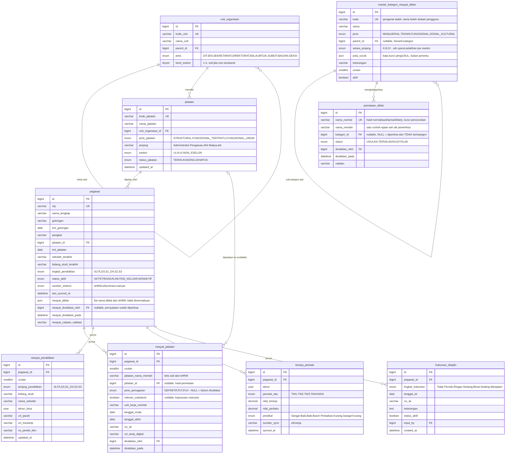
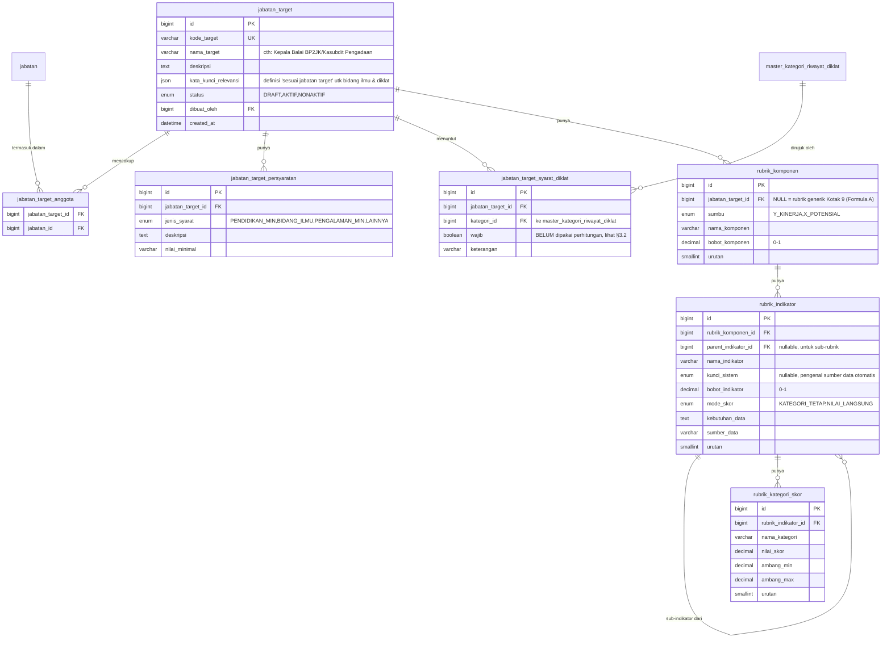
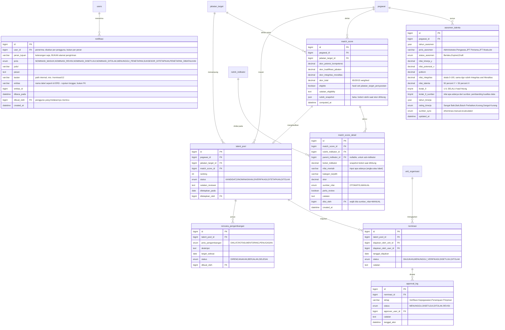
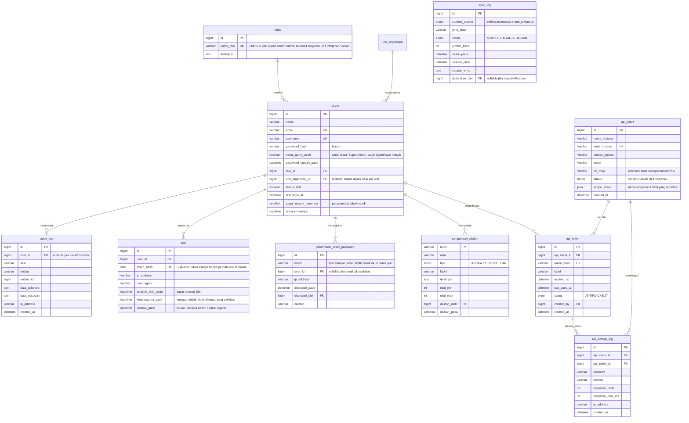

# ERD — Sistem Informasi Manajemen Talenta DJBK

**Target DBMS:** MySQL 8.x
**Status:** skema sudah **diimplementasikan** di `pupr_dev_v2` (nilai `DATABASE_NAME` di `.env.local`; `pupr_dev` masih ada sebagai DB lama). DDL & data: [`sql/001_schema.sql`](sql/001_schema.sql) → [`015_syarat_diklat_target.sql`](sql/015_syarat_diklat_target.sql), dijalankan berurutan. Tabel & kolom yang ditambahkan setelah `001`:

| Berkas | Tambahan | Alasan |
|---|---|---|
| `005_skema_tambahan.sql` | `match_score_detail`, `match_score.rubrik_snapshot`, `jabatan_target.kata_kunci_relevansi` | hasil audit rule engine — lihat [`../phase.md`](../phase.md) §8 (U-3, U-5, U-12) |
| `009_kolom_pembanding.sql` | `asesmen_talenta.kotak_9_sumber` | §6 no. 2 mewajibkan menyimpan `kotak_9` dari sumber sebagai pembanding, tapi kolomnya belum ada sehingga nilai sumber hilang saat dihitung ulang |
| `010_kunci_indikator.sql` | `rubrik_indikator.kunci_sistem`, `match_score` UNIQUE (pegawai_id, jabatan_target_id) | begitu rubrik bisa diedit (Fase 5), nama indikator jadi milik pengguna — jembatan data→indikator tidak boleh lagi bergantung pada pencocokan nama. Kunci unik menegakkan relasi "paling banyak satu skor per pasangan" yang selama ini hanya dijaga oleh cara pengisiannya |
| `011_notifikasi.sql` | tabel `notifikasi` (U-7) + pembetulan keadaan workflow di data dev | Alur approval tanpa inbox menggantung: unit mengajukan lalu tidak tahu apa-apa sampai seseorang kebetulan membuka halaman. Pembetulan datanya perlu karena `007_recompute` menyisipkan nominasi tanpa memperbarui `talent_pool.status` yang berpasangan dengannya |
| `012_auth.sql` | tabel `sesi`, `pengaturan_sistem`, `permintaan_reset_password`; kolom `users.harus_ganti_sandi`/`password_diubah_pada`/`gagal_masuk_beruntun`/`terkunci_sampai`; indeks waktu di `audit_log` | Fase 7 mengganti identitas dev dengan sesi asli. Sesi disimpan di DB (bukan JWT) karena dua tuntutan Fase 7 justru menuntut keadaan server: **pencabutan harus seketika** saat akun dinonaktifkan, dan **timeout idle** butuh penanda "terakhir aktif". `pengaturan_sistem` memindahkan masa berlaku asesmen dari konstanta kode ke parameter — PRD §10.11 memang menyebutnya begitu |
| `013_token_api_dev.sql` | *(tidak menambah kolom — data saja)* | Membetulkan `api_token.token_hash` yang di `002` ternyata placeholder, bukan SHA-256 dari apa pun, sehingga tidak ada satu pun token dev yang bisa memanggil `/api/v1`. Dihasilkan program (`npm run db:gen-token-api`) |
| `014_kategori_riwayat.sql` | tabel `master_kategori_riwayat_diklat` & `pemetaan_diklat`; kolom `riwayat_jabatan.jenis_penugasan`/`relevan_substansi`/`divalidasi_oleh`/`divalidasi_pada`; `pegawai.riwayat_divalidasi_oleh`/`_pada`/`riwayat_catatan_validasi` | Dua indikator rubrik sebelumnya disimpulkan dari **teks bebas** (pencocokan kata kunci diklat, regex Plt/Plh). Keduanya menghasilkan angka wajar untuk data rapi dan diam-diam salah untuk data yang tidak — lihat §1 poin 8. Kategorinya kini datang dari kamus + validasi manusia |
| `015_syarat_diklat_target.sql` | tabel `jabatan_target_syarat_diklat` | `jabatan_target.kata_kunci_relevansi` dipakai bersama oleh **dua** indikator berbeda (Kesesuaian Bidang Ilmu & Pengembangan Kompetensi), sehingga menambah kata kunci untuk salah satunya diam-diam mengubah yang lain. Syarat diklat pindah jadi relasi ke kategori; kolom lama tinggal melayani bidang ilmu |

**Sumber rancangan:** [`Data DTM.json`](Data%20DTM.json) & CSV turunannya (data contoh 9 pegawai), [`KERANGKA TALENT POOL.md`](KERANGKA%20TALENT%20POOL.md) (rubrik penilaian), [`BLUEPRINT READINESS - MODUL MANAJEMEN TALENTA.md`](BLUEPRINT%20READINESS%20-%20MODUL%20MANAJEMEN%20TALENTA.md) (gap data & modul yang akan dibangun), [`manajemen talenta 27 juli utk tim SIM.md`](manajemen%20talenta%2027%20juli%20utk%20tim%20SIM.md) (roadmap & stakeholder).

> Skema di dokumen ini **sudah diimplementasikan** dan berjalan di `pupr_dev_v2` (**34 tabel**). Sumber kebenarannya adalah berkas SQL bernomor di [`sql/`](sql/), dijalankan berurutan `001` → `015`; tipe TypeScript **diturunkan dari database** lewat `drizzle-kit pull`, bukan ditulis ulang manual. Kalau struktur di dokumen ini berubah, ubah juga berkas SQL-nya — jangan biarkan keduanya lepas.
>
> **Nilai enum di diagram ditulis PERSIS seperti di database.** Beberapa di antaranya berisi spasi dan Title Case (`'Sangat Baik'`, `'Berlaku'`, `'Tidak Pernah'`), bukan `SCREAMING_SNAKE` seperti enum lain di skema yang sama. Ketidakseragaman itu nyata dan berasal dari data sumber; menuliskannya "dirapikan" di dokumen ini akan membuat siapa pun yang menyalinnya ke kueri mendapat **nol baris tanpa galat** — MySQL tidak mengeluh untuk perbandingan enum yang tidak pernah cocok.

---

## 1. Prinsip Desain

1. **Surrogate key di semua tabel** (`id BIGINT UNSIGNED AUTO_INCREMENT`). Natural key (NIP, kode unit, kode jabatan) disimpan sebagai `UNIQUE`, bukan PK — supaya aman kalau suatu saat ada koreksi data dari sumber eksternal.
2. **Pisahkan data yang "sudah ada" dari data yang "perlu dibangun"**, mengikuti tabel *Status Readiness Data* di Blueprint:
   - Sudah ada (dari eNominasi/eHRM) → tabel kelompok B (`pegawai`, `riwayat_*`, `asesmen_talenta`).
   - Perlu dibangun (❌ di Blueprint: Kode Jabatan & Kode Unit, Master Jabatan Target & Persyaratan, Data Hukuman Disiplin, Workflow Nominasi & Approval) → tabel kelompok A, C, E di bawah.
3. **Rule engine dibuat generik/berjenjang** (Komponen → Indikator → Kategori Skor), persis struktur [`KERANGKA TALENT POOL.md`](KERANGKA%20TALENT%20POOL.md), supaya bobot & rubrik bisa dikonfigurasi per **jabatan target** tanpa ubah kode (ini yang dimaksud Blueprint komponen #2 "Master Jabatan Target & Rule Configuration").
4. **Dua level skor yang berbeda tujuan, jangan ditumpuk jadi satu tabel:**
   - `asesmen_talenta` = skor **generik** dari e-Nominasi (Formula Dasar A: 50% Kinerja + 50% Potensial → Kotak 9). Ini snapshot tahunan yang sudah ada per pegawai, tidak terikat jabatan target tertentu.
   - `match_score` = skor **spesifik per jabatan target** (Formula Dasar B: 65% Potensi&Kompetensi + 20% Kualifikasi Jabatan + 15% Integritas&Moralitas), dihitung oleh rule engine baru saat pegawai dicalonkan untuk suatu jabatan target. `match_score` MEMAKAI `asesmen_talenta.potkom` sebagai salah satu input, tidak menghitung ulang dari nol.
5. Semua tabel riwayat (`riwayat_jabatan`, `riwayat_pendidikan`) tetap simpan **teks mentah** dari sumber (karena Blueprint menandai "Riwayat Jabatan Terstruktur" masih 🟡 sebagian), plus kolom FK opsional ke master setelah data dibersihkan/dipetakan.
6. **Riwayat Diklat/Sertifikasi tidak dibuat tabel terpisah** — datanya cuma daftar nama diklat per pegawai tanpa kolom yang benar-benar unik/bisa direlasikan (lokasi, TMT, arsip mayoritas kosong di data contoh), jadi disimpan sebagai kolom `JSON` langsung di `pegawai.riwayat_diklat` (lihat §2.1). Kalau nanti kebutuhan berkembang (perlu query "siapa saja yang ikut diklat X", atau field lokasi/TMT/arsip mulai konsisten terisi), baru layak dipecah jadi tabel relasional lagi.

   > **Kebutuhan itu sudah datang (`doc/sql/014`), tapi jalan keluarnya BUKAN memecah JSON-nya.** Yang dibutuhkan adalah menjawab "diklat ini termasuk kategori apa", dan itu properti **nama diklat**, bukan properti pasangan (pegawai × diklat). Jadi yang dibuat `pemetaan_diklat` — **kamus** yang dikunci pada nama diklat ternormalisasi — sementara `pegawai.riwayat_diklat` tetap JSON apa adanya dari sumber. Bedanya besar dalam praktik: di `pupr_dev_v2` **37 pegawai** (dari 43) punya **264 entri** diklat tetapi hanya **182 nama** yang benar-benar berbeda; memecahnya per baris berarti orang yang sama memutuskan "Diklat PIM IV itu Manajerial" berulang kali. Memecah jadi tabel per-baris tetap layak nanti, tapi alasannya harus yang lain (lokasi/TMT/arsip mulai terisi) — bukan kategorisasi.

7. **Rantai `ON DELETE CASCADE` hanya boleh diandalkan SATU tingkat.** Pola FK di skema ini konsisten — `CASCADE` untuk kepemilikan (anak tak bermakna tanpa induk), `SET NULL` untuk jejak orang (`users`, supaya menghapus akun tidak menghapus riwayatnya), `NO ACTION` untuk master yang harus menahan penghapusan (`jabatan.unit_organisasi_id`, `users.role_id`, `nominasi.diajukan_oleh_unit_id`) — **tapi cascade yang lebih dalam dari satu tingkat tidak berjalan penuh di DB ini.** Terukur dengan replika rantai `jabatan_target → 3 rubrik_komponen → 9 rubrik_indikator → 45 rubrik_kategori_skor`: satu `DELETE FROM jabatan_target` hanya mengikuti cabang **pertama** dan menyisakan **8 indikator + 40 kategori** sebagai baris yatim; menghapus `rubrik_komponen` satu per satu lebih dulu bersih total.

   Jejaknya ada di data dev, dan **kaidahnya eksak**: tiap `HAPUS jabatan_target` meninggalkan **8 `rubrik_indikator` + 25 `rubrik_kategori_skor`** yatim. Jadi angkanya bergerak mengikuti pemakaian — pada 11 Agustus 2026 tercatat 28 penghapusan di `audit_log` dan tepat 224 + 700 baris yatim (**88% isi kedua tabel itu**), dan bertambah 8 + 25 lagi setiap kali sebuah jabatan target dihapus. Cara memeriksanya kapan pun:

   ```sql
   SELECT COUNT(*) FROM rubrik_indikator i
     LEFT JOIN rubrik_komponen k ON k.id = i.rubrik_komponen_id
   WHERE k.id IS NULL;
   ```

   Akibatnya untuk penulis kode: **jalur hapus wajib menghapus tingkat perantara secara eksplisit**, jangan mengandalkan cascade dari puncak. Yang terdampak bukan cuma rubrik — `jabatan_target → match_score → match_score_detail` dan `jabatan_target → talent_pool → nominasi → approval_log` berbentuk sama. Yatimnya tidak membuat angka di UI salah (semua kueri join lewat induknya), jadi ia tidak akan pernah muncul sebagai bug; ia hanya menumpuk.

8. **Kategori riwayat diambil dari kamus + validasi manusia, bukan dari pencocokan kata kunci** (`doc/sql/014`). Sebelumnya dua indikator rubrik disimpulkan dari teks bebas: Pengembangan Kompetensi mencocokkan `pegawai.riwayat_diklat` dengan `jabatan_target.kata_kunci_relevansi`, dan Substansi Riwayat Jabatan menguji `riwayat_jabatan.jabatan_nama_mentah` dengan regex Plt/Plh. Keduanya menghasilkan angka wajar untuk data rapi dan **diam-diam salah** untuk data yang tidak — terukur: dari 182 nama diklat nyata hanya **36 (20%)** cocok dengan pola kategori mana pun. Pencocokannya tetap ada, tapi statusnya turun jadi **usulan** yang wajib dikonfirmasi (`pemetaan_diklat.status`, `riwayat_jabatan.jenis_penugasan`), dan jejak siapa/kapan tersimpan. **Gagal tertutup:** yang belum divalidasi tidak dianggap relevan dan tidak dianggap Plt/Plh — arah sebaliknya menaikkan skor orang yang datanya paling berantakan.

---

## 2. Diagram ERD

### 2.1 Master Data & Kepegawaian



### 2.2 Rule Engine / Rubrik Penilaian (Master Jabatan Target)



> Catatan `mode_skor` pada `rubrik_indikator`: sebagian besar indikator memakai **KATEGORI_TETAP** (mis. predikat kinerja → nilai tetap 100/80/60/40/20, lihat `rubrik_kategori_skor`). Tapi indikator **Penilaian Potensi dan Kompetensi** memakai **NILAI_LANGSUNG** — angka Potkom mentah dipakai langsung sebagai skor, kategori (Memenuhi Syarat/dst) hanya label klasifikasi, bukan konversi ke poin tetap. Bedakan dua mode ini di logic aplikasi.

### 2.3 Asesmen, Talent Pool & Workflow Nominasi



> `notifikasi` **tidak punya FK ke `nominasi`/`talent_pool`** — satu-satunya FK-nya ke `users` (penerima, `CASCADE`) dan `users` (pemicu, `SET NULL`). Rujukan ke entitas yang memicunya longgar lewat pasangan `entitas` + `entitas_id` berindeks, pola yang sama dengan `audit_log`. Konsekuensinya patut dipertahankan: satu baris notifikasi tetap terbaca setelah nominasinya dihapus, sedangkan FK `CASCADE` akan melenyapkan kabar "nominasi Anda ditolak" justru ketika penerimanya belum membacanya. Harganya, rujukan itu **tidak dijaga database** — `entitas_id` bisa menunjuk baris yang sudah tidak ada, jadi pembacanya wajib menyiapkan tautan yang menjawab 404.

### 2.4 Sistem, Keamanan & Integrasi API



---

## 3. Detail Tabel

### 3.1 Master Data & Kepegawaian

| Tabel | Fungsi | Kolom Kunci | Catatan |
|---|---|---|---|
| `unit_organisasi` | Hierarki unit (Ditjen → Sekretariat/Direktorat → Balai/BP2JK → Bagian/Seksi), self-referencing via `parent_id` | `kode_unit` UK | Menutup gap ❌ "Kode Jabatan & Kode Unit" di Blueprint. Konsolidasi `Unit Organisasi` (eNominasi) + `Unit Kerja` (eHRM) jadi satu hierarki. |
| `jabatan` | Master posisi/jabatan definitif | `kode_jabatan` UK | `status_jabatan='KOSONG'` = sumber untuk "Status Jabatan Kosong" (Input Manual/Master Data di Blueprint). |
| `pegawai` | Data biografis & posisi terkini | `nip` UK | `eselon`/`unit_kerja` TIDAK disimpan redundan di sini — diturunkan dari `jabatan_id → jabatan.eselon/unit_organisasi_id`. Kolom `riwayat_diklat` (JSON) menyimpan daftar nama diklat langsung di baris pegawai — lihat catatan §1 poin 6. Sejak `doc/sql/014`: `riwayat_divalidasi_oleh`/`_pada`/`riwayat_catatan_validasi` menyimpan **pernyataan seseorang bahwa ia sudah memeriksa riwayat orang ini**. Disimpan, bukan diturunkan: kelengkapan ("semua entri sudah berkategori") bisa dihitung kapan saja, tapi pegawai yang tidak punya satu pun riwayat diklat otomatis "lengkap" padahal belum pernah dilihat siapa pun. |
| `riwayat_jabatan` | Histori jabatan (1-ke-banyak per pegawai) | FK `pegawai_id` | Simpan teks mentah + FK opsional ke `jabatan` setelah dibersihkan (Blueprint: 🟡 "Riwayat Jabatan Terstruktur"). Sejak `doc/sql/014`: `jenis_penugasan` (DEFINITIF/PLT/PLH) & `relevan_substansi` berisi **keputusan manusia**, `NULL` = belum divalidasi. Usulan regex sengaja **tidak** ditulis ke kolom ini — kalau ikut ditulis, tidak ada lagi cara membedakan "mesin menebak Plt" dari "manusia memastikan Plt", dan seluruh gunanya hilang. |
| `master_kategori_riwayat_diklat` | Kamus kategori diklat/pelatihan, berjenjang (`parent_id` self-FK) | `kode` UK | Isinya diturunkan dari `doc/doc_tambahan_2/sample(1).md` lembar 6 (Persyaratan Jabatan) + PP 11/2017: rumpun **Manajerial** (PIM II/III/IV) & **Teknis** (PBJ, Hukum Kontrak, Manajemen Konstruksi). `setara_jenjang` dipakai memeriksa syarat pelatihan per jabatan target — Direktur (eselon II) menuntut PIM III, Kasubdit/Ka Balai menuntut PIM IV. Kolom `pola_cocok` (JSON) berisi kata kunci **pengUSUL**, bukan penentu, dan bisa disunting dari UI: daftar kata kunci yang hidup di kode akan menua tanpa ada yang berani menyentuhnya. |
| `pemetaan_diklat` | Kamus **satu nama diklat → satu kategori** | `nama_normal` UK | Dikunci pada nama diklat ternormalisasi, **bukan** pada (pegawai × diklat) — lihat §1 poin 6. `status` (USULAN/TERVALIDASI/DITOLAK) dipisah dari `kategori_id` karena "belum diperiksa" dan "sudah diperiksa, hasilnya bukan kategori mana pun" adalah dua keadaan berbeda; menyamakannya membuat antrian pemeriksaan tidak pernah habis. Normalisasi namanya punya **satu** definisi di `lib/kategori-riwayat.ts` — kalau ia hidup di dua tempat, kamusnya akan punya baris yang tidak pernah cocok dengan apa pun, dan tampilannya adalah diklat yang "sudah divalidasi tapi tetap tidak dihitung". |
| `riwayat_pendidikan` | Histori pendidikan | FK `pegawai_id` | Kolom sesuai mockup Blueprint (ijazah, transkrip, no. pertek BKN). |
| `kinerja_periode` | Rekap kinerja per triwulan/tahunan | FK `pegawai_id` | Sumber granular untuk `asesmen_talenta.rating_kinerja` (Blueprint: 🟡 "Rating Kinerja Numerik" perlu dibersihkan). |
| `hukuman_disiplin` | Rekam jejak disiplin | FK `pegawai_id` | Menutup gap ❌ "Data Hukuman Disiplin Resmi". Input manual, dipakai indikator Integritas & Moralitas (`KERANGKA TALENT POOL.md` §B.3). **Aturan skoring** (dipakai di data contoh, belum resmi dikonfirmasi — lihat PRD.md §10 poin 8): hanya baris dengan `status_aktif=1` yang menurunkan skor indikator; baris `status_aktif=0` (dianggap sudah tidak berlaku/kedaluwarsa) tidak memengaruhi skor Integritas & Moralitas berjalan. |

### 3.2 Rule Engine / Rubrik Penilaian

| Tabel | Fungsi | Catatan |
|---|---|---|
| `jabatan_target` | Profil "jabatan sasaran suksesi" — bisa mencakup beberapa jabatan definitif sekaligus (cth: gabungan Kepala Balai BP2JK + Kasubdit Pengadaan) | Menutup gap ❌ "Master Jabatan Target & Persyaratan". Kolom `kata_kunci_relevansi` (JSON) menyimpan **apa yang dianggap "sesuai dengan jabatan target"** — rubrik memakai frasa itu pada indikator Kesesuaian Bidang Ilmu & Pengembangan Kompetensi, tapi sebelumnya tidak ada tempat menyimpannya, sehingga kedua indikator tidak bisa dihitung otomatis. Nilai `"semua"` berarti semua bidang ilmu diperbolehkan. **Sejak `doc/sql/015` kolom ini hanya melayani Kesesuaian Bidang Ilmu**; syarat diklat pindah ke `jabatan_target_syarat_diklat` sebagai relasi ke kategori. Aturan lama "`semua` tidak membebaskan syarat diklat" karena itu **tidak berlaku lagi** — ia adalah tambalan atas satu kolom yang dipakai dua maksud. |
| `jabatan_target_anggota` | Junction many-to-many `jabatan_target` ↔ `jabatan` | |
| `jabatan_target_syarat_diklat` | Kategori diklat yang dianggap relevan untuk sebuah jabatan target (`doc/sql/015`) | Menggantikan peran `kata_kunci_relevansi` **untuk indikator diklat saja**. Kolom itu dipakai bersama oleh dua indikator berbeda — Kesesuaian Bidang Ilmu & Pengembangan Kompetensi — sehingga menambah kata kunci untuk salah satunya diam-diam mengubah yang lain; nilai `"semua"` bahkan sudah harus diperlakukan berbeda di antara keduanya, yang adalah gejala satu kolom dipakai dua maksud. Kolom `wajib` **belum dipakai perhitungan**: indikator Pengembangan Kompetensi hanya punya dua kategori skor (punya → 100, tidak → 50), jadi tidak ada tempat membedakan "punya 1 dari 3" dari "punya 3 dari 3". Jabatan target tanpa baris di sini → indikatornya bernilai *tidak diketahui*, bukan gagal |
| `jabatan_target_persyaratan` | Syarat minimal (pendidikan, bidang ilmu, dst) per jabatan target | Cth: "cek syarat jabatan Dit Pengadaan — minimal S1 semua jurusan" dari `KERANGKA TALENT POOL.md`. |
| `rubrik_komponen` | Komponen berbobot per sumbu (Y/X), `jabatan_target_id` NULL = rubrik generik Kotak 9 | Menutup gap ❌ "Master Jabatan Target & Rule Configuration" — bobot **bisa diubah dari UI**, bukan hardcode. |
| `rubrik_indikator` | Indikator berbobot per komponen, mendukung sub-indikator (self-FK `parent_indikator_id`) | Sub-indikator dipakai utk 3 sub-rubrik "Nilai Pengalaman Jabatan" (Lama/Keragaman/Substansi Jabatan). Kolom `kunci_sistem` memisahkan **label** indikator (milik pengguna, bebas diubah dari editor rubrik) dari **pengenal sumber datanya** (milik sistem, dipilih dari daftar tertutup di `lib/penilaian.ts`). `NULL` berarti tidak ada sumber otomatis → nilainya diisi manusia dan ditandai `MANUAL` di `match_score_detail`. Sebelum kolom ini ada, jembatannya adalah pencocokan nama persis, sehingga mengganti nama indikator dari UI akan mematikan seluruh perhitungan match score (`doc/sql/010`). |
| `rubrik_kategori_skor` | Rubrik skor per indikator (kategori → nilai, atau ambang batas) | Merepresentasikan tabel-tabel skor di `KERANGKA TALENT POOL.md` (Sangat Baik=100, dst). |

### 3.3 Asesmen, Talent Pool & Workflow

| Tabel | Fungsi | Catatan |
|---|---|---|
| `asesmen_talenta` | Snapshot tahunan hasil e-Nominasi (Kotak 9 generik) | Data yang **sudah ada** ✅ per Blueprint. Setara `dtm_asesmen_talenta.csv`. **Skala `nilai_integritas` diseragamkan ke 0–100** (semula `DECIMAL(4,2)`, mengikuti skala kecil 1–4 di data contoh) supaya sistem hanya punya SATU skala integritas — lihat `phase.md` §2.7; perubahan tipe ada di `005_skema_tambahan.sql`. `kotak_9` **selalu hasil hitung** dari (Y, X); nilai dari sistem sumber disimpan terpisah di **`kotak_9_sumber`** (ditambahkan `009_kolom_pembanding.sql`) dan dipakai HANYA sebagai pembanding — selisihnya masuk Antrian Pembersihan Data (`phase.md` §2.3, §6 no. 2). Sebelum kolom itu ada, nilai sumber tertimpa `007_recompute` sehingga selisihnya tidak bisa ditampilkan sama sekali. |
| `match_score` | Skor kecocokan pegawai × jabatan target spesifik | Output komponen Blueprint #3 "Eligibility Check & Match Scoring". Kolom `rubrik_snapshot` membekukan bobot rubrik saat skor dihitung — tanpa itu, skor talent pool yang sudah `DITETAPKAN` tidak bisa direproduksi setelah bobot diubah dari UI (lihat `phase.md` §8 usulan U-5). **UNIQUE (pegawai_id, jabatan_target_id)** ditambahkan di `doc/sql/010`: relasinya memang paling banyak satu baris per pasangan, tapi sebelumnya hanya dijaga oleh cara pengisiannya (`007_recompute` menghapus seluruh tabel lebih dulu). Tombol Hitung Ulang memperbarui satu jabatan target saja, jadi jalur "sudah ada → perbarui" perlu dijamin database — duplikatnya tidak akan terlihat karena halaman menampilkan salah satunya dan `talent_pool.match_score_id` menunjuk entah yang mana. |
| `match_score_detail` | Rincian skor per **indikator & sub-indikator** untuk satu baris `match_score` | Ditambahkan di `doc/sql/005_skema_tambahan.sql`. Alasannya: `match_score` hanya menyimpan 3 agregat + total, sehingga pertanyaan "kenapa kandidat yang sama dapat 75,83 di satu jabatan target tapi 88,33 di target lain?" tidak bisa dijawab dari UI — padahal indikator Kesesuaian Bidang Ilmu & Pengembangan Kompetensi memang bernilai beda per target. `sumber_nilai` memisahkan hasil hitung otomatis dari nilai yang diisi manusia, karena sebagian indikator (Lama/Keragaman/Substansi Jabatan) datanya belum tentu lengkap di sistem sumber (lihat `phase.md` §8 usulan U-3). |
| `notifikasi` | Kabar untuk satu pengguna tentang perubahan alur nominasi & suksesi | Ditambahkan di `doc/sql/011` (phase.md §8 usulan U-7). **Disebar per pengguna saat dibuat**, bukan disimpan bertujuan peran: satu baris untuk peran yang dipegang tiga orang akan hilang dari dua orang lain begitu satu orang menandainya terbaca — `dibaca_pada` tidak bisa dibagi. Kolom `peran_tujuan` tetap ada, tapi sebagai keterangan ("Anda menerima ini sebagai Admin Talenta"), bukan alamat pengiriman. Aturan siapa yang dikabari diturunkan dari state machine di `lib/workflow.ts`, bukan ditulis ulang |
| `talent_pool` | Daftar kandidat final per jabatan target + status workflow | Output komponen #4 "Ranking, Gap Analysis & Talent Profile". |
| `nominasi` | Pengajuan nominasi oleh unit | Langkah "Nominasi Unit" di Garis Besar Proses. |
| `approval_log` | Log berjenjang persetujuan (bisa >1 tahap) | Langkah "Verifikasi Biro Kepegawaian" (lihat asumsi §6). |
| `rencana_pengembangan` | Rencana pengembangan suksesor | Sesuai `Lampiran B` (`manajemen talenta...md`) & langkah "Rencana Pengembangan". |

### 3.4 Sistem, Keamanan & Integrasi API

| Tabel | Fungsi | Catatan |
|---|---|---|
| `roles`, `users` | Pengguna internal & peran | **Isi `roles` di DB ada 5**: Super Admin · Admin Talenta · Pengelola Unit · Pimpinan · Viewer. Diagram §2.4 sempat menuliskan enam nama lain (*Admin Talenta DJBK*, *Verifikator Kepegawaian*, *Pimpinan Unit*, *Pimpinan DJBK*) — itu penamaan rancangan awal yang tidak pernah masuk DB, dan menyalinnya ke kode gerbang peran akan menghasilkan pemeriksaan yang tidak pernah cocok. Peran mengikuti Tim Kerja di `manajemen talenta...md` §07 (Champion, Core Team, dst) — dipetakan ke role sistem, lihat PRD. Kolom penghambat tebak-sandi (`gagal_masuk_beruntun`, `terkunci_sampai`) sengaja **di baris pengguna**, bukan di memori proses: Next.js bisa berjalan lebih dari satu instans, dan penghitung per proses berarti batasnya terkalikan jumlah instans tanpa ada yang menyadarinya. |
| `sesi` | Sesi login pengguna internal (Fase 7) | Sesi disimpan di DB, **bukan JWT**. Alasannya dua hal yang justru jadi inti Fase 7: (a) menonaktifkan pengguna harus memutus aksesnya **seketika** — dengan JWT satu-satunya cara adalah daftar-cabut di server, yang artinya sudah punya keadaan server; (b) timeout idle butuh penanda "terakhir aktif" yang tidak bisa dibawa token yang tidak diperbarui. Token disimpan sebagai **hash SHA-256** (bukan bcrypt: isinya 256 bit acak, tidak ada yang bisa ditebak, jadi fungsi lambat hanya menambah biaya tiap permintaan). **Dua tenggat**, karena satu tenggat selalu bisa dilangkahi: `terakhir_aktif_pada` menutup sesi yang ditinggal, `kedaluwarsa_pada` menutup sesi yang dibiarkan hidup terus oleh tab yang memuat ulang sendiri. |
| `pengaturan_sistem` | Parameter yang boleh diubah tanpa deploy | Halaman Pengaturan Sistem (PRD §6.10). Berisi masa berlaku asesmen yang PRD §10.11 sebut sebagai parameter tapi sampai Fase 6 hidup sebagai konstanta di `lib/scoring/konstanta.ts` — selama di sana, jawaban atas pertanyaan terbuka tidak bisa dijalankan tanpa menyentuh kode. Bentuknya kunci–nilai bertipe supaya menambah parameter tidak berarti `ALTER TABLE`. **Perubahannya tidak retroaktif**: `match_score` yang tersimpan tetap hasil hitungan dengan nilai lama sampai Hitung Ulang dijalankan. |
| `permintaan_reset_password` | Permintaan Lupa Password (PRD §6.1) | Belum ada transport surel yang diputuskan, jadi **tidak ada tautan reset yang dikirim** — permintaannya dicatat lalu ditangani Super Admin secara manual, dan halamannya mengatakan itu apa adanya. Halaman yang menjanjikan "cek email Anda" padahal tidak ada surel yang dikirim adalah cacat termahal: penggunanya menunggu sesuatu yang tidak akan datang dan tidak melapor karena mengira itu salahnya sendiri. Permintaan dari email **tidak terdaftar** tetap disimpan (`user_id` NULL) — pola email asing yang berulang adalah percobaan mencacah akun. |
| `audit_log` | Jejak audit semua perubahan data | Output Modul Blueprint "Audit log dan ekspor laporan". Sejak Fase 7 juga memuat peristiwa autentikasi (`MASUK`, `MASUK_GAGAL`, `KELUAR`, `SANDI_DIGANTI`, `AKUN_TERKUNCI`, `RESET_DIMINTA`) lewat pintu tulis kedua `catatPeristiwaAuth()` — peristiwa yang terjadi **sebelum** ada pengguna tidak mungkin lewat `jalankanMutasi()` yang menuntut pemeriksaan peran. Indeks `(created_at, id)` ditambahkan di `012`: ini satu-satunya tabel yang hanya bertambah, dan Audit Log Viewer mengurutkan menurut waktu. |
| `api_client` | Instansi eksternal yang mengonsumsi API | Kolom `no_mou` untuk keterkaitan dasar hukum berbagi data (relevan UU PDP). |
| `api_token` | Token akses per klien (Bearer token) | Bisa lebih dari 1 token aktif per klien (rotasi). |
| `api_activity_log` | Log pemanggilan API eksternal | Untuk audit & pemantauan rate-limit. |
| `sync_log` | Log konsolidasi data dari eHRM/eNominasi/eKinerja | Output komponen Blueprint #1 "Data Consolidation & Cleansing". |

---

## 4. Peta Migrasi: Data Contoh (CSV) → Skema Baru

| Sumber (CSV existing) | Tujuan (tabel baru) | Transformasi |
|---|---|---|
| `dtm_pegawai.csv` | `pegawai` | `unit_organisasi`, `unit_kerja`, `eselon`, `jabatan_saat_ini` **tidak** disalin apa adanya — dipetakan manual ke `jabatan.id` (buat dulu master `jabatan`/`unit_organisasi`, lalu isi `pegawai.jabatan_id`). `tmt_golongan_pangkat` & `golongan` diparse ulang (lihat catatan kualitas di `Data DTM - README.md`) sebelum jadi `pegawai.tmt_golongan`/`golongan`. Kolom `riwayat_diklat` (array JSON dari `Data DTM.json`) disalin langsung ke `pegawai.riwayat_diklat` (JSON) — tidak lagi lewat tabel/CSV terpisah. |
| `dtm_asesmen_talenta.csv` | `asesmen_talenta` | Kolom sama persis (`potkom`, `nilai_integritas`, `kotak_9`, dst) + tambahan `nilai_kinerja_y`/`nilai_potensial_x`/`nilai_talenta` yang dihitung ulang dari rubrik (bisa dihitung mundur dari `rating_kinerja` & `potkom` yang sudah ada). |
| `dtm_riwayat_jabatan.csv` | `riwayat_jabatan` | `nama_jabatan` → `jabatan_nama_mentah`. `jabatan_id` diisi NULL dulu (butuh pemetaan manual/fuzzy-match ke master `jabatan`). |
| `dtm_riwayat_pendidikan.csv` | `riwayat_pendidikan` | Teks seperti `"S2 SISTEM DAN TEKNIK TRANSPORTASI"` perlu di-parse jadi `jenjang_pendidikan='S2'` + `bidang_studi='SISTEM DAN TEKNIK TRANSPORTASI'` — **tidak seragam** di data contoh (ada yang prefix `"DIII ..."`, ada yang `"S1 FIS ADMINISTRASI"`), perlu aturan parsing atau normalisasi manual saat migrasi. |
| — (belum ada sumber) | `hukuman_disiplin`, `jabatan_target*`, `rubrik_*`, `match_score`, `talent_pool`, `nominasi`, `approval_log`, `rencana_pengembangan`, `users`, `roles`, `api_client`, `api_token`, `audit_log`, `sync_log` | Tabel baru, mulai kosong — diisi lewat UI begitu modul terkait dibangun (lihat PRD §Fase Implementasi). |

**Isu kualitas data dari sample (dari `Data DTM - README.md`) yang harus diselesaikan *sebelum* migrasi produksi:**
- Format tanggal TMT tidak konsisten antar baris → wajib dinormalisasi ke `DATE` MySQL.
- Kasus "Irwan": `Unit Kerja` kemungkinan salah tempel (isinya teks jabatan) → perlu verifikasi manual ke eHRM sebelum masuk `pegawai.jabatan_id`.
- Format Golongan campur (`IV.b` vs `III/d`) → seragamkan format sebelum masuk kolom `golongan`.
- `nilai_integritas` bisa desimal (3.5) → sudah diantisipasi dengan `DECIMAL`, bukan `INT`, konsisten dari `Data DTM - README.md`.

---

## 5. Asumsi & Hal yang Perlu Dikonfirmasi

Poin bertanda ⚙️ **sudah punya default yang berjalan di kode** (dipilih supaya implementasi bisa maju), tapi tetap keputusan bisnis yang sebaiknya divalidasi. Poin bertanda ✅ sudah terjawab. Daftar keputusan yang lebih lengkap — termasuk empat yang baru muncul saat rubrik diterjemahkan ke kode — ada di [`PRD.md`](PRD.md) §10.

1. **"Verifikasi Biro Kepegawaian"** di Garis Besar Proses — asumsi ini merujuk ke **Bagian Kepegawaian dan Umum DJBK sendiri** (bukan Biro Kepegawaian & Ortala Kementerian PU, yang di peta stakeholder berperan sebagai *Latens*/pembina kebijakan, bukan operasional harian). Kalau ternyata verifikasi memang harus lewat Kementerian, perlu tabel `approval_log.tahap` tambahan + role baru.
2. ⚙️ **Agregasi 3 sub-indikator "Nilai Pengalaman Jabatan"** (Lama Jabatan, Keragaman Riwayat Jabatan, Substansi Riwayat Jabatan) — **default terpasang: rata-rata sederhana** (bobot sama rata). Mesin rubrik memakai rumus generik `Σ(nilai × bobot) / Σ(bobot)`, jadi kalau ternyata bobotnya harus berbeda cukup isi `rubrik_indikator.bobot_indikator` pada sub-indikator — tanpa mengubah kode. Masih perlu konfirmasi pemilik proses (lihat `PRD.md` §10 poin 7).
3. ✅ **Satu pegawai bisa masuk banyak `talent_pool`** untuk jabatan target berbeda secara bersamaan — **dikonfirmasi oleh implementasi**: `UNIQUE KEY (pegawai_id, jabatan_target_id)` mengizinkan satu pegawai punya satu baris per jabatan target, dan data dev memang memuat pegawai yang dinilai untuk 3 jabatan target sekaligus dengan skor berbeda.
4. **Level data yang boleh dibagi ke instansi eksternal via API** — asumsi: berbasis `scope_akses` per klien (bisa dibatasi read-only, bisa dibatasi ke data agregat saja tanpa NIP/nama individu, tergantung ada/tidaknya MoU). Perlu ketentuan resmi (rujukan UU PDP No. 27/2022 karena ini data ASN).
5. ✅ **Autentikasi user internal** — **terpasang di Fase 7**: akun lokal (username **atau** email + sandi bcrypt), sesi tersimpan di tabel `sesi` dengan timeout idle & tenggat mutlak, penghambat tebak-sandi, dan penggantian sandi wajib untuk sandi yang dibuatkan Super Admin. Janji `phase.md` §5.6 ditepati — hanya isi `lib/auth.ts` yang berubah, dan pengalih peran dev **dihapus**, bukan dimatikan di balik flag (dua sumber identitas yang hidup berdampingan bisa berselisih, dan yang satu memang dirancang melewati sandi). Integrasi SSO Kementerian PU tetap terbuka sebagai penggantian isi `getCurrentUser()` berikutnya; tinggal dikonfirmasi (PRD §10.6).

---

*DDL MySQL sudah disusun 1:1 dari struktur di atas dan berjalan di `pupr_dev_v2` — lihat [`sql/`](sql/). Perubahan skema berikutnya dilakukan sebagai berkas SQL bernomor baru (`016`, `017`, …), bukan dengan menyunting berkas yang sudah tereksekusi, supaya riwayatnya bisa dijalankan ulang dari nol.*

*Dokumen ini terakhir dicocokkan dengan isi `pupr_dev_v2` pada **11 Agustus 2026**: 34 tabel, **56 foreign key** (28 `CASCADE` · 25 `SET NULL` · 3 `NO ACTION`), dan seluruh nilai enum dibaca langsung dari `information_schema` — bukan disalin dari berkas DDL, supaya kolom yang pernah diubah `ALTER` ikut tertangkap. Pencocokannya dua arah: setiap tabel punya blok diagram, dan setiap kolom yang disebut diagram benar-benar ada.*

*Satu hal yang **belum** selaras dan sengaja tidak disentuh dari sini karena ia kode, bukan skema: `lib/db/schema.ts` masih memuat **33** tabel — `jabatan_target_syarat_diklat` belum ikut karena `npm run db:pull` belum dijalankan setelah `015`.*
