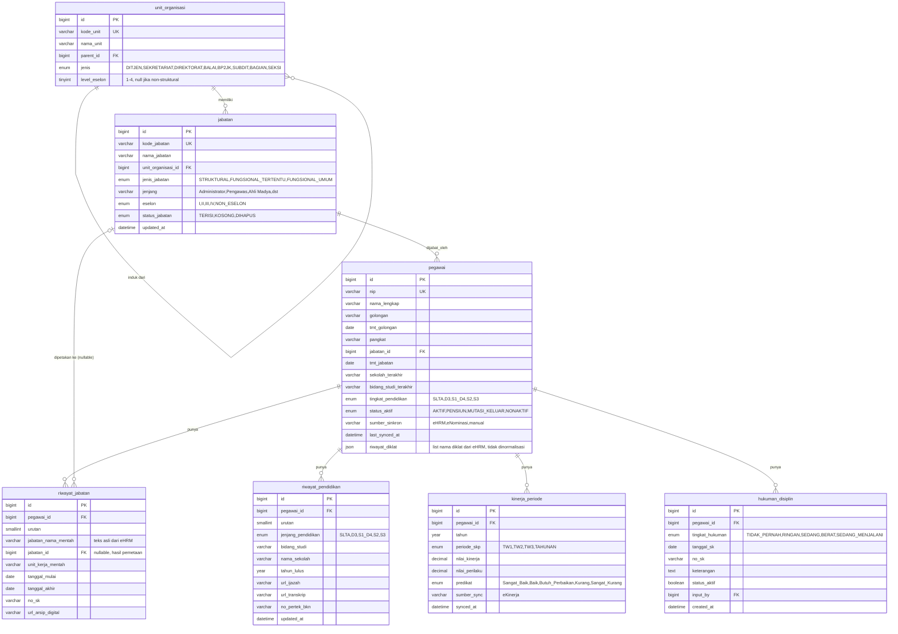
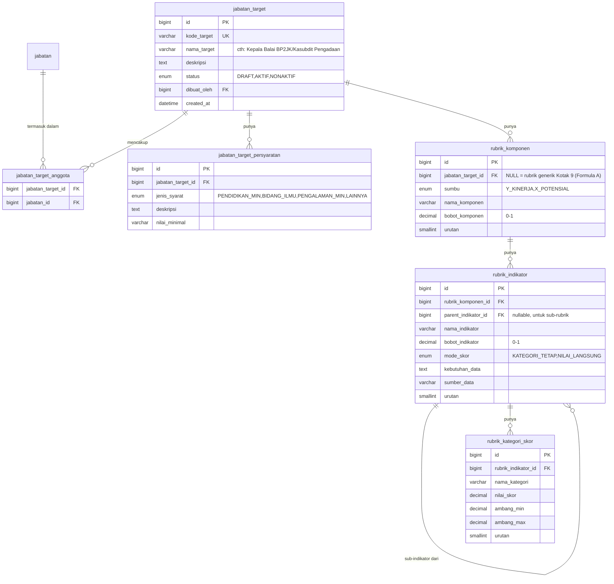
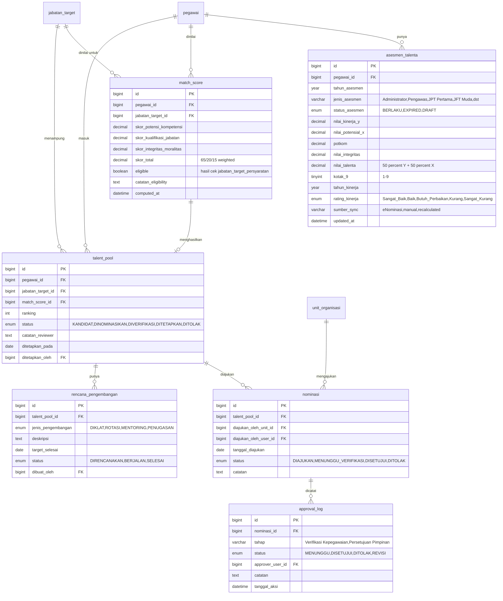
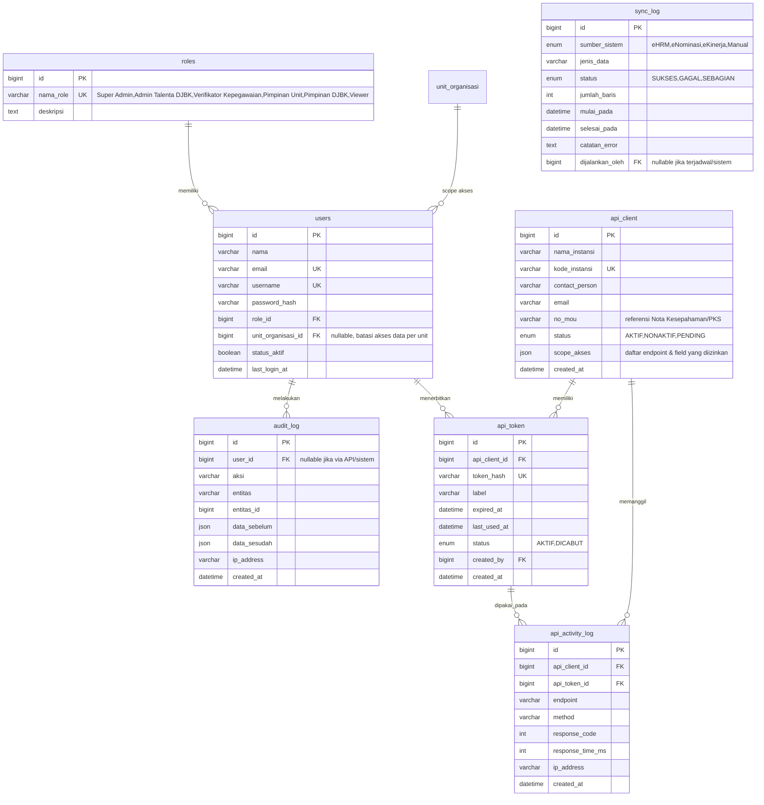

# ERD — Sistem Informasi Manajemen Talenta DJBK

**Target DBMS:** MySQL 8.x
**Sumber rancangan:** [`Data DTM.json`](Data%20DTM.json) & CSV turunannya (data contoh 9 pegawai), [`KERANGKA TALENT POOL.md`](KERANGKA%20TALENT%20POOL.md) (rubrik penilaian), [`BLUEPRINT READINESS - MODUL MANAJEMEN TALENTA.md`](BLUEPRINT%20READINESS%20-%20MODUL%20MANAJEMEN%20TALENTA.md) (gap data & modul yang akan dibangun), [`manajemen talenta 27 juli utk tim SIM.md`](manajemen%20talenta%2027%20juli%20utk%20tim%20SIM.md) (roadmap & stakeholder).

> Dokumen ini murni desain data (skema tabel), **belum ada kode**. Tujuannya untuk diaudit dulu sebelum implementasi MySQL/Prisma/ORM apa pun.

---

## 1. Prinsip Desain

1. **Surrogate key di semua tabel** (`id BIGINT UNSIGNED AUTO_INCREMENT`). Natural key (NIP, kode unit, kode jabatan) disimpan sebagai `UNIQUE`, bukan PK — supaya aman kalau suatu saat ada koreksi data dari sumber eksternal.
2. **Pisahkan data yang "sudah ada" dari data yang "perlu dibangun"**, mengikuti tabel *Status Readiness Data* di Blueprint:
   - Sudah ada (dari eNominasi/eHRM) → tabel kelompok B (`pegawai`, `riwayat_*`, `asesmen_talenta`).
   - Perlu dibangun (❌ di Blueprint: Kode Jabatan & Kode Unit, Master Jabatan Target & Persyaratan, Data Hukuman Disiplin, Workflow Nominasi & Approval) → tabel kelompok A, C, E di bawah.
3. **Rule engine dibuat generik/berjenjang** (Komponen → Indikator → Kategori Skor), persis struktur [`KERANGKA TALENT POOL.md`](KERANGKA%20TALENT%20POOL.md), supaya bobot & rubrik bisa dikonfigurasi per **jabatan target** tanpa ubah kode (ini yang dimaksud Blueprint komponen #2 "Master Jabatan Target & Rule Configuration").
4. **Dua level skor yang berbeda tujuan, jangan ditumpuk jadi satu tabel:**
   - `asesmen_talenta` = skor **generik** dari e-Nominasi (Formula Dasar A: 50% Kinerja + 50% Potensial → Kotak 9). Ini snapshot tahunan yang sudah ada per pegawai, tidak terikat jabatan target tertentu.
   - `match_score` = skor **spesifik per jabatan target** (Formula Dasar B: 65% Potensi&Kompetensi + 20% Kualifikasi Jabatan + 15% Integritas&Moralitas), dihitung oleh rule engine baru saat pegawai dicalonkan untuk suatu jabatan target. `match_score` MEMAKAI `asesmen_talenta.potkom` sebagai salah satu input, tidak menghitung ulang dari nol.
5. Semua tabel riwayat (`riwayat_jabatan`, `riwayat_pendidikan`) tetap simpan **teks mentah** dari sumber (karena Blueprint menandai "Riwayat Jabatan Terstruktur" masih 🟡 sebagian), plus kolom FK opsional ke master setelah data dibersihkan/dipetakan.
6. **Riwayat Diklat/Sertifikasi tidak dibuat tabel terpisah** — datanya cuma daftar nama diklat per pegawai tanpa kolom yang benar-benar unik/bisa direlasikan (lokasi, TMT, arsip mayoritas kosong di data contoh), jadi disimpan sebagai kolom `JSON` langsung di `pegawai.riwayat_diklat` (lihat §2.1). Kalau nanti kebutuhan berkembang (perlu query "siapa saja yang ikut diklat X", atau field lokasi/TMT/arsip mulai konsisten terisi), baru layak dipecah jadi tabel relasional lagi.

---

## 2. Diagram ERD

### 2.1 Master Data & Kepegawaian

### 2.2 Rule Engine / Rubrik Penilaian (Master Jabatan Target)

> Catatan `mode_skor` pada `rubrik_indikator`: sebagian besar indikator memakai **KATEGORI_TETAP** (mis. predikat kinerja → nilai tetap 100/80/60/40/20, lihat `rubrik_kategori_skor`). Tapi indikator **Penilaian Potensi dan Kompetensi** memakai **NILAI_LANGSUNG** — angka Potkom mentah dipakai langsung sebagai skor, kategori (Memenuhi Syarat/dst) hanya label klasifikasi, bukan konversi ke poin tetap. Bedakan dua mode ini di logic aplikasi.

### 2.3 Asesmen, Talent Pool & Workflow Nominasi

### 2.4 Sistem, Keamanan & Integrasi API

---

## 3. Detail Tabel

### 3.1 Master Data & Kepegawaian

| Tabel | Fungsi | Kolom Kunci | Catatan |
|---|---|---|---|
| `unit_organisasi` | Hierarki unit (Ditjen → Sekretariat/Direktorat → Balai/BP2JK → Bagian/Seksi), self-referencing via `parent_id` | `kode_unit` UK | Menutup gap ❌ "Kode Jabatan & Kode Unit" di Blueprint. Konsolidasi `Unit Organisasi` (eNominasi) + `Unit Kerja` (eHRM) jadi satu hierarki. |
| `jabatan` | Master posisi/jabatan definitif | `kode_jabatan` UK | `status_jabatan='KOSONG'` = sumber untuk "Status Jabatan Kosong" (Input Manual/Master Data di Blueprint). |
| `pegawai` | Data biografis & posisi terkini | `nip` UK | `eselon`/`unit_kerja` TIDAK disimpan redundan di sini — diturunkan dari `jabatan_id → jabatan.eselon/unit_organisasi_id`. Kolom `riwayat_diklat` (JSON) menyimpan daftar nama diklat langsung di baris pegawai — lihat catatan §1 poin 6. |
| `riwayat_jabatan` | Histori jabatan (1-ke-banyak per pegawai) | FK `pegawai_id` | Simpan teks mentah + FK opsional ke `jabatan` setelah dibersihkan (Blueprint: 🟡 "Riwayat Jabatan Terstruktur"). |
| `riwayat_pendidikan` | Histori pendidikan | FK `pegawai_id` | Kolom sesuai mockup Blueprint (ijazah, transkrip, no. pertek BKN). |
| `kinerja_periode` | Rekap kinerja per triwulan/tahunan | FK `pegawai_id` | Sumber granular untuk `asesmen_talenta.rating_kinerja` (Blueprint: 🟡 "Rating Kinerja Numerik" perlu dibersihkan). |
| `hukuman_disiplin` | Rekam jejak disiplin | FK `pegawai_id` | Menutup gap ❌ "Data Hukuman Disiplin Resmi". Input manual, dipakai indikator Integritas & Moralitas (`KERANGKA TALENT POOL.md` §B.3). **Aturan skoring** (dipakai di data contoh, belum resmi dikonfirmasi — lihat PRD.md §10 poin 8): hanya baris dengan `status_aktif=1` yang menurunkan skor indikator; baris `status_aktif=0` (dianggap sudah tidak berlaku/kedaluwarsa) tidak memengaruhi skor Integritas & Moralitas berjalan. |

### 3.2 Rule Engine / Rubrik Penilaian

| Tabel | Fungsi | Catatan |
|---|---|---|
| `jabatan_target` | Profil "jabatan sasaran suksesi" — bisa mencakup beberapa jabatan definitif sekaligus (cth: gabungan Kepala Balai BP2JK + Kasubdit Pengadaan) | Menutup gap ❌ "Master Jabatan Target & Persyaratan". |
| `jabatan_target_anggota` | Junction many-to-many `jabatan_target` ↔ `jabatan` | |
| `jabatan_target_persyaratan` | Syarat minimal (pendidikan, bidang ilmu, dst) per jabatan target | Cth: "cek syarat jabatan Dit Pengadaan — minimal S1 semua jurusan" dari `KERANGKA TALENT POOL.md`. |
| `rubrik_komponen` | Komponen berbobot per sumbu (Y/X), `jabatan_target_id` NULL = rubrik generik Kotak 9 | Menutup gap ❌ "Master Jabatan Target & Rule Configuration" — bobot **bisa diubah dari UI**, bukan hardcode. |
| `rubrik_indikator` | Indikator berbobot per komponen, mendukung sub-indikator (self-FK `parent_indikator_id`) | Sub-indikator dipakai utk 3 sub-rubrik "Nilai Pengalaman Jabatan" (Lama/Keragaman/Substansi Jabatan). |
| `rubrik_kategori_skor` | Rubrik skor per indikator (kategori → nilai, atau ambang batas) | Merepresentasikan tabel-tabel skor di `KERANGKA TALENT POOL.md` (Sangat Baik=100, dst). |

### 3.3 Asesmen, Talent Pool & Workflow

| Tabel | Fungsi | Catatan |
|---|---|---|
| `asesmen_talenta` | Snapshot tahunan hasil e-Nominasi (Kotak 9 generik) | Data yang **sudah ada** ✅ per Blueprint. Setara `dtm_asesmen_talenta.csv`. |
| `match_score` | Skor kecocokan pegawai × jabatan target spesifik | Output komponen Blueprint #3 "Eligibility Check & Match Scoring". |
| `talent_pool` | Daftar kandidat final per jabatan target + status workflow | Output komponen #4 "Ranking, Gap Analysis & Talent Profile". |
| `nominasi` | Pengajuan nominasi oleh unit | Langkah "Nominasi Unit" di Garis Besar Proses. |
| `approval_log` | Log berjenjang persetujuan (bisa >1 tahap) | Langkah "Verifikasi Biro Kepegawaian" (lihat asumsi §6). |
| `rencana_pengembangan` | Rencana pengembangan suksesor | Sesuai `Lampiran B` (`manajemen talenta...md`) & langkah "Rencana Pengembangan". |

### 3.4 Sistem, Keamanan & Integrasi API

| Tabel | Fungsi | Catatan |
|---|---|---|
| `roles`, `users` | Pengguna internal & peran | Peran mengikuti Tim Kerja di `manajemen talenta...md` §07 (Champion, Core Team, dst) — dipetakan ke role sistem, lihat PRD. |
| `audit_log` | Jejak audit semua perubahan data | Output Modul Blueprint "Audit log dan ekspor laporan". |
| `api_client` | Instansi eksternal yang mengonsumsi API | Kolom `no_mou` untuk keterkaitan dasar hukum berbagi data (relevan UU PDP). |
| `api_token` | Token akses per klien (Bearer token) | Bisa lebih dari 1 token aktif per klien (rotasi). |
| `api_activity_log` | Log pemanggilan API eksternal | Untuk audit & pemantauan rate-limit. |
| `sync_log` | Log konsolidasi data dari eHRM/eNominasi/eKinerja | Output komponen Blueprint #1 "Data Consolidation & Cleansing". |

---

## 4. Peta Migrasi: Data Contoh (CSV) → Skema Baru

| Sumber (CSV existing) | Tujuan (tabel baru) | Transformasi |
|---|---|---|
| `dtm_pegawai.csv` | `pegawai` | `unit_organisasi`, `unit_kerja`, `eselon`, `jabatan_saat_ini` **tidak** disalin apa adanya — dipetakan manual ke `jabatan.id` (buat dulu master `jabatan`/`unit_organisasi`, lalu isi `pegawai.jabatan_id`). `tmt_golongan_pangkat` & `golongan` diparse ulang (lihat catatan kualitas di `Data DTM - README.md`) sebelum jadi `pegawai.tmt_golongan`/`golongan`. Kolom `riwayat_diklat` (array JSON dari `Data DTM.json`) disalin langsung ke `pegawai.riwayat_diklat` (JSON) — tidak lagi lewat tabel/CSV terpisah. |
| `dtm_asesmen_talenta.csv` | `asesmen_talenta` | Kolom sama persis (`potkom`, `nilai_integritas`, `kotak_9`, dst) + tambahan `nilai_kinerja_y`/`nilai_potensial_x`/`nilai_talenta` yang dihitung ulang dari rubrik (bisa dihitung mundur dari `rating_kinerja` & `potkom` yang sudah ada). |
| `dtm_riwayat_jabatan.csv` | `riwayat_jabatan` | `nama_jabatan` → `jabatan_nama_mentah`. `jabatan_id` diisi NULL dulu (butuh pemetaan manual/fuzzy-match ke master `jabatan`). |
| `dtm_riwayat_pendidikan.csv` | `riwayat_pendidikan` | Teks seperti `"S2 SISTEM DAN TEKNIK TRANSPORTASI"` perlu di-parse jadi `jenjang_pendidikan='S2'` + `bidang_studi='SISTEM DAN TEKNIK TRANSPORTASI'` — **tidak seragam** di data contoh (ada yang prefix `"DIII ..."`, ada yang `"S1 FIS ADMINISTRASI"`), perlu aturan parsing atau normalisasi manual saat migrasi. |
| — (belum ada sumber) | `hukuman_disiplin`, `jabatan_target*`, `rubrik_*`, `match_score`, `talent_pool`, `nominasi`, `approval_log`, `rencana_pengembangan`, `users`, `roles`, `api_client`, `api_token`, `audit_log`, `sync_log` | Tabel baru, mulai kosong — diisi lewat UI begitu modul terkait dibangun (lihat PRD §Fase Implementasi). |

**Isu kualitas data dari sample (dari `Data DTM - README.md`) yang harus diselesaikan *sebelum* migrasi produksi:**
- Format tanggal TMT tidak konsisten antar baris → wajib dinormalisasi ke `DATE` MySQL.
- Kasus "Irwan": `Unit Kerja` kemungkinan salah tempel (isinya teks jabatan) → perlu verifikasi manual ke eHRM sebelum masuk `pegawai.jabatan_id`.
- Format Golongan campur (`IV.b` vs `III/d`) → seragamkan format sebelum masuk kolom `golongan`.
- `nilai_integritas` bisa desimal (3.5) → sudah diantisipasi dengan `DECIMAL`, bukan `INT`, konsisten dari `Data DTM - README.md`.

---

## 5. Asumsi & Hal yang Perlu Dikonfirmasi

Sebelum implementasi, tolong konfirmasi poin-poin berikut (aku ambil asumsi paling masuk akal, tapi ini keputusan bisnis yang sebaiknya divalidasi):

1. **"Verifikasi Biro Kepegawaian"** di Garis Besar Proses — asumsi ini merujuk ke **Bagian Kepegawaian dan Umum DJBK sendiri** (bukan Biro Kepegawaian & Ortala Kementerian PU, yang di peta stakeholder berperan sebagai *Latens*/pembina kebijakan, bukan operasional harian). Kalau ternyata verifikasi memang harus lewat Kementerian, perlu tabel `approval_log.tahap` tambahan + role baru.
2. **Agregasi 3 sub-indikator "Nilai Pengalaman Jabatan"** (Lama Jabatan, Keragaman Riwayat Jabatan, Substansi Riwayat Jabatan) — skema `rubrik_indikator` sudah mendukung struktur sub-indikator, tapi metode gabungnya (rata-rata sederhana? bobot custom per sub-indikator?) belum ditentukan di dokumen sumber manapun.
3. **Satu pegawai bisa masuk banyak `talent_pool`** untuk jabatan target berbeda secara bersamaan (diasumsikan YA — relasi many-to-many via baris `talent_pool` terpisah).
4. **Level data yang boleh dibagi ke instansi eksternal via API** — asumsi: berbasis `scope_akses` per klien (bisa dibatasi read-only, bisa dibatasi ke data agregat saja tanpa NIP/nama individu, tergantung ada/tidaknya MoU). Perlu ketentuan resmi (rujukan UU PDP No. 27/2022 karena ini data ASN).
5. **Autentikasi user internal** — asumsi: akun lokal (email/username + password) untuk fase awal; integrasi SSO Kementerian PU (kalau ada) bisa menyusul di fase panjang.

---

*Dokumen ini adalah rancangan skema (DDL belum dibuat). Setelah diaudit dan poin §5 dikonfirmasi, DDL MySQL (atau schema Prisma) bisa disusun 1:1 dari struktur di atas.*
