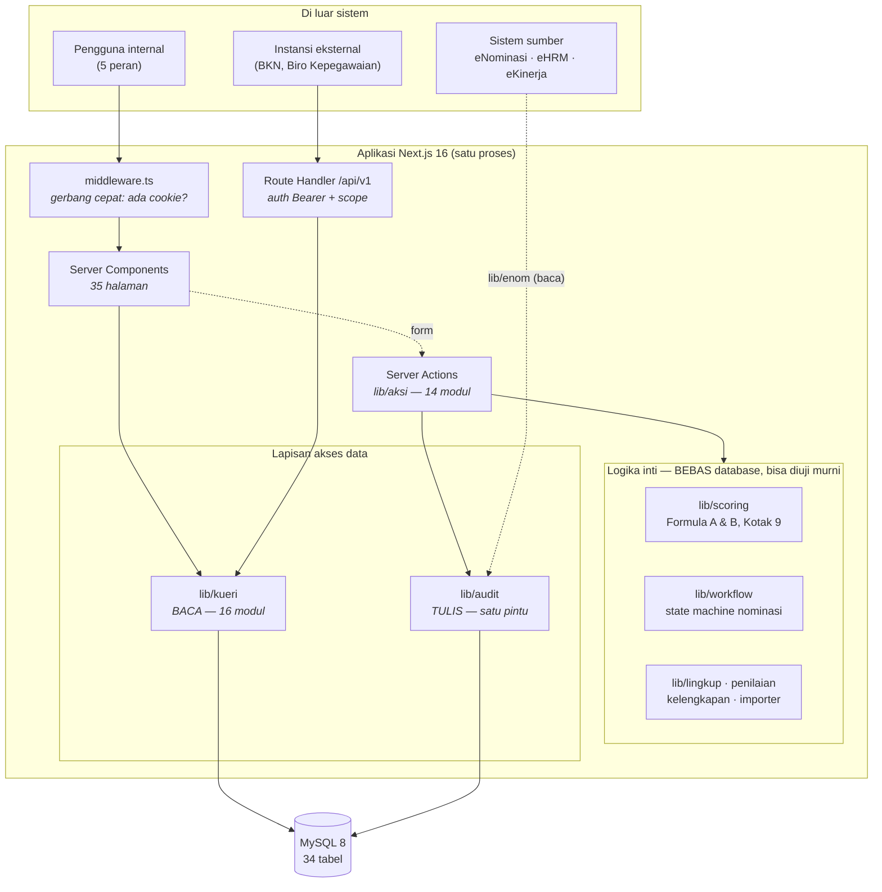
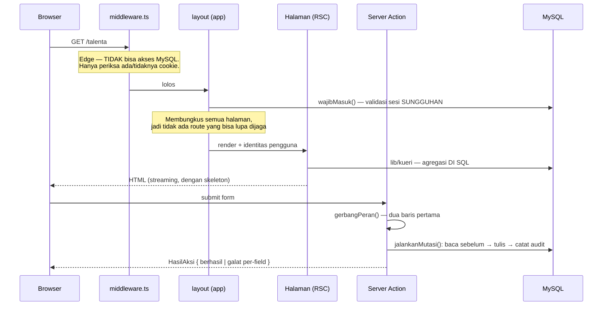
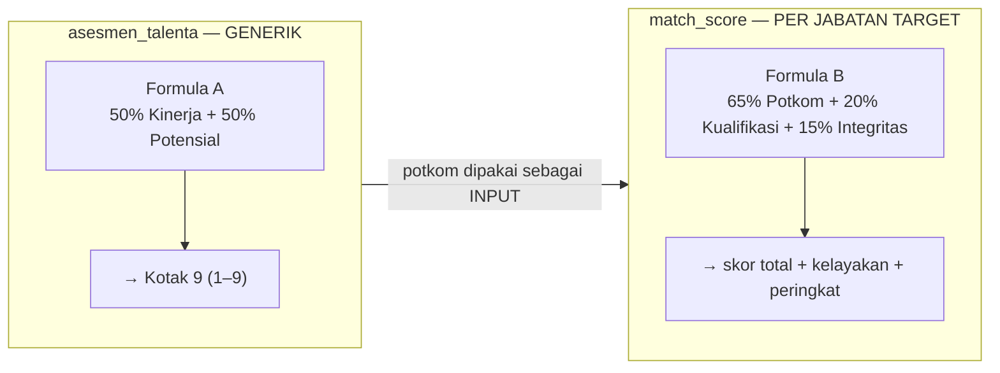
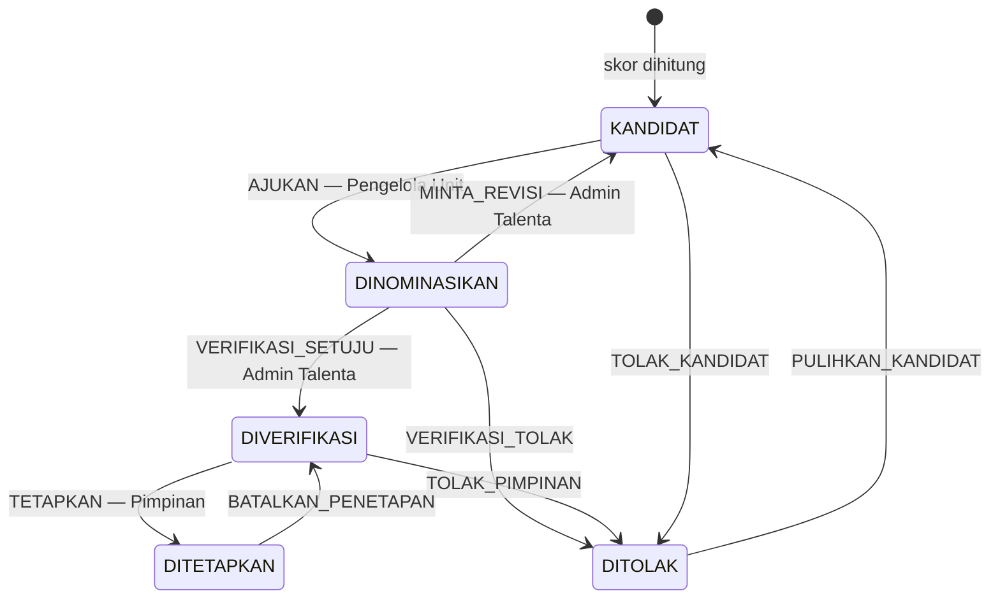

# DOKUMEN PERANCANGAN PERANGKAT LUNAK (SDD)

## SIMT DJBK — Sistem Informasi Manajemen Talenta
### Direktorat Jenderal Bina Konstruksi, Kementerian Pekerjaan Umum

| | |
|---|---|
| **Versi** | 1.0 |
| **Tanggal** | 11 Agustus 2026 |
| **Status** | Menggambarkan sistem yang **sudah berjalan** (Fase 0–11), bukan rancangan yang belum dibangun |
| **Dasar** | Dibaca langsung dari kode & database `pupr_dev_v2`, bukan disusun dari niat |

---

## Cara membaca dokumen ini

SRS menjawab **apa** yang harus dilakukan sistem. SDD menjawab **bagaimana ia dibangun, dan kenapa begitu**. Yang dituliskan di sini hanya keputusan yang **mahal untuk diubah** atau **mudah dirusak tanpa sadar** — bukan katalog seluruh berkas.

| Dokumen | Menjawab | Otoritas atas |
|---|---|---|
| [`PRD.md`](PRD.md) | Produk: tujuan, peran, alur, inventaris halaman | Ruang lingkup fitur |
| [`SRS.md`](../SRS.md) | Kebutuhan: 209 fungsional · 77 non-fungsional · DFD · use case | Kontrak "harus bisa apa" |
| **`SDD.md`** (ini) | Rancangan: arsitektur, dekomposisi, algoritma, keamanan | Cara membangun |
| [`ERD.md`](ERD.md) | Data: 34 tabel, 56 relasi, aturan level data | Struktur database |
| [`sql/001` → `015`](sql/) | DDL & seed, dijalankan berurutan | **Sumber kebenaran skema** |

> **Satu aturan yang mengikat seluruh dokumen:** kalau kode menyimpang dari dokumen, dokumennya ikut diubah pada commit yang sama. Dokumen yang diam-diam basi lebih berbahaya daripada tidak ada dokumen — ia dipercaya.

---

# 1. Arsitektur

## 1.1. Bentuk dasar

Satu aplikasi Next.js **full-stack** — frontend dan backend dalam satu proses, bukan SPA + REST terpisah. Konsekuensinya paling penting: halaman mengambil data dengan **memanggil fungsi**, bukan dengan `fetch` ke API-nya sendiri. Tidak ada lapisan HTTP internal yang perlu diautentikasi, diserialisasi, dan diuji dua kali.



## 1.2. Teknologi & alasan pemilihannya

| Lapis | Pilihan | Kenapa ini |
|---|---|---|
| Kerangka | **Next.js 16** (App Router) | Server Components menghapus lapisan API internal; satu artefak untuk di-deploy di lingkungan on-premise instansi |
| UI | **React 19** + **Tailwind v4** | Tailwind v4 memetakan tiap utility langsung ke CSS variable, sehingga tema terang/gelap jadi **pergantian nilai token** — bukan pergantian kelas yang harus diingat di tiap komponen |
| Basis data | **MySQL 8** | Sudah jadi standar di lingkungan Kementerian; CTE rekursif & window function yang dipakai rule engine tersedia |
| ORM | **Drizzle 0.45** (`drizzle-kit pull`) | Tipe **diturunkan dari database**, bukan ditulis manual — skema dan tipe tidak bisa lepas |
| Validasi | **Zod 4** | Satu skema untuk parsing di boundary + tipe TypeScript |
| Sandi | **bcryptjs 3** | Tanpa dependensi biner native; portabel ke lingkungan yang tidak boleh mengompilasi |
| Grafik | **Recharts 3** | Kotak 9 justru **tidak** memakainya — CSS Grid lebih tepat untuk matriks 3×3 |
| Uji | **Vitest** + **Playwright 1.62** | Unit untuk logika murni, browser sungguhan untuk yang hanya terlihat di browser |

## 1.3. Siklus satu permintaan



**Tiga hal yang tidak boleh dibalik urutannya:**

1. **`middleware` bukan otoritas.** Ia berjalan di edge dan tidak bisa menyentuh MySQL, jadi ia hanya bisa melihat *ada* cookie — bukan apakah cookie itu masih sah. Sesi yang sudah dicabut lolos di sini. Menaruh RBAC di middleware = penjagaan yang terlihat ada tapi tidak ada.
2. **Penolakan baca terjadi SEBELUM kueri.** Data yang sudah terkirim ke klien tidak bisa ditarik kembali.
3. **Peran diperiksa sebelum membaca keadaan.** Sebagian besar server action perlu membaca DB lebih dulu untuk menyusun penolakan yang berguna ("masih ditempati 3 pegawai aktif"). Kalau pembacaan itu jalan sebelum peran diperiksa, isi penolakannya membocorkan keberadaan baris kepada siapa pun yang punya sesi — satu di antaranya bahkan menyebut nama pegawai. Karena itu `gerbangPeran()` wajib jadi **dua baris pertama** setiap aksi.

---

# 2. Dekomposisi Modul

## 2.1. Peta tanggung jawab

```
lib/
├── scoring/     11 modul · Formula A & B, Kotak 9, agregasi rubrik       → BEBAS DB
├── workflow.ts       state machine nominasi & talent pool                → BEBAS DB
├── penilaian.ts      jembatan data pegawai → nilai per indikator         → BEBAS DB
├── skor-massal.ts    pipeline rubrik + banyak pegawai → skor + peringkat → BEBAS DB
├── lingkup.ts        aturan pembatasan data per unit                     → BEBAS DB
├── importer/         normalisasi data sumber + pencatatan temuan         → BEBAS DB
├── kueri/       16 modul · 101 fungsi BACA                               → server-only
├── aksi/        14 modul · 60 fungsi TULIS (server action)
├── audit.ts          jalankanMutasi() — SATU-SATUNYA pintu tulis
├── api/          4 modul · permukaan eksternal: token, scope, gerbang
├── enom/         4 modul · klien BACA API eNominasi
└── db/               hasil drizzle-kit pull — JANGAN diedit tangan
```

*(Hitungan di atas modul non-uji; berkas `*.test.ts` bersanding di folder yang sama.)*

**Pemisahan yang paling menentukan: logika inti bebas database.** `lib/scoring`, `lib/workflow`, `lib/lingkup`, `lib/importer` tidak mengimpor satu pun modul DB. Bukan demi kerapian — demi **bisa diuji tanpa database**. Rumus penilaian yang hanya bisa diuji lewat halaman berarti setiap perubahan rumus menuntut menyiapkan data, menjalankan server, dan mengeklik; yang terjadi dalam praktik adalah rumusnya tidak diuji.

## 2.2. Aturan satu sumber kebenaran

Ini bagian rancangan yang paling mudah dilanggar tanpa ada yang gagal, jadi ia ditulis sebagai larangan eksplisit:

| Hal | Satu-satunya tempatnya | Kalau disalin ke tempat kedua |
|---|---|---|
| Rumus skoring | `lib/scoring/` | Dua halaman menampilkan skor berbeda untuk orang yang sama |
| "Asesmen mana yang berlaku" | `CTE_ASESMEN_TERBARU` di `lib/kueri/dasar.ts` | Dashboard & direktori menghitung populasi berbeda |
| "Siapa yang ditampilkan" | `filterSumber()` di `lib/kueri/dasar.ts` | Halaman mulai berselisih tanpa satu pun galat |
| Urutan skor → kelayakan → peringkat | `lib/skor-massal.ts` | Empat pemanggilnya bisa berbeda hasil |
| Transisi status nominasi | `lib/workflow.ts` | Satu keputusan manusia mengubah 3 hal; salah satunya tertinggal |
| Identitas pengguna | `getCurrentUser()` di `lib/auth.ts` | Penggantian ke SSO tidak lagi cukup satu berkas |
| Pintu tulis DB | `jalankanMutasi()` di `lib/audit.ts` | Mutasi tanpa jejak audit |
| Pembacaan parameter URL | `lib/param.ts` | `?hal=abc` → `NaN` masuk `OFFSET` → MySQL menolak |
| Warna | token CSS di `globals.css` | Tema gelap jebol di komponen yang terlewat |

**Prosedur wajib sebelum menulis fungsi baru:** cari dulu yang serupa (`grep` nama, periksa `lib/`). Kalau ada yang mirip tapi belum pas, **generalisasi yang ada** — jangan tambah versi kedua.

## 2.3. Dua permukaan di atas data yang sama

`/api/v1` (instansi eksternal, Bearer) dan UI internal (sesi cookie) adalah **dua lapisan autentikasi di atas kueri yang sama**, bukan dua sistem. Endpoint eksternal memanggil `lib/kueri` yang sama dengan halaman — sehingga angka yang dikirim ke BKN tidak mungkin berbeda dari yang dilihat Dirjen di layar.

Yang **berbeda** hanya penyaringan lapangan di atasnya, dan itu memakai **allowlist**, bukan blocklist: `samarkanPegawai()` menyusun balasan dari field yang diizinkan alih-alih menghapus field yang dilarang. Dengan blocklist, kolom yang ditambahkan ke kueri enam bulan kemudian menetes ke klien tanpa MoU, dan tidak ada satu pun uji yang gagal.

---

# 3. Rancangan Data

Struktur lengkap ada di [`ERD.md`](ERD.md). Yang dicatat di sini hanya keputusan rancangannya.

## 3.1. Dua level skor, sengaja dua tabel



`asesmen_talenta` adalah snapshot tahunan per pegawai, tidak terikat jabatan. `match_score` adalah skor kecocokan per pasangan pegawai × jabatan target, dan ia **memakai** `potkom` dari asesmen — tidak menghitung ulang dari nol. Menumpuk keduanya jadi satu tabel membuat kata "skor" ambigu tergantung siapa yang bertanya.

## 3.2. Bobot mana yang jadi konstanta, mana yang jadi data

Pembedaan ini menentukan apa yang bisa diubah tanpa deploy:

| | Formula A | Formula B |
|---|---|---|
| Bobot | **Konstanta kode** (`BOBOT_FORMULA_A` 50/50) | **Baris database** (`rubrik_komponen.bobot_komponen` 0,65/0,20/0,15) |
| Alasan | Ditetapkan Lampiran A/B secara nasional — bukan wewenang DJBK | Rubrik boleh berbeda **per jabatan target** dan disunting dari UI |
| Mengubahnya | Mengubah kode + `db:recompute` | Mengedit rubrik di UI, lalu Hitung Ulang |

Ambang klasifikasi kedua sumbu juga konstanta: **≥80** teratas, **60–79** tengah, **<60** terbawah. Matriks Kotak 9 turunan langsung Lampiran A:

| Kinerja (Y) ↓ / Potensial (X) → | Rendah | Menengah | Tinggi |
|---|:---:|:---:|:---:|
| **Di Atas Ekspektasi** | 4 | 7 | **9** |
| **Sesuai Ekspektasi** | 2 | 5 | 8 |
| **Di Bawah Ekspektasi** | 1 | 3 | 6 |

Skor tetap lain yang berasal dari dokumen dan **tidak boleh disesuaikan ke data**: predikat kinerja 100/80/60/40/20, rekam jejak disiplin 100/75/50/25/0. Kalau data bentrok dengan angka ini, datanya yang dibetulkan.

## 3.3. Rule engine sebagai data, bukan kode

Rubrik disimpan berjenjang — **Komponen → Indikator → (Sub-indikator) → Kategori Skor** — persis struktur `KERANGKA TALENT POOL.md`. Bobot, kategori, dan ambang jadi baris DB, sehingga jabatan target baru tidak menuntut rilis kode.

Dua kolom menjaga rancangan itu tetap hidup setelah pengguna mulai menyuntingnya:

- **`rubrik_indikator.kunci_sistem`** memisahkan *label* indikator (milik pengguna, bebas diubah) dari *pengenal sumber datanya* (milik sistem, daftar tertutup di `lib/penilaian.ts`). Sebelum kolom ini ada, jembatannya adalah pencocokan nama persis — mengganti nama indikator dari UI mematikan seluruh perhitungan match score.
- **`match_score.rubrik_snapshot`** membekukan bobot saat skor dihitung. Tanpa itu, skor suksesor yang sudah **DITETAPKAN** tidak bisa dipertanggungjawabkan setelah bobot diubah.

Mesin rubriknya **sengaja tidak pernah melempar** — benar untuk perhitungan massal (satu rubrik cacat tidak boleh menghentikan 1.872 pegawai), tapi berarti rubrik cacat tetap menghasilkan angka yang tampak wajar. Karena itu kesalahannya ditangkap di tempat lain: `lib/scoring/validasi.ts` saat rubrik disimpan atau diaktifkan.

## 3.4. Pola akses data

| Aturan | Alasan |
|---|---|
| **Agregasi di SQL**, bukan `.reduce()` di server | Dev 43 pegawai, produksi 1.872. Yang lolos di dev akan menarik seluruh tabel di produksi |
| Kolom pengurutan lewat **daftar putih** | `?urut=` tidak pernah diinterpolasi ke SQL |
| `ORDER BY` hanya atas kolom **tersimpan** | Mengurutkan menurut kolom terhitung membatalkan penghematan `LIMIT` — terukur 5.677 ms → 153 ms setelah dibetulkan |
| Riwayat lengkap seluruh pegawai hanya untuk Hitung Ulang & Simulasi | Rubrik menilai *isi* riwayat tiap orang, jadi tidak bisa diagregasi; ia memang berat dan tidak boleh dipanggil saat merender halaman biasa |
| `bacaSesi()` di-`cache()` per permintaan | Tanpa itu layout, halaman, dan tiap aksi menembak kueri yang sama berkali-kali |

## 3.5. Batasan integritas yang harus diketahui perancang

**Rantai `ON DELETE CASCADE` hanya berjalan penuh satu tingkat di DBMS ini.** Terukur: satu `DELETE` pada induk yang punya 3 anak, masing-masing bercucu, hanya mengikuti cabang pertama. Akibatnya **jalur hapus wajib menghapus tingkat perantara secara eksplisit**, tidak mengandalkan cascade dari puncak. Rincian & kueri pemeriksanya di [`ERD.md`](ERD.md) §1 poin 7.

---

# 4. Rancangan Alur Kerja

Satu keputusan manusia mengubah **tiga** hal sekaligus: status `talent_pool`, status `nominasi`, dan satu baris `approval_log`. Karena itu transisinya tinggal di **satu tabel transisi eksplisit** (`lib/workflow.ts`), bukan sebagai `if` yang tersebar di komponen — keadaan setengah jalan tidak menghasilkan galat, hanya halaman yang saling bertentangan.



**10 aksi · 5 status pool · 2 tahap approval · 4 giliran.** Fungsi `giliranSiapa()` menurunkan "siapa yang harus bertindak" dari tabel yang sama — ia **tidak pernah** ditulis sebagai kondisi SQL, karena itu akan jadi definisi kedua. Isi & tujuan notifikasi (`lib/notifikasi.ts`) juga mengambil peran tujuannya dari `PERAN_GILIRAN` di tabel yang sama, sehingga menambah tahap approval tidak menuntut menyunting dua tempat.

---

# 5. Rancangan Keamanan

## 5.1. Tiga lapis, pembagian tugas tegas

| Lapis | Berkas | Menjaga | **Bukan** untuk |
|---|---|---|---|
| 1. Gerbang cepat | `middleware.ts` | Ada tidaknya cookie | RBAC — peran tidak ada di cookie, dan sesi tercabut lolos |
| 2. Validasi sesi | `app/(app)/layout.tsx` | `wajibMasuk()` — sesi sungguhan di DB | — |
| 3. Wewenang | `gerbangPeran()` + `jalankanMutasi()` | Peran per aksi, apa pun kata middleware | — |

Lapis 2 membungkus **seluruh** halaman aplikasi, jadi tidak ada route di bawahnya yang bisa lupa dijaga. Lapis 3 diperiksa dua kali dengan sengaja: `gerbangPeran()` mempercepat penolakan, `jalankanMutasi()` tetap penegak terakhir.

**`api/` sengaja dilewati lapis 1, dan itu bukan kelonggaran.** Gerbang di `middleware.ts` hanya melihat cookie, sementara kedua permukaan `api/` tidak memakainya: `api/v1` diautentikasi Bearer, dan `api/internal` membalas berkas unduhan. Menerapkannya di sana membuat instansi eksternal menerima **307 + HTML halaman login** alih-alih 401 JSON, dan unduhan CSV bersesi mati menghasilkan **berkas HTML bernama `.csv`**. Keduanya menegakkan aksesnya sendiri di route handler — penolakannya dipindahkan ke lapisan yang mengerti bentuk balasannya, bukan dihapus.

## 5.2. Sesi disimpan di database, bukan JWT

Dua kebutuhan justru menuntut keadaan server: **pencabutan seketika** saat akun dinonaktifkan, dan **timeout idle** yang butuh penanda "terakhir aktif". JWT hanya bisa memenuhinya dengan daftar-cabut di server — yang artinya sudah punya keadaan server.

- Token disimpan sebagai **SHA-256**, bukan bcrypt: isinya 256 bit acak, tidak ada yang bisa ditebak, jadi fungsi lambat hanya menambah biaya tiap permintaan.
- **Dua tenggat**, karena satu tenggat selalu bisa dilangkahi: `terakhir_aktif_pada` menutup sesi yang ditinggal, `kedaluwarsa_pada` menutup sesi yang dibuat hidup terus oleh tab yang memuat ulang sendiri.
- Keduanya diperiksa **di dalam SQL yang sama** dengan pengambilan penggunanya. Memeriksanya di JavaScript memakai jam aplikasi sementara yang menulis `terakhir_aktif_pada` adalah jam MySQL — dua jam yang beda beberapa detik menghasilkan sesi yang kadang hidup kadang mati tanpa pola.

## 5.3. Gagal tertutup

Setiap keputusan akses jatuh ke **paling sempit** ketika datanya tidak terbaca:

| Keadaan | Hasil |
|---|---|
| `scope_akses` klien API tak terbaca | Nol endpoint, bukan semua |
| Pengelola Unit tanpa unit | Tidak melihat apa-apa, bukan melihat semua |
| Riwayat diklat belum divalidasi | Tidak dianggap relevan (arah sebaliknya menaikkan skor orang yang datanya paling berantakan) |
| Pegawai di luar lingkup diakses lewat URL | Dijawab **"tidak ada"**, bukan "akses ditolak" — pesan yang membedakan keduanya membuat URL bisa dipakai menebak keberadaan orang |

## 5.4. Yang tidak boleh dilonggarkan tanpa alasan tertulis

Balasan gagal login yang **sama untuk semua sebab** · sandi yang **tidak pernah masuk URL** (`<form action>`, bukan `onSubmit`) · sandi sementara yang **tampil sekali** · larangan menonaktifkan **Super Admin aktif terakhir** · penghambat tebak-sandi **di baris pengguna**, bukan di memori proses (Next.js bisa berjalan lebih dari satu instans; penghitung per proses berarti batasnya terkalikan jumlah instans tanpa ada yang menyadarinya).

## 5.5. Data pribadi

Data ASN (NIP, kinerja, hukuman disiplin) tunduk **UU PDP No. 27/2022**. Dua konsekuensi rancangan: endpoint eksternal tidak boleh mengirim lebih dari yang diizinkan `scope_akses` (§2.3), dan permukaan **pra-autentikasi** — halaman masuk — tidak boleh memuat data pribadi apa pun, termasuk foto dari berkas kepegawaian.

---

# 6. Rancangan Antarmuka

## 6.1. Rasa yang dituju

**Padat & profesional seperti Notion, tapi berjaket institusi.** Alat kerja internal yang ditatap staf kepegawaian sepanjang hari — bukan halaman pemasaran. Densitas data di atas dekorasi; border tipis alih-alih shadow tebal; tanpa emoji dekoratif; tanpa hero section.

Identitas visualnya nyata, bukan netral: navy Kementerian PU + emas `#FCB717`, sidebar bergradien bertepi emas, pita kepala halaman navy→teal.

## 6.2. Warna hanya lewat token

Seluruh warna hidup sebagai **token CSS berpasangan terang/gelap**. Tidak ada warna yang ditulis di komponen — kalau ada, tema gelap jebol di komponen yang terlewat, dan yang terlewat tidak akan ketahuan sampai ada yang membukanya.

| Aturan | Alasan |
|---|---|
| **Emas bukan warna status** | Ia penanda identitas. Memakainya untuk "peringatan" membuatnya bertabrakan dengan `--warning` yang maknanya sudah tetap |
| Emas **tidak bisa jadi warna teks** di latar terang | Kontrasnya 1,7:1. Untuk itu ada `--emas-teks` |
| Warna seri chart **bukan** warna status | Success/warning/danger punya makna tetap |
| Setiap seri chart **wajib punya pola garis berbeda** + legenda yang menggambar polanya + padanan tabel angka | Palet sudah divalidasi untuk semua pasangan, tapi pemisahan terburuknya ada di pita CVD 6–8. Warna sendirian tidak cukup |
| Menimpa gaya di atas permukaan bermerek lewat **token**, bukan nama class | Menimpa per nama class lolos di halaman yang diperiksa dan gagal di halaman yang tidak |

**`npm run audit:kontras` wajib hijau** (218 pasangan) dan ikut dalam `npm run verifikasi`. Ia membaca nilainya **langsung dari `globals.css`**, jadi token yang diubah tanpa mengubah skripnya akan gagal — bukan tetap hijau. Latar bergradien tidak punya satu nilai, jadi **tiap stop gradien diaudit sendiri**: "sudah kulihat dan terbaca" hanya berlaku untuk titik yang kebetulan dilihat.

## 6.3. Struktur layar

App shell full-screen: sidebar kiri persisten (dua tingkat ciutkan — lebar 240→56px, dan per grup) + navbar (breadcrumb, pencarian, menu pengguna, toggle tema) + area konten. Latar area konten memakai `--kanvas`, **bukan** `--surface` — kalau area konten juga putih, satu-satunya pemisah dari kartu adalah border 1px dan halaman padat kartu jadi rata tanpa hierarki.

Dua aturan yang lahir dari kejadian nyata:

- **Grup sidebar yang memuat halaman aktif tidak bisa ditutup.** Tanpa itu, orang yang menciutkan grup lalu masuk ke salah satu halamannya melihat sidebar yang tidak menunjukkan di mana ia berada — dan gejalanya terbaca sebagai "menu saya hilang".
- **Filter populasi wajib menyatakan dirinya di UI.** Tampilan yang dibatasi harus mengatakannya sendiri; tanpa itu aplikasi menampilkan 10 pegawai tanpa satu pun tanda bahwa 33 disembunyikan, dan pembacanya menyimpulkan DJBK punya 10 pegawai.

## 6.4. Keadaan interaksi

Setiap halaman punya **skeleton dengan tata letak yang sama** dengan hasil akhirnya (kalau tidak, halaman melompat tepat saat data masuk), tombol punya pending state bawaan, dan setiap chart punya **padanan tabel angka**. Cetak/PDF punya gayanya sendiri: sidebar & toolbar hilang, pembatas tinggi dilepas — tanpa itu yang tercetak hanya sepanjang satu layar.

---

# 7. Strategi Pengujian

Empat lapis yang **saling melengkapi, bukan berulang**:

| Lapis | Perintah | Cakupan | Menangkap |
|---|---|---|---|
| Unit | `npm run verifikasi` | 18 berkas uji atas logika murni | Rumus & aturan yang salah |
| Isi data | `npm run verifikasi:data` | 48 pemeriksaan **SQL murni** | **Data** yang menyimpang dari rumus |
| Kode skoring | `npm run verifikasi:skoring` | 120 baris dilahirkan ulang + 441 pasangan (Y,X) | **Kode** yang menyimpang dari data |
| Perilaku | `npm run smoke` | 12 berkas Playwright, ±390 pemeriksaan | Yang hanya terlihat di browser sungguhan |

> Memverifikasi `lib/scoring` dengan `lib/scoring` hanya mengonfirmasi dirinya sendiri. Karena itu `verifikasi:data` menguji isi DB dengan SQL murni, sementara `verifikasi:skoring` menjalankan kodenya lalu membandingkannya dengan isi DB. Dua arah berbeda atas kebenaran yang sama.

Ditambah **pengukuran** sebagai bagian rancangan, bukan renungan belakangan: `ukur:kueri` (ambang 150 ms/kueri; 500 ms untuk agregat laporan yang dirender di dalam `<Suspense>`), `ukur:hitung-ulang`, `ukur:payload`, dan `ukur:dampak-skoring` yang **wajib dijalankan sebelum menimpa `match_score`** setiap kali `lib/penilaian` atau `lib/scoring` disentuh — ia yang menjawab "berapa yang bergeser dan apakah kelayakan berubah" dengan angka, bukan dengan keyakinan.

**Prinsip menulis asersi:** tanyakan *"apa yang membuat ini merah kalau populasinya berubah tapi kodenya benar?"* Penjaga atau pembanding yang memakai angka/nama tetap akan patah suatu hari, dan gejalanya menuduh aplikasinya. Pembanding harus datang dari sumber yang sama dengan yang diuji.

---

# 8. Keputusan Rancangan & Alternatif yang Ditolak

Bagian ini ada supaya alternatif yang sudah ditimbang tidak diusulkan ulang sebagai "perbaikan".

| Keputusan | Yang dipilih | Yang ditolak | Alasan terukur |
|---|---|---|---|
| Lapisan API internal | Server Components memanggil fungsi | REST internal untuk UI sendiri | Auth, serialisasi, dan uji jadi dua kali untuk data yang sama |
| Riwayat diklat | Kolom `JSON` di `pegawai` + **kamus** per nama diklat | Tabel per baris (pegawai × diklat) | 264 entri hanya berisi **182 nama** berbeda; memecah per baris berarti orang yang sama memutuskan "PIM IV itu Manajerial" berulang kali |
| Kategori diklat | Kamus + **validasi manusia** | Pencocokan kata kunci otomatis | Dari 182 nama nyata, hanya **36 (20%)** cocok pola apa pun. Sisanya akan diberi kategori yang salah secara diam-diam |
| Usulan kategori | Kembalikan **semua** yang cocok | Pilih yang "terbaik" | Memilih otomatis di antara dua kandidat berarti mesin mengambil keputusan yang justru sedang dipindahkan ke manusia |
| Sesi | Tabel `sesi` di DB | JWT stateless | Pencabutan seketika & timeout idle menuntut keadaan server (§5.2) |
| Penyaringan field API | **Allowlist** | Blocklist (`delete baris.nip`) | Kolom yang ditambahkan nanti menetes ke klien tanpa MoU, tanpa uji yang gagal |
| Kotak 9 | CSS Grid | Library chart | Matriks 3×3 dengan drill-down bukan chart; library-nya justru menghalangi |
| Warna Kotak 9 | Band kualitas + tint diplafon **45%**, teks tetap `--text` | Teks putih di semua sel (cara v1) | Terukur **1,74–2,28:1** di kotak 4/5/7/8 — empat dari sembilan sel tak terbaca |
| Job asinkron ekspor | **Belum dibuat** | Antrean job | Kueri laporan 2–60 ms dan tiap ekspor dibatasi `LIMIT`. Infrastruktur untuk masalah yang belum ada |
| Progress determinate Hitung Ulang | Pending state biasa | Progress bar berpersentase | Setelah jalur tulisnya di-batch: 1.960 pegawai selesai **2,5–4,4 s** (dari 48 s versi per-pegawai) |
| Indeks penutup agregat laporan | **Ditolak setelah dicoba** | `idx_msd_agregat` | Justru **lebih lambat** (255–468 ms vs 241–275 ms) — optimizer berpindah ke indeks itu lalu memilih rencana lebih buruk |
| Tombol sinkronisasi manual | Belum dipasang | Tombol yang memanggil sumber | Mekanisme sumber produksi belum diputuskan; tombol yang memanggil sumber yang belum ada **selalu gagal** → pengguna menyimpulkan sinkronisasi rusak |

---

# 9. Batasan yang Disadari

## 9.1. Utang teknis yang sengaja ditunda

Ekspor **Excel & PDF** (CSV sudah jalan tanpa dependensi apa pun; `.xlsx` menuntut pustaka baru — keputusan yang pantas diambil sadar) · **`openapi.yaml`** untuk `/api/v1` (halaman Dokumentasi API sudah memuat isinya, spesifikasi mesin belum ada) · **rate limit per klien** (sekarang konstanta global 120/menit; kuota per MoU berarti kolom baru di `api_client`) · **2FA** (disebut PRD sebagai *opsi*; menuntut keputusan operasional yang belum ada pemiliknya) · **pengiriman surel** (transport belum diputuskan — Lupa Password **mengatakan itu apa adanya** alih-alih menjanjikan email yang tidak akan datang).

## 9.2. Keputusan yang menunggu pemilik proses

Empat hal sudah dianalisis, punya default yang berjalan, dan **mengubah siapa boleh apa** — menyentuhnya tanpa jawaban berarti mengubah desain, bukan memperbaiki cacat: skala `potkom` dari eNominasi (terukur **61,74–130,73**; separuh sampel >100, sehingga aturan clamp membuat separuh populasi menumpuk di X=100 dan kehilangan daya bedanya — perlu dinormalisasi atau tidak?), sumber data Penilaian Kinerja (dua dokumen menyebut sistem berbeda), syarat minimal kinerja di kelayakan, dan agregasi tiga sub-indikator Pengalaman Jabatan.

## 9.3. Yang wajib diganti sebelum produksi

Tidak satu pun bisa ditemukan oleh uji:

1. **Sandi seluruh akun seed** masih sandi dev — atur ulang lewat Manajemen Pengguna supaya pemiliknya dipaksa mengganti saat masuk.
2. **HTTPS wajib.** Cookie sesi dipasang `secure` hanya di produksi; build produksi di belakang HTTP polos berarti cookie melintas terbuka. `localhost` dikecualikan sebagai secure context, **alamat IP tidak** — gejalanya "sandinya benar tapi tidak bisa masuk".
3. **Ketiga token API dev bersifat publik** — plaintext-nya ada di repositori (disengaja, supaya smoke bisa memakainya). Cabut ketiganya, terbitkan yang baru.
4. Hapus variabel env pengalih peran dev yang sudah tidak dipakai kode mana pun.

---

## Riwayat Perubahan Dokumen

| Versi | Tanggal | Perubahan |
|---|---|---|
| 1.0 | 11 Agustus 2026 | Penyusunan awal. Diturunkan dari sistem yang sudah berjalan (Fase 0–11) dan dicocokkan dengan `pupr_dev_v2` — 34 tabel, 56 relasi |
