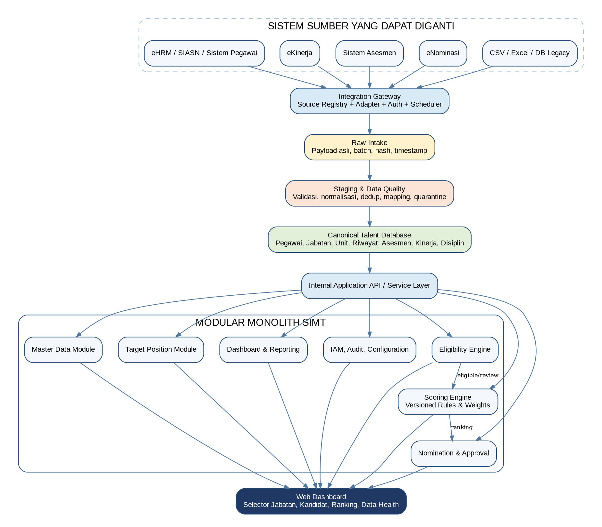
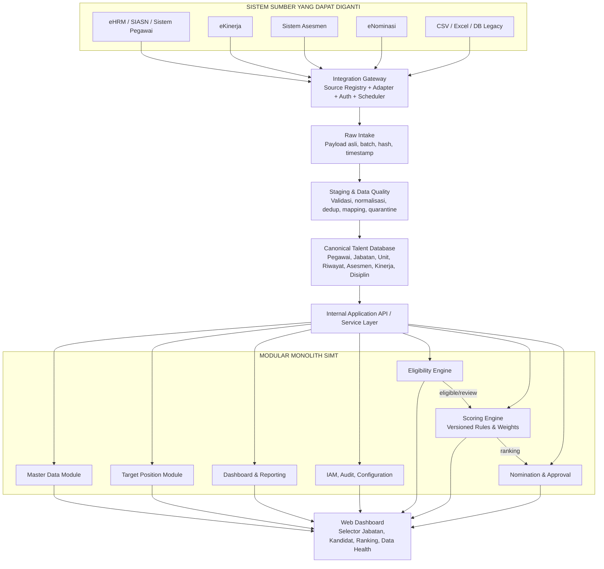

# Diagram Arsitektur — SIMT DJBK Modular Monolith

> **Transkrip dari [`WhatsApp Image 2026-07-31 at 4.40.35 PM.jpeg`](WhatsApp%20Image%202026-07-31%20at%204.40.35%20PM.jpeg).**
> Gambar ini **sama** dengan gambar §4 "Gambar Arsitektur" di
> [`00_Blueprint_Arsitektur_Talenta.md`](00_Blueprint_Arsitektur_Talenta.md)
> ([`media/image1.png`](media/image1.png)) — versi WhatsApp-nya beresolusi lebih rendah.
> Yang ditulis di bawah adalah isi kotak & panah apa adanya, bukan tafsiran.

---

## Aliran data

---

## Isi tiap kotak

### Sistem sumber yang dapat diganti *(kotak bergaris putus-putus)*

| Kotak |
|---|
| eHRM / SIASN / Sistem Pegawai |
| eKinerja |
| Sistem Asesmen |
| eNominasi |
| CSV / Excel / DB Legacy |

Kelima sumber menunjuk ke **satu** tujuan yang sama: Integration Gateway.

### Jalur pipa data *(berurutan, satu arah)*

| Urutan | Kotak | Keterangan di dalam kotak |
|---|---|---|
| 1 | Integration Gateway | Source Registry + Adapter + Auth + Scheduler |
| 2 | Raw Intake | Payload asli, batch, hash, timestamp |
| 3 | Staging & Data Quality | Validasi, normalisasi, dedup, mapping, quarantine |
| 4 | Canonical Talent Database | Pegawai, Jabatan, Unit, Riwayat, Asesmen, Kinerja, Disiplin |
| 5 | Internal Application API / Service Layer | — |

### Modul di dalam "MODULAR MONOLITH SIMT"

| Modul | Keterangan di dalam kotak |
|---|---|
| Master Data Module | — |
| Target Position Module | — |
| Dashboard & Reporting | — |
| IAM, Audit, Configuration | — |
| Eligibility Engine | — |
| Scoring Engine | Versioned Rules & Weights |
| Nomination & Approval | — |

### Panah berlabel di dalam monolith

| Dari | Label | Ke |
|---|---|---|
| Eligibility Engine | `eligible/review` | Scoring Engine |
| Scoring Engine | `ranking` | Nomination & Approval |

### Muara

Seluruh modul bermuara ke satu kotak paling bawah:

> **Web Dashboard** — Selector Jabatan, Kandidat, Ranking, Data Health
