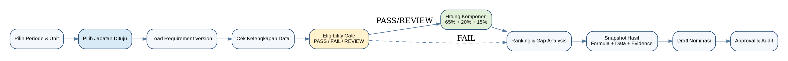
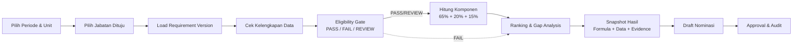

# Diagram Alur Matching Jabatan — SIMT DJBK

> **Transkrip dari [`WhatsApp Image 2026-07-31 at 4.40.37 PM.jpeg`](WhatsApp%20Image%202026-07-31%20at%204.40.37%20PM.jpeg).**
> Gambar ini **sama** dengan gambar §7 "Alur Matching Jabatan" di
> [`00_Blueprint_Arsitektur_Talenta.md`](00_Blueprint_Arsitektur_Talenta.md)
> ([`media/image2.png`](media/image2.png)) — versi WhatsApp-nya beresolusi lebih rendah.
> Yang ditulis di bawah adalah isi kotak & panah apa adanya, bukan tafsiran.

---

## Alur

---

## Langkah, berurutan

| # | Kotak | Keterangan di dalam kotak |
|---|---|---|
| 1 | Pilih Periode & Unit | — |
| 2 | Pilih Jabatan Dituju | *(kotak disorot biru)* |
| 3 | Load Requirement Version | — |
| 4 | Cek Kelengkapan Data | — |
| 5 | Eligibility Gate | PASS / FAIL / REVIEW *(kotak disorot kuning)* |
| 6 | Hitung Komponen | 65% + 20% + 15% *(kotak disorot hijau)* |
| 7 | Ranking & Gap Analysis | — |
| 8 | Snapshot Hasil | Formula + Data + Evidence |
| 9 | Draft Nominasi | — |
| 10 | Approval & Audit | — |

## Percabangan setelah Eligibility Gate

| Dari | Label panah | Ke | Gaya garis |
|---|---|---|---|
| Eligibility Gate | `PASS/REVIEW` | Hitung Komponen (65% + 20% + 15%) | utuh |
| Eligibility Gate | `FAIL` | Ranking & Gap Analysis | **putus-putus** |

Kandidat berstatus **FAIL** melewati perhitungan komponen tetapi **tetap masuk**
Ranking & Gap Analysis — garisnya putus-putus, langsung ke kotak yang sama dengan
jalur PASS/REVIEW.
