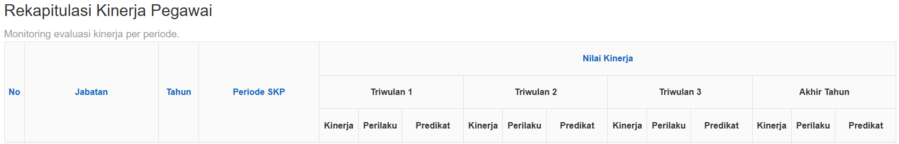

# sample(1).xlsx — konversi Markdown

> Dihasilkan program dari `doc/doc_tambahan_2/sample(1).xlsx`. **Berkas `.xlsx` tetap sumbernya**;
> berkas ini untuk dibaca & dicari, bukan untuk disunting.

- **Pembuat:** Ully Rachmawati
- **Dibuat:** 2026-07-13
- **Terakhir diubah:** 2026-08-04
- **Lembar:** 7
- **Gambar tersemat:** 5, diekstrak ke `media/` dan ditranskripsi di [Lampiran](#lampiran--gambar-tersemat)

**Cara membaca tabel di bawah:**

- Kolom `#` adalah **nomor baris di Excel**, dan judul kolom adalah **label kolom Excel** —
  jadi `B7` di sini menunjuk sel yang sama di berkas aslinya. Baris pertama tiap lembar
  adalah **judul**, bukan header: header sebenarnya ada di **baris 3**.
- Nilai sel bergabung disalin **ke bawah** (supaya `Parameter` tetap terbaca di setiap baris
  yang dicakupnya) tapi **tidak ke kanan** (judul yang membentang sembilan kolom akan terulang
  sembilan kali tanpa menambah informasi).
- Baris yang seluruhnya kosong dilewati; nomor `#` yang melompat berarti baris kosong di aslinya.
- Angka ditampilkan **apa adanya seperti tersimpan** — bobot `0.65` di Excel tampil `0.65`,
  bukan `65%` seperti yang mungkin terlihat di layar karena format sel.
- Sel berformula tampil sebagai `nilai (=rumus)`, mis. `4.5 (=5%*L14)`. Itu penting untuk
  lembar `Sample`, yang justru ada untuk memperagakan cara skornya dihitung.

## Daftar isi

1. [kerangka talent pool](#1-kerangka-talent-pool)
2. [TALENT POOLdata-Dir Pengadaan](#2-talent-pooldata-dir-pengadaan)
3. [TALENT POOLdata-Ka BP2JK](#3-talent-pooldata-ka-bp2jk)
4. [TALENT POOLdata-kdsbt sist](#4-talent-pooldata-kdsbt-sist)
5. [edit talet pool dir pengadaan](#5-edit-talet-pool-dir-pengadaan)
6. [Persyaratan Jabatan](#6-persyaratan-jabatan)
7. [Sample](#7-sample)

## 1. kerangka talent pool

_Rentang `B1:M38` · 35 baris berisi · 7 rentang sel bergabung (disalin ke bawah)._

| # | B | C | D | E | F | G | H | I | J | K | L | M |
|---|---|---|---|---|---|---|---|---|---|---|---|---|
| 1 | KERANGKA TALENT POOL ASN DIREKTORAT JENDERAL BINA KONSTRUKSI |  |  |  |  |  |  |  |  |  |  |  |
| 3 | Parameter | Kategori |  | Komponen | Bobot Komponen | Indikator | Bobot Indikator | Kategori |  |  |  |  |
| 4 | Nilai Kinerja (Sumbu Y) | Di Atas Ekspektasi | ≥80 - 100 | Kinerja Utama | 1 | Penilaian Kinerja | 1 | Sangat Baik | 100 |  |  |  |
| 5 |  | Sesuai Ekspektasi | ≥60 - <80 |  |  |  |  | Baik | 80 |  |  |  |
| 6 |  | Di Bawah Ekspektasi | <60 |  |  |  |  | Butuh Perbaikan | 60 |  |  |  |
| 7 |  |  |  |  |  |  |  | Kurang | 40 |  |  |  |
| 8 |  |  |  |  |  |  |  | Sangat Kurang | 20 |  |  |  |
| 10 | Nilai Potensial (Sumbu X) | Tinggi | ≥80 - 100 | Potensi & Kompetensi | 0.65 | Penilaian Potensi dan Kompetensi | 0.65 | Memenuhi Syarat | ≥80 | atau (Total Nilai Potkom Hasil Asesmen /Total Nilai Maksimal Potkom)*100 |  |  |
| 11 |  | Menengah | ≥60 - <80 |  |  |  |  | Masih Memenuhi Syarat | ≥68 - <80 | atau (Total Nilai Potkom Hasil Asesmen /Total Nilai Maksimal Potkom)*100 |  |  |
| 12 |  | Rendah | <60 |  |  |  |  | Kurang Memenuhi Syarat | <68 | atau (Total Nilai Potkom Hasil Asesmen /Total Nilai Maksimal Potkom)*100 |  |  |
| 13 |  |  |  | Kualifikasi Jabatan | 0.2 | Tingkat Pendidikan Formal | 0.05 | Doktor | 100 |  |  |  |
| 14 |  |  |  |  |  |  |  | Magister | 90 |  |  |  |
| 15 |  |  |  |  |  |  |  | S1/DIV | 80 |  |  |  |
| 16 |  |  |  |  |  |  |  | DIII | 70 |  |  |  |
| 17 |  |  |  |  |  |  |  | SLTA | 60 |  |  |  |
| 18 |  |  |  |  |  | Kesesuaian Bidang Ilmu | 0.05 | Memiliki riwayat pendidikan dalam bidang ilmu yang sesuai dengan jabatan target | 100 |  |  |  |
| 19 |  |  |  |  |  |  |  | Tidak memiliki riwayat pendidikan dalam bidang ilmu yang sesuai dengan jabatan target | 50 |  |  |  |
| 20 |  |  |  |  |  | Pengembangan Kompetensi | 0.05 | Memiliki riwayat pengembangan kompetensi dalam bidang yang sesuai dengan jabatan target | 100 |  |  |  |
| 21 |  |  |  |  |  |  |  | Tidak memiliki riwayat pengembangan kompetensi dalam bidang yang sesuai dengan jabatan target | 50 |  |  |  |
| 22 |  |  |  |  |  | Nilai Pengalaman Jabatan | 0.05 | Lama Jabatan |  |  |  |  |
| 23 |  |  |  |  |  |  |  | Memiliki masa kerja dalam jenjang jabatan 5 tahun ke atas | 100 |  |  |  |
| 24 |  |  |  |  |  |  |  | Memiliki masa kerja dalam jenjang jabatan 3 sampai dengan 4 tahun | 80 |  |  |  |
| 25 |  |  |  |  |  |  |  | Memiliki masa kerja dalam jenjang jabatan kurang dari 2 tahun | 60 |  |  |  |
| 26 |  |  |  |  |  |  |  | Keragaman Riwayat Jabatan |  |  |  |  |
| 27 |  |  |  |  |  |  |  | Memiliki pengalaman jabatan lintas Unit Organisasi | 100 |  |  |  |
| 28 |  |  |  |  |  |  |  | Memiliki pengalaman jabatan lintas Unit Kerja | 80 |  |  |  |
| 29 |  |  |  |  |  |  |  | Memiliki pengalaman jabatan Satu Unit Kerja | 60 |  |  |  |
| 30 |  |  |  |  |  |  |  | Substansi  Riwayat Jabatan |  |  |  |  |
| 31 |  |  |  |  |  |  |  | Memiliki riwayat jabatan yang berkaitan dengan jabatan target | 100 |  |  |  |
| 32 |  |  |  |  |  |  |  | Tidak Memiliki riwayat jabatan yang berkaitan dengan jabatan target | 50 |  |  |  |
| 33 |  |  |  | Integritas & Moralitas | 0.15 | Verifikasi Rekam Jejak Disiplin | 0.15 | Tidak pernah dijatuhi Hukdis | 100 |  |  |  |
| 34 |  |  |  |  |  |  |  | Pernah dijatuhi Hukdis Ringan | 75 |  |  |  |
| 35 |  |  |  |  |  |  |  | Pernah dijatuhi Hukdis Sedang | 50 |  |  |  |
| 36 |  |  |  |  |  |  |  | Pernah dijatuhi Hukdis Berat | 25 |  |  |  |
| 37 |  |  |  |  |  |  |  | Sedang menjalani hukdis | 0 |  |  |  |

## 2. TALENT POOLdata-Dir Pengadaan

_Rentang `B1:P42` · 40 baris berisi · 9 rentang sel bergabung (disalin ke bawah) · 5 gambar mengapung (lihat Lampiran)._

| # | B | C | D | E | F | G | H | I | J | K | L | M | N | O | P |
|---|---|---|---|---|---|---|---|---|---|---|---|---|---|---|---|
| 1 | KERANGKA TALENT POOL ASN DIREKTORAT JENDERAL BINA KONSTRUKSI |  |  |  |  |  |  |  |  |  |  |  |  |  |  |
| 2 | JABATAN TARGET : DIREKTUR PENGADAAN JASA KONSTRUKSI |  |  |  |  |  |  |  |  |  |  |  |  |  |  |
| 3 | Parameter | Kategori |  | Komponen | Bobot Komponen | Indikator | Bobot Indikator | Kategori |  | Kebutuhan Data | Sumber |  |  |  |  |
| 4 | Nilai Kinerja (Sumbu Y) | Di Atas Ekspektasi | ≥80 - 100 | Kinerja Utama | 1 | Penilaian Kinerja | 1 | Sangat Baik | 100 | Predikat Kinerja Triwulan IV 2025/akhir tahun PNS | https://karir.pu.go.id/enom |  |  |  |  |
| 5 |  | Sesuai Ekspektasi | ≥60 - <80 |  |  |  |  | Baik | 80 |  |  |  |  |  |  |
| 6 |  | Di Bawah Ekspektasi | <60 |  |  |  |  | Butuh Perbaikan | 60 |  |  |  |  |  |  |
| 7 |  |  |  |  |  |  |  | Kurang | 40 |  |  |  |  |  |  |
| 8 |  |  |  |  |  |  |  | Sangat Kurang | 20 |  |  |  |  |  |  |
| 10 | Nilai Potensial (Sumbu X) | Tinggi | ≥80 - 100 | Potensi & Kompetensi | 0.65 | Penilaian Potensi dan Kompetensi | 0.65 | Memenuhi Syarat | ≥80 | Nilai Potkom Jabatan saat ini | https://karir.pu.go.id/enom |  |  |  |  |
| 11 |  | Menengah | ≥60 - <80 |  |  |  |  | Masih Memenuhi Syarat | ≥68 - <80 |  |  |  |  |  |  |
| 12 |  | Rendah | <60 |  |  |  |  | Kurang Memenuhi Syarat | <68 |  |  |  |  |  |  |
| 13 |  |  |  | Kualifikasi Jabatan | 0.2 | Tingkat Pendidikan Formal | 0.05 | Doktor | 100 | Pendidikan PNS | https://ehrm.pu.go.id/layanan-kepegawaian |  |  |  |  |
| 14 |  |  |  |  |  |  |  | Magister | 90 |  |  |  |  |  |  |
| 15 |  |  |  |  |  |  |  | S1/DIV | 80 |  |  |  |  |  |  |
| 16 |  |  |  |  |  |  |  | DIII | 70 |  |  | Cek syarat jabatan dir pengadaan/S1 Semua Jurusan |  |  |  |
| 17 |  |  |  |  |  |  |  | SLTA | 60 |  |  |  |  |  |  |
| 18 |  |  |  |  |  | Kesesuaian Bidang Ilmu | 0.05 | Memiliki riwayat pendidikan dalam bidang ilmu yang sesuai dengan jabatan target | 100 | Jurusan S1 Pendidikan PNS | https://ehrm.pu.go.id/layanan-kepegawaian |  |  |  | Untuk Jabatan Pengadaan : semua jurusan |
| 19 |  |  |  |  |  |  |  | Tidak memiliki riwayat pendidikan dalam bidang ilmu yang sesuai dengan jabatan target | 50 |  |  | Cek syarat jabatan dir pengadaan/S1 Semua Jurusan |  |  |  |
| 20 |  |  |  |  |  | Pengembangan Kompetensi | 0.05 | Memiliki riwayat pengembangan kompetensi dalam bidang yang sesuai dengan jabatan target | 100 | Jenis Diklat / Sertifikat | https://ehrm.pu.go.id/layanan-kepegawaian |  |  |  |  |
| 21 |  |  |  |  |  |  |  | Tidak memiliki riwayat pengembangan kompetensi dalam bidang yang sesuai dengan jabatan target | 50 |  |  | memiliki pelatihan/sertifikat pengadaan barang dan jasa |  |  |  |
| 22 |  |  |  |  |  | Nilai Pengalaman Jabatan | 0.05 | Lama Jabatan |  |  | https://ehrm.pu.go.id/layanan-kepegawaian |  |  |  |  |
| 23 |  |  |  |  |  |  |  | Memiliki masa kerja dalam jenjang jabatan 5 tahun ke atas | 100 |  | pengalaman eselon 3 terkait pengadaan barang/jasa (Kepala BP2JK, Kepala subdit  Kontrak Konstruksi, Kepala Subdit Sistem Pengadaan Jasa Konstruksi,Kepala Subdirektorat Pengelolaan Katalog Elektronik, Kepala Subdirektorat Fasilitasi dan Kelembagaan Pengadaan Jasa Konstruksi, |  |  |  |  |
| 24 |  |  |  |  |  |  |  | Memiliki masa kerja dalam jenjang jabatan 3 sampai dengan 4 tahun | 80 |  | pengalaman eselon 3 terkait pengadaan barang/jasa (Kepala BP2JK, Kepala subdit  Kontrak Konstruksi, Kepala Subdit Sistem Pengadaan Jasa Konstruksi,Kepala Subdirektorat Pengelolaan Katalog Elektronik, Kepala Subdirektorat Fasilitasi dan Kelembagaan Pengadaan Jasa Konstruksi, |  |  |  |  |
| 25 |  |  |  |  |  |  |  | Memiliki masa kerja dalam jenjang jabatan kurang dari 2 tahun | 60 |  | pengalaman eselon 3 terkait pengadaan barang/jasa (Kepala BP2JK, Kepala subdit  Kontrak Konstruksi, Kepala Subdit Sistem Pengadaan Jasa Konstruksi,Kepala Subdirektorat Pengelolaan Katalog Elektronik, Kepala Subdirektorat Fasilitasi dan Kelembagaan Pengadaan Jasa Konstruksi, |  |  |  |  |
| 26 |  |  |  |  |  |  |  | Keragaman Riwayat Jabatan |  |  |  | memiliki pengalaman jabatan es 3 (kasubdit/kabid) |  |  |  |
| 27 |  |  |  |  |  |  |  | Memiliki pengalaman jabatan lintas Unit Organisasi/diluar bina konstruksi | 100 |  | memiliki pengalaman es 3 di luar bidang pengadaan barang/jasa |  |  |  |  |
| 28 |  |  |  |  |  |  |  | Memiliki pengalaman jabatan lintas Unit Kerja/antar direkorat atau balai di DJBK | 80 |  | memiliki pengalaman es 3 di luar bidang pengadaan barang/jasa |  |  |  |  |
| 29 |  |  |  |  |  |  |  | Memiliki pengalaman jabatan Satu Unit Kerja | 60 |  | memiliki pengalaman es 3 di luar bidang pengadaan barang/jasa |  |  |  |  |
| 30 |  |  |  |  |  |  |  | Substansi  Riwayat Jabatan |  |  |  |  |  |  |  |
| 31 |  |  |  |  |  |  |  | Memiliki pengalaman penugasan sbg Pelaksana Tugas/Plt Pada jenjang jabatan yang lebih tinggi | 100 |  |  |  |  |  |  |
| 32 |  |  |  |  |  |  |  | Memiliki pengalaman penugasan sbg Pelaksana Tugas/Plt Pada jenjang jabatan yang setara | 80 |  |  |  |  |  |  |
| 33 |  |  |  |  |  |  |  | Memiliki pengalaman penugasan sbg Pelaksana Harian/Plh Pada jenjang jabatan yang lebih tinggi | 60 |  |  | memiliki pengalaman riwayat jabatan terkait pengadaan barang/jasa misal kepala BP2JK/Kasubdit di Dit Pengadaaan Jasa Konstruksi |  |  |  |
| 34 |  |  |  |  |  |  |  | Memiliki pengalaman penugasan sbg Pelaksana Harian/Plh Pada jenjang jabatan yang setara | 40 |  |  |  |  |  |  |
| 35 |  |  |  |  |  |  |  | Tidak Memiliki riwayat jabatan yang berkaitan dengan jabatan non defenitif | 0 |  |  |  |  |  |  |
| 36 |  |  |  | Integritas & Moralitas | 0.15 | Verifikasi Rekam Jejak Disiplin | 0.15 | Tidak pernah dijatuhi Hukdis | 100 |  | input manual |  |  |  |  |
| 37 |  |  |  |  |  |  |  | Pernah dijatuhi Hukdis Ringan | 75 |  |  |  |  |  |  |
| 38 |  |  |  |  |  |  |  | Pernah dijatuhi Hukdis Sedang | 50 |  |  |  |  |  |  |
| 39 |  |  |  |  |  |  |  | Pernah dijatuhi Hukdis Berat | 25 |  |  |  |  |  |  |
| 40 |  |  |  |  |  |  |  | Sedang menjalani hukdis | 0 |  |  |  |  |  |  |
| 42 |  |  |  |  |  |  |  | Nilai Talenta |  |  |  |  |  |  |  |

## 3. TALENT POOLdata-Ka BP2JK

_Rentang `B1:P41` · 39 baris berisi · 9 rentang sel bergabung (disalin ke bawah) · 5 gambar mengapung (lihat Lampiran)._

| # | B | C | D | E | F | G | H | I | J | K | L | M | N | O | P |
|---|---|---|---|---|---|---|---|---|---|---|---|---|---|---|---|
| 1 | KERANGKA TALENT POOL ASN DIREKTORAT JENDERAL BINA KONSTRUKSI |  |  |  |  |  |  |  |  |  |  |  |  |  |  |
| 2 | JABATAN TARGET : KEPALA BALAI BP2JK |  |  |  |  |  |  |  |  |  |  |  |  |  |  |
| 3 | Parameter | Kategori |  | Komponen | Bobot Komponen | Indikator | Bobot Indikator | Kategori |  | Kebutuhan Data | Sumber |  |  |  |  |
| 4 | Nilai Kinerja (Sumbu Y) | Di Atas Ekspektasi | ≥80 - 100 | Kinerja Utama | 1 | Penilaian Kinerja | 1 | Sangat Baik | 100 | Predikat Kinerja Triwulan IV 2025/akhir tahun PNS | https://karir.pu.go.id/enom |  |  |  |  |
| 5 |  | Sesuai Ekspektasi | ≥60 - <80 |  |  |  |  | Baik | 80 |  |  |  |  |  |  |
| 6 |  | Di Bawah Ekspektasi | <60 |  |  |  |  | Butuh Perbaikan | 60 |  |  |  |  |  |  |
| 7 |  |  |  |  |  |  |  | Kurang | 40 |  |  |  |  |  |  |
| 8 |  |  |  |  |  |  |  | Sangat Kurang | 20 |  |  |  |  |  |  |
| 10 | Nilai Potensial (Sumbu X) | Tinggi | ≥80 - 100 | Potensi & Kompetensi | 0.65 | Penilaian Potensi dan Kompetensi | 0.65 | Memenuhi Syarat | ≥80 | Nilai Potkom Jabatan saat ini | https://karir.pu.go.id/enom |  |  |  |  |
| 11 |  | Menengah | ≥60 - <80 |  |  |  |  | Masih Memenuhi Syarat | ≥68 - <80 |  |  |  |  |  |  |
| 12 |  | Rendah | <60 |  |  |  |  | Kurang Memenuhi Syarat | <68 |  |  |  |  |  |  |
| 13 |  |  |  | Kualifikasi Jabatan | 0.2 | Tingkat Pendidikan Formal | 0.05 | Doktor | 100 | Pendidikan PNS | https://ehrm.pu.go.id/layanan-kepegawaian |  |  |  |  |
| 14 |  |  |  |  |  |  |  | Magister | 90 |  |  |  |  |  |  |
| 15 |  |  |  |  |  |  |  | S1/DIV | 80 |  |  |  |  |  |  |
| 16 |  |  |  |  |  |  |  | DIII | 70 |  |  | Cek syarat jabatan dir pengadaan/S1 Semua Jurusan |  |  |  |
| 17 |  |  |  |  |  |  |  | SLTA | 60 |  |  |  |  |  |  |
| 18 |  |  |  |  |  | Kesesuaian Bidang Ilmu | 0.05 | Memiliki riwayat pendidikan dalam bidang ilmu yang sesuai dengan jabatan target | 100 | Jurusan S1 Pendidikan PNS | https://ehrm.pu.go.id/layanan-kepegawaian |  |  |  | Untuk Jabatan Pengadaan : semua jurusan |
| 19 |  |  |  |  |  |  |  | Tidak memiliki riwayat pendidikan dalam bidang ilmu yang sesuai dengan jabatan target | 50 |  |  | Cek syarat jabatan dir pengadaan/S1 Semua Jurusan |  |  |  |
| 20 |  |  |  |  |  | Pengembangan Kompetensi | 0.05 | Memiliki riwayat pengembangan kompetensi dalam bidang yang sesuai dengan jabatan target | 100 | Jenis Diklat / Sertifikat | https://ehrm.pu.go.id/layanan-kepegawaian |  |  |  |  |
| 21 |  |  |  |  |  |  |  | Tidak memiliki riwayat pengembangan kompetensi dalam bidang yang sesuai dengan jabatan target | 50 |  |  | memiliki pelatihan/sertifikat pengadaan barang dan jasa |  |  |  |
| 22 |  |  |  |  |  | Nilai Pengalaman Jabatan | 0.05 | Lama Jabatan |  |  | https://ehrm.pu.go.id/layanan-kepegawaian |  |  |  |  |
| 23 |  |  |  |  |  |  |  | Memiliki masa kerja dalam jenjang jabatan 5 tahun ke atas | 100 |  | pengalaman eselon 4 terkait pengadaan barang/jasa (Kepala Subbag TU BP2JK, Jafung Pembina Jasa Konstruksi Ahli Madya, Jafung Pengelola Pengadaan Barang/Jasa Ahli Madya |  |  |  |  |
| 24 |  |  |  |  |  |  |  | Memiliki masa kerja dalam jenjang jabatan 3 sampai dengan 4 tahun | 80 |  | pengalaman eselon 4 terkait pengadaan barang/jasa (Kepala Subbag TU BP2JK, Jafung Pembina Jasa Konstruksi Ahli Madya, Jafung Pengelola Pengadaan Barang/Jasa Ahli Madya |  |  |  |  |
| 25 |  |  |  |  |  |  |  | Memiliki masa kerja dalam jenjang jabatan kurang dari 2 tahun | 60 |  | pengalaman eselon 4 terkait pengadaan barang/jasa (Kepala Subbag TU BP2JK, Jafung Pembina Jasa Konstruksi Ahli Madya, Jafung Pengelola Pengadaan Barang/Jasa Ahli Madya |  |  |  |  |
| 26 |  |  |  |  |  |  |  | Keragaman Riwayat Jabatan |  |  |  | memiliki pengalaman jabatan es 3 (kasubdit/kabid) |  |  |  |
| 27 |  |  |  |  |  |  |  | Memiliki pengalaman jabatan lintas Unit Organisasi/diluar bina konstruksi | 100 |  | memiliki pengalaman es 4, Jafung Pembina Jasa Konstruksi Ahli Madya, Jafung Pengelola Pengadaan Barang/Jasa Ahli Madya di luar bidang pengadaan barang/jasa |  |  |  |  |
| 28 |  |  |  |  |  |  |  | Memiliki pengalaman jabatan lintas Unit Kerja/antar direkorat atau balai di DJBK | 80 |  | memiliki pengalaman es 4, Jafung Pembina Jasa Konstruksi Ahli Madya, Jafung Pengelola Pengadaan Barang/Jasa Ahli Madya di luar bidang pengadaan barang/jasa |  |  |  |  |
| 29 |  |  |  |  |  |  |  | Memiliki pengalaman jabatan Satu Unit Kerja | 60 |  | memiliki pengalaman es 4, Jafung Pembina Jasa Konstruksi Ahli Madya, Jafung Pengelola Pengadaan Barang/Jasa Ahli Madya di luar bidang pengadaan barang/jasa |  |  |  |  |
| 30 |  |  |  |  |  |  |  | Substansi  Riwayat Jabatan |  |  |  |  |  |  |  |
| 31 |  |  |  |  |  |  |  | Memiliki pengalaman penugasan sbg Pelaksana Tugas/Plt Pada jenjang jabatan yang lebih tinggi | 100 |  |  |  |  |  |  |
| 32 |  |  |  |  |  |  |  | Memiliki pengalaman penugasan sbg Pelaksana Tugas/Plt Pada jenjang jabatan yang setara | 80 |  |  |  |  |  |  |
| 33 |  |  |  |  |  |  |  | Memiliki pengalaman penugasan sbg Pelaksana Harian/Plh Pada jenjang jabatan yang lebih tinggi | 60 |  |  | memiliki pengalaman riwayat jabatan terkait pengadaan barang/jasa misal kepala BP2JK/Kasubdit di Dit Pengadaaan Jasa Konstruksi |  |  |  |
| 34 |  |  |  |  |  |  |  | Memiliki pengalaman penugasan sbg Pelaksana Harian/Plh Pada jenjang jabatan yang setara | 40 |  |  |  |  |  |  |
| 35 |  |  |  |  |  |  |  | Tidak Memiliki riwayat jabatan yang berkaitan dengan jabatan non defenitif | 0 |  |  |  |  |  |  |
| 36 |  |  |  | Integritas & Moralitas | 0.15 | Verifikasi Rekam Jejak Disiplin | 0.15 | Tidak pernah dijatuhi Hukdis | 100 |  | input manual |  |  |  |  |
| 37 |  |  |  |  |  |  |  | Pernah dijatuhi Hukdis Ringan | 75 |  |  |  |  |  |  |
| 38 |  |  |  |  |  |  |  | Pernah dijatuhi Hukdis Sedang | 50 |  |  |  |  |  |  |
| 39 |  |  |  |  |  |  |  | Pernah dijatuhi Hukdis Berat | 25 |  |  |  |  |  |  |
| 40 |  |  |  |  |  |  |  | Sedang menjalani hukdis | 0 |  |  |  |  |  |  |

## 4. TALENT POOLdata-kdsbt sist

_Rentang `B1:P41` · 39 baris berisi · 9 rentang sel bergabung (disalin ke bawah) · 5 gambar mengapung (lihat Lampiran)._

| # | B | C | D | E | F | G | H | I | J | K | L | M | N | O | P |
|---|---|---|---|---|---|---|---|---|---|---|---|---|---|---|---|
| 1 | KERANGKA TALENT POOL ASN DIREKTORAT JENDERAL BINA KONSTRUKSI |  |  |  |  |  |  |  |  |  |  |  |  |  |  |
| 2 | JABATAN TARGET : KEPALA SUBDIREKTORAT SISTEM INFORMASI DIT PENGADAAN |  |  |  |  |  |  |  |  |  |  |  |  |  |  |
| 3 | Parameter | Kategori |  | Komponen | Bobot Komponen | Indikator | Bobot Indikator | Kategori |  | Kebutuhan Data | Sumber |  |  |  |  |
| 4 | Nilai Kinerja (Sumbu Y) | Di Atas Ekspektasi | ≥80 - 100 | Kinerja Utama | 1 | Penilaian Kinerja | 1 | Sangat Baik | 100 | Predikat Kinerja Triwulan IV 2025/akhir tahun PNS | https://karir.pu.go.id/enom |  |  |  |  |
| 5 |  | Sesuai Ekspektasi | ≥60 - <80 |  |  |  |  | Baik | 80 |  |  |  |  |  |  |
| 6 |  | Di Bawah Ekspektasi | <60 |  |  |  |  | Butuh Perbaikan | 60 |  |  |  |  |  |  |
| 7 |  |  |  |  |  |  |  | Kurang | 40 |  |  |  |  |  |  |
| 8 |  |  |  |  |  |  |  | Sangat Kurang | 20 |  |  |  |  |  |  |
| 10 | Nilai Potensial (Sumbu X) | Tinggi | ≥80 - 100 | Potensi & Kompetensi | 0.65 | Penilaian Potensi dan Kompetensi | 0.65 | Memenuhi Syarat | ≥80 | Nilai Potkom Jabatan saat ini | https://karir.pu.go.id/enom |  |  |  |  |
| 11 |  | Menengah | ≥60 - <80 |  |  |  |  | Masih Memenuhi Syarat | ≥68 - <80 |  |  |  |  |  |  |
| 12 |  | Rendah | <60 |  |  |  |  | Kurang Memenuhi Syarat | <68 |  |  |  |  |  |  |
| 13 |  |  |  | Kualifikasi Jabatan | 0.2 | Tingkat Pendidikan Formal | 0.05 | Doktor | 100 | Data Riwayat Pendidikan PNS-PENDIDIKAN | https://ehrm.pu.go.id/layanan-kepegawaian |  |  |  |  |
| 14 |  |  |  |  |  |  |  | Magister | 90 |  |  |  |  |  |  |
| 15 |  |  |  |  |  |  |  | S1/DIV | 80 |  |  |  |  |  |  |
| 16 |  |  |  |  |  |  |  | DIII | 70 |  |  | Cek syarat jabatan dir pengadaan/S1 Semua Jurusan |  |  |  |
| 17 |  |  |  |  |  |  |  | SLTA | 60 |  |  |  |  |  |  |
| 18 |  |  |  |  |  | Kesesuaian Bidang Ilmu | 0.05 | Memiliki riwayat pendidikan dalam bidang ilmu yang sesuai dengan jabatan target | 100 | Data Riwayat Pendidikan PNS - Jurusan / Bidang Studi | https://ehrm.pu.go.id/layanan-kepegawaian |  |  |  | Untuk Jabatan Pengadaan : semua jurusan |
| 19 |  |  |  |  |  |  |  | Tidak memiliki riwayat pendidikan dalam bidang ilmu yang sesuai dengan jabatan target | 50 |  |  | Cek syarat jabatan dir pengadaan/S1 Semua Jurusan |  |  |  |
| 20 |  |  |  |  |  | Pengembangan Kompetensi | 0.05 | Memiliki riwayat pengembangan kompetensi dalam bidang yang sesuai dengan jabatan target | 100 | Data Riwayat Diklat / Sertifikasi Keahlian PNS | https://ehrm.pu.go.id/layanan-kepegawaian |  |  |  |  |
| 21 |  |  |  |  |  |  |  | Tidak memiliki riwayat pengembangan kompetensi dalam bidang yang sesuai dengan jabatan target | 50 |  |  | memiliki pelatihan/sertifikat pengadaan barang dan jasa |  |  |  |
| 22 |  |  |  |  |  | Nilai Pengalaman Jabatan | 0.05 | Lama Jabatan |  | Data Riwayat Jabatan PNS | https://ehrm.pu.go.id/layanan-kepegawaian |  |  |  |  |
| 23 |  |  |  |  |  |  |  | Memiliki masa kerja dalam jenjang jabatan 5 tahun ke atas | 100 |  | pengalaman eselon 4 terkait pengadaan barang/jasa (Kepala Subbag TU BP2JK, Jafung Pembina Jasa Konstruksi Ahli Madya, Jafung Pengelola Pengadaan Barang/Jasa Ahli Madya |  |  |  |  |
| 24 |  |  |  |  |  |  |  | Memiliki masa kerja dalam jenjang jabatan 3 sampai dengan 4 tahun | 80 |  | pengalaman eselon 4 terkait pengadaan barang/jasa (Kepala Subbag TU BP2JK, Jafung Pembina Jasa Konstruksi Ahli Madya, Jafung Pengelola Pengadaan Barang/Jasa Ahli Madya |  |  |  |  |
| 25 |  |  |  |  |  |  |  | Memiliki masa kerja dalam jenjang jabatan kurang dari 2 tahun | 60 |  | pengalaman eselon 4 terkait pengadaan barang/jasa (Kepala Subbag TU BP2JK, Jafung Pembina Jasa Konstruksi Ahli Madya, Jafung Pengelola Pengadaan Barang/Jasa Ahli Madya |  |  |  |  |
| 26 |  |  |  |  |  |  |  | Keragaman Riwayat Jabatan |  |  |  | memiliki pengalaman jabatan es 3 (kasubdit/kabid) |  |  |  |
| 27 |  |  |  |  |  |  |  | Memiliki pengalaman jabatan lintas Unit Organisasi/diluar bina konstruksi | 100 |  | memiliki pengalaman es 4, Jafung Pembina Jasa Konstruksi Ahli Madya, Jafung Pengelola Pengadaan Barang/Jasa Ahli Madya di luar bidang pengadaan barang/jasa |  |  |  |  |
| 28 |  |  |  |  |  |  |  | Memiliki pengalaman jabatan lintas Unit Kerja/antar direkorat atau balai di DJBK | 80 |  | memiliki pengalaman es 4, Jafung Pembina Jasa Konstruksi Ahli Madya, Jafung Pengelola Pengadaan Barang/Jasa Ahli Madya di luar bidang pengadaan barang/jasa |  |  |  |  |
| 29 |  |  |  |  |  |  |  | Memiliki pengalaman jabatan Satu Unit Kerja | 60 |  | memiliki pengalaman es 4, Jafung Pembina Jasa Konstruksi Ahli Madya, Jafung Pengelola Pengadaan Barang/Jasa Ahli Madya di luar bidang pengadaan barang/jasa |  |  |  |  |
| 30 |  |  |  |  |  |  |  | Substansi  Riwayat Jabatan |  |  |  |  |  |  |  |
| 31 |  |  |  |  |  |  |  | Memiliki pengalaman penugasan sbg Pelaksana Tugas/Plt Pada jenjang jabatan yang lebih tinggi | 100 |  |  |  |  |  |  |
| 32 |  |  |  |  |  |  |  | Memiliki pengalaman penugasan sbg Pelaksana Tugas/Plt Pada jenjang jabatan yang setara | 80 |  |  |  |  |  |  |
| 33 |  |  |  |  |  |  |  | Memiliki pengalaman penugasan sbg Pelaksana Harian/Plh Pada jenjang jabatan yang lebih tinggi | 60 |  |  | memiliki pengalaman riwayat jabatan terkait pengadaan barang/jasa misal kepala BP2JK/Kasubdit di Dit Pengadaaan Jasa Konstruksi |  |  |  |
| 34 |  |  |  |  |  |  |  | Memiliki pengalaman penugasan sbg Pelaksana Harian/Plh Pada jenjang jabatan yang setara | 40 |  |  |  |  |  |  |
| 35 |  |  |  |  |  |  |  | Tidak Memiliki riwayat jabatan yang berkaitan dengan jabatan non defenitif | 0 |  |  |  |  |  |  |
| 36 |  |  |  | Integritas & Moralitas | 0.15 | Verifikasi Rekam Jejak Disiplin | 0.15 | Tidak pernah dijatuhi Hukdis | 100 |  | input manual |  |  |  |  |
| 37 |  |  |  |  |  |  |  | Pernah dijatuhi Hukdis Ringan | 75 |  |  |  |  |  |  |
| 38 |  |  |  |  |  |  |  | Pernah dijatuhi Hukdis Sedang | 50 |  |  |  |  |  |  |
| 39 |  |  |  |  |  |  |  | Pernah dijatuhi Hukdis Berat | 25 |  |  |  |  |  |  |
| 40 |  |  |  |  |  |  |  | Sedang menjalani hukdis | 0 |  |  |  |  |  |  |

## 5. edit talet pool dir pengadaan

_Rentang `B1:P42` · 40 baris berisi · 9 rentang sel bergabung (disalin ke bawah)._

| # | B | C | D | E | F | G | H | I | J | K | L | M | N | O | P |
|---|---|---|---|---|---|---|---|---|---|---|---|---|---|---|---|
| 1 | KERANGKA TALENT POOL ASN DIREKTORAT JENDERAL BINA KONSTRUKSI |  |  |  |  |  |  |  |  |  |  |  |  |  |  |
| 2 | JABATAN TARGET : DIREKTUR PENGADAAN JASA KONSTRUKSI |  |  |  |  |  |  |  |  |  |  |  |  |  |  |
| 3 | Parameter | Kategori |  | Komponen | Bobot Komponen | Indikator | Bobot Indikator | Kategori |  | Kebutuhan Data | Sumber |  |  |  |  |
| 4 | Nilai Kinerja (Sumbu Y) | Di Atas Ekspektasi | ≥80 - 100 | Kinerja Utama | 1 | Penilaian Kinerja | 1 | Sangat Baik | 100 | Predikat Kinerja Triwulan IV 2025/akhir tahun PNS | https://karir.pu.go.id/enom |  |  |  |  |
| 5 |  | Sesuai Ekspektasi | ≥60 - <80 |  |  |  |  | Baik | 80 |  |  |  |  |  |  |
| 6 |  | Di Bawah Ekspektasi | <60 |  |  |  |  | Butuh Perbaikan | 60 |  |  |  |  |  |  |
| 7 |  |  |  |  |  |  |  | Kurang | 40 |  |  |  |  |  |  |
| 8 |  |  |  |  |  |  |  | Sangat Kurang | 20 |  |  |  |  |  |  |
| 10 | Nilai Potensial (Sumbu X) | Tinggi | ≥80 - 100 | Potensi & Kompetensi | 0.65 | Penilaian Potensi dan Kompetensi | 0.65 | Memenuhi Syarat | ≥80 | Nilai Potkom Jabatan saat ini | https://karir.pu.go.id/enom |  |  |  |  |
| 11 |  | Menengah | ≥60 - <80 |  |  |  |  | Masih Memenuhi Syarat | ≥68 - <80 |  |  |  |  |  |  |
| 12 |  | Rendah | <60 |  |  |  |  | Kurang Memenuhi Syarat | <68 |  |  |  |  |  |  |
| 13 |  |  |  | Kualifikasi Jabatan | 0.2 | Tingkat Pendidikan Formal | 0.05 | Doktor | 100 | Data Riwayat Pendidikan PNS-PENDIDIKAN | https://ehrm.pu.go.id/layanan-kepegawaian |  |  |  |  |
| 14 |  |  |  |  |  |  |  | Magister | 90 |  |  |  |  |  |  |
| 15 |  |  |  |  |  |  |  | S1/DIV | 80 |  |  |  |  |  |  |
| 16 |  |  |  |  |  |  |  | DIII | 70 |  |  | Cek syarat jabatan dir pengadaan/S1 Semua Jurusan |  |  |  |
| 17 |  |  |  |  |  |  |  | SLTA | 60 |  |  |  |  |  |  |
| 18 |  |  |  |  |  | Kesesuaian Bidang Ilmu | 0.05 | Memiliki riwayat pendidikan dalam bidang ilmu yang sesuai dengan jabatan target | 100 | Data Riwayat Pendidikan PNS - Jurusan / Bidang Studi | https://ehrm.pu.go.id/layanan-kepegawaian |  |  |  | Untuk Jabatan Pengadaan : semua jurusan |
| 19 |  |  |  |  |  |  |  | Tidak memiliki riwayat pendidikan dalam bidang ilmu yang sesuai dengan jabatan target | 50 |  |  | Cek syarat jabatan dir pengadaan/S1 Semua Jurusan |  |  |  |
| 20 |  |  |  |  |  | Pengembangan Kompetensi | 0.05 | Memiliki riwayat pengembangan kompetensi dalam bidang yang sesuai dengan jabatan target | 100 | Data Riwayat Diklat / Sertifikasi Keahlian PNS | https://ehrm.pu.go.id/layanan-kepegawaian |  |  |  |  |
| 21 |  |  |  |  |  |  |  | Tidak memiliki riwayat pengembangan kompetensi dalam bidang yang sesuai dengan jabatan target | 50 |  |  | memiliki pelatihan/sertifikat pengadaan barang dan jasa |  |  |  |
| 22 |  |  |  |  |  | Nilai Pengalaman Jabatan | 0.05 | Lama Jabatan |  | Data Riwayat Jabatan PNS | https://ehrm.pu.go.id/layanan-kepegawaian |  |  |  |  |
| 23 |  |  |  |  |  |  |  | Memiliki masa kerja dalam jenjang jabatan 5 tahun ke atas | 100 |  | pengalaman eselon 3 terkait pengadaan barang/jasa (Kepala BP2JK, Kepala subdit  Kontrak Konstruksi, Kepala Subdit Sistem Pengadaan Jasa Konstruksi,Kepala Subdirektorat Pengelolaan Katalog Elektronik, Kepala Subdirektorat Fasilitasi dan Kelembagaan Pengadaan Jasa Konstruksi. |  |  |  |  |
| 24 |  |  |  |  |  |  |  | Memiliki masa kerja dalam jenjang jabatan 3 sampai dengan 4 tahun | 80 |  | pengalaman eselon 3 terkait pengadaan barang/jasa (Kepala BP2JK, Kepala subdit  Kontrak Konstruksi, Kepala Subdit Sistem Pengadaan Jasa Konstruksi,Kepala Subdirektorat Pengelolaan Katalog Elektronik, Kepala Subdirektorat Fasilitasi dan Kelembagaan Pengadaan Jasa Konstruksi. |  |  |  |  |
| 25 |  |  |  |  |  |  |  | Memiliki masa kerja dalam jenjang jabatan kurang dari 2 tahun | 60 |  | pengalaman eselon 3 terkait pengadaan barang/jasa (Kepala BP2JK, Kepala subdit  Kontrak Konstruksi, Kepala Subdit Sistem Pengadaan Jasa Konstruksi,Kepala Subdirektorat Pengelolaan Katalog Elektronik, Kepala Subdirektorat Fasilitasi dan Kelembagaan Pengadaan Jasa Konstruksi. |  |  |  |  |
| 26 |  |  |  |  |  |  |  | Keragaman Riwayat Jabatan |  |  |  | memiliki pengalaman jabatan es 3 (kasubdit/kabid) |  |  |  |
| 27 |  |  |  |  |  |  |  | Memiliki pengalaman jabatan lintas Unit Organisasi/diluar bina konstruksi | 100 |  | memiliki pengalaman es 3 di luar bidang pengadaan barang/jasa |  |  |  |  |
| 28 |  |  |  |  |  |  |  | Memiliki pengalaman jabatan lintas Unit Kerja/antar direkorat atau balai di DJBK | 80 |  | memiliki pengalaman es 3 di luar bidang pengadaan barang/jasa |  |  |  |  |
| 29 |  |  |  |  |  |  |  | Memiliki pengalaman jabatan Satu Unit Kerja | 60 |  | memiliki pengalaman es 3 di luar bidang pengadaan barang/jasa |  |  |  |  |
| 30 |  |  |  |  |  |  |  | Substansi  Riwayat Jabatan |  |  |  |  |  |  |  |
| 31 |  |  |  |  |  |  |  | Memiliki pengalaman penugasan sbg Pelaksana Tugas/Plt Pada jenjang jabatan yang lebih tinggi | 100 |  |  |  |  |  |  |
| 32 |  |  |  |  |  |  |  | Memiliki pengalaman penugasan sbg Pelaksana Tugas/Plt Pada jenjang jabatan yang setara | 80 |  |  |  |  |  |  |
| 33 |  |  |  |  |  |  |  | Memiliki pengalaman penugasan sbg Pelaksana Harian/Plh Pada jenjang jabatan yang lebih tinggi | 60 |  |  | memiliki pengalaman riwayat jabatan terkait pengadaan barang/jasa misal kepala BP2JK/Kasubdit di Dit Pengadaaan Jasa Konstruksi |  |  |  |
| 34 |  |  |  |  |  |  |  | Memiliki pengalaman penugasan sbg Pelaksana Harian/Plh Pada jenjang jabatan yang setara | 40 |  |  |  |  |  |  |
| 35 |  |  |  |  |  |  |  | Tidak Memiliki riwayat jabatan yang berkaitan dengan jabatan non defenitif | 0 |  |  |  |  |  |  |
| 36 |  |  |  | Integritas & Moralitas | 0.15 | Verifikasi Rekam Jejak Disiplin | 0.15 | Tidak pernah dijatuhi Hukdis | 100 |  | input manual |  |  |  |  |
| 37 |  |  |  |  |  |  |  | Pernah dijatuhi Hukdis Ringan | 75 |  |  |  |  |  |  |
| 38 |  |  |  |  |  |  |  | Pernah dijatuhi Hukdis Sedang | 50 |  |  |  |  |  |  |
| 39 |  |  |  |  |  |  |  | Pernah dijatuhi Hukdis Berat | 25 |  |  |  |  |  |  |
| 40 |  |  |  |  |  |  |  | Sedang menjalani hukdis | 0 |  |  |  |  |  |  |
| 42 |  |  |  |  |  |  |  | Nilai Talenta |  |  |  |  |  |  |  |

## 6. Persyaratan Jabatan

_Rentang `B1:I26` · 19 baris berisi._

| # | B | C | D | E | F | G | H | I |
|---|---|---|---|---|---|---|---|---|
| 1 |  |  |  |  |  | PP 11 2017 |  |  |
| 2 | No | Jabatan | Pendidikan | Bidang Pendidikan | Pelatihan | Pengalaman Kerja | Golongan | Definisi |
| 3 | 1 | Direktur Pengadaan Jasa Konstruksi | S2 | Teknik / Ekonomi Studi Pembangunan/ Manajemen/ Akuntansi/ Hukum/Komunikasi / Administrasi Negara/ Administrasi Publik / Teknik Informatika (semua jurusan) | Pelatihan Manajerial (Diklat Kepemimpinan/ Diklat PIM III/ Pelatihan Kepemimpinan Administrator) Pelatihan Teknis (Pelatihan Pengadaan Barang dan Jasa/ Procurement, Pelatihan Hukum Kontrak, Pelatihan Manajemen Konstruksi) | Sedang atau pernah jabatan administrator (kepala bagian/kepala sub direktorat/kepala bidang/kepala balai) atau jabatan fungsional  jenjang Ahli Madya (Pembina Jasa Konstruksi Ahli Madya/Pengelola Pengadaan Barang dan Jasa Ahli Madya) paling singkat 2 tahun | IVb |  |
| 4 | 2 | Kasubdit Sistem Pengadaan Jasa Konstruksi | D4/S1 | Teknik / Ekonomi Studi Pembangunan/ Manajemen/ Akuntansi/ Hukum/Komunikasi / Administrasi Negara/ Administrasi Publik / Teknik Informatika (semua jurusan) | Pelatihan Manajerial (Diklat Kepemimpinan/ Diklat PIM IV/ Pelatihan Kepemimpinan Pengawas) Pelatihan Teknis (Pelatihan Pengadaan Barang dan Jasa/ Procurement, Pelatihan Hukum Kontrak, Pelatihan Manajemen Konstruksi) | Memiliki pengalaman pada jabatan pengawas (kepala subbagian/kepala seksi) paling singkat 3 tahun atau jabatan fungsional (Pembina Jasa Konstruksi Ahli Muda/Pengelola Pengadaan Barang dan Jasa Ahli Muda) yang setingkat dengan jabatan pengawas sesuai dengan bidang tugas jabatan yang akan diduduki | IIId |  |
| 5 | 3 | Kasubdit Fasilitasi dan Kelembagaan Pengadaan Jasa Konstruksi | D4/S1 | Teknik / Ekonomi Studi Pembangunan/ Manajemen/ Akuntansi/ Hukum/Komunikasi / Administrasi Negara/ Administrasi Publik / Teknik Informatika (semua jurusan) | Pelatihan Manajerial (Diklat Kepemimpinan/ Diklat PIM IV/ Pelatihan Kepemimpinan Pengawas) Pelatihan Teknis (Pelatihan Pengadaan Barang dan Jasa/ Procurement, Pelatihan Hukum Kontrak, Pelatihan Manajemen Konstruksi) | Memiliki pengalaman pada jabatan pengawas (kepala subbagian/kepala seksi) paling singkat 3 tahun atau jabatan fungsional (Pembina Jasa Konstruksi Ahli Muda/Pengelola Pengadaan Barang dan Jasa Ahli Muda) yang setingkat dengan jabatan pengawas sesuai dengan bidang tugas jabatan yang akan diduduki | IIId |  |
| 6 | 4 | Kasubdit Pengelolaan Katalog Elektronik | D4/S1 | Teknik / Ekonomi Studi Pembangunan/ Manajemen/ Akuntansi/ Hukum/Komunikasi / Administrasi Negara/ Administrasi Publik / Teknik Informatika (semua jurusan) | Pelatihan Manajerial (Diklat Kepemimpinan/ Diklat PIM IV/ Pelatihan Kepemimpinan Pengawas) Pelatihan Teknis (Pelatihan Pengadaan Barang dan Jasa/ Procurement, Pelatihan Hukum Kontrak, Pelatihan Manajemen Konstruksi) | Memiliki pengalaman pada jabatan pengawas (kepala subbagian/kepala seksi) paling singkat 3 tahun atau jabatan fungsional (Pembina Jasa Konstruksi Ahli Muda/Pengelola Pengadaan Barang dan Jasa Ahli Muda) yang setingkat dengan jabatan pengawas sesuai dengan bidang tugas jabatan yang akan diduduki | IIId |  |
| 7 | 5 | Kasubdit Kontrak Kontruksi | D4/S1 | Teknik / Ekonomi Studi Pembangunan/ Manajemen/ Akuntansi/ Hukum/Komunikasi / Administrasi Negara/ Administrasi Publik / Teknik Informatika (semua jurusan) | Pelatihan Manajerial (Diklat Kepemimpinan/ Diklat PIM IV/ Pelatihan Kepemimpinan Pengawas) Pelatihan Teknis (Pelatihan Pengadaan Barang dan Jasa/ Procurement, Pelatihan Hukum Kontrak, Pelatihan Manajemen Konstruksi) | Memiliki pengalaman pada jabatan pengawas (kepala subbagian/kepala seksi) paling singkat 3 tahun atau jabatan fungsional (Pembina Jasa Konstruksi Ahli Muda/Pengelola Pengadaan Barang dan Jasa Ahli Muda) yang setingkat dengan jabatan pengawas sesuai dengan bidang tugas jabatan yang akan diduduki | IIId |  |
| 8 | 6 | Kasubag TU | D4/S1 | Teknik / Ekonomi Studi Pembangunan/ Manajemen/ Akuntansi/ Hukum/Komunikasi / Administrasi Negara/ Administrasi Publik / Teknik Informatika (semua jurusan) | Pelatihan Teknis (Pelatihan Pengadaan Barang dan Jasa/ Procurement, Pelatihan Hukum Kontrak, Pelatihan Manajemen Konstruksi) Pelatihan Manajemen Umum (Pelatihan Kepatuhan Internal, Pengelolaan Manajemen Resiko, Pengelolaan BMN, Manajemen Pengembangan SDM, Sistem Akuntansi Instansi, Pelaksanaan Anggaran, Perencanaan Anggaran, Tata Persuratan dan Kearsipan | Memiliki pengalaman dalam jabatan pelaksana paling singkat 4 tahun atau jabatan fungsional yang setingkat dengan jabatan pelaksana sesuai dengan bidang tugas jabatan yang akan diduduki | IIIb | Yang dimaksud dengan jabatan pelaksana adalah semua jabatan selain jabatan struktural dan fungsional yang tidak ada keterangan pemula, terampil, pelaksana lanjutan, penyelia, ahli pertama, ahli muda dan ahli madya |
| 9 | 7 | Kepala Balai Pelaksana Pemilihan Jasa Konstruksi | D4/S1 | Teknik / Ekonomi Studi Pembangunan/ Manajemen/ Akuntansi/ Hukum/Komunikasi / Administrasi Negara/ Administrasi Publik / Teknik Informatika (semua jurusan) | Pelatihan Manajerial (Diklat Kepemimpinan/ Diklat PIM IV/ Pelatihan Kepemimpinan Pengawas) Pelatihan Teknis (Pelatihan Pengadaan Barang dan Jasa/ Procurement, Pelatihan Hukum Kontrak, Pelatihan Manajemen Konstruksi) | Memiliki pengalaman pada jabatan pengawas (kepala subbagian/kepala seksi) paling singkat 3 tahun atau jabatan fungsional (Pembina Jasa Konstruksi Ahli Muda/Pengelola Pengadaan Barang dan Jasa Ahli Muda) yang setingkat dengan jabatan pengawas sesuai dengan bidang tugas jabatan yang akan diduduki | IIId |  |
| 10 | 8 | Kasubag Umum dan Tata Usaha | D4/S1 | Teknik / Ekonomi Studi Pembangunan/ Manajemen/ Akuntansi/ Hukum/Komunikasi / Administrasi Negara/ Administrasi Publik / Teknik Informatika (semua jurusan) | Pelatihan Teknis (Pelatihan Pengadaan Barang dan Jasa/ Procurement, Pelatihan Hukum Kontrak, Pelatihan Manajemen Konstruksi) Pelatihan Manajemen Umum (Pelatihan Kepatuhan Internal, Pengelolaan Manajemen Resiko, Pengelolaan BMN, Manajemen Pengembangan SDM, Sistem Akuntansi Instansi, Pelaksanaan Anggaran, Perencanaan Anggaran, Tata Persuratan dan Kearsipan | Memiliki pengalaman dalam jabatan pelaksana paling singkat 4 tahun atau jabatan fungsional yang setingkat dengan jabatan pelaksana sesuai dengan bidang tugas jabatan yang akan diduduki | IIIb | Yang dimaksud dengan jabatan pelaksana adalah semua jabatan selain jabatan struktural dan fungsional yang tidak ada keterangan pemula, terampil, pelaksana lanjutan, penyelia, ahli pertama, ahli muda dan ahli madya |
| 11 | 9 |  |  |  |  |  |  |  |
| 12 | 10 |  |  |  |  |  |  |  |
| 13 | 11 |  |  |  |  |  |  |  |
| 14 | 12 |  |  |  |  |  |  |  |
| 15 | 13 |  |  |  |  |  |  |  |
| 16 | 14 |  |  |  |  |  |  |  |
| 17 | 15 |  |  |  |  |  |  |  |
| 18 | 16 |  |  |  |  |  |  |  |
| 19 | 17 |  |  |  |  |  |  |  |

## 7. Sample

_Rentang `B1:P67` · 43 baris berisi · 16 rentang sel bergabung (disalin ke bawah)._

| # | B | C | D | E | F | G | H | I | J | K | L | M | N | O | P |
|---|---|---|---|---|---|---|---|---|---|---|---|---|---|---|---|
| 1 | KERANGKA TALENT POOL ASN DIREKTORAT JENDERAL BINA KONSTRUKSI |  |  |  |  |  |  |  |  |  |  |  |  |  |  |
| 2 | JABATAN TARGET : DIREKTUR PENGADAAN JASA KONSTRUKSI |  |  |  |  |  |  |  |  |  |  |  |  |  |  |
| 3 | Parameter | Kategori |  | Komponen | Bobot Komponen | Indikator | Bobot Indikator | Kategori |  | Kebutuhan Data | Nilai 1 (Iwan) | Bobot | Nilai 2 (Mardi) | Bobot |  |
| 4 | Nilai Kinerja (Sumbu Y) | Di Atas Ekspektasi | ≥80 - 100 | Kinerja Utama | 1 | Penilaian Kinerja | 1 | Sangat Baik | 100 | Predikat Kinerja Triwulan IV 2025/akhir tahun PNS |  |  | 100 | 100 (=100) |  |
| 5 |  | Sesuai Ekspektasi | ≥60 - <80 |  |  |  |  | Baik | 80 |  | 80 | 80 |  |  |  |
| 6 |  | Di Bawah Ekspektasi | <60 |  |  |  |  | Butuh Perbaikan | 60 |  |  |  |  |  |  |
| 7 |  |  |  |  |  |  |  | Kurang | 40 |  |  |  |  |  |  |
| 8 |  |  |  |  |  |  |  | Sangat Kurang | 20 |  |  |  |  |  |  |
| 10 | Nilai Potensial (Sumbu X) | Tinggi | ≥80 - 100 | Potensi & Kompetensi | 0.65 | Penilaian Potensi dan Kompetensi | 0.65 | Memenuhi Syarat | ≥80 | Nilai Potkom Jabatan saat ini | 93.47 | 60.7555 (=65%*L10) |  |  |  |
| 11 |  | Menengah | ≥60 - <80 |  |  |  |  | Masih Memenuhi Syarat | ≥68 - <80 |  |  |  | 76.04 | 49.426 (=65%*N11) |  |
| 12 |  | Rendah | <60 |  |  |  |  | Kurang Memenuhi Syarat | <68 |  |  |  |  |  |  |
| 13 |  |  |  | Kualifikasi Jabatan | 0.2 | Tingkat Pendidikan Formal | 0.05 | Doktor | 100 | Pendidikan PNS |  |  |  |  |  |
| 14 |  |  |  |  |  |  |  | Magister | 90 |  | 90 | 4.5 (=5%*L14) | 90 | 4.5 (=5%*N14) |  |
| 15 |  |  |  |  |  |  |  | S1/DIV | 80 |  |  |  |  |  |  |
| 16 |  |  |  |  |  |  |  | DIII | 70 |  |  |  |  |  |  |
| 17 |  |  |  |  |  |  |  | SLTA | 60 |  |  |  |  |  |  |
| 18 |  |  |  |  |  | Kesesuaian Bidang Ilmu | 0.05 | Memiliki riwayat pendidikan dalam bidang ilmu yang sesuai dengan jabatan target | 100 | Jurusan S1 Pendidikan PNS | 100 | 5 (=5%*L18) | 100 | 5 (=5%*N18) |  |
| 19 |  |  |  |  |  |  |  | Tidak memiliki riwayat pendidikan dalam bidang ilmu yang sesuai dengan jabatan target | 50 |  |  |  |  |  |  |
| 20 |  |  |  |  |  | Pengembangan Kompetensi | 0.05 | Memiliki riwayat pengembangan kompetensi dalam bidang yang sesuai dengan jabatan target | 100 | Jenis Diklat / Sertifikat | 100 | 5 (=5%*L20) | 100 | 5 (=5%*N20) | Bagaimana jika diklat hanya ada salah satu dr teknis/manajerial |
| 21 |  |  |  |  |  |  |  | Tidak memiliki riwayat pengembangan kompetensi dalam bidang yang sesuai dengan jabatan target | 50 |  |  |  |  |  | Bagaimana jika diklat hanya ada salah satu dr teknis/manajerial |
| 22 |  |  |  |  |  | Nilai Pengalaman Jabatan | 0.05 | Lama Jabatan |  |  |  |  |  |  | Tarikan dari ehrm akan seperti apa? |
| 23 |  |  |  |  |  |  |  | Memiliki masa kerja dalam jenjang jabatan 5 tahun ke atas | 100 |  | 100 | 3.33333333333 (=5%*((100+100)/3)) |  | 2.66666666667 (=5%*((80+80)/3)) | Tarikan dari ehrm akan seperti apa? |
| 24 |  |  |  |  |  |  |  | Memiliki masa kerja dalam jenjang jabatan 3 sampai dengan 4 tahun | 80 |  |  |  | 80 |  | Tarikan dari ehrm akan seperti apa? |
| 25 |  |  |  |  |  |  |  | Memiliki masa kerja dalam jenjang jabatan kurang dari 2 tahun | 60 |  |  |  |  |  | Tarikan dari ehrm akan seperti apa? |
| 26 |  |  |  |  |  |  |  | Keragaman Riwayat Jabatan |  |  |  |  |  |  |  |
| 27 |  |  |  |  |  |  |  | Memiliki pengalaman jabatan lintas Unit Organisasi/diluar bina konstruksi | 100 |  | 100 |  |  |  |  |
| 28 |  |  |  |  |  |  |  | Memiliki pengalaman jabatan lintas Unit Kerja/antar direkorat atau balai di DJBK | 80 |  |  |  | 80 |  |  |
| 29 |  |  |  |  |  |  |  | Memiliki pengalaman jabatan Satu Unit Kerja | 60 |  |  |  |  |  |  |
| 30 |  |  |  |  |  |  |  | Substansi  Riwayat Jabatan |  |  |  |  |  |  | Bagaimana jika tidak ada riwat Plt/Plh |
| 31 |  |  |  |  |  |  |  | Memiliki pengalaman penugasan sbg Pelaksana Tugas/Plt Pada jenjang jabatan yang lebih tinggi | 100 |  |  |  |  |  | Bagaimana jika tidak ada riwat Plt/Plh |
| 32 |  |  |  |  |  |  |  | Memiliki pengalaman penugasan sbg Pelaksana Tugas/Plt Pada jenjang jabatan yang setara | 80 |  |  |  |  |  | Bagaimana jika tidak ada riwat Plt/Plh |
| 33 |  |  |  |  |  |  |  | Memiliki pengalaman penugasan sbg Pelaksana Harian/Plh Pada jenjang jabatan yang lebih tinggi | 60 |  |  |  |  |  | Bagaimana jika tidak ada riwat Plt/Plh |
| 34 |  |  |  |  |  |  |  | Memiliki pengalaman penugasan sbg Pelaksana Harian/Plh Pada jenjang jabatan yang setara | 40 |  |  |  |  |  | Bagaimana jika tidak ada riwat Plt/Plh |
| 35 |  |  |  |  |  |  |  | Tidak Memiliki riwayat jabatan yang berkaitan dengan jabatan non defenitif | 0 |  | 0 |  | 0 |  | Bagaimana jika tidak ada riwat Plt/Plh |
| 36 |  |  |  | Integritas & Moralitas | 0.15 | Verifikasi Rekam Jejak Disiplin | 0.15 | Tidak pernah dijatuhi Hukdis | 100 |  | 100 | 15 (=15%*L36) |  |  |  |
| 37 |  |  |  |  |  |  |  | Pernah dijatuhi Hukdis Ringan | 75 |  |  |  |  |  |  |
| 38 |  |  |  |  |  |  |  | Pernah dijatuhi Hukdis Sedang | 50 |  |  |  | 50 | 7.5 (=15%*N38) |  |
| 39 |  |  |  |  |  |  |  | Pernah dijatuhi Hukdis Berat | 25 |  |  |  |  |  |  |
| 40 |  |  |  |  |  |  |  | Sedang menjalani hukdis | 0 |  |  |  |  |  |  |
| 42 |  |  |  |  |  |  |  | Nilai Talenta |  |  |  |  |  |  |  |
| 43 |  |  |  |  |  |  |  |  |  |  | Total X | 80 | Total X | 100 (=O4) |  |
| 44 |  |  |  |  |  |  |  |  |  |  | Total Y | 93.5888333333 (=M10+M14+M18+M20+M23+M36) | Total Y | 74.0926666667 (=O11+O14+O18+O20+O23+O38) |  |
| 45 |  |  |  |  |  |  |  |  |  |  | Nilai Talenta Iwan | 86.7944166667 (=(50%*M43)+(50%*M44)) | Nilai Talenta Mardi | 87.0463333333 (=(50%*O43)+(50%*O44)) |  |

---

## Ringkasan lembar

| # | Lembar | Rentang | Baris berisi | Sel bergabung | Gambar |
|---|---|---|---|---|---|
| 1 | kerangka talent pool | `B1:M38` | 35 | 7 | 0 |
| 2 | TALENT POOLdata-Dir Pengadaan | `B1:P42` | 40 | 9 | 5 |
| 3 | TALENT POOLdata-Ka BP2JK | `B1:P41` | 39 | 9 | 5 |
| 4 | TALENT POOLdata-kdsbt sist | `B1:P41` | 39 | 9 | 5 |
| 5 | edit talet pool dir pengadaan | `B1:P42` | 40 | 9 | 0 |
| 6 | Persyaratan Jabatan | `B1:I26` | 19 | 0 | 0 |
| 7 | Sample | `B1:P67` | 43 | 16 | 0 |

---

## Lampiran — gambar tersemat

> **Transkripsi di bagian ini TIDAK dihasilkan program.** Sisa berkas ini hasil parsing
> XML; keterangan gambar di bawah dihasilkan dengan **membacanya**, lalu disimpan di
> `media.json`. Kalau ada keraguan, buka PNG-nya di `media/`.

Kelimanya **tangkapan layar baris header tabel di `karir.pu.go.id`** — bukan diagram maupun data.
Fungsinya menunjukkan kolom apa yang benar-benar tersedia di sumber untuk setiap indikator rubrik,
jadi ia melengkapi kolom `Kebutuhan Data` & `Sumber` di lembar `TALENT POOLdata-*`. Kelimanya
tertaut ke ketiga lembar `TALENT POOLdata-*` sekaligus, bukan satu gambar per lembar.

### image1.png — Direktori / daftar talenta

**Kolom:** No · NIP dan Nama Lengkap · Jabatan · Eselon · Unit Organisasi · Pangkat · Jenis Asesmen · Potkom (Jabatan Saat ini) · Nilai Integritas · Predikat Kinerja · Jenjang · Kotak 9

### image2.png — Rekapitulasi Kinerja Pegawai — "Monitoring evaluasi kinerja per periode"

**Kolom:** No · Jabatan · Tahun · Periode SKP · lalu **Nilai Kinerja** bertingkat: Triwulan 1 / Triwulan 2 / Triwulan 3 / Akhir Tahun, masing-masing dipecah jadi Kinerja, Perilaku, Predikat

### image3.png — Riwayat pendidikan

**Kolom:** NO · PENDIDIKAN · JURUSAN / BIDANG STUDI · TAHUN LULUS · TGL ISI DATA · IJAZAH · TRANSKRIP · PERTEK BKN · TERAKHIR DIPERBARUI · AKSI

### image4.png — Riwayat diklat / sertifikat

**Kolom:** NO · JENIS DIKLAT / SERTIFIKAT · LOKASI DIKLAT / SERTIFIKAT · TMT · ARSIP · ARSIP BPSDM · TANGGAL DIPERBARUI · AKSI

### image5.png — Riwayat jabatan

**Kolom:** NO · URAIAN JABATAN · NAMA JABATAN · JENJANG JABATAN · STATUS JABATAN · MULAI · AKHIR · NO SK · ARSIP DIGITAL · TERAKHIR DIPERBARUI · AKSI
