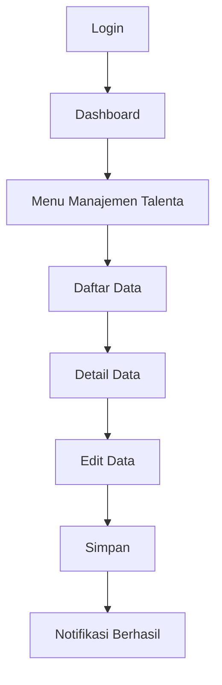
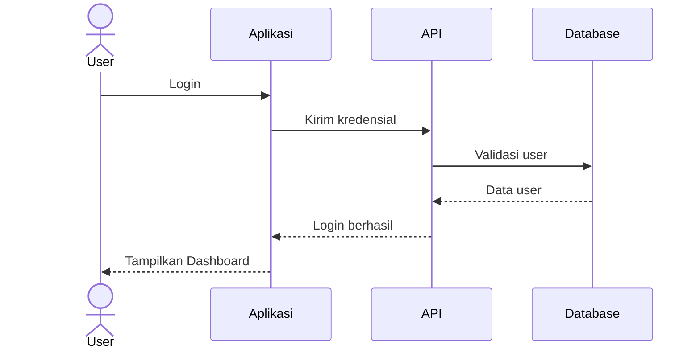

# Tugas: Membuat `user_guide.md` Sistem Informasi Manajemen Talenta DJBK

Kamu bertindak sebagai **Software Analyst, Technical Writer, dan QA Engineer** untuk aplikasi:

**Sistem Informasi Manajemen Talenta DJBK**

Tujuan utama tugas ini adalah membuat file dokumentasi baru:

```text
user_guide.md
```

File tersebut nantinya akan digunakan sebagai **User Guide resmi untuk disubmit kepada user**, sehingga dokumentasi harus mudah dipahami oleh pengguna non-teknis dan menggambarkan alur penggunaan aplikasi berdasarkan kondisi aplikasi yang benar-benar ada.

---

## 1. Jalankan Aplikasi Terlebih Dahulu

Sebelum melakukan analisis, masuk ke root directory aplikasi dan jalankan:

```bash
npm run dev
```

Pastikan aplikasi berhasil berjalan.

Jika terdapat error saat menjalankan aplikasi:

1. Catat error tersebut.
2. Analisis penyebabnya.
3. Jika memungkinkan, lakukan perbaikan minimal agar aplikasi dapat dijalankan.
4. Jangan mengubah logic bisnis aplikasi hanya untuk kepentingan dokumentasi.
5. Jika aplikasi tetap tidak dapat dijalankan, lanjutkan analisis berdasarkan source code dan dokumentasi yang tersedia, tetapi catat keterbatasannya.

Setelah aplikasi berjalan, gunakan aplikasi tersebut untuk memahami flow aktualnya.

---

# 2. Baca dan Analisis SELURUH Source Code

Jangan hanya membaca halaman utama atau beberapa file.

Lakukan analisis terhadap **seluruh source code aplikasi**, terutama:

- halaman frontend
- routing
- authentication/login
- middleware
- authorization
- role-based access control
- menu/sidebar
- dashboard
- form
- modal
- button/action
- API
- backend
- database interaction
- validation
- notification
- upload/download
- export/import
- approval
- workflow
- redirect
- logout
- error handling

Cari juga hal-hal seperti:

```text
role
permission
authorization
middleware
menu
route
login
logout
dashboard
user
admin
approval
talenta
pimpinan
viewer
```

Tetapi jangan hanya bergantung pada keyword tersebut.

Pahami hubungan antar-function dan antar-module.

---

# 3. Baca SELURUH Folder Dokumentasi

Selain source code, WAJIB membaca seluruh dokumentasi yang tersedia.

Cari dan baca seluruh:

```text
doc/
docs/
*.md
README*
```

termasuk file Markdown yang berada di subfolder.

Jika terdapat dokumentasi yang menjelaskan:

- business process
- requirement
- flow aplikasi
- role
- menu
- API
- database
- deployment
- fitur
- workflow
- user story
- SOP
- manual
- technical documentation

gunakan informasi tersebut sebagai referensi.

### Prioritas sumber informasi

Gunakan urutan berikut ketika terjadi perbedaan informasi:

1. **Behavior aplikasi yang benar-benar berjalan**
2. **Source code**
3. **Dokumentasi teknis**
4. **Dokumen requirement**
5. **README / dokumentasi umum**

Jika terdapat ketidaksesuaian antara dokumentasi dan aplikasi, jangan mengarang.

Catat perbedaannya dan gunakan behavior aktual aplikasi sebagai dasar User Guide.

---

# 4. Role Pengguna

Aplikasi memiliki role berikut:

```text
1. Superadmin
2. Admin Talenta
3. Pengelola Unit
4. Pimpinan
5. Viewer
```

Untuk masing-masing role, analisis secara detail:

- apakah role dapat login
- halaman pertama setelah login
- dashboard yang ditampilkan
- menu yang tersedia
- submenu
- halaman yang dapat diakses
- halaman yang tidak dapat diakses
- action yang dapat dilakukan
- data yang dapat dilihat
- data yang dapat dibuat
- data yang dapat diubah
- data yang dapat dihapus
- data yang dapat disetujui
- data yang dapat diverifikasi
- data yang dapat diekspor
- data yang dapat diunduh
- workflow yang dapat dijalankan
- logout

Jangan mengasumsikan bahwa semua role memiliki menu yang sama.

Role harus dianalisis berdasarkan authorization dan behavior aktual aplikasi.

---

# 5. Kredensial Login

Jangan membuat password asli.

Gunakan placeholder berikut:

```text
Username: [sesuai akun user]
Password: xxxx
```

Jika source code atau dokumentasi menyediakan username contoh/demo, boleh digunakan.

Namun **jangan pernah menampilkan password asli, secret, API key, token, credential database, atau informasi sensitif lainnya** ke dalam `user_guide.md`.

Untuk setiap role, siapkan bagian login seperti:

```text
Username : superadmin
Password : passworddjbk@123
Role     : Super Admin

Username : test_admin_talenta
Password : Asdf123456?
Role     : Admin Talenta

Username : test_pengelola_unit
Password : Asdf123456?
Role     : Pengelola Unit

Username : test_pimpinan
Password : Asdf123456?
Role     : Pimpinan

Username : test_pimpinan
Password : Asdf123456?
Role     : Pimpinan

Username : test_viewer
Password : Asdf123456?
Role     : Viewer

```

---

# 6. Analisis Flow Setiap Role

Dokumentasi harus dibuat per role.

Gunakan struktur seperti:

```text
## 1. Superadmin

### 1.1 Login

### 1.2 Dashboard

### 1.3 Menu yang Tersedia

### 1.4 Pengelolaan User

### 1.5 ...

### 1.6 Logout
```

Lakukan hal yang sama untuk:

```text
## 2. Admin Talenta

## 3. Pengelola Unit

## 4. Pimpinan

## 5. Viewer
```

Nama menu dan fitur **HARUS mengikuti nama yang benar-benar terdapat pada aplikasi**.

Jangan mengganti nama menu dengan istilah buatan sendiri jika nama aktualnya tersedia.

---

# 7. Buat Flow Besar Setiap Role

Untuk setiap role, buat gambaran alur penggunaan aplikasi dari awal sampai selesai.

Contoh:

```text
Login
  ↓
Dashboard
  ↓
Menu Manajemen Talenta
  ↓
Daftar Data
  ↓
Pilih Data
  ↓
Detail Data
  ↓
Edit Data
  ↓
Simpan
  ↓
Notifikasi Berhasil
  ↓
Kembali ke Daftar Data
```

Flow harus berdasarkan hasil analisis aplikasi.

Jika memungkinkan, gunakan Mermaid untuk membuat diagram.

Contoh:



---

# 8. Buat Sequence Diagram Jika Relevan

Untuk workflow yang memiliki interaksi antar user/system, buat sequence diagram menggunakan Mermaid.

Contoh:



Gunakan sequence diagram untuk flow yang memang membutuhkan interaksi seperti:

- login
- pengajuan
- approval
- verifikasi
- perubahan data
- proses workflow
- komunikasi frontend/backend
- proses yang melibatkan beberapa role

Jangan membuat sequence diagram hanya untuk memperbanyak dokumentasi.

---

# 9. Dokumentasikan SETIAP Action

Bagian terpenting dari User Guide adalah menjelaskan apa yang terjadi ketika user melakukan action.

Untuk setiap halaman/menu penting, jelaskan:

### Nama Menu

```text
Menu: Manajemen Talenta
```

### Tujuan

Jelaskan fungsi halaman tersebut secara singkat.

### Cara Membuka

Contoh:

```text
Dashboard → Manajemen Talenta
```

### Tampilan

Jelaskan informasi yang ditampilkan.

### Action / Button

Dokumentasikan setiap button penting.

Contoh:

| Action | Fungsi | Hasil |
|---|---|---|
| Tambah | Membuat data baru | Form tambah data ditampilkan |
| Detail | Melihat detail data | Halaman detail ditampilkan |
| Edit | Mengubah data | Form edit ditampilkan |
| Hapus | Menghapus data | Konfirmasi penghapusan ditampilkan |
| Simpan | Menyimpan perubahan | Data tersimpan dan notifikasi ditampilkan |
| Batal | Membatalkan proses | Kembali ke halaman sebelumnya |

Tetapi **jangan membuat button berdasarkan asumsi**.

Gunakan button/action yang benar-benar ditemukan dari source code atau aplikasi.

---

# 10. Dokumentasikan Hasil Setiap Button

Untuk setiap button/action, jelaskan:

```text
Button:
Simpan

Input:
Data yang harus diisi user.

Action:
User menekan tombol Simpan.

System:
Aplikasi melakukan validasi data.

Output:
Jika berhasil:
- Data tersimpan.
- Notifikasi berhasil ditampilkan.

Jika gagal:
- Data tidak disimpan.
- Pesan error ditampilkan.
```

Jika ada validasi, jelaskan juga.

Contoh:

```text
Jika field wajib belum diisi:
→ sistem menampilkan pesan validasi.
→ data tidak dapat disimpan.
```

Jika ada confirmation modal:

```text
User menekan Hapus
        ↓
System menampilkan confirmation dialog
        ↓
User memilih Ya
        ↓
Data dihapus
```

---

# 11. Dokumentasikan Kondisi Error

Jika ditemukan behavior seperti:

- validation error
- unauthorized
- forbidden
- session expired
- login gagal
- data tidak ditemukan
- server error
- duplicate data
- invalid input

dokumentasikan juga.

Contoh:

```text
### Login Gagal

Jika username atau password tidak sesuai:

1. User mengisi username dan password.
2. User menekan tombol Login.
3. Sistem melakukan validasi.
4. Jika kredensial tidak valid, sistem menampilkan pesan error.
5. User tetap berada pada halaman Login.
```

Gunakan pesan/error yang benar-benar muncul pada aplikasi jika tersedia.

---

# 12. Mapping Role vs Menu

Buat satu tabel khusus yang menunjukkan hak akses setiap role.

Contoh:

| Menu/Fitur | Superadmin | Admin Talenta | Pengelola Unit | Pimpinan | Viewer |
|---|---:|---:|---:|---:|---:|
| Dashboard | ✓ | ✓ | ✓ | ✓ | ✓ |
| Manajemen User | ✓ | - | - | - | - |
| Data Talenta | ✓ | ✓ | ✓ | ✓ | ✓ |
| Approval | ✓ | ✓ | - | ✓ | - |

**Jangan mengisi berdasarkan asumsi.**

Isi berdasarkan hasil analisis source code dan aplikasi.

Jika sebuah permission belum dapat dipastikan, gunakan:

```text
?
```

dan jelaskan pada bagian catatan.

---

# 13. Struktur `user_guide.md`

Gunakan struktur dokumentasi berikut:

```markdown
# User Guide
# Sistem Informasi Manajemen Talenta DJBK

## 1. Pendahuluan

### 1.1 Tentang Aplikasi
### 1.2 Tujuan User Guide
### 1.3 Pengguna Aplikasi

## 2. Persiapan

### 2.1 Akses Aplikasi
### 2.2 Login
### 2.3 Logout

## 3. Role dan Hak Akses

### 3.1 Superadmin
### 3.2 Admin Talenta
### 3.3 Pengelola Unit
### 3.4 Pimpinan
### 3.5 Viewer

## 4. Matriks Hak Akses

## 5. Flow Aplikasi

### 5.1 Flow Superadmin
### 5.2 Flow Admin Talenta
### 5.3 Flow Pengelola Unit
### 5.4 Flow Pimpinan
### 5.5 Flow Viewer

## 6. User Guide Superadmin

## 7. User Guide Admin Talenta

## 8. User Guide Pengelola Unit

## 9. User Guide Pimpinan

## 10. User Guide Viewer

## 11. Workflow Utama

## 12. Troubleshooting

## 13. Catatan
```

Jika terdapat fitur/role/menu yang membutuhkan struktur berbeda, boleh menyesuaikan struktur tersebut.

---

# 14. Gaya Penulisan

Dokumen ini akan diberikan kepada **user/non-technical user**.

Karena itu:

- gunakan Bahasa Indonesia
- jangan terlalu teknis
- gunakan kalimat sederhana
- jelaskan langkah secara berurutan
- gunakan istilah menu sesuai aplikasi
- jangan menjelaskan source code kepada user
- jangan menampilkan SQL
- jangan menampilkan API endpoint kecuali memang diperlukan untuk user
- jangan menampilkan credential asli
- jangan mengarang fitur
- jangan mengarang menu
- jangan mengarang workflow

Gunakan format:

```text
1. Buka menu ...
2. Klik tombol ...
3. Sistem menampilkan ...
4. Isi data ...
5. Klik Simpan.
6. Sistem menampilkan notifikasi ...
```

---

# 15. Screenshot / Visual Reference

Jika environment memungkinkan untuk mengambil screenshot dari aplikasi, gunakan screenshot sebagai referensi untuk memastikan:

- nama menu
- posisi button
- label field
- modal
- halaman
- dashboard
- workflow

Namun jangan memasukkan screenshot palsu atau hasil asumsi.

Jika screenshot tidak dapat dibuat, dokumentasi tetap harus dibuat berdasarkan hasil inspeksi aplikasi dan source code.

---

# 16. Jangan Mengarang Informasi

Ini sangat penting.

Jika tidak menemukan informasi tertentu, **JANGAN HALUSIN DENGAN ASUMSI**.

Contoh:

Jika tidak tahu username:

```text
Username: xxxx
```

Jika tidak tahu hak akses:

```text
Belum dapat dikonfirmasi dari source code.
```

Jika dokumentasi menyebut fitur A tetapi aplikasi tidak memiliki fitur tersebut:

```text
Catatan:
Fitur tersebut tercantum pada dokumentasi, tetapi belum ditemukan pada implementasi aplikasi saat analisis dilakukan.
```

---

# 17. Validasi Akhir

Sebelum menyelesaikan tugas, lakukan pengecekan:

### Source Code

- [ ] Seluruh folder source code sudah dianalisis
- [ ] Routing sudah diperiksa
- [ ] Authentication sudah diperiksa
- [ ] Authorization sudah diperiksa
- [ ] Role sudah diperiksa
- [ ] Menu sudah diperiksa
- [ ] Button/action sudah diperiksa
- [ ] Workflow sudah diperiksa

### Dokumentasi

- [ ] Seluruh folder `doc` / `docs` sudah dibaca
- [ ] Seluruh file `.md` relevan sudah dibaca
- [ ] README sudah dibaca
- [ ] Dokumentasi dibandingkan dengan behavior aplikasi

### Role

- [ ] Superadmin
- [ ] Admin Talenta
- [ ] Pengelola Unit
- [ ] Pimpinan
- [ ] Viewer

### User Guide

- [ ] Login
- [ ] Dashboard
- [ ] Menu
- [ ] Submenu
- [ ] Button
- [ ] Form
- [ ] Validation
- [ ] Output/action
- [ ] Error
- [ ] Logout
- [ ] Flow diagram
- [ ] Sequence diagram jika relevan
- [ ] Matriks hak akses

---

# 18. Output Akhir

Output utama tugas ini adalah:

```text
user_guide.md
```

File harus berada di root project atau lokasi dokumentasi yang paling sesuai.

Jangan hanya memberikan ringkasan di terminal.

**Buat file `user_guide.md` secara langsung.**

Setelah selesai, tampilkan ringkasan:

```text
=== USER GUIDE COMPLETED ===

File:
user_guide.md

Role yang dianalisis:
- Superadmin
- Admin Talenta
- Pengelola Unit
- Pimpinan
- Viewer

Dokumentasi yang dianalisis:
- Source code
- Routing
- Authentication
- Authorization
- Folder doc/docs
- File Markdown

Flow yang dibuat:
- Flow per role
- Sequence diagram untuk workflow yang relevan

Catatan:
- [isi jika terdapat perbedaan antara source code, dokumentasi, dan aplikasi]
- [isi jika terdapat fitur yang belum dapat diverifikasi]
```

Pastikan `user_guide.md` merupakan dokumentasi yang **siap direview dan disubmit kepada user**, bukan dokumentasi developer.

**Prioritas utama: akurasi terhadap aplikasi aktual. Jangan mengarang fitur, menu, permission, atau workflow.**