# User Guide
# Sistem Informasi Manajemen Talenta DJBK (SIMT DJBK)

**Kementerian Pekerjaan Umum — Direktorat Jenderal Bina Konstruksi**

| | |
|---|---|
| **Versi dokumen** | 1.0 |
| **Tanggal** | 23 Agustus 2026 |
| **Untuk** | Pengguna aplikasi (Super Admin, Admin Talenta, Pengelola Unit, Pimpinan, Viewer) |
| **Dasar penyusunan** | Aplikasi yang benar-benar berjalan, diperiksa langsung layar demi layar untuk **kelima peran**, lalu dicocokkan dengan kode program dan dokumen proyek |

> **Cara dokumen ini disusun.** Aplikasi dijalankan lebih dulu, lalu setiap peran benar-benar dimasukkan (login) satu per satu. Nama menu, judul halaman, label tombol, isi formulir, dan pesan kesalahan di panduan ini **disalin dari layar aplikasi**, bukan dikarang atau diambil dari dokumen perencanaan. Bila ada perbedaan antara dokumen proyek dan aplikasi, yang ditulis di sini adalah **perilaku aplikasi**, dan perbedaannya dicatat di [Bab 13 — Catatan](#13-catatan).

---

## Daftar Isi

1. [Pendahuluan](#1-pendahuluan)
2. [Persiapan](#2-persiapan)
3. [Role dan Hak Akses](#3-role-dan-hak-akses)
4. [Matriks Hak Akses](#4-matriks-hak-akses)
5. [Flow Aplikasi](#5-flow-aplikasi)
6. [User Guide Super Admin](#6-user-guide-super-admin)
7. [User Guide Admin Talenta](#7-user-guide-admin-talenta)
8. [User Guide Pengelola Unit](#8-user-guide-pengelola-unit)
9. [User Guide Pimpinan](#9-user-guide-pimpinan)
10. [User Guide Viewer](#10-user-guide-viewer)
11. [Workflow Utama](#11-workflow-utama)
12. [Troubleshooting](#12-troubleshooting)
13. [Catatan](#13-catatan)

---

# 1. Pendahuluan

## 1.1 Tentang Aplikasi

**SIMT DJBK** adalah aplikasi web internal untuk mengelola **manajemen talenta ASN** di lingkungan Direktorat Jenderal Bina Konstruksi. Aplikasi ini menjawab satu pertanyaan pokok:

> *"Siapa yang paling siap mengisi jabatan strategis tertentu, dan atas dasar apa?"*

Untuk menjawabnya, aplikasi menyediakan lima kelompok fungsi:

| Kelompok | Isinya |
|---|---|
| **Talenta** | Direktori pegawai, profil talenta lengkap, Peta Talenta (9 Kotak), perbandingan kandidat |
| **Suksesi** | Jabatan target beserta rubrik penilaian, talent pool, alur nominasi & persetujuan, rencana pengembangan |
| **Data & Kualitas** | Riwayat sinkronisasi data, antrian pembersihan, validasi riwayat diklat & jabatan, skor kelengkapan data |
| **Master Data** | Unit organisasi, jabatan, kategori riwayat diklat, hukuman disiplin |
| **Laporan** | Gap Analysis, rekap nominasi & approval, pusat ekspor berkas CSV |

Ditambah **Administrasi** (pengguna & peran, pengaturan sistem, audit log, klien & token API) yang hanya dibuka Super Admin.

## 1.2 Tujuan User Guide

Panduan ini menjelaskan, untuk **setiap peran**:

- cara masuk dan keluar aplikasi;
- menu apa saja yang terlihat dan apa isinya;
- tombol apa saja yang ada di tiap halaman, apa yang terjadi ketika ditekan, dan apa hasilnya bila berhasil maupun gagal;
- alur kerja utama dari awal sampai selesai;
- apa yang harus dilakukan bila muncul pesan kesalahan.

Panduan ini **bukan** dokumen teknis. Tidak ada penjelasan kode program, perintah basis data, maupun rincian pemrograman di dalamnya.

## 1.3 Pengguna Aplikasi

Aplikasi ini memiliki **lima peran pengguna internal**. Peran ditetapkan oleh Super Admin dan menentukan menu yang terlihat **serta** tindakan yang diizinkan.

| Peran | Diisi oleh | Pekerjaan intinya |
|---|---|---|
| **Super Admin** | Tim IT DJBK | Menjaga sistem: akun pengguna, master data, parameter sistem, klien & token API, audit log |
| **Admin Talenta** | Bagian Kepegawaian dan Umum | Menyusun formulasi penilaian, menjalankan perhitungan, memverifikasi nominasi, menyusun laporan |
| **Pengelola Unit** | Staf kepegawaian Balai / BP2JK / Direktorat | Merawat & memvalidasi data pegawai **unitnya sendiri**, mengajukan nominasi |
| **Pimpinan** | Dirjen, Sesditjen, Para Direktur | Membaca dashboard & laporan, **menetapkan suksesor** |
| **Viewer** | Pembina kebijakan (Biro Kepegawaian & Ortala, BPSDM) | Akses baca terbatas, tanpa hak ubah |

> Instansi eksternal (BKN, Biro Kepegawaian Kementerian, dsb.) **tidak memakai peran di atas** dan tidak masuk lewat halaman login. Mereka menarik data lewat API bertoken yang dikelola Super Admin.

## 1.4 Istilah yang Perlu Dipahami

Istilah berikut dipakai di banyak halaman. Memahaminya lebih dulu akan membuat sisa panduan ini jauh lebih mudah diikuti.

| Istilah | Artinya di aplikasi ini |
|---|---|
| **Kotak 9** | Posisi pegawai pada matriks 3×3 **Kinerja (sumbu Y) × Potensial (sumbu X)**. Kotak 9 adalah posisi terbaik (kinerja & potensial sama-sama tinggi), Kotak 1 terendah. Nilainya **selalu dihitung sistem**, tidak diketik manual |
| **Nilai Talenta** | 50% Kinerja + 50% Potensial |
| **Jabatan Target** | Profil jabatan yang menjadi sasaran suksesi. Berisi *jabatan anggota*, *persyaratan*, dan *rubrik penilaian* |
| **Rubrik** | Aturan penilaian bertingkat: **Komponen → Indikator → Kategori Skor**, masing-masing berbobot |
| **Match Score** | Skor kecocokan pegawai terhadap satu jabatan target: **65%** Potensi & Kompetensi + **20%** Kualifikasi Jabatan + **15%** Integritas & Moralitas. **Tidak memuat unsur kinerja** — karena itu selalu dibaca berdampingan dengan Kotak 9 |
| **Kelayakan (eligibility)** | Hasil pemeriksaan syarat minimal jabatan target. **Terpisah dari skor**: kandidat berskor tinggi bisa saja tidak lolos syarat |
| **Talent Pool** | Daftar kandidat suksesi untuk satu jabatan target, sudah berperingkat |
| **Nominasi** | Pengajuan seorang kandidat oleh sebuah unit, yang kemudian diverifikasi dan disetujui |
| **Hitung Ulang** | Tombol yang menjalankan penilaian seluruh pegawai terhadap satu jabatan target. Perhitungan **tidak** berjalan otomatis setiap kali data berubah |
| **Giliran** | Kolom yang menyebut **siapa yang harus bertindak berikutnya** atas sebuah nominasi |

---

# 2. Persiapan

## 2.1 Akses Aplikasi

1. Buka peramban (Google Chrome, Microsoft Edge, atau Firefox versi terbaru).
2. Ketik alamat aplikasi yang diberikan administrator, lalu tekan **Enter**.
   *(Pada lingkungan pengembangan yang dipakai saat panduan ini disusun, alamatnya `http://localhost:3000`.)*
3. Bila Anda belum masuk, aplikasi otomatis membawa Anda ke halaman **Masuk**.

**Yang seharusnya terlihat:** halaman masuk dua sisi — panel biru dongker berisi lambang Kementerian Pekerjaan Umum dan tulisan *"Sistem Informasi Manajemen Talenta"* di kiri, formulir masuk di kanan.

> Aplikasi dirancang untuk layar desktop, tetapi tetap dapat dibuka di tablet dan telepon.

## 2.2 Login

### Cara membuka
Langsung dari alamat aplikasi, atau dari alamat halaman mana pun (Anda akan diantar ke halaman masuk lalu **dikembalikan ke halaman yang Anda tuju** setelah berhasil masuk).

### Tampilan

Formulir **Masuk** berisi:

| Kolom / Tombol | Keterangan |
|---|---|
| **Username atau email** | Wajib. Boleh diisi username **atau** alamat email akun Anda |
| **Sandi** | Wajib. Ada ikon mata di ujung kanan untuk **menampilkan / menyembunyikan** sandi |
| **Masuk** | Tombol utama. Saat diproses berubah menjadi *"Memeriksa…"* |
| **Ajukan pengaturan ulang** | Tautan ke halaman **Lupa sandi** |

### Langkah

1. Isi **Username atau email**.
2. Isi **Sandi**.
3. Klik **Masuk**.
4. Sistem memeriksa kredensial Anda.
5. Bila cocok, sistem membuka **Dashboard Talenta**.

### Akun uji coba

Berikut akun yang tersedia pada lingkungan pengujian:

```text
Username : superadmin
Password : passworddjbk@123
Role     : Super Admin

Username : test_admin_talenta
Password : Asdf123456?
Role     : Admin Talenta

Username : test_pengelola_unit
Password : Asdf123456?
Role     : Pengelola Unit

Username : test_pimpinan
Password : Asdf123456?
Role     : Pimpinan

Username : test_viewer
Password : Asdf123456?
Role     : Viewer
```

> ⚠️ **Penting.** Akun dan sandi di atas adalah **akun pengujian**, bukan akun produksi. Sebelum aplikasi dipakai sungguhan, seluruh sandi wajib diatur ulang oleh Super Admin melalui menu **Pengguna & Peran**, dan akun uji coba dinonaktifkan. Perlakukan halaman ini sebagai bagian dokumen yang **terbatas**.

Selain akun uji coba di atas terdapat pula akun contoh bawaan sistem (`martyanti.rbs`, `reza.kurniawan`, `farid.hidayat`, `bayu.saputra`, `dirjen`, `sesditjen`, `reviewer.bpsdm`). Sandinya diberikan terpisah oleh administrator.

### Bila login gagal

Lihat [12.1 Login gagal](#121-login-gagal).

## 2.3 Ganti Sandi Pertama Kali (Wajib)

Bila sandi Anda **dibuatkan Super Admin** (akun baru atau baru saja di-*reset*), aplikasi **tidak akan terbuka** sebelum sandi diganti.

**Yang seharusnya terlihat:** halaman berjudul **"Ganti sandi Anda dulu"** dengan penjelasan:

> *"Sandi yang Anda pakai sekarang dibuatkan Super Admin, jadi bukan hanya Anda yang mengetahuinya. Selama belum diganti, tindakan atas nama akun ini belum bisa dianggap perbuatan Anda — karena itu aplikasi belum bisa dibuka."*

### Langkah

1. Isi **Sandi saat ini** (sandi sementara dari Super Admin).
2. Isi **Sandi baru**. Keterangan di bawah kolom menyebut syaratnya: *minimal 10 karakter, dua jenis karakter*.
3. Isi **Ulangi sandi baru**.
4. Klik **Simpan sandi baru** (saat diproses berubah menjadi *"Menyimpan…"*).
5. Bila berhasil, aplikasi terbuka.

### Aturan sandi yang ditegakkan sistem

| Aturan | Pesan bila dilanggar |
|---|---|
| Minimal 10 karakter | *"Sandi minimal 10 karakter (sekarang N)."* |
| Maksimal 72 byte | *"Sandi terlalu panjang (… maksimal 72). Karakter setelah batas itu diabaikan oleh algoritma hash, jadi tidak menambah keamanan."* |
| Tidak boleh sandi yang terlalu umum | *"Sandi ini terlalu umum dan ada di daftar tebakan pertama. Pilih yang lain."* |
| Tidak boleh memuat username Anda | *"Sandi tidak boleh memuat username Anda."* |
| Tidak boleh memuat alamat email Anda | *"Sandi tidak boleh memuat alamat email Anda."* |
| Minimal dua jenis karakter (huruf/angka/simbol) | *"Gabungkan minimal dua jenis karakter (huruf, angka, atau simbol)."* |
| Ulangan harus sama | *"Ulangan sandi tidak sama."* |
| Harus berbeda dari sandi lama | *"Sandi baru harus berbeda dari sandi lama."* |

> Bila Anda bukan pemilik akun yang tampil di halaman ini, klik tautan **Keluar** di bagian bawah.

## 2.4 Lupa Sandi

### Cara membuka
Halaman **Masuk** → klik **Ajukan pengaturan ulang**.

### Tampilan

Halaman **"Lupa sandi"** memuat pemberitahuan yang perlu dibaca lebih dulu:

> *"**Tidak ada email yang dikirim.** Sistem belum terhubung ke layanan surel, jadi tidak ada tautan reset otomatis. Super Admin akan mengatur ulang sandi Anda dan menyerahkan sandi sementara lewat jalur kepegawaian — dan Anda akan diminta menggantinya saat masuk."*

### Langkah

1. Isi **Email akun** (wajib).
2. Klik **Ajukan pengaturan ulang**.
3. Sistem menampilkan halaman **"Permintaan tercatat"**.
4. Klik **Kembali ke halaman masuk**.
5. Hubungi Super Admin untuk menerima sandi sementara.

> Balasan sistem **selalu sama**, baik email Anda terdaftar maupun tidak. Ini disengaja agar halaman ini tidak bisa dipakai orang luar untuk menebak email siapa saja yang punya akun.

## 2.5 Logout

### Langkah

1. Klik **nama Anda** di pojok kanan atas (di sebelahnya tertulis peran Anda).
2. Menu terbuka, menampilkan nama, email, peran, unit, dan penjelasan singkat peran.
3. Klik **Keluar** (saat diproses berubah menjadi *"Keluar…"*).
4. Sistem mengakhiri sesi di perangkat ini dan kembali ke halaman **Masuk** dengan pesan:
   > *"Anda sudah keluar. Sesi di perangkat ini sudah diakhiri."*

**Sesi juga berakhir dengan sendirinya** bila:

| Keadaan | Bawaan |
|---|---|
| Tidak ada aktivitas selama … | **60 menit** |
| Umur maksimal satu sesi sejak masuk | **12 jam** |
| Akun dinonaktifkan / peran atau unit diubah Super Admin | **seketika** |

Kedua angka pertama dapat diubah Super Admin di **Pengaturan Sistem**.

## 2.6 Mengenal Layar Aplikasi

Setelah masuk, seluruh halaman memakai tata letak yang sama.

```text
┌──────────────┬──────────────────────────────────────────────────────┐
│              │  Breadcrumb · Pencarian · Tema · Nama & Peran ▼      │  ← navbar
│  SIMT DJBK   ├──────────────────────────────────────────────────────┤
│  (sidebar)   │                                                      │
│              │                                                      │
│  Dashboard   │                 ISI HALAMAN                          │
│  Inbox Tugas │                                                      │
│  ── TALENTA  │                                                      │
│  ── SUKSESI  │                                                      │
│  ── …        │                                                      │
│  [Ciutkan]   │                                                      │
└──────────────┴──────────────────────────────────────────────────────┘
```

| Bagian | Fungsi |
|---|---|
| **Sidebar kiri** | Menu utama, dikelompokkan (Talenta, Suksesi, Data & Kualitas, Master Data, Laporan, Administrasi). Isinya **berbeda menurut peran** |
| **Ciutkan** (atas sidebar) | Mempersempit sidebar menjadi ikon saja |
| **Judul grup** (mis. **TALENTA**) | Diklik untuk melipat/membuka grup. Grup yang memuat halaman yang sedang dibuka **tidak bisa ditutup**, agar Anda tetap tahu posisi Anda |
| **Breadcrumb** (navbar) | Jejak halaman, dapat diklik untuk kembali |
| **Pencarian / Ctrl+K** | Pencarian cepat halaman. Ketik kata kunci (mis. *"rubrik"*, *"pensiun"*), lalu Enter |
| **Tema** | Terang / Gelap / Sistem |
| **Nama & Peran ▼** | Menu pengguna: **Profil Saya** dan **Keluar** |

---

# 3. Role dan Hak Akses

Bagian ini mendaftar menu yang **benar-benar tampil di sidebar** untuk setiap peran, hasil pemeriksaan langsung pada aplikasi.

## 3.1 Super Admin

**Halaman pertama setelah login:** Dashboard Talenta.
**Jumlah menu di sidebar: 24.**

| Grup | Menu |
|---|---|
| *(tanpa grup)* | Dashboard · Inbox Tugas |
| **Talenta** | Direktori Pegawai · Peta Talenta · Perbandingan Kandidat |
| **Suksesi** | Jabatan Target · Talent Pool · Nominasi · Rencana Pengembangan |
| **Data & Kualitas** | Konsolidasi Data · Antrian Pembersihan · Validasi Riwayat · Kelengkapan Data |
| **Master Data** | Unit Organisasi · Jabatan · Kategori Riwayat Diklat · Hukuman Disiplin |
| **Laporan** | Gap Analysis · Nominasi & Approval · Pusat Ekspor |
| **Administrasi** | Pengguna & Peran · Klien & Token API · Audit Log · Pengaturan Sistem |

Halaman berikut **tidak muncul di sidebar** tetapi dapat dibuka lewat pencarian **Ctrl+K** atau tautan di halaman lain: **Profil Saya**, **Jabatan Kosong & Risiko**, **Log Aktivitas API**, **Dokumentasi API**.

## 3.2 Admin Talenta

**Halaman pertama setelah login:** Dashboard Talenta.
**Jumlah menu di sidebar: 18.**

| Grup | Menu |
|---|---|
| *(tanpa grup)* | Dashboard · Inbox Tugas |
| **Talenta** | Direktori Pegawai · Peta Talenta · Perbandingan Kandidat |
| **Suksesi** | Jabatan Target · Talent Pool · Nominasi · Rencana Pengembangan |
| **Data & Kualitas** | Antrian Pembersihan · Validasi Riwayat · Kelengkapan Data |
| **Master Data** | Jabatan · Kategori Riwayat Diklat · Hukuman Disiplin |
| **Laporan** | Gap Analysis · Nominasi & Approval · Pusat Ekspor |

Tanpa grup **Administrasi**, tanpa **Konsolidasi Data**, tanpa **Unit Organisasi**. Halaman di luar sidebar: **Profil Saya**, **Jabatan Kosong & Risiko**, **Dokumentasi API**.

## 3.3 Pengelola Unit

**Halaman pertama setelah login:** Dashboard Talenta.
**Jumlah menu di sidebar: 7.**

| Grup | Menu |
|---|---|
| *(tanpa grup)* | Dashboard · Inbox Tugas |
| **Talenta** | Direktori Pegawai · Peta Talenta |
| **Suksesi** | Talent Pool · Nominasi |
| **Data & Kualitas** | Validasi Riwayat |

Halaman di luar sidebar: **Profil Saya**.

> **Seluruh data yang dilihat Pengelola Unit dibatasi pada unitnya sendiri beserta seluruh unit di bawahnya.** Bila akun Pengelola Unit belum ditautkan ke unit mana pun, halaman akan kosong disertai penjelasan — bukan menampilkan seluruh data. Mintalah Super Admin menetapkan unit Anda.

## 3.4 Pimpinan

**Halaman pertama setelah login:** Dashboard Talenta.
**Jumlah menu di sidebar: 13.**

| Grup | Menu |
|---|---|
| *(tanpa grup)* | Dashboard · Inbox Tugas |
| **Talenta** | Direktori Pegawai · Peta Talenta · Perbandingan Kandidat |
| **Suksesi** | Jabatan Target · Talent Pool · Nominasi · Rencana Pengembangan |
| **Data & Kualitas** | Kelengkapan Data |
| **Laporan** | Gap Analysis · Nominasi & Approval · Pusat Ekspor |

Halaman di luar sidebar: **Profil Saya**, **Jabatan Kosong & Risiko**.

## 3.5 Viewer

**Halaman pertama setelah login:** Dashboard Talenta.
**Jumlah menu di sidebar: 6.**

| Grup | Menu |
|---|---|
| *(tanpa grup)* | Dashboard · Inbox Tugas |
| **Talenta** | Direktori Pegawai · Peta Talenta |
| **Suksesi** | Talent Pool · Nominasi |

Halaman di luar sidebar: **Profil Saya**. Viewer **tidak memiliki tombol aksi apa pun** — seluruh halamannya baca saja.

---

# 4. Matriks Hak Akses

Legenda: **✓** = ya · **—** = tidak · **(unit)** = terbatas pada unit sendiri beserta unit di bawahnya

## 4.1 Menu yang tampil di sidebar

| Menu / Fitur | Super Admin | Admin Talenta | Pengelola Unit | Pimpinan | Viewer |
|---|:--:|:--:|:--:|:--:|:--:|
| Dashboard | ✓ | ✓ | ✓ | ✓ | ✓ |
| Inbox Tugas | ✓ | ✓ | ✓ | ✓ | ✓ |
| Direktori Pegawai | ✓ | ✓ | ✓ (unit) | ✓ | ✓ |
| Peta Talenta | ✓ | ✓ | ✓ (unit) | ✓ | ✓ |
| Perbandingan Kandidat | ✓ | ✓ | — | ✓ | — |
| Jabatan Target | ✓ | ✓ | — | ✓ | — |
| Talent Pool | ✓ | ✓ | ✓ | ✓ | ✓ |
| Nominasi | ✓ | ✓ | ✓ | ✓ | ✓ |
| Rencana Pengembangan | ✓ | ✓ | — | ✓ | — |
| Konsolidasi Data | ✓ | — | — | — | — |
| Antrian Pembersihan | ✓ | ✓ | — | — | — |
| Validasi Riwayat | ✓ | ✓ | ✓ (unit) | — | — |
| Kelengkapan Data | ✓ | ✓ | — | ✓ | — |
| Unit Organisasi | ✓ | — | — | — | — |
| Jabatan | ✓ | ✓ | — | — | — |
| Kategori Riwayat Diklat | ✓ | ✓ | — | — | — |
| Hukuman Disiplin | ✓ | ✓ | — | — | — |
| Gap Analysis | ✓ | ✓ | — | ✓ | — |
| Nominasi & Approval | ✓ | ✓ | — | ✓ | — |
| Pusat Ekspor | ✓ | ✓ | — | ✓ | — |
| Pengguna & Peran | ✓ | — | — | — | — |
| Klien & Token API | ✓ | — | — | — | — |
| Log Aktivitas API | ✓ | — | — | — | — |
| Dokumentasi API | ✓ | ✓ | — | — | — |
| Audit Log | ✓ | — | — | — | — |
| Pengaturan Sistem | ✓ | — | — | — | — |
| Profil Saya | ✓ | ✓ | ✓ | ✓ | ✓ |

## 4.2 Tindakan (tulis / ubah / setujui) — inilah yang benar-benar ditegakkan sistem

| Tindakan | Super Admin | Admin Talenta | Pengelola Unit | Pimpinan | Viewer |
|---|:--:|:--:|:--:|:--:|:--:|
| Tambah / ubah **pengguna & peran**, reset sandi, buka kunci akun | ✓ | — | — | — | — |
| Ubah **Pengaturan Sistem** | ✓ | — | — | — | — |
| Tambah / ubah / hapus **Unit Organisasi** | ✓ | — | — | — | — |
| Tambah / ubah **Jabatan**, tandai kosong/terisi | ✓ | ✓ | — | — | — |
| Tambah / ubah **Kategori Riwayat Diklat** | ✓ | ✓ | — | — | — |
| Tambah / ubah / nonaktifkan **Hukuman Disiplin** | ✓ | ✓ | — | — | — |
| **Validasi Riwayat** (kategori diklat, jenis penugasan, tandai diperiksa) | ✓ | ✓ | ✓ (unit) | — | — |
| Tambah / ubah **data pegawai & riwayatnya** dari halaman profil | ✓ | ✓ | ✓ (unit) | — | — |
| Tambah pegawai (satuan / massal) dari Direktori | ✓ | ✓ | ✓ (unit) | — | — |
| Buat / ubah **Jabatan Target**, **Persyaratan**, **Rubrik**; aktifkan / nonaktifkan | ✓ | ✓ | — | — | — |
| **Hitung Ulang** skor & isi **nilai manual** indikator | ✓ | ✓ | — | — | — |
| Masukkan kandidat ke **Talent Pool** | ✓ | ✓ | — | — | — |
| **Ajukan nominasi** / ajukan ulang setelah revisi | ✓ | ✓ | ✓ | — | — |
| **Setujui verifikasi / Minta revisi / Tolak nominasi** | ✓ | ✓ | — | — | — |
| **Tetapkan suksesor / Tolak di tahap pimpinan / Batalkan penetapan** | ✓ | — | — | ✓ | — |
| Keluarkan / pulihkan kandidat dari pool | ✓ | ✓ | — | — | — |
| Tambah / ubah / hapus **Rencana Pengembangan** | ✓ | ✓ | — | ✓ | — |
| **Unduh CSV** laporan (Gap, Nominasi, Riwayat perhitungan) | ✓ | ✓ | — | ✓ | — |
| **Unduh CSV** audit log | ✓ | — | — | — | — |
| Kelola **Klien & Token API** | ✓ | — | — | — | — |
| Tandai notifikasi terbaca (milik sendiri) | ✓ | ✓ | ✓ | ✓ | ✓ |
| Ganti sandi sendiri & akhiri sesi perangkat sendiri | ✓ | ✓ | ✓ | ✓ | ✓ |

## 4.3 Catatan penting tentang matriks ini

**Menu yang tersembunyi tidak berarti halamannya terkunci.** Hasil pemeriksaan langsung: beberapa halaman **tetap dapat dibuka** bila alamatnya diketik langsung di peramban, walaupun menunya tidak tampil untuk peran tersebut.

| Halaman | Menunya tampil untuk | Halamannya **terbuka** (lewat alamat langsung) untuk |
|---|---|---|
| Jabatan Target, Kandidat & Eligibility, Simulasi & Diff | Super Admin · Admin Talenta · Pimpinan | **semua peran** |
| Rencana Pengembangan | Super Admin · Admin Talenta · Pimpinan | **semua peran** |
| Unit Organisasi | Super Admin | **semua peran** |
| Jabatan | Super Admin · Admin Talenta | **semua peran** |
| Konsolidasi Data | Super Admin | **semua peran** |
| Antrian Pembersihan | Super Admin · Admin Talenta | **semua peran** |
| Kelengkapan Data | Super Admin · Admin Talenta · Pimpinan | **semua peran** |

Halaman yang benar-benar **menolak di server** (menampilkan layar **"Akses ditolak"**):

| Halaman | Ditolak untuk |
|---|---|
| Perbandingan Kandidat | Pengelola Unit, Viewer |
| Validasi Riwayat | Pimpinan, Viewer |
| Kategori Riwayat Diklat, Hukuman Disiplin | Pengelola Unit, Pimpinan, Viewer |
| Gap Analysis, Nominasi & Approval, Pusat Ekspor | Pengelola Unit, Viewer |
| Dokumentasi API | Pengelola Unit, Pimpinan, Viewer |
| Pengguna & Peran, Klien & Token API, Log Aktivitas API, Audit Log, Pengaturan Sistem | semua kecuali Super Admin |

**Yang tetap terjaga sepenuhnya:** setiap **penyimpanan** diperiksa ulang di server. Peran yang tidak berwenang boleh saja melihat formulirnya, tetapi begitu menekan **Simpan** akan menerima penolakan:

> *"Peran Anda (Pengelola Unit) tidak berwenang melakukan ini. Dibutuhkan salah satu: Super Admin."*

Jadi tidak ada data yang bisa diubah di luar wewenang. Selisih ini tercatat sebagai butir yang menunggu keputusan pemilik proses — lihat [13.2](#132-perbedaan-antara-dokumen-dan-aplikasi).

---

# 5. Flow Aplikasi

## 5.0 Alur besar sistem — dari data mentah sampai suksesor ditetapkan

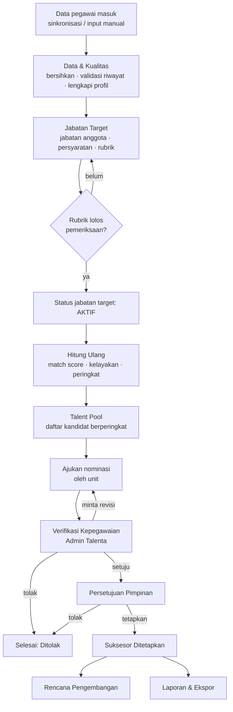

## 5.1 Flow Super Admin

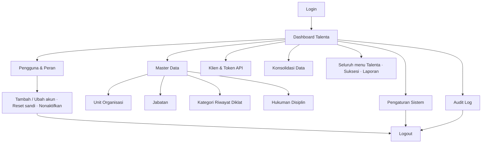

## 5.2 Flow Admin Talenta

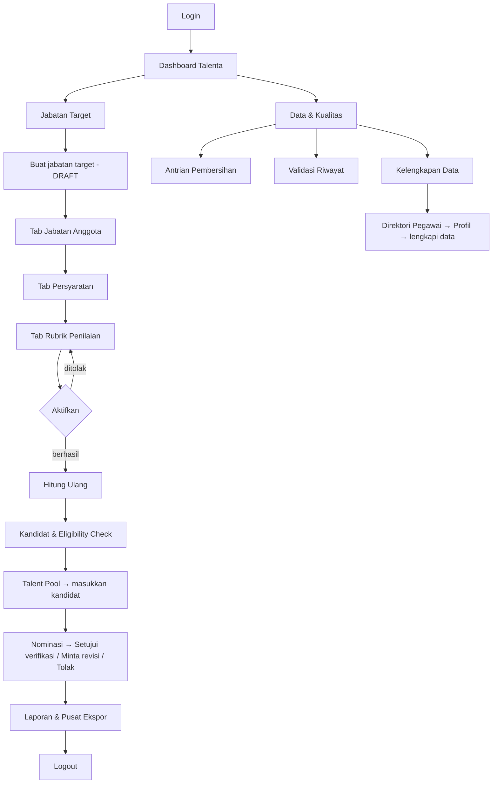

## 5.3 Flow Pengelola Unit

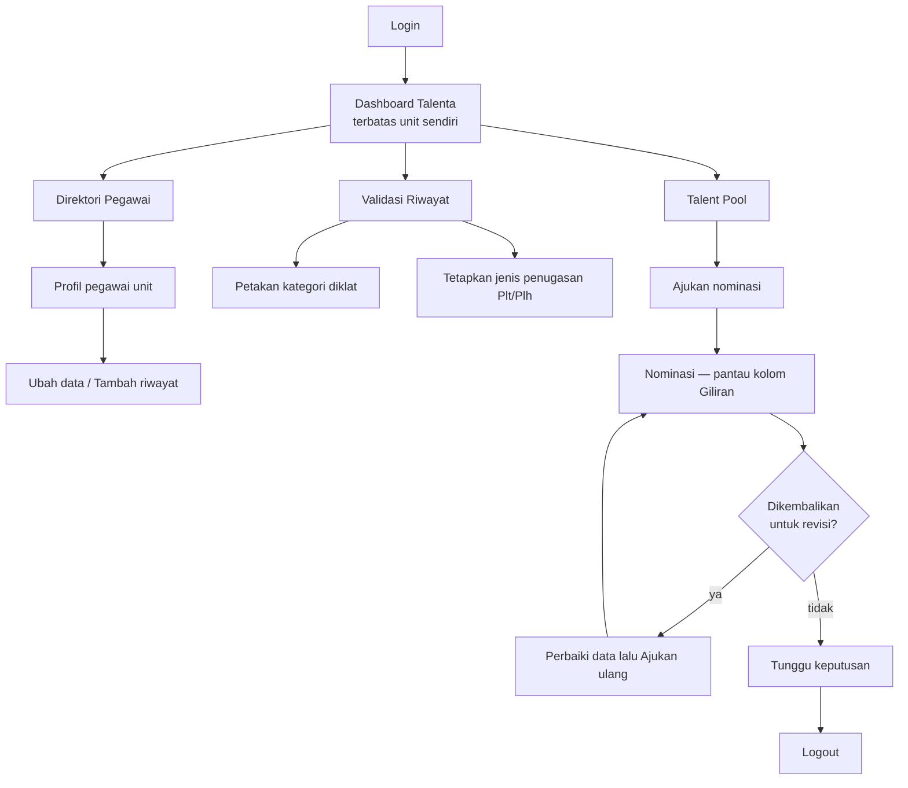

## 5.4 Flow Pimpinan

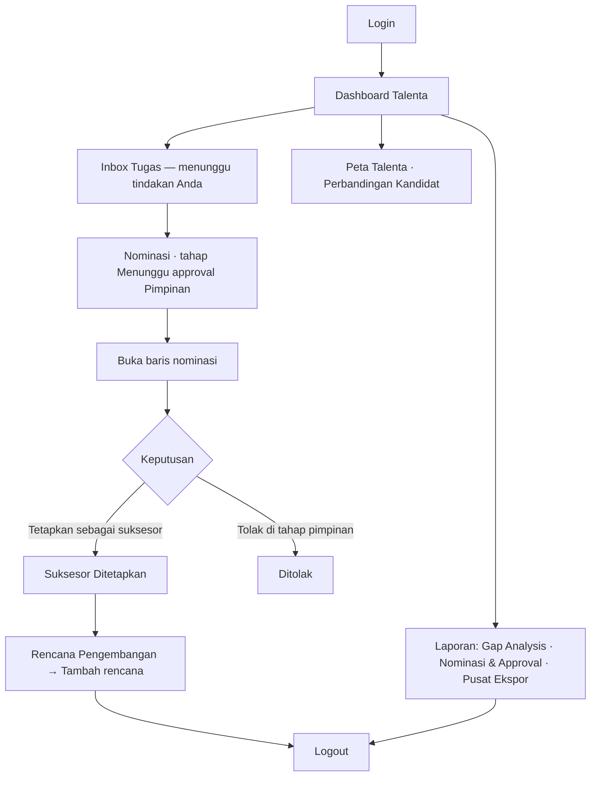

## 5.5 Flow Viewer

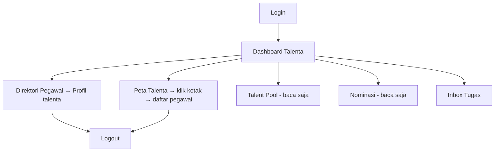

> Viewer tidak memiliki tombol aksi. Bila Viewer membuka halaman yang ditolak, aplikasi menampilkan layar **"Akses ditolak"** beserta alasannya.

---

# 6. User Guide Super Admin

## 6.1 Login

Ikuti [2.2 Login](#22-login) menggunakan akun Super Admin. Setelah berhasil, aplikasi membuka **Dashboard Talenta**.

## 6.2 Dashboard

**Menu:** Dashboard
**Cara membuka:** menu paling atas di sidebar, atau klik logo **SIMT DJBK**.
**Tujuan:** ringkasan kondisi talenta dalam satu layar.

### Tampilan

**a. Lima kartu ringkas (KPI)** — semuanya dapat diklik:

| Kartu | Isi | Tautannya menuju |
|---|---|---|
| **Pegawai aktif** | Jumlah pegawai yang terdata | Direktori Pegawai |
| **Jabatan strategis kosong** | Jumlah + persentase dari seluruh jabatan eselon I–III | Jabatan Target — bagian Jabatan Kosong |
| **Kandidat dalam talent pool** | Jumlah kandidat, tersebar di berapa jabatan target aktif | Talent Pool |
| **Daftar nominasi** | Jumlah nominasi, dengan keterangan berapa yang menunggu tindakan | Nominasi |
| **Terverifikasi** | Jumlah yang lolos verifikasi, dirinci *"N ditetapkan · M menunggu Pimpinan"* | Nominasi tahap approval |

**b. Sebaran Kotak 9** — grid 3×3. Setiap sel memuat nomor kotak, jumlah pegawai, dan persentasenya. Sumbu tegak **KINERJA** (Di Atas Ekspektasi / Sesuai Ekspektasi / Di Bawah Ekspektasi), sumbu datar **POTENSIAL** (Tinggi / Menengah / Rendah).

**c. Peta Kinerja × Potensial** — diagram gelembung; ukuran gelembung = jumlah pegawai.

### Action / Button

| Action | Fungsi | Hasil |
|---|---|---|
| Klik salah satu **kartu KPI** | Membuka halaman terkait | Halaman tujuan terbuka |
| Klik salah satu **sel Kotak 9** | Menampilkan daftar pegawai di kotak tersebut | Tabel pegawai muncul di bawah grid; alamat halaman berubah menjadi `…/?kotak=N` sehingga bisa dibagikan |
| Klik **nama pegawai** pada daftar | Membuka profil talenta | Halaman Profil Talenta terbuka |
| **Peta lengkap** | Menuju halaman Peta Talenta | Halaman Peta Talenta terbuka |

## 6.3 Pengguna & Peran

**Menu:** Administrasi › Pengguna & Peran
**Cara membuka:** Dashboard → sidebar **Administrasi** → **Pengguna & Peran**
**Tujuan:** membuat dan mengelola akun aplikasi beserta perannya.

### Tampilan

Di bawah judul tertulis ringkasan, misalnya *"12 akun aktif dari 12 terdaftar · 14 sesi sedang berjalan"*, dengan penjelasan:

> *"Peran menentukan menu yang terlihat DAN aksi yang diizinkan di server — keduanya dari satu sumber."*

Tabel **Akun internal** berkolom: **Nama · Username · Peran · Unit · Status · Masuk terakhir · Aksi**. Kolom Status menampilkan lencana **Aktif / Nonaktif** dan jumlah sesi yang sedang berjalan.

Terdapat pula penyaring **Semua peran** dan **Aktif & nonaktif / Hanya aktif / Hanya nonaktif**, serta panel **antrian permintaan pengaturan ulang sandi** bila ada.

### Action / Button

| Action | Fungsi | Hasil |
|---|---|---|
| **Tambah pengguna** | Membuat akun baru | Dialog *Tambah pengguna* terbuka |
| **Ubah** | Mengubah nama, username, email, peran, unit | Dialog *Ubah akun …* terbuka |
| **Reset sandi** | Menerbitkan sandi sementara | Dialog konfirmasi *"Atur ulang sandi …?"* → tombol **Atur ulang** |
| **Nonaktifkan / Aktifkan** | Menutup atau membuka akses akun | Dialog konfirmasi → tombol **Lanjutkan** |

### Detail action — Tambah pengguna

**Input:**

| Kolom | Wajib | Keterangan |
|---|:--:|---|
| Nama lengkap | ✓ | minimal 3 karakter |
| Username | ✓ | huruf kecil, tanpa spasi; hanya huruf, angka, titik, garis bawah, strip |
| Email | ✓ | format email yang sah |
| Peran | ✓ | pilihan menampilkan jumlah akun aktif tiap peran, mis. *"Admin Talenta (2 aktif)"* |
| Unit organisasi | — | daftar bertingkat mengikuti pohon organisasi; kosongkan untuk **akses pusat** |

Keterangan di dialog: *"Akun dibuat dengan sandi sementara yang ditampilkan satu kali. Pemiliknya wajib menggantinya saat pertama masuk."*

**Action:** klik **Buat akun**.

**System:** memvalidasi seluruh isian, membuat akun, lalu menerbitkan sandi sementara.

**Output — bila berhasil:**
- Akun baru muncul di tabel.
- Dialog **"Sandi sementara untuk …"** tampil dengan catatan: *"Salin sekarang. Setelah dialog ini ditutup, sandinya tidak bisa dilihat lagi — yang tersimpan hanya hash-nya."*
- Serahkan sandi itu ke pemilik akun lewat jalur kepegawaian.

**Output — bila gagal:**
- Data tidak tersimpan, pesan tampil di sebelah kolom yang salah, misalnya *"Username minimal 3 karakter"* atau *"Format email tidak valid"*.
- Bila username/email sudah dipakai: *"… itu sudah dipakai baris lain. Pakai nilai yang berbeda."*

> **Sandi sementara hilang?** Tidak dapat dilihat ulang. Gunakan **Reset sandi** untuk menerbitkan yang baru.

### Detail action — Ubah / Nonaktifkan

Aturan yang ditegakkan sistem:

| Keadaan | Pesan yang muncul |
|---|---|
| Menonaktifkan akun sendiri | *"Anda tidak bisa menonaktifkan akun Anda sendiri — Anda akan langsung terkunci di luar. Minta Super Admin lain melakukannya."* |
| Menonaktifkan Super Admin aktif terakhir | *"Ini satu-satunya Super Admin yang aktif. Menonaktifkannya membuat tidak ada lagi yang bisa mengelola pengguna. Angkat Super Admin lain lebih dulu."* |
| Menurunkan peran Super Admin aktif terakhir | *"Ini satu-satunya Super Admin yang aktif. Menurunkan perannya membuat Manajemen Pengguna tidak bisa dibuka siapa pun. Angkat Super Admin lain lebih dulu."* |

> **Mengubah peran atau unit langsung memutus sesi akun tersebut.** Pengguna yang sedang membuka aplikasi akan diminta masuk lagi. Ini disengaja agar wewenang lama tidak ikut terbawa.

### Antrian permintaan reset sandi

Permintaan dari halaman **Lupa sandi** muncul di sini sebagai daftar pekerjaan.

| Action | Fungsi | Hasil |
|---|---|---|
| **Terbitkan sandi sementara** | Mengatur ulang sandi pemohon | Dialog *"Sandi sementara untuk …"* — salin sekarang |
| **Tandai selesai** | Menutup permintaan tanpa menerbitkan sandi | Dialog *"Tandai permintaan selesai"*; **catatan wajib diisi** — *"Tulis bagaimana permintaan ini ditangani…"* |

## 6.4 Pengaturan Sistem

**Menu:** Administrasi › Pengaturan Sistem
**Tujuan:** mengubah parameter aplikasi tanpa perlu pemasangan ulang.

> *"Parameter yang bisa diubah tanpa deploy. Perubahannya langsung berlaku untuk semua pengguna dan tercatat di audit log."*

### Tampilan

Parameter dikelompokkan, dan **setiap parameter punya tombol simpannya sendiri**.

**Kelompok: Parameter penilaian** — *"Menentukan siapa yang lolos syarat talent pool."*

| Parameter | Nilai saat ini | Batas yang diizinkan | Keterangan singkat |
|---|:--:|:--:|---|
| Masa berlaku hasil asesmen (tahun) | 4 | 1–15 | Asesmen yang lebih tua dianggap kedaluwarsa dan pemiliknya tidak lolos syarat talent pool. *(Nilai bawaan sistem 3 tahun, dan halaman ini menyebut bahwa angka itu belum dikonfirmasi pemilik proses.)* |
| Tahun asesmen berjalan | 2026 | 2015–2100 | Tahun acuan untuk dashboard & pilihan bawaan penyaring. Tidak dipakai menghitung skor |

**Kelompok: Keamanan & sesi** — *"Berlaku pada sesi yang DIBUAT setelah perubahan — sesi yang sedang berjalan tetap memakai tenggat lamanya."*

| Parameter | Nilai saat ini | Batas yang diizinkan |
|---|:--:|:--:|
| Lama akun terkunci (menit) | 15 | 1–1440 |
| Batas percobaan masuk yang gagal | 5 | 3–20 |
| Timeout sesi menganggur (menit) | 60 | 5–1440 |
| Umur maksimal satu sesi (jam) | 12 | 1–168 |

**Kelompok: Belum dikelompokkan**

| Parameter | Nilai saat ini | Batas yang diizinkan |
|---|:--:|:--:|
| Ambang kategori teratas Kotak 9 | 80 | 1–99 |
| Ambang kategori tengah Kotak 9 | 60 | 1–99 |

Keterangan di halaman: batas bawah kedua ambang **inklusif** — nilai yang tepat sama dengan ambang sudah masuk kategori itu. **Ambang atas wajib lebih besar daripada ambang tengah.**

### Detail action — Simpan satu parameter

**Input:** nilai baru pada kolom parameter.
**Action:** klik **Simpan** pada baris parameter itu.
**System:** memeriksa batas nilai **di server**, lalu menyimpan dan mencatatnya di audit log.

**Output — berhasil:** notifikasi berhasil; keterangan *"Masih nilai bawaan sistem"* berganti menjadi keterangan siapa dan kapan mengubahnya.

**Output — gagal:**
- Nilai di luar batas → pesan menyebut rentang yang diizinkan.
- **Ambang atas ≤ ambang tengah** → ditolak, karena kategori tengah akan menjadi wilayah kosong.

> ⚠️ **Perubahan parameter tidak berlaku surut.** Skor yang sudah tersimpan tetap memakai nilai lama. Setelah mengubah **masa berlaku asesmen** atau **ambang Kotak 9**, jalankan **Hitung Ulang** pada setiap jabatan target. Halaman ini menyatakan hal tersebut apa adanya.

## 6.5 Audit Log

**Menu:** Administrasi › Audit Log
**Tujuan:** jejak seluruh perubahan data — siapa, kapan, aksi apa, pada data apa, dan **berubah dari apa menjadi apa**.

### Tampilan

Di bawah judul tertulis jumlah baris yang cocok dan rentang tanggalnya. Panel **Penyaring** berisi:

| Penyaring | Isi |
|---|---|
| **Pengguna** | Daftar pengguna beserta jumlah barisnya |
| **Entitas** | Nama data yang diubah beserta jumlahnya (mis. `talent_pool`, `jabatan_target`, `users`, `ekspor`) |
| **Aksi** | `MASUK`, `MASUK_GAGAL`, `KELUAR`, `BUAT`, `UBAH`, `HAPUS`, `UBAH_STATUS`, `RECOMPUTE`, `EKSPOR`, `AKUN_TERKUNCI`, `SANDI_DIGANTI`, dsb. |
| **Dari tanggal / Sampai tanggal** | Rentang waktu |

> Pilihan pada penyaring **diturunkan dari isi data**, jadi hanya nilai yang benar-benar ada yang ditawarkan.

### Action / Button

| Action | Fungsi | Hasil |
|---|---|---|
| Pilih penyaring | Menyaring daftar | Tabel dimuat ulang; pilihan tersimpan di alamat halaman |
| Klik satu baris | Melihat rincian perubahan | Menampilkan **hanya kolom yang berubah**, nilai sebelum & sesudah |
| **Sebelumnya / Berikutnya** | Berpindah halaman | Halaman tabel berganti |

Baris peristiwa **masuk yang gagal** ditandai warna bahaya — itu satu-satunya baris yang bisa menandakan percobaan penyusupan.

## 6.6 Unit Organisasi

**Menu:** Master Data › Unit Organisasi
**Tujuan:** mengelola hierarki unit kerja. *"Filter unit di seluruh aplikasi mengikuti pohon ini — termasuk seluruh unit di bawahnya."*

### Tampilan
Pohon unit yang dapat dilipat per cabang, memuat jumlah jabatan & pegawai **termasuk seluruh turunannya**, ditambah panel **"Aturan yang ditegakkan saat menyimpan"**.

### Action / Button

| Action | Fungsi | Hasil |
|---|---|---|
| **Tambah unit** | Membuat unit baru | Dialog *Tambah unit organisasi* terbuka |
| **Ubah** (per baris) | Mengubah unit | Dialog terisi data unit tersebut |
| **Hapus** (per baris) | Menghapus unit | Dialog konfirmasi |

### Detail action — Tambah unit

**Input:**

| Kolom | Wajib | Keterangan |
|---|:--:|---|
| Kode unit | ✓ | harus unik |
| Nama unit | ✓ | |
| Unit induk | — | pilihan bertingkat; *"— Tanpa induk (akar) —"* menjadikannya akar pohon |
| Jenis unit | ✓ | Direktorat Jenderal · Sekretariat · Direktorat · Balai · BP2JK · Subdirektorat · Bagian · Seksi |
| Level eselon | — | Eselon 1–4; *"kosongkan bila non-eselon"* |

**Action:** klik **Simpan**.

**Output — berhasil:** unit muncul di pohon; perubahan tercatat di Audit Log.

**Output — gagal:**

| Sebab | Pesan |
|---|---|
| Kode sudah dipakai | *"Kode unit "…" itu sudah dipakai baris lain. Pakai nilai yang berbeda."* |
| Induk diisi unit yang justru berada di bawahnya | *"Unit itu berada di bawah unit ini, jadi tidak bisa dijadikan induknya — cabangnya akan lepas dari pohon organisasi."* |
| Menghapus unit yang masih punya turunan/jabatan | Ditolak, **beserta jumlah** yang harus dibereskan lebih dulu |

## 6.7 Jabatan

**Menu:** Master Data › Jabatan
**Tujuan:** daftar jabatan definitif beserta unit, jenjang, dan status keterisiannya. *"Status kosong di sini yang mengisi halaman Risiko Kekosongan."*

### Tampilan
Tabel berkolom **Kode & Nama Jabatan · Unit Organisasi · Eselon · Jenjang · Jenis · Status · Jabatan target · Aksi**, dengan penyaring, pencarian, pemilih **Kolom**, dan paginasi.

### Action / Button

| Action | Fungsi | Hasil |
|---|---|---|
| **Tambah jabatan** | Membuat jabatan baru | Dialog *Tambah jabatan* terbuka |
| **Ubah** | Mengubah jabatan | Dialog terisi |
| **Tandai kosong** | Menyatakan jabatan sedang lowong | Status berubah; jabatan muncul di panel Jabatan Kosong |
| **Tandai terisi** | Kebalikannya | Status berubah |
| **Kolom** | Menyembunyikan/menampilkan kolom | Tabel menyesuaikan |
| **Sebelumnya / Berikutnya** | Paginasi | Halaman berganti |

### Detail action — Tandai kosong

**System:** memeriksa apakah jabatan masih ditempati pegawai aktif.

**Output — gagal:**
> *"Jabatan ini masih ditempati N pegawai aktif (…), jadi tidak bisa ditandai kosong. Pindahkan pegawainya lebih dulu."*

Keterangan pada dialog tambah/ubah: *"Status kosong membuat jabatan ini muncul di halaman Risiko Kekosongan dan widget dashboard."*

## 6.8 Konsolidasi Data

**Menu:** Data & Kualitas › Konsolidasi Data
**Tujuan:** memantau keadaan tiap sumber data dan riwayat sinkronisasinya. *"Sinkronisasi yang gagal ditandai jelas — itu penyebab paling umum angka di dashboard terlihat aneh."*

### Tampilan
Kartu per sumber data (**Manual**, **eNominasi**, **eHRM**, **eKinerja**) berisi status terakhir, waktu terakhir dijalankan, total baris, serta rincian **sukses / sebagian / gagal**. Di bawahnya tabel **Riwayat sinkronisasi** berkolom *Sumber & jenis data · Status · Baris · Mulai · Durasi · Dijalankan oleh*.

### Action / Button
Halaman ini **baca saja**. Belum ada tombol untuk memicu sinkronisasi manual — lihat [13.1](#131-fitur-yang-belum-tersedia).

> **eHRM dan eKinerja belum tersambung**, dan halaman ini menandainya. Riwayat sinkronisasi keduanya adalah **data contoh**, bukan sinkronisasi yang pernah berjalan.

## 6.9 Klien & Token API

**Menu:** Administrasi › Klien & Token API
**Tujuan:** mengatur instansi luar yang boleh menarik data lewat API. *"Setiap klien hanya menerima data yang scope-nya izinkan, dan setiap pemanggilan tercatat. Token disimpan sebagai hash — plaintext-nya ditampilkan tepat sekali saat diterbitkan."*

### Action / Button

| Action | Fungsi | Hasil |
|---|---|---|
| **Tambah klien** | Mendaftarkan instansi | Dialog *Tambah klien API* |
| **Ubah** | Mengubah data & scope klien | Dialog terisi |
| **Terbitkan token** | Membuat token akses baru | Token ditampilkan **tepat satu kali** |
| **Cabut** | Menonaktifkan sebuah token | Dialog konfirmasi; barisnya **tidak dihapus** karena log aktivitas menunjuk padanya |

### Detail action — Tambah klien

**Input:**

| Kolom | Wajib | Keterangan |
|---|:--:|---|
| Nama instansi | ✓ | |
| Kode instansi | ✓ | |
| Contact person, Email | — | |
| Nomor MoU / PKS | — | *"Wajib sebelum status AKTIF — dasar hukum berbagi data ASN (UU PDP)"* |
| Status | ✓ | PENDING (belum boleh memanggil) · AKTIF · NONAKTIF |
| Endpoint yang diizinkan | — | `/api/v1/pegawai` · `/api/v1/talent-pool` · `/api/v1/kotak-9/summary`. *"Tidak ada yang dicentang = klien tidak bisa memanggil apa pun."* |
| Izinkan data personal (NIP & nama) | — | Tanpa ini, balasan API tidak memuat NIP maupun nama |

**Output — gagal:** klien tidak bisa berstatus **AKTIF** tanpa Nomor MoU/PKS, dan token hanya bisa diterbitkan untuk klien **AKTIF**.

## 6.10 Log Aktivitas API & Dokumentasi API

| Halaman | Cara membuka | Isi |
|---|---|---|
| **Log Aktivitas API** | Ctrl+K → ketik *"log api"* | Tabel *Waktu · Klien · Token · Endpoint · Kode · Waktu respons · IP*, dengan penyaring hasil/endpoint/rentang tanggal |
| **Dokumentasi API v1** | Ctrl+K → ketik *"dokumentasi api"* | Daftar endpoint, cara memakai token, aturan penyamaran data, tabel bentuk kesalahan, dan batas laju permintaan |

## 6.11 Menu lain

Super Admin juga membuka seluruh menu **Talenta**, **Suksesi**, **Data & Kualitas**, dan **Laporan** dengan wewenang penuh. Petunjuk lengkapnya ada di [Bab 7 — User Guide Admin Talenta](#7-user-guide-admin-talenta), dan wewenang penetapan suksesor di [Bab 9 — User Guide Pimpinan](#9-user-guide-pimpinan).

## 6.12 Logout

Ikuti [2.5 Logout](#25-logout).

---

# 7. User Guide Admin Talenta

Admin Talenta adalah peran yang paling banyak bekerja di aplikasi ini. Urutan bab ini mengikuti urutan pekerjaannya: **siapkan formulasi → siapkan data → hitung → baca hasil → verifikasi nominasi → laporkan.**

## 7.1 Login

Ikuti [2.2 Login](#22-login). Halaman pertama: **Dashboard Talenta**.

## 7.2 Dashboard

Sama dengan [6.2 Dashboard](#62-dashboard). Kartu yang paling relevan bagi Admin Talenta: **Daftar nominasi** (berapa yang menunggu tindakan) dan **Kandidat dalam talent pool**.

## 7.3 Menu yang Tersedia

Lihat [3.2 Admin Talenta](#32-admin-talenta).

## 7.4 Jabatan Target — menyusun formulasi penilaian

**Menu:** Suksesi › Jabatan Target
**Tujuan:** menyatakan **bagaimana** seorang kandidat dinilai untuk sebuah jabatan sasaran, sebelum ada satu pun nama yang dinilai.

### Tampilan halaman daftar

Judul: **Jabatan Target & Kekosongan**. Halaman ini memuat tiga hal:

1. **Daftar jabatan target** — tabel berkolom *Jabatan target · Status · Anggota · Rubrik (komponen · indikator) · Kandidat (lolos syarat / dinilai) · Dihitung terakhir · Aksi*. Urutannya: **aktif dulu, lalu draft, lalu nonaktif**.
2. **Jabatan Kosong** — jabatan yang sudah lowong, berkolom *Jabatan · Unit Organisasi · Eselon · Kesiapan suksesi · Kandidat pool · Siap*.
3. **Risiko Kekosongan** — pejabat yang mendekati Batas Usia Pensiun, berkolom *Pejabat · Jabatan & unit · Usia · BUP · Sisa · Lama menjabat*.

### Action / Button

| Action | Fungsi | Hasil |
|---|---|---|
| **Buat jabatan target** | Membuat jabatan target baru | Dialog *Buat jabatan target* terbuka |
| **Jadikan draft** (pada baris Jabatan Kosong) | Membuat draf jabatan target dari jabatan yang kosong | Jabatan target baru berstatus **DRAFT** dibuat |
| Klik **nama jabatan target** | Membuka editor 3 tab | Halaman editor terbuka |

### Langkah 1 — Buat jabatan target

**Input:**

| Kolom | Wajib | Aturan |
|---|:--:|---|
| Kode target | ✓ | minimal 3 karakter |
| Nama jabatan target | ✓ | minimal 5 karakter |
| Deskripsi | — | *"opsional — konteks untuk pembaca, tidak dipakai perhitungan"* |

Keterangan pada dialog:
> *"Jabatan target baru selalu lahir sebagai draft — ia belum bisa menilai siapa pun sebelum punya jabatan anggota dan rubrik yang lolos pemeriksaan."*

**Action:** klik **Simpan**.

**Output — berhasil:** baris baru muncul berstatus **DRAFT**, kolom Rubrik masih kosong, kolom Kandidat masih `—`.

**Output — gagal:** pesan tampil di sebelah kolom yang salah:
- *"Kode target minimal 3 karakter"*
- *"Nama jabatan target minimal 5 karakter"*
- *"Kode target "…" itu sudah dipakai baris lain. Pakai nilai yang berbeda."*

### Langkah 2 — Tab **Jabatan Anggota**

**Cara membuka:** Jabatan Target → klik nama jabatan target → tab **Jabatan Anggota**.

**Tujuan:** menyebut posisi konkret mana saja yang diwakili jabatan target ini. *"Satu jabatan boleh menjadi anggota beberapa jabatan target."*

| Action | Fungsi | Hasil |
|---|---|---|
| **Tambah** (pilih dari daftar jabatan) | Menambah jabatan anggota | Baris anggota bertambah, tampil beserta unit, eselon, jenjang, dan jumlah penghuninya |
| **Hapus** | Melepas jabatan anggota | Baris hilang |

> **Minimal satu jabatan anggota wajib ada** sebelum jabatan target bisa diaktifkan.

### Langkah 3 — Tab **Persyaratan**

**Tujuan:** syarat minimal kelayakan kandidat.
> *"Diperiksa sebelum match score dipakai: kandidat yang tidak memenuhi tetap dihitung skornya, tapi ditandai tidak lolos syarat."*

**Action / Button:** **Tambah syarat** (atau **Tambah syarat pertama** bila masih kosong), **Ubah**, **Hapus**.

**Input pada dialog *Tambah persyaratan*:**

| Kolom | Isi |
|---|---|
| **Jenis syarat** | Pendidikan minimal · Bidang ilmu · Pengalaman minimal · Lainnya |
| **Deskripsi** | Kalimat penjelas yang dibaca manusia |
| **Nilai minimal** | Isi terstruktur yang diperiksa mesin |

Panduan pengisian **Nilai minimal** menurut jenisnya:

| Jenis | Nilai minimal yang diterima |
|---|---|
| Pendidikan minimal | salah satu dari `SLTA` · `D3` · `S1_D4` · `S2` · `S3` |
| Bidang ilmu | daftar kata kunci dipisah koma (mis. `teknik, sipil, konstruksi`); isi `semua` bila semua bidang diperbolehkan |
| Pengalaman minimal | eselon (`I` · `II` · `III` · `IV` · `NON_ESELON`) **atau** jumlah tahun berupa angka |
| Lainnya | bebas — *"Selalu perlu penilaian manusia — mesin tidak memeriksanya"* |

Keterangan pada dialog:
> *"Nilai minimal yang terstruktur membuat syarat ini bisa diperiksa mesin; dibiarkan kosong, ia hanya jadi catatan untuk manusia."*

**Output — berhasil:** syarat muncul di daftar. Bila seluruh syarat punya nilai minimal terstruktur, halaman menyatakan: *"Seluruh syarat punya nilai minimal terstruktur, jadi kelayakan bisa diputuskan mesin sepenuhnya."*

**Output — menghapus syarat:** dialog konfirmasi *"Hapus persyaratan ini?"* dengan keterangan *"Kandidat yang tadinya tersaring olehnya akan lolos setelah skor dihitung ulang."*

**Panel Syarat pelatihan** (di tab yang sama) — memilih kategori diklat dari kamus.
> *"Dipakai indikator rubrik Pengembangan Kompetensi (5%) — dibandingkan dengan kategori diklat pegawai yang sudah divalidasi manusia."*

Menambah kategori pelatihan **melonggarkan** syarat, karena indikatornya menilai "punya minimal satu yang cocok". Bila tidak ada syarat pelatihan sama sekali, indikatornya bernilai **tidak diketahui** dan ditandai *perlu ditinjau* — bukan gagal.

### Langkah 4 — Tab **Rubrik Penilaian**

**Tujuan:** menyusun aturan penilaian **Komponen → Indikator → Kategori Skor**.

Struktur baku yang dipakai DJBK:

| Komponen | Bobot | Indikator |
|---|:--:|---|
| Potensi & Kompetensi | **65%** | Penilaian Potensi dan Kompetensi |
| Kualifikasi Jabatan | **20%** | Tingkat Pendidikan Formal 5% · Kesesuaian Bidang Ilmu 5% · Pengembangan Kompetensi 5% · Nilai Pengalaman Jabatan 5% (Lama · Keragaman · Substansi) |
| Integritas & Moralitas | **15%** | Verifikasi Rekam Jejak Disiplin |

**Action / Button:**

| Action | Fungsi | Hasil |
|---|---|---|
| **Komponen** (atau **Tambah komponen pertama**) | Menambah komponen | Dialog berisi *Nama komponen · Sumbu · Bobot (%) · Urutan* |
| **Tambah indikator di komponen ini** | Menambah indikator | Dialog berisi *Nama indikator · Sumber data · Bobot (%) · Mode skor · Urutan · Kebutuhan data · Sistem sumber* |
| **Jadikan agregator (tambah sub-indikator)** / **Tambah sub-indikator** | Membuat indikator bertingkat | Sub-indikator muncul di bawah induknya |
| **Kategori** | Menambah kategori skor pada satu indikator | Dialog berisi *Nama kategori · Nilai skor · Urutan · Ambang bawah · Ambang atas* |
| Ikon **panah atas / bawah** | Mengubah urutan | Urutan berubah |
| Ikon **pensil** | Mengubah baris | Dialog terisi |
| Ikon **tempat sampah** | Menghapus baris | Dialog konfirmasi *"Hapus "…"?"* |
| **Duplikasi rubrik** | Menyalin rubrik dari jabatan target lain | Rubrik tersalin sebagai titik awal |

Di atas semua tab terdapat **panel pemeriksaan rubrik**. Bila bersih, isinya:
> *"Rubrik lolos seluruh pemeriksaan — Bobot komponen berjumlah 100%, bobot indikator sama dengan bobot komponennya, dan setiap rentang ambang kontinu — tidak ada nilai pegawai yang akan jatuh ke kategori terdekat."*

### Langkah 5 — Aktifkan jabatan target

| Action | Fungsi | Hasil |
|---|---|---|
| **Aktifkan** | Mengubah status DRAFT → AKTIF | Bila lolos gerbang, status menjadi **AKTIF** |
| **Nonaktifkan** | Mengubah AKTIF → NONAKTIF | Status berubah |

**System** memeriksa dua hal sebelum mengizinkan aktivasi:
1. Minimal satu **jabatan anggota**;
2. **Rubrik tanpa galat**.

**Output — gagal**, contoh nyata dari aplikasi:
> **Belum bisa diaktifkan**
> *"Rubrik masih punya 1 galat sehingga skornya akan salah. Yang pertama: Rubrik — Rubrik belum punya komponen sama sekali, jadi setiap skor akan bernilai 0. Tambahkan minimal satu komponen beserta indikatornya."*

Perbaiki temuan yang disebut, lalu ulangi.

> **Mengapa gerbang ini ada:** mesin rubrik sengaja tidak pernah berhenti dengan pesan kesalahan saat menghitung — itu benar untuk perhitungan massal, tetapi berarti rubrik yang cacat tetap menghasilkan angka yang tampak wajar. Gerbang inilah yang menangkapnya.

## 7.5 Hitung Ulang

**Menu:** Suksesi › Jabatan Target → klik jabatan target → tombol **Hitung Ulang**
**Tujuan:** menilai seluruh pegawai aktif terhadap jabatan target ini.

**Action:** klik **Hitung Ulang**. Dialog konfirmasi terbuka:

> *"Hitung ulang skor jabatan target ini? — Seluruh pegawai aktif dinilai ulang dengan rubrik & persyaratan yang tersimpan sekarang, lalu N anggota talent pool diperingkat ulang. Nilai yang pernah diisi manual dipertahankan. Kalau ingin melihat dampaknya lebih dulu, buka Simulasi & Diff — di sana perubahan peringkat ditampilkan tanpa menyimpan apa pun."*

**Tombol:** **Batal** · **Hitung sekarang** (saat berjalan menjadi *"Menghitung…"*).

**Output — berhasil:** notifikasi berisi ringkasan berbentuk
> *"[N] pegawai dinilai · [M] lolos syarat · [K] baris rincian."*

dan kolom **Dihitung terakhir** pada daftar jabatan target berubah.

**Output — gagal:**
- *"Jabatan target ini belum punya rubrik, jadi tidak ada yang bisa dihitung. Susun rubriknya lebih dulu di tab Rubrik Penilaian."*
- *"Tidak ada pegawai aktif untuk dinilai."*

> **Perhitungan tidak berjalan otomatis.** Ia hanya berjalan ketika tombol ini ditekan, karena hasilnya menggeser peringkat & kelayakan seluruh kandidat — itu keputusan, bukan efek samping.

## 7.6 Simulasi & Diff

**Cara membuka:** halaman editor jabatan target → tombol **Simulasi & Diff**.
**Tujuan:** melihat dampak rubrik sekarang **tanpa menyimpan apa pun**.

### Tampilan
Empat angka ringkas: **Baris berubah** · **Peringkat bergeser** · **Kelayakan berubah** · **Selisih skor terbesar**, disusul daftar perubahan per pegawai.

Halaman ini menjelaskan dua hal yang mudah disalahpahami:
- Penyunting rubrik **menyimpan langsung**, jadi yang dibandingkan adalah *"tersimpan vs hasil hitung sekarang"* — bukan *"sebelum vs sesudah suntingan"*.
- Sebagian selisih muncul karena **waktu berjalan** (indikator Lama Jabatan bertambah tiap hari), bukan karena rubriknya diubah.

### Action / Button
Halaman ini **baca saja**. Tidak ada yang disimpan dari sini.

## 7.7 Kandidat & Eligibility Check

**Cara membuka:** halaman editor jabatan target → tombol **Kandidat (N)**.
**Tujuan:** melihat peringkat kandidat untuk jabatan target ini.

### Tampilan
Tabel berkolom:

| Kolom | Arti |
|---|---|
| **Kandidat** | Nama & NIP |
| **Jabatan saat ini** | Jabatan dan unitnya |
| **Kotak 9** | kinerja × potensial |
| **Predikat kinerja** | *sumbu Y — tidak masuk match score* |
| **Potkom** | bobot 65% · skala 0–100 |
| **Match score** | 65/20/15 · skala 0–100 |
| **Kelayakan** | lolos syarat / tidak lolos syarat, beserta status talent pool |
| **Rincian** | tautan **Lihat** ke rincian per indikator |

Di atas tabel tertulis waktu perhitungan terakhir dan catatan: *"Kandidat yang tidak lolos syarat tetap dihitung skornya sebagai pembanding."*

### Action / Button

| Action | Fungsi | Hasil |
|---|---|---|
| **Hanya lolos syarat** | Menyaring kandidat | Tabel menyisakan yang lolos |
| **Kolom** | Memilih kolom yang ditampilkan | Tabel menyesuaikan |
| Klik judul kolom (**Kandidat**, **Kotak 9**, **Potkom**, **Match score**) | Mengurutkan | Urutan tabel berubah |
| **Lihat** | Membuka rincian perhitungan | Panel rincian per indikator terbuka |
| **Sebelumnya / Berikutnya** | Paginasi | Halaman berganti |

## 7.8 Direktori Pegawai & Profil Talenta

### 7.8.1 Direktori Pegawai

**Menu:** Talenta › Direktori Pegawai
**Tujuan:** daftar seluruh talenta ASN. *"Klik satu baris untuk membuka profil talenta 360°."*

**Kolom tabel:** *Nama Lengkap · NIP · Jabatan · Eselon · Unit Organisasi · Pangkat · Jenjang · Jenis Asesmen · Potkom · Integritas · Predikat Kinerja · Kotak 9*.

**Penyaring** (isinya diturunkan dari data yang benar-benar ada, sehingga tidak ada pilihan yang menghasilkan nol baris):

| Penyaring | Contoh isi |
|---|---|
| Semua unit | daftar unit bertingkat |
| Semua eselon | Eselon II · Eselon III · Non-eselon (fungsional) |
| Semua jenjang | Administrator · Ahli Madya · Ahli Muda · Ahli Pertama · II.a · III.a · JPT Pratama |
| Semua pendidikan | S3 · S2 · S1/D4 |
| Semua kotak | Kotak 9 · Kotak 7 (hanya kotak yang terisi) |
| Semua status | Berlaku · Kedaluwarsa |

| Action | Fungsi | Hasil |
|---|---|---|
| **Tambah pegawai** | Menambah pegawai | Dialog *Tambah pegawai* terbuka |
| Klik judul kolom | Mengurutkan | Urutan berubah; tersimpan di alamat halaman |
| Klik satu baris | Membuka profil | Halaman Profil Talenta terbuka |
| **Sebelumnya / Berikutnya** | Paginasi | Halaman berganti |

### 7.8.2 Detail action — Tambah pegawai

Dialog memiliki **dua mode**: **Satu pegawai** dan **Banyak sekaligus**.

Keterangan di dialog:
> *"Pegawai baru belum punya asesmen, jadi ia belum muncul di Kotak 9 maupun match score sampai asesmennya diisi dari profilnya."*

**Mode "Satu pegawai" — Input:**

| Kolom | Wajib | Keterangan |
|---|:--:|---|
| NIP | ✓ | **harus tepat 18 angka** |
| Nama lengkap | ✓ | |
| Jabatan | — | *"Boleh dikosongkan — tapi selama kosong, pegawai ini tidak muncul pada penyaring unit."* |
| Golongan, Pangkat, TMT golongan, TMT jabatan | — | |
| Pendidikan, Sekolah terakhir, Bidang studi | — | |

**Action:** klik **Simpan**.

**Output — berhasil:** pegawai baru muncul di direktori.

**Output — gagal:** contoh nyata dari aplikasi —
> *"NIP harus tepat 18 angka, tanpa spasi atau tanda baca"*

**Mode "Banyak sekaligus":** tempelkan beberapa baris data pada kolom **Tempelkan di sini** (maksimal 500 baris).
> ⚠️ **Berlaku semua-atau-tidak.** Bila ada satu baris yang salah, **seluruh** tempelan dibatalkan dan tidak ada data yang masuk. Perbaiki barisnya lalu ulangi.

### 7.8.3 Profil Talenta

**Cara membuka:** Direktori Pegawai → klik satu baris. Alamatnya memuat NIP pegawai.

**Tampilan:** foto (bila ada), identitas, dan panel-panel berikut:

| Panel | Isi |
|---|---|
| Biodata & data turunan NIP | usia, jenis kelamin, TMT CPNS, masa kerja, proyeksi Batas Usia Pensiun |
| Kelengkapan Data | skor kelengkapan berbobot + butir yang belum terpenuhi |
| Posisi Kotak 9 & riwayat asesmen | tabel *Tahun · Jenis · Kinerja · Potensial · Kotak · Status · Aksi* |
| Tren kinerja | grafik kinerja per periode |
| Riwayat jabatan | garis waktu, menandai penugasan Plt/Plh dan riwayat yang belum terpetakan |
| Riwayat pendidikan | jenjang, bidang studi, sekolah, tahun lulus |
| Riwayat diklat | daftar yang bisa dicari dan dilipat (**Tampilkan N lainnya**) |
| Integritas & rekam jejak disiplin | tingkat hukuman aktif |
| **Kecocokan dengan jabatan target** | match score ke setiap jabatan target + tombol **Lihat rincian perhitungan (N indikator)** |

**Action / Button:**

| Action | Fungsi | Hasil |
|---|---|---|
| **Ubah data** | Mengubah identitas & pendidikan terakhir | Dialog *Ubah identitas & pendidikan terakhir* |
| **Tambah** (per panel riwayat) | Menambah baris riwayat | Dialog *Tambah riwayat …* |
| **Ubah** (per baris riwayat) | Mengubah baris | Dialog terisi |
| **Lihat rincian perhitungan (N indikator)** | Membuka rincian skor | Tabel *Indikator · Bobot · Nilai mentah · Kategori terpilih · Skor* |
| **Isi manual** (pada baris indikator) | Menilai indikator secara manusia | Dialog *Isi manual: …* |

**Yang bisa diisi lewat tombol Tambah/Ubah:**

| Bagian | Kolom |
|---|---|
| Identitas | Nama lengkap · Golongan · Pangkat · TMT golongan · TMT jabatan · Jabatan · Tingkat pendidikan · Sekolah/universitas terakhir · Bidang studi terakhir · Status kepegawaian |
| Riwayat pendidikan | Jenjang · Bidang studi · Nama sekolah/universitas · Tahun lulus · No. pertek BKN |
| Riwayat jabatan | Nama jabatan · Tautkan ke jabatan master · Jenis penugasan (DEFINITIF/PLT/PLH) · Unit kerja · Tanggal mulai · Tanggal akhir · Nomor SK |
| Riwayat diklat | Nama diklat/sertifikasi |
| Penilaian kinerja | Tahun · Periode SKP (TW1/TW2/TW3/TAHUNAN) · Nilai kinerja · Nilai perilaku · Predikat |
| Hasil asesmen | Tahun asesmen · Jenis asesmen · Status · Nilai kinerja (Y) · Potkom · Nilai integritas · Tahun kinerja · Predikat kinerja |

> **Tiga hal yang perlu diketahui:**
> 1. **NIP tidak bisa diubah dari sini.** Ia identitas baris, alamat halaman profil, dan satu-satunya sumber tanggal lahir, usia, masa kerja, dan proyeksi pensiun. Dialog menyatakan ini apa adanya.
> 2. **Kotak 9, Nilai Potensial, dan Nilai Talenta dihitung sistem** dari isian asesmen — tidak diketik, dan formulirnya memang tidak menyediakan kolomnya.
> 3. **Diklat yang baru ditambahkan belum langsung dihitung.** Ia harus dipetakan kategorinya lebih dulu di **Validasi Riwayat**.

### 7.8.4 Detail action — Isi manual (nilai indikator)

**Input:**

| Kolom | Wajib | Keterangan |
|---|:--:|---|
| **Kategori rubrik** | ✓ | pemilih berisi kategori dari rubrik beserta nilainya (mis. *"…lintas Unit Organisasi — 100"*). Untuk indikator berambang angka, yang diminta **Nilai mentah** |
| **Alasan & bukti** | ✓ | minimal 5 karakter — *"dokumen/SK yang jadi dasarnya — tersimpan bersama nama Anda"* |

**Action:** klik **Simpan nilai manual**.

**System:** menyimpan nilai + catatan + nama pengisi, lalu **langsung menghitung ulang** skor jabatan target tersebut.

**Output — berhasil:** skor indikator, skor total, dan peringkat talent pool langsung diperbarui.

**Output — gagal:**
- *"Nilai tidak boleh kosong"*
- *"Catatan wajib diisi — dasar penilaiannya harus bisa ditelusuri"*
- *"Belum ada baris skor untuk pegawai ini pada jabatan target ini. Jalankan Hitung Ulang lebih dulu."*
- Bila perhitungan ulangnya gagal, nilai mentahnya **tetap tersimpan** dan pesannya menyuruh menjalankan Hitung Ulang dari halaman jabatan target.

> Baris indikator **induk** (mis. *Nilai Pengalaman Jabatan*) **tidak punya tombol Isi manual** — nilainya rata-rata sub-indikatornya. Isilah sub-indikatornya.
>
> **Nilai manual bertahan** melewati Hitung Ulang berikutnya.

## 7.9 Data & Kualitas

### 7.9.1 Kelengkapan Data

**Menu:** Data & Kualitas › Kelengkapan Data
**Tujuan:** melihat data apa yang paling banyak kurang, dan siapa yang datanya paling tidak lengkap.

**Panel:**
- **Butir yang paling mendesak** — *"Diurutkan menurut bobot × jumlah pegawai yang belum memenuhinya — bukan menurut persentase, supaya butir berbobot besar tidak tertutup butir remeh yang kebetulan lebih banyak bolongnya."* Kolom: *Butir · Bobot · Terpenuhi · %*
- **Rollup per unit organisasi** — kolom *Unit · Pegawai · Rerata · Tingkat*
- **Pegawai dengan kelengkapan terendah** — 15 teratas; kolom *NIP & Nama · Unit Organisasi · Skor*

**Action:** klik baris pegawai → membuka profilnya untuk dilengkapi.

### 7.9.2 Antrian Pembersihan Data

**Menu:** Data & Kualitas › Antrian Pembersihan
**Tujuan:** *"Anomali dan data yang belum terpetakan, dikelompokkan menurut aturan importer. Pilih satu kelompok untuk melihat barisnya."*

Contoh temuan: NIP tidak valid, riwayat jabatan belum terstruktur, pendidikan tidak terurai, tanggal kosong, Kotak 9 dari sumber berbeda dengan hasil hitung.

| Action | Fungsi | Hasil |
|---|---|---|
| Klik satu kelompok temuan | Melihat baris yang terkena | Daftar rinci muncul |
| Klik nama pegawai | Membuka profilnya | Halaman profil terbuka untuk diperbaiki |

Bila bersih, halaman menampilkan **"Antrian bersih"**. Temuan bernilai nol **tetap didaftar** beserta alasannya, agar terbaca bahwa pemeriksaannya ada dan hasilnya bersih.

### 7.9.3 Validasi Riwayat — **jangan dilewati**

**Menu:** Data & Kualitas › Validasi Riwayat
**Tujuan:** memastikan riwayat diklat & jabatan **ikut dihitung** dalam penilaian.

> *"Kategori diklat & jenis penugasan Plt/Plh sebelumnya disimpulkan dari teks bebas. Di sini pencocokan itu turun jadi USULAN yang Anda konfirmasi, dan jejak siapa/kapan tersimpan."*

Halaman ini punya tiga bagian: **Nama diklat belum dikategorikan**, **Riwayat jabatan belum dipastikan**, dan **Pegawai sudah diperiksa**.

**a. Antrian nama diklat** — kolom *Nama diklat · Dipakai · Kategori*

| Action | Fungsi | Hasil |
|---|---|---|
| Pilih **Kategori** lalu klik **Simpan** | Menetapkan kategori diklat | Baris keluar dari antrian; diklat itu mulai dihitung untuk seluruh pegawai yang memilikinya |
| **Bukan kategori apa pun** | Menyatakan nama diklat ini memang tidak masuk kategori mana pun | Baris keluar dari antrian; keputusan ini **sah**, bukan pengabaian |

> Sistem hanya **mengusulkan**. Usulan tidak pernah tersimpan sendiri — membuka halaman ini tidak sama dengan menyetujui antriannya.

**b. Antrian riwayat jabatan** — kolom *Pegawai · Jabatan (teks asli) · Jenis penugasan*
> *"Jenis penugasan (Definitif / Plt / Plh) menentukan skor Substansi Riwayat Jabatan. Usulan datang dari teks jabatannya, tapi tidak pernah tersimpan tanpa Anda tetapkan."*

| Action | Fungsi | Hasil |
|---|---|---|
| Pilih jenis penugasan lalu klik **Tetapkan** | Menyimpan jenis penugasan | Baris keluar dari antrian |

Di sebelah pemilih tertulis usulan sistem, mis. *"usulan: DEFINITIF"*, atau peringatan *"perlu diperiksa — …"* bila sistem tidak yakin.

> **Mengapa ini penting:** indikator **Pengembangan Kompetensi** dan **Substansi Riwayat Jabatan** membaca **kategori hasil validasi**, bukan teks nama diklat. Diklat yang belum dipetakan **tidak dihitung**, walaupun namanya sudah tercatat di profil pegawai.

## 7.10 Master Data (Jabatan, Kategori Riwayat Diklat, Hukuman Disiplin)

### 7.10.1 Jabatan
Sama dengan [6.7 Jabatan](#67-jabatan). Admin Talenta memiliki wewenang yang sama di halaman ini.

### 7.10.2 Kategori Riwayat Diklat

**Menu:** Master Data › Kategori Riwayat Diklat
**Tujuan:** kamus kategori diklat yang dipakai Validasi Riwayat dan Syarat Pelatihan.

**Tabel:** *Kategori · Jenis · Setara jenjang · Kata kunci pengusul · Dipakai*

| Action | Fungsi | Hasil |
|---|---|---|
| **Tambah kategori** | Menambah kategori | Dialog *Tambah kategori diklat* |
| **Ubah** | Mengubah kategori | Dialog terisi |

**Input:**

| Kolom | Wajib | Keterangan |
|---|:--:|---|
| Kode | ✓ | *"Pengenal stabil, huruf besar. Nama boleh diubah kapan saja; kode dipakai memeriksa syarat pelatihan."* |
| Nama | ✓ | |
| Jenis kompetensi | — | MANAJERIAL · TEKNIS · FUNGSIONAL · SOSIAL KULTURAL (PP 11/2017 Ps. 203) |
| Induk | — | kosongkan untuk kategori **rumpun** |
| Setara jenjang | — | II · III · IV (mis. PIM III → II, PIM IV → III/IV) |
| Urutan tampil | — | |
| Kata kunci pengusul | — | satu per baris, bukan dipisah koma |
| Keterangan | — | |
| **Aktif** | — | *"kategori nonaktif tetap terpasang di pemetaan lama, tapi tidak bisa dipilih lagi"* |

Keterangan pada dialog: *"Kata kunci di bawah hanya MENGUSULKAN kategori; keputusan tetap dikonfirmasi manusia di halaman Validasi Riwayat."*

> Kategori **tidak dapat dihapus**, hanya dinonaktifkan — kategori yang sudah dipakai adalah dasar skor yang harus tetap bisa dipertanggungjawabkan.

### 7.10.3 Hukuman Disiplin

**Menu:** Master Data › Hukuman Disiplin
**Tujuan:** rekam jejak disiplin yang menentukan skor **Integritas & Moralitas**.
> *"Input manual karena belum ada sumber sistem resmi. Tingkat terberat yang berstatus aktif menentukan skor integritas pegawai pada rubrik Integritas & Moralitas."*

| Action | Fungsi | Hasil |
|---|---|---|
| **Tambah catatan** | Menambah catatan hukuman | Dialog *Tambah catatan hukuman disiplin* |
| **Ubah** | Mengubah catatan | Dialog terisi |
| **Nonaktifkan** | Menonaktifkan catatan | Catatan tidak lagi menurunkan skor |

**Input:** *Pegawai* (wajib) · *Tingkat hukuman* (wajib) · *Status catatan* · *Nomor SK* · *Tanggal SK* · *Keterangan*.

Keterangan pada dialog: *"Skor integritas pegawai mengikuti tingkat TERBERAT yang berstatus aktif — bukan yang terbaru."*

> **Catatan disiplin tidak pernah dihapus, hanya dinonaktifkan** — ia dasar skor integritas yang sudah dipakai menghitung match score.
>
> Halaman ini **ditolak di server** untuk peran selain Super Admin & Admin Talenta, karena isinya data pribadi yang dilindungi UU PDP No. 27/2022.

## 7.11 Talent Pool

**Menu:** Suksesi › Talent Pool
**Tujuan:** *"Daftar suksesi per jabatan target: siapa kandidatnya, sejauh mana ia dalam alur persetujuan, dan siapa yang harus bertindak berikutnya."*

### Tampilan
Pemilih jabatan target di atas (menampilkan jumlah anggota tiap target, dan menandai yang masih **DRAFT**), lalu tabel berkolom:

**Kandidat · NIP · Jabatan · Kotak 9 · Predikat kinerja · Match score · Status · Giliran · Aksi**

Di bawah tabel tertulis pengingat: *"Match score tidak memuat unsur kinerja, jadi kolom Kotak 9 & predikat kinerja ditampilkan berdampingan dengan skor…"*

### Action / Button

Tombol yang muncul **berbeda menurut status kandidat dan peran Anda** — daftarnya dihitung server, bukan disusun di layar.

| Action | Tersedia untuk | Akibatnya |
|---|---|---|
| **Ajukan nominasi** | Pengelola Unit · Admin Talenta · Super Admin | Kandidat masuk antrian Verifikasi Kepegawaian; statusnya menjadi **Dinominasikan** |
| **Setujui verifikasi** | Admin Talenta · Super Admin | Kandidat menjadi **Diverifikasi**, diteruskan ke Persetujuan Pimpinan |
| **Minta revisi** | Admin Talenta · Super Admin | Nominasi dikembalikan ke unit pengaju |
| **Tolak nominasi** | Admin Talenta · Super Admin | Nominasi ditolak; kandidat berstatus **Ditolak** |
| **Keluarkan dari pool** | Admin Talenta · Super Admin | Kandidat ditandai **Ditolak** tanpa melalui nominasi |
| **Pulihkan sebagai kandidat** | Admin Talenta · Super Admin | Kandidat kembali berstatus **Kandidat** |
| **Tetapkan sebagai suksesor** | Pimpinan · Super Admin | Kandidat menjadi suksesor resmi |
| **Tolak di tahap pimpinan** | Pimpinan · Super Admin | Kandidat tidak ditetapkan; statusnya **Ditolak** |
| **Batalkan penetapan** | Pimpinan · Super Admin | Kandidat kembali **Diverifikasi**; rencana pengembangannya **tidak dihapus** |

### Panel "Kandidat lolos syarat di luar daftar suksesi"

Hanya tampil untuk **Super Admin & Admin Talenta**, dan hanya bila ada kandidat yang memenuhi syarat tetapi belum masuk pool.

> *"Sudah dinilai untuk … dan memenuhi syarat minimal, tapi belum dimasukkan ke pool. Menambahkan seseorang akan menghitung ulang peringkat seluruh anggota."*

| Action | Fungsi | Hasil |
|---|---|---|
| **Tampilkan / Sembunyikan** | Membuka atau menutup panel | Daftar kandidat luar pool muncul |
| **Tambah ke pool** | Memasukkan kandidat ke daftar suksesi | Kandidat masuk pool; peringkat seluruh anggota dihitung ulang |

> **Pengelola Unit tidak melihat panel ini.** Bila orang yang hendak ia nominasikan belum ada di daftar, ia harus meminta Admin Talenta menambahkannya lebih dulu.

## 7.12 Nominasi — verifikasi kepegawaian

**Menu:** Suksesi › Nominasi
**Tujuan:** *"Pengajuan kandidat dari unit beserta tahap persetujuannya. Kolom Giliran menunjukkan siapa yang harus bertindak, dan lama menunggu dihitung sejak keputusan terakhir."*

### Tampilan
Tabel berkolom **Kandidat · Jabatan target · Unit pengaju · Kotak 9 · Match score · Status · Giliran · Menunggu (hari)**.

Penyaring **Tahap** memiliki lima pilihan yang saling meniadakan:

| Pilihan pada penyaring | Siapa yang harus bertindak |
|---|---|
| Dikembalikan untuk revisi | unit pengaju |
| Menunggu verifikasi kepegawaian | Admin Talenta |
| Menunggu approval Pimpinan | Pimpinan |
| Ditetapkan sebagai suksesor | selesai — tidak menunggu siapa pun |
| Ditolak | selesai — tidak menunggu siapa pun |

### Langkah verifikasi

1. Buka **Suksesi › Nominasi**.
2. Pada penyaring **Tahap**, pilih **Menunggu verifikasi kepegawaian**.
3. Klik baris nominasi yang akan diproses.
4. Halaman detail terbuka, memuat:
   - status kandidat (mis. **Dinominasikan**) dan kalimat *"Sekarang menunggu Admin Talenta."*;
   - panel **Keputusan** berisi tombol aksi;
   - panel **Timeline persetujuan** (dua tahap; tahap yang belum dijalani tetap ditampilkan);
   - panel **Konteks kandidat**: Match score, Kotak 9, Predikat kinerja, Peringkat di pool, Status nominasi, Lama menunggu;
   - panel **Catatan pengaju** dan **Riwayat catatan pada entri pool**.
5. Pilih salah satu: **Setujui verifikasi** · **Minta revisi** · **Tolak nominasi**.
6. Dialog konfirmasi terbuka, menyebut akibat tindakan tersebut.
7. Isi **Catatan** (wajib untuk *Minta revisi* dan *Tolak nominasi*; opsional untuk *Setujui verifikasi*).
8. Klik tombol berlabel sama dengan aksinya.

**Output — berhasil:** notifikasi berisi status baru, misalnya
> *"Setujui verifikasi: … sekarang berstatus DIVERIFIKASI. 3 notifikasi terkirim."*

Tahap berubah menjadi **Menunggu approval Pimpinan**, dan Pimpinan otomatis menerima notifikasi.

**Output — gagal:**
- Catatan kurang dari 5 karakter → *"‘Minta revisi’ perlu catatan — keputusan yang mengubah peringkat orang harus bisa ditelusuri alasannya."*
- Keadaan sudah berubah karena orang lain lebih dulu bertindak → pesan menyebut keadaan sekarang, aksi apa yang masih mungkin, dan menyuruh **muat ulang halaman**.

## 7.13 Rencana Pengembangan

**Menu:** Suksesi › Rencana Pengembangan
**Tujuan:** *"Rencana diklat, rotasi, mentoring, atau penugasan untuk suksesor yang sudah ditetapkan — beserta target waktu dan progresnya."*

| Action | Fungsi | Hasil |
|---|---|---|
| **Tambah rencana** | Menambah rencana untuk seorang suksesor | Dialog *Tambah rencana — …* |
| **Ubah** | Mengubah rencana | Dialog terisi |
| **Hapus** | Menghapus rencana | Dialog konfirmasi |

**Input:**

| Kolom | Wajib | Pilihan |
|---|:--:|---|
| Jenis pengembangan | — | Pendidikan & pelatihan formal · Diklat · Rotasi · Mentoring · Penugasan |
| Deskripsi | ✓ | |
| Target selesai | — | tanggal |
| Status progres | — | Direncanakan · Berjalan · Selesai |

Keterangan pada dialog:
> *"Rencana hanya bisa dibuat untuk suksesor berstatus Ditetapkan. Kalau penetapannya nanti dibatalkan, rencana ini tetap tersimpan sebagai riwayat."*

> **Rencana berstatus Selesai tidak dapat dihapus** — ia rekam jejak pengembangan.
>
> Bila belum ada suksesor yang ditetapkan, halaman menampilkan **"Belum ada suksesor yang ditetapkan"**.

## 7.14 Laporan & Ekspor

### 7.14.1 Gap Analysis

**Menu:** Laporan › Gap Analysis
**Tujuan:** indikator mana yang paling lemah di populasi.

**Panel:**
- **Gap per indikator** — kolom *Jabatan target · Komponen · Indikator · Bobot · Rata-rata · Terendah · Di bawah 60 · Manual*
- **Rollup per unit** — kolom *Unit · Dinilai · Lolos · Total · Potkom · Kualif. · Integr.*
- **Rollup per jenjang** — kolom yang sama, menurut jenjang

Penyaring: jabatan target · unit · jenjang. *"Pilihan … diturunkan dari isi tabel — bukan daftar tetap."*

Bila belum ada skor: *"Belum ada skor yang bisa dianalisis — Gap dihitung dari rincian skor per indikator. Jalankan Hitung Ulang pada jabatan target lebih dulu."*

### 7.14.2 Nominasi & Approval

**Menu:** Laporan › Nominasi & Approval

**Panel:** *Rekap per periode* · *Rekap per unit pengaju* · *Sebaran keputusan per tahap* · *Daftar nominasi*.

Penyaring: jabatan target · unit · rentang tanggal.

> *"Nominasi yang masih berjalan ikut dihitung sampai hari ini — kalau tidak, rata-ratanya justru membaik setiap kali ada berkas yang menggantung."*

### 7.14.3 Pusat Ekspor

**Menu:** Laporan › Pusat Ekspor
**Tujuan:** mengunduh laporan sebagai berkas **CSV** (dapat dibuka Excel & LibreOffice).

| Jenis ekspor | Isi | Tersedia untuk |
|---|---|---|
| Gap per indikator | Rata-rata, skor terendah, jumlah pegawai di bawah ambang per indikator | SA · AT · Pimpinan |
| Gap per unit organisasi | Rollup 65/20/15 dan rasio kelayakan per unit | SA · AT · Pimpinan |
| Gap per jenjang jabatan | Rollup yang sama menurut jenjang | SA · AT · Pimpinan |
| Nominasi rinci | Satu baris per nominasi (sampai 5.000 baris) | SA · AT · Pimpinan |
| Rekap nominasi per periode | Jumlah & rata-rata hari proses per bulan | SA · AT · Pimpinan |
| Rekap nominasi per unit pengaju | Jumlah, keputusan, rata-rata hari proses per unit | SA · AT · Pimpinan |
| Riwayat perhitungan (sesi validasi) | Waktu, pelaku, jabatan target, hasil, dan durasi tiap Hitung Ulang | SA · AT · Pimpinan |
| Audit log | 100 baris jejak terbaru (isi perubahan **tidak** ikut) | **Super Admin saja** |

| Action | Fungsi | Hasil |
|---|---|---|
| **Unduh** | Mengunduh berkas CSV | Berkas terunduh ke komputer Anda |
| Tautan nama halaman (mis. **Laporan Gap Analysis**) | Membuka halaman laporannya | Halaman terbuka |

> **Tombol Unduh di halaman ini mengunduh tanpa penyaring.** Untuk ekspor bersyarat, mulailah dari halaman laporannya — penyaring yang aktif di layar ikut terbawa ke berkas, sehingga isi berkas sama dengan isi layar.
>
> **Setiap unduhan tercatat di Audit Log** (jenis, penyaring, dan jumlah baris — isi datanya tidak).

## 7.15 Inbox Tugas

**Menu:** Inbox Tugas
**Tujuan:** *"Yang menunggu tindakan Anda sebagai [peran], beserta kabar terbaru dari alur nominasi & suksesi."*

Halaman ini punya dua panel yang **sengaja dipisah**:

| Panel | Isi |
|---|---|
| **Menunggu tindakan Anda** | Keadaan alur kerja yang menunggu peran Anda. *"Baris di sini hilang hanya setelah keputusannya diambil, bukan setelah dibaca."* Tiap baris memuat nama kandidat, NIP, tahap, peran yang ditunggu, dan lama menunggu |
| **Notifikasi** | Kabar dari alur nominasi. *"Menandai terbaca TIDAK menyelesaikan tugasnya — pekerjaan yang menunggu ada di panel sebelah."* |

| Action | Fungsi | Hasil |
|---|---|---|
| Klik satu baris tugas | Membuka nominasi terkait | Halaman detail nominasi terbuka |
| **Tandai terbaca** | Menandai satu notifikasi | Notifikasi berpindah ke daftar sudah dibaca |
| **Tandai semua terbaca** | Menandai seluruh notifikasi | Pesan *"N notifikasi ditandai terbaca."* atau *"Tidak ada notifikasi baru."* |

## 7.16 Logout

Ikuti [2.5 Logout](#25-logout).

---

# 8. User Guide Pengelola Unit

Pengelola Unit adalah **penyedia data** di tingkat unit. Dua pekerjaan utamanya: **merawat data pegawai unitnya** dan **mengajukan nominasi**.

## 8.1 Login

Ikuti [2.2 Login](#22-login). Halaman pertama: **Dashboard Talenta**.

> **Seluruh angka dan daftar yang Anda lihat sudah dibatasi pada unit Anda beserta unit di bawahnya.** Di bagian atas daftar biasanya tertulis keterangan, mis. *"Dibatasi ke unit Anda: Balai Pelaksana Pemilihan Jasa Konstruksi Wilayah DKI Jakarta (termasuk unit di bawahnya)."*
>
> Bila akun Anda **belum ditautkan ke unit mana pun**, halaman tampil kosong dengan penjelasan:
> *"Akun Anda berperan Pengelola Unit tetapi belum ditautkan ke unit organisasi mana pun, jadi belum ada data yang boleh ditampilkan. Minta Super Admin menetapkan unit Anda di Manajemen Pengguna."*

## 8.2 Dashboard

Sama seperti peran lain (lihat [6.2](#62-dashboard)), tetapi angkanya hanya menghitung pegawai di lingkup unit Anda.

## 8.3 Menu yang Tersedia

Lihat [3.3 Pengelola Unit](#33-pengelola-unit) — **7 menu**: Dashboard · Inbox Tugas · Direktori Pegawai · Peta Talenta · Talent Pool · Nominasi · Validasi Riwayat.

## 8.4 Merawat data pegawai unit

**Menu:** Talenta › Direktori Pegawai

Langkah dan tombolnya sama dengan [7.8 Direktori Pegawai & Profil Talenta](#78-direktori-pegawai--profil-talenta), dengan dua perbedaan:

1. Daftar hanya memuat pegawai **di unit Anda dan unit di bawahnya**.
2. Membuka profil pegawai **di luar lingkup Anda** lewat alamat langsung akan dijawab *"Pegawai tidak ditemukan"* — bukan *"akses ditolak"*. Ini disengaja agar alamat halaman tidak bisa dipakai menebak keberadaan seseorang.

Yang boleh Anda lakukan di profil pegawai unit Anda: **Ubah data**, **Tambah**/**Ubah** riwayat pendidikan, riwayat jabatan, riwayat diklat, penilaian kinerja, dan hasil asesmen. Anda juga boleh menambah pegawai baru lewat **Tambah pegawai**.

> Tombol **Isi manual** pada rincian skor **tidak tersedia** untuk Pengelola Unit — pengisian nilai indikator adalah wewenang Admin Talenta.

## 8.5 Validasi Riwayat

**Menu:** Data & Kualitas › Validasi Riwayat

Langkahnya sama dengan [7.9.3 Validasi Riwayat](#793-validasi-riwayat--jangan-dilewati).

Dua hal khusus bagi Pengelola Unit:

- **Antrian riwayat jabatan** hanya memuat pegawai di lingkup unit Anda.
- **Antrian nama diklat** sengaja **tidak dibatasi unit**, karena kamus diklat berlaku lintas DJBK. Yang dibatasi adalah **penghitung dampak** — kolom "Dipakai" menunjukkan berapa pegawai **di unit Anda** yang terdampak, sehingga urutan kerja Anda mengikuti dampak yang Anda lihat. Halaman menyatakan hal ini.

## 8.6 Mengajukan Nominasi

**Menu:** Suksesi › Talent Pool

### Langkah

1. Buka **Suksesi › Talent Pool**.
2. Pada pemilih di atas tabel, pilih **jabatan target** yang dituju.
3. Cari kandidat dari unit Anda pada tabel.
4. Klik **Ajukan nominasi** pada baris kandidat tersebut.
5. Dialog terbuka: *"Ajukan nominasi — [nama kandidat]"*, dengan keterangan akibatnya:
   > *"Kandidat masuk antrian Verifikasi Kepegawaian dan statusnya menjadi Dinominasikan. Unit pengaju tercatat pada nominasi."*
6. Pilih **Unit pengaju** — *"nominasi diajukan atas nama unit, bukan pribadi"*. Bawaannya unit Anda.
7. Isi **Catatan** (**wajib**, minimal 5 karakter) — *"tercatat di timeline approval & jejak audit"*.
8. Klik **Ajukan nominasi**.

**Output — berhasil:** notifikasi berisi status baru, kandidat berubah menjadi **Dinominasikan**, kolom **Giliran** menjadi **Admin Talenta**, dan Admin Talenta menerima notifikasi.

**Output — gagal:**

| Sebab | Pesan |
|---|---|
| Catatan kosong / kurang dari 5 karakter | *"‘Ajukan nominasi’ perlu catatan — keputusan yang mengubah peringkat orang harus bisa ditelusuri alasannya."* |
| Unit pengaju belum dipilih | *"Unit pengaju harus dipilih. Nominasi diajukan atas nama unit, bukan atas nama pribadi."* |
| Kandidat sudah dinominasikan orang lain lebih dulu | Pesan menyebut keadaan sekarang dan aksi yang masih mungkin, lalu menyuruh **muat ulang halaman** |

> **Kandidat yang hendak Anda ajukan belum ada di daftar?** Panel *"Kandidat lolos syarat di luar daftar suksesi"* **hanya terlihat oleh Admin Talenta & Super Admin**. Mintalah Admin Talenta memasukkan orang tersebut ke talent pool lebih dulu.

## 8.7 Memantau & Mengajukan Ulang Nominasi

**Menu:** Suksesi › Nominasi

1. Buka **Suksesi › Nominasi**.
2. Perhatikan kolom **Giliran**. Bila tertulis **Unit pengaju**, bola ada di tangan Anda.
3. Gunakan penyaring **Tahap** → **Dikembalikan untuk revisi** untuk melihat nominasi yang harus diperbaiki.
4. Klik barisnya; baca **Timeline persetujuan** dan catatan dari Admin Talenta untuk mengetahui apa yang perlu diperbaiki.
5. Perbaiki datanya (biasanya di **Profil Talenta** atau **Validasi Riwayat**).
6. Kembali ke **Talent Pool**, lalu klik **Ajukan ulang setelah revisi** pada baris kandidat tersebut.
7. Isi **Catatan** (wajib), lalu klik tombol berlabel sama.

**Output:** nominasi kembali ke antrian **Menunggu verifikasi kepegawaian**; riwayat permintaan revisi sebelumnya tetap tersimpan.

> **Belum ada fitur "tarik nominasi".** Bila Anda salah mengajukan, mintalah Admin Talenta menolaknya. Jejaknya tetap utuh melalui jalur penolakan.
>
> **Anda tidak dapat memverifikasi nominasi yang Anda ajukan sendiri.** Yang mengajukan dan yang memverifikasi wajib orang berbeda — itu inti kendali proses ini.

## 8.8 Inbox Tugas

Sama dengan [7.15 Inbox Tugas](#715-inbox-tugas). Bagi Pengelola Unit, panel **Menunggu tindakan Anda** berisi nominasi yang **dikembalikan untuk revisi**.

## 8.9 Halaman yang tidak dapat Anda buka

Bila Anda membuka alamat berikut, aplikasi menampilkan layar **"Akses ditolak"** beserta alasannya:
Perbandingan Kandidat · Kategori Riwayat Diklat · Hukuman Disiplin · Gap Analysis · Nominasi & Approval · Pusat Ekspor · Dokumentasi API · seluruh menu **Administrasi**.

## 8.10 Logout

Ikuti [2.5 Logout](#25-logout).

---

# 9. User Guide Pimpinan

Pimpinan adalah **pengambil keputusan akhir**: membaca peta talenta dan **menetapkan suksesor**.

## 9.1 Login

Ikuti [2.2 Login](#22-login). Halaman pertama: **Dashboard Talenta**.

## 9.2 Dashboard

Sama dengan [6.2 Dashboard](#62-dashboard). Bagi Pimpinan, tiga kartu yang paling sering dipakai:

- **Jabatan strategis kosong** — berapa jabatan eselon I–III yang lowong;
- **Terverifikasi** — berapa kandidat yang sudah lolos verifikasi dan **menunggu keputusan Anda**;
- **Daftar nominasi** — seluruh pengajuan yang sedang berjalan.

## 9.3 Menu yang Tersedia

Lihat [3.4 Pimpinan](#34-pimpinan) — **13 menu**.

## 9.4 Membaca Peta Talenta

**Menu:** Talenta › Peta Talenta
**Tujuan:** *"Sebaran talenta pada 9 Kotak Manajemen Talenta ASN. Klik satu kotak untuk melihat daftar pegawainya."*

### Tampilan

Pemilih di atas peta menentukan **dasar sumbu Potensial**:

| Pilihan | Artinya |
|---|---|
| **Sebaran organisasi — Potkom e-Nominasi** | Sumbu Potensial memakai nilai Potkom apa adanya, tidak terikat jabatan mana pun. Inilah angka untuk laporan sebaran talenta organisasi |
| **Kesiapan: [nama jabatan target]** | Sumbu Potensial memakai match score terhadap jabatan target itu — yaitu **kesiapan terhadap jabatan tersebut** |

Penyaring lain: unit · eselon · jenjang · tahun asesmen · **Hanya asesmen berlaku**.

### Action / Button

| Action | Fungsi | Hasil |
|---|---|---|
| **Gelembung / Tabel** | Berganti bentuk tampilan | Diagram gelembung ↔ tabel angka |
| Klik satu **sel Kotak 9** | Melihat daftar pegawai di kotak itu | Daftar muncul, **penyaring yang aktif tetap terbawa** |
| Klik **nama pegawai** | Membuka profilnya | Halaman Profil Talenta terbuka |

> Pegawai yang **belum punya skor** untuk jabatan target terpilih ditampilkan sebagai **"belum dinilai"** dan tidak dimasukkan ke sel mana pun — bukan dianggap nol.
>
> Seluruh keadaan penyaring tersimpan di alamat halaman, sehingga tautannya bisa dibagikan.

## 9.5 Perbandingan Kandidat

**Menu:** Talenta › Perbandingan Kandidat
**Tujuan:** *"Bandingkan 2–4 pegawai berdampingan: posisi Kotak 9, nilai asesmen, match score per jabatan target, dan rekam jejaknya."*

### Langkah

1. Buka **Talenta › Perbandingan Kandidat**.
2. Ketik nama atau NIP pada kotak pencarian, lalu pilih orangnya. Ulangi sampai **2–4 orang** terpilih.
3. Pilih **Jabatan target pembanding**.
   > *"Match score hanya sebanding di dalam satu jabatan target — bobot komponen & daftar indikatornya berbeda antar target."*
4. Tabel **Perbandingan rinci** dan diagram radar per indikator tampil.

**Bila belum ada yang dipilih:** halaman menampilkan *"Belum ada kandidat dipilih — Perbandingan butuh minimal dua orang. Cari lewat kotak di atas, atau buka Peta Talenta untuk melihat siapa yang berada di kotak yang sama."*

## 9.6 Menetapkan Suksesor — **wewenang khusus Pimpinan**

### Cara membuka
**Inbox Tugas** → baris bertanda *Menunggu penetapan sebagai suksesor*, **atau** **Suksesi › Nominasi** → penyaring **Tahap** → **Menunggu approval Pimpinan**.

### Langkah

1. Buka salah satu jalur di atas.
2. Klik baris nominasinya. Halaman detail terbuka.
3. Baca **Konteks kandidat**: Match score, Kotak 9, Predikat kinerja, Peringkat di pool, Lama menunggu.
   > **Match score tidak memuat unsur kinerja** — karena itu Kotak 9 & predikat ditampilkan berdampingan. Keduanya wajib dibaca bersama.
4. Bila perlu, buka tautan **Profil 360°**, **Rincian perhitungan skor**, atau **Talent pool**.
5. Pada panel **Keputusan**, pilih:

| Tombol | Akibatnya | Catatan |
|---|---|---|
| **Tetapkan sebagai suksesor** | *"Kandidat menjadi suksesor resmi (Ditetapkan) untuk jabatan target ini, dan bisa diberi rencana pengembangan."* | opsional |
| **Tolak di tahap pimpinan** | *"Kandidat yang sudah diverifikasi tetap tidak ditetapkan. Statusnya menjadi Ditolak dan alasannya tercatat di timeline."* | **wajib** |

6. Isi **Catatan** bila diminta, lalu klik tombol berlabel sama dengan aksinya.

**Output — berhasil:** tahap berubah menjadi **Ditetapkan sebagai suksesor** (atau **Ditolak**), tercatat di **Timeline persetujuan**, dan barisnya muncul di Talent Pool sebagai suksesor ditetapkan.

**Output — gagal:**
- Catatan kurang dari 5 karakter untuk aksi yang mewajibkannya → pesan menyebutkan nama aksinya.
- Keadaan sudah berubah (mis. Admin Talenta menariknya kembali) → pesan menyebut keadaan sekarang dan menyuruh **muat ulang halaman**.

### Membatalkan penetapan

Pada kandidat yang sudah **Ditetapkan**, tersedia tombol **Batalkan penetapan** (catatan **wajib**):
> *"Kandidat kembali ke status Diverifikasi. Rencana pengembangan yang sudah dibuat TIDAK dihapus — ia jadi riwayat, dan halaman Rencana Pengembangan akan menandainya sebagai milik kandidat yang penetapannya dibatalkan."*

## 9.7 Rencana Pengembangan

Pimpinan dapat menambah, mengubah, dan menghapus rencana pengembangan. Lihat [7.13 Rencana Pengembangan](#713-rencana-pengembangan).

## 9.8 Laporan

Pimpinan membuka **Gap Analysis**, **Nominasi & Approval**, dan **Pusat Ekspor** dengan isi yang sama seperti Admin Talenta. Lihat [7.14 Laporan & Ekspor](#714-laporan--ekspor). Ekspor **Audit log** tetap hanya untuk Super Admin.

## 9.9 Yang tidak dapat dilakukan Pimpinan

| Tindakan | Keterangan |
|---|---|
| Mengubah jabatan target, persyaratan, atau rubrik | Halaman dapat dibaca, tetapi tombol ubah tidak tersedia |
| Menjalankan **Hitung Ulang** | Wewenang Super Admin & Admin Talenta |
| Memverifikasi nominasi (Setujui verifikasi / Minta revisi / Tolak nominasi) | Wewenang Admin Talenta — pemisahan tugas |
| Mengubah master data & data pegawai | Wewenang Super Admin / Admin Talenta / Pengelola Unit |
| Membuka **Validasi Riwayat**, **Kategori Riwayat Diklat**, **Hukuman Disiplin**, seluruh menu **Administrasi** | Ditolak di server dengan layar *"Akses ditolak"* |

> ⚠️ Pada halaman **Profil Talenta**, tombol **Ubah data** / **Tambah** masih terlihat oleh Pimpinan, tetapi bila ditekan **Simpan**, sistem menolak dengan pesan *"Peran Anda (Pimpinan) tidak berwenang melakukan ini. Dibutuhkan salah satu: Super Admin, Admin Talenta, Pengelola Unit."* Tidak ada data yang berubah. Lihat [13.2](#132-perbedaan-antara-dokumen-dan-aplikasi).

## 9.10 Logout

Ikuti [2.5 Logout](#25-logout).

---

# 10. User Guide Viewer

Viewer adalah peran **baca saja** untuk pembina kebijakan.

## 10.1 Login

Ikuti [2.2 Login](#22-login). Halaman pertama: **Dashboard Talenta**.

## 10.2 Dashboard

Sama dengan [6.2 Dashboard](#62-dashboard). Kartu KPI dan sel Kotak 9 tetap dapat diklik untuk menelusuri datanya.

## 10.3 Menu yang Tersedia

Lihat [3.5 Viewer](#35-viewer) — **6 menu**: Dashboard · Inbox Tugas · Direktori Pegawai · Peta Talenta · Talent Pool · Nominasi.

## 10.4 Yang Dapat Dilakukan Viewer

| Halaman | Yang bisa dilakukan |
|---|---|
| **Dashboard** | Membaca KPI, mengeklik sel Kotak 9, menelusuri ke daftar pegawai |
| **Direktori Pegawai** | Menyaring, mengurutkan, mencari, membuka profil talenta. **Tidak ada** tombol *Tambah pegawai* |
| **Peta Talenta** | Berganti tampilan **Gelembung / Tabel**, menyaring, mengeklik sel, membuka profil |
| **Talent Pool** | Membaca daftar kandidat & peringkatnya. **Tidak ada** tombol aksi |
| **Nominasi** | Membaca daftar & tahapnya, membuka detail beserta timeline. **Tidak ada** tombol keputusan |
| **Inbox Tugas** | Membaca notifikasi dan menandainya terbaca |
| **Profil Saya** | Mengganti sandi sendiri dan mengakhiri sesi perangkat sendiri |

## 10.5 Yang Tidak Dapat Dilakukan Viewer

Viewer **tidak memiliki satu pun tombol aksi tulis**. Halaman berikut ditolak di server dengan layar **"Akses ditolak"**:

Perbandingan Kandidat · Validasi Riwayat · Kategori Riwayat Diklat · Hukuman Disiplin · Gap Analysis · Nominasi & Approval · Pusat Ekspor · Dokumentasi API · seluruh menu **Administrasi**.

Contoh nyata layar penolakan (Viewer membuka Pusat Ekspor):

```text
Pusat Ekspor
Unduh laporan sebagai berkas.

  Akses ditolak

  Ekspor mengeluarkan data pegawai dari batas aplikasi — setelah berkasnya
  terunduh, tidak ada aturan akses di sini yang masih berlaku atasnya. Karena
  itu dibatasi ke Admin Talenta dan Pimpinan. Peran Anda saat ini — Viewer —
  tidak termasuk.
```

> ⚠️ Sama seperti Pimpinan, tombol **Ubah data** pada halaman Profil Talenta masih terlihat oleh Viewer, tetapi setiap upaya menyimpan ditolak sistem. Lihat [13.2](#132-perbedaan-antara-dokumen-dan-aplikasi).

## 10.6 Logout

Ikuti [2.5 Logout](#25-logout).

---

# 11. Workflow Utama

## 11.1 Masuk ke aplikasi (login)

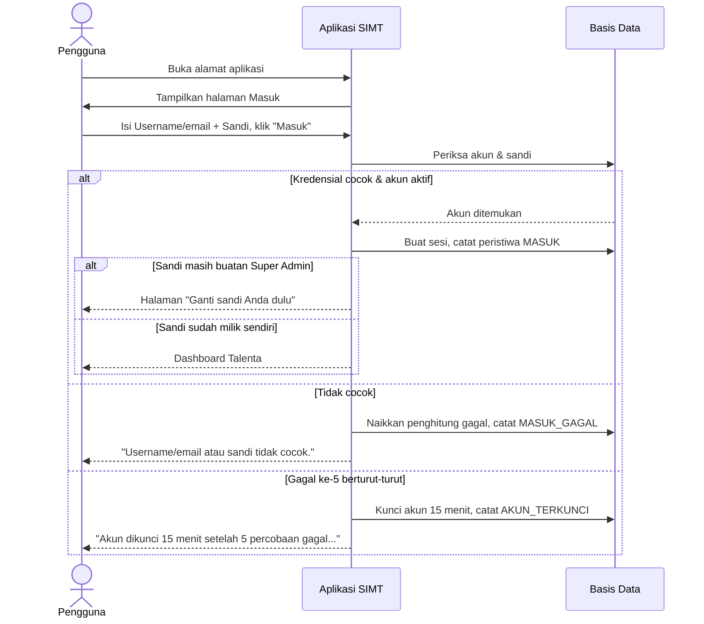

## 11.2 Menyusun formulasi jabatan target (Tahap A)

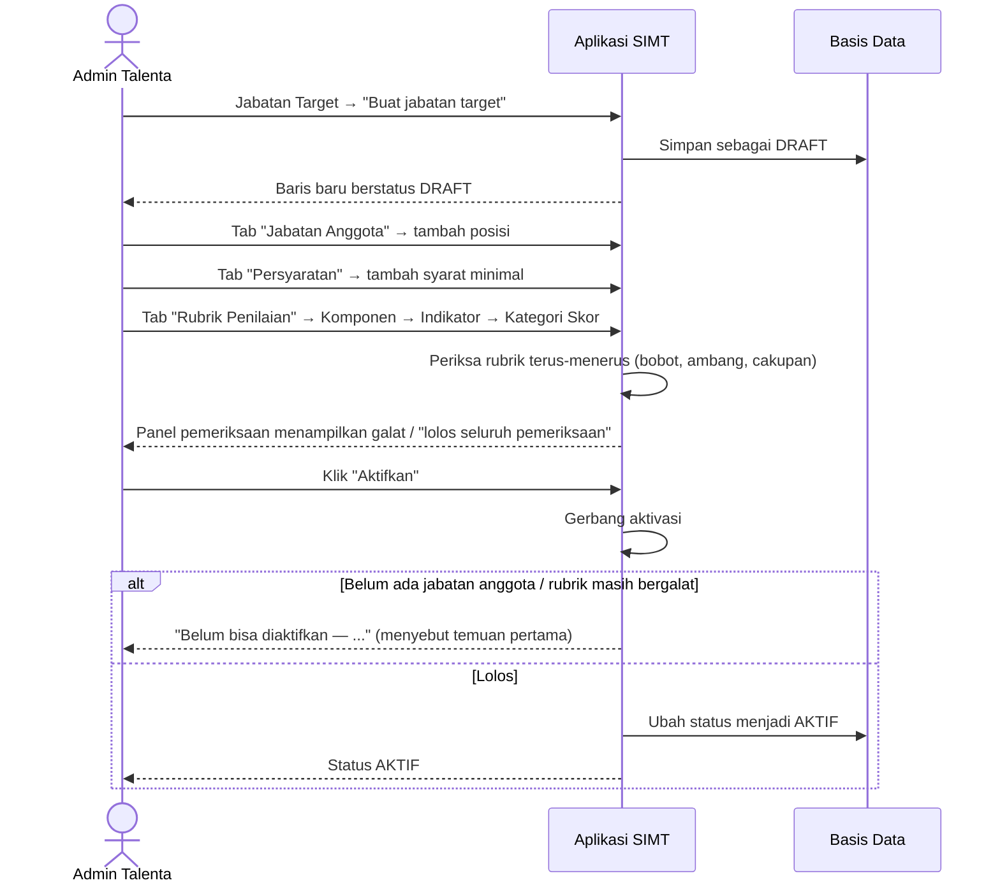

## 11.3 Perhitungan skor (Tahap C)

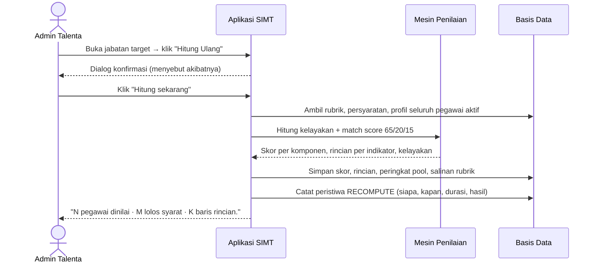

> **Nilai yang pernah diisi manual dipertahankan** dan tidak tertimpa oleh perhitungan ulang.

## 11.4 Nominasi → Verifikasi → Penetapan Suksesor (Tahap D)

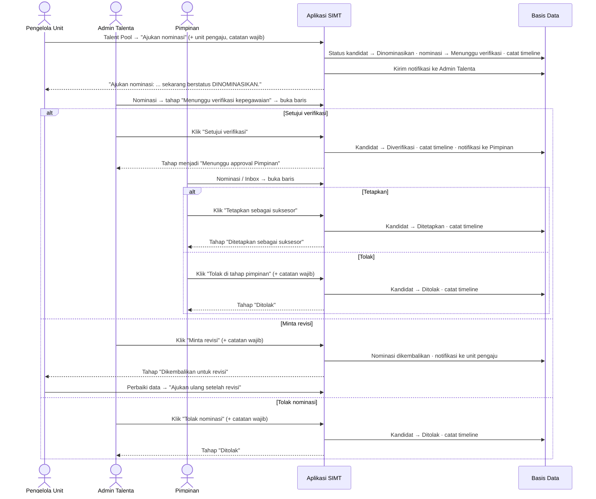

### Tabel keputusan lengkap

| Tindakan | Boleh dijalankan | Dari keadaan | Menjadi | Catatan wajib |
|---|---|---|---|:--:|
| **Ajukan nominasi** | Pengelola Unit · Admin Talenta · Super Admin | Kandidat (belum ada nominasi) | Dinominasikan · Menunggu verifikasi | ✓ |
| **Ajukan ulang setelah revisi** | Pengelola Unit · Admin Talenta · Super Admin | Dikembalikan untuk revisi | Menunggu verifikasi | ✓ |
| **Setujui verifikasi** | Admin Talenta · Super Admin | Menunggu verifikasi | Diverifikasi · Menunggu Pimpinan | — |
| **Minta revisi** | Admin Talenta · Super Admin | Menunggu verifikasi | Dikembalikan untuk revisi | ✓ |
| **Tolak nominasi** | Admin Talenta · Super Admin | Menunggu verifikasi | Ditolak | ✓ |
| **Tetapkan sebagai suksesor** | Pimpinan · Super Admin | Diverifikasi | Ditetapkan | — |
| **Tolak di tahap pimpinan** | Pimpinan · Super Admin | Diverifikasi | Ditolak | ✓ |
| **Batalkan penetapan** | Pimpinan · Super Admin | Ditetapkan | Diverifikasi | ✓ |
| **Keluarkan dari pool** | Admin Talenta · Super Admin | Kandidat | Ditolak | ✓ |
| **Pulihkan sebagai kandidat** | Admin Talenta · Super Admin | Ditolak | Kandidat | ✓ |

> **Satu keputusan mengubah tiga hal sekaligus**: status kandidat di talent pool, status nominasi, dan satu baris di timeline persetujuan. Ketiganya ditulis bersamaan, jadi tidak mungkin ada keadaan setengah jalan.

## 11.5 Mengunduh laporan

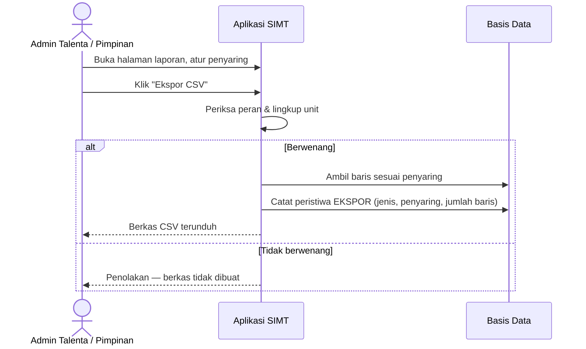

## 11.6 Menyiapkan data pegawai (Tahap B)

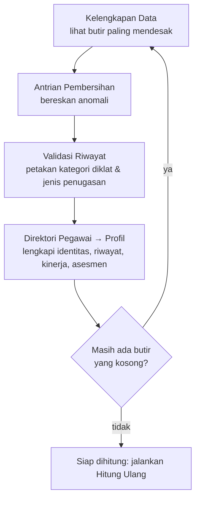

**Urutan ini disengaja.** Mengerjakan Validasi Riwayat **sebelum** Hitung Ulang penting, karena indikator *Pengembangan Kompetensi* dan *Substansi Riwayat Jabatan* membaca kategori hasil validasi — bukan teks nama diklat. Diklat yang belum dipetakan tidak akan dihitung meskipun namanya sudah tercatat.

---

# 12. Troubleshooting

## 12.1 Login gagal

**Yang terjadi:** Anda mengisi username & sandi, menekan **Masuk**, dan muncul pesan merah.

| Pesan | Artinya | Yang harus dilakukan |
|---|---|---|
| *"Username/email atau sandi tidak cocok."* | Username/email salah, sandi salah, **atau** akun sedang nonaktif. Sistem sengaja tidak membedakan ketiganya | Periksa ejaan username. Bila yakin benar, hubungi Super Admin — akun Anda mungkin dinonaktifkan |
| *"Akun terkunci sementara karena terlalu banyak percobaan gagal. Coba lagi dalam 15 menit, atau hubungi Super Admin."* | Sudah 5 kali gagal berturut-turut | Tunggu 15 menit, **jangan mencoba lagi** — percobaan baru tidak akan berhasil. Atau minta Super Admin membuka kuncinya |
| *"Akun dikunci 15 menit setelah 5 percobaan gagal. Hubungi Super Admin bila Anda tidak melakukannya."* | Percobaan ke-5 baru saja mengunci akun | Sama seperti di atas. Bila bukan Anda yang mencoba, laporkan — bisa jadi ada yang menebak sandi akun Anda |

> **Mengapa pesannya sama untuk semua sebab?** Bila pesannya berbeda, halaman masuk berubah menjadi alat untuk memeriksa siapa saja yang punya akun di sistem kepegawaian. Itu disengaja, bukan kekurangan.

## 12.2 Sesi berakhir / tiba-tiba diminta masuk lagi

**Gejala:** Anda sedang membuka halaman, lalu tiba-tiba diantar ke halaman **Masuk**.

**Sebabnya salah satu dari:**

| Sebab | Keterangan |
|---|---|
| Tidak ada aktivitas selama 60 menit | Tenggat diam |
| Sudah 12 jam sejak Anda masuk | Tenggat mutlak |
| Super Admin mengubah **peran** atau **unit** akun Anda | Sesi diputus seketika agar wewenang lama tidak menempel |
| Super Admin **menonaktifkan** akun Anda | Hubungi Super Admin |
| Anda mengakhiri sesi ini dari perangkat lain (**Profil Saya → Akhiri**) | Perilaku yang diharapkan |

**Yang harus dilakukan:** masuk lagi. Aplikasi akan **mengembalikan Anda ke halaman yang tadi Anda tuju**.

## 12.3 "Akses ditolak"

**Gejala:** halaman terbuka, tetapi isinya kotak **Akses ditolak** beserta penjelasan dan penyebutan peran Anda.

**Artinya:** halaman tersebut memang bukan untuk peran Anda. Bukan kerusakan.

**Yang harus dilakukan:** bila Anda memang membutuhkannya untuk bekerja, mintalah Super Admin meninjau peran akun Anda melalui **Pengguna & Peran**.

## 12.4 Tombol terlihat, tetapi menyimpan ditolak

**Gejala:** Anda menekan **Simpan**, lalu muncul pemberitahuan:
> *"Peran Anda (Pengelola Unit) tidak berwenang melakukan ini. Dibutuhkan salah satu: Super Admin."*

**Artinya:** halaman itu dapat Anda baca, tetapi **tindakannya** bukan wewenang Anda. Tidak ada data yang berubah.

**Yang harus dilakukan:** mintakan tindakan tersebut kepada peran yang disebut dalam pesan.

## 12.5 Data tidak tersimpan — pesan validasi

**Gejala:** setelah menekan **Simpan**, dialog tetap terbuka dan ada teks merah di sebelah kolom.

**Artinya:** ada isian yang belum sesuai aturan. **Data tidak disimpan sama sekali.**

Contoh pesan yang benar-benar muncul di aplikasi:

| Halaman | Pesan |
|---|---|
| Tambah pegawai | *"NIP harus tepat 18 angka, tanpa spasi atau tanda baca"* |
| Buat jabatan target | *"Kode target minimal 3 karakter"* · *"Nama jabatan target minimal 5 karakter"* |
| Tambah pengguna | *"Username minimal 3 karakter"* · *"Username hanya boleh huruf kecil, angka, titik, garis bawah, strip"* · *"Format email tidak valid"* |
| Isi nilai manual | *"Nilai tidak boleh kosong"* · *"Catatan wajib diisi — dasar penilaiannya harus bisa ditelusuri"* |
| Aksi workflow | *"‘Minta revisi’ perlu catatan — keputusan yang mengubah peringkat orang harus bisa ditelusuri alasannya."* |
| Ajukan nominasi | *"Unit pengaju harus dipilih. Nominasi diajukan atas nama unit, bukan atas nama pribadi."* |

**Yang harus dilakukan:** perbaiki kolom yang ditandai, lalu **Simpan** lagi.

## 12.6 Data duplikat

**Gejala:**
> *"Kode unit "…" itu sudah dipakai baris lain. Pakai nilai yang berbeda."*

**Artinya:** kode/username/email tersebut sudah dipakai baris lain. **Yang harus dilakukan:** pakai nilai yang berbeda, atau cari baris lama yang sudah memakainya.

## 12.7 Data tidak bisa dihapus

**Gejala:**
> *"Data ini masih dipakai baris lain, jadi tidak bisa dihapus. Lepaskan keterkaitannya lebih dulu."*

atau pada unit organisasi: penolakan yang **menyebutkan jumlah** turunan/jabatan yang masih menempel.

**Yang harus dilakukan:** pindahkan atau lepaskan dulu data yang menempel, baru hapus.

Beberapa data memang **sengaja tidak bisa dihapus**, hanya dinonaktifkan:

| Data | Alasan |
|---|---|
| Catatan hukuman disiplin | Dasar skor integritas yang sudah dipakai menghitung match score |
| Kategori riwayat diklat | Dasar skor yang harus tetap bisa dipertanggungjawabkan |
| Jabatan target yang sudah punya anggota talent pool | Menghapusnya ikut menghapus riwayat nominasi & persetujuan |
| Rencana pengembangan berstatus **Selesai** | Rekam jejak pengembangan |
| Token API yang dicabut | Log aktivitas menunjuk padanya |

## 12.8 Jabatan target tidak bisa diaktifkan

**Gejala:**
> **Belum bisa diaktifkan** — *"Rubrik masih punya N galat sehingga skornya akan salah. Yang pertama: …"*
> atau *"Belum ada jabatan anggota…"*

**Yang harus dilakukan:** ikuti temuan yang disebutkan. Dua penyebab paling sering:
1. Tab **Jabatan Anggota** masih kosong → tambahkan minimal satu posisi.
2. Rubrik belum lengkap → lengkapi komponen/indikator/kategori sesuai temuan pada panel pemeriksaan.

## 12.9 Jabatan tidak bisa ditandai kosong

**Gejala:**
> *"Jabatan ini masih ditempati N pegawai aktif (…), jadi tidak bisa ditandai kosong. Pindahkan pegawainya lebih dulu."*

**Yang harus dilakukan:** perbarui jabatan pegawai yang masih menempatinya (lewat **Profil Talenta → Ubah data**), lalu ulangi.

## 12.10 Keadaan sudah berubah — nominasi

**Gejala:** Anda menekan tombol keputusan, lalu muncul pesan panjang yang menyebut status kandidat sekarang, aksi apa yang masih mungkin, dan diakhiri:
> *"… Kemungkinan besar keadaannya sudah berubah oleh orang lain — muat ulang halaman."*

**Artinya:** rekan Anda bertindak lebih dulu atas berkas yang sama.

**Yang harus dilakukan:** muat ulang halaman (F5), lalu lihat keadaan terbarunya.

## 12.11 Skor kandidat tidak berubah setelah data diperbaiki

**Artinya:** perhitungan **tidak berjalan otomatis**.

**Yang harus dilakukan:** minta Admin Talenta menjalankan **Hitung Ulang** pada jabatan target yang bersangkutan. Angka baru muncul setelah itu.

## 12.12 Diklat sudah dicatat tetapi skornya tetap 0

**Artinya:** nama diklat itu **belum dipetakan** ke kategori di **Validasi Riwayat**. Indikator *Pengembangan Kompetensi* membaca kategori hasil validasi, bukan teks nama diklat.

**Yang harus dilakukan:**
1. Buka **Data & Kualitas › Validasi Riwayat**.
2. Cari nama diklatnya pada **Antrian nama diklat**.
3. Pilih kategori → **Simpan** (atau **Bukan kategori apa pun** bila memang tidak masuk kategori mana pun).
4. Minta Admin Talenta menjalankan **Hitung Ulang**.

## 12.13 Laporan Gap Analysis kosong

**Gejala:**
> *"Belum ada skor yang bisa dianalisis — Gap dihitung dari rincian skor per indikator. Jalankan Hitung Ulang pada jabatan target lebih dulu — tanpa itu tidak ada rincian yang tersimpan."*

**Yang harus dilakukan:** jalankan **Hitung Ulang** pada jabatan target lebih dulu.

## 12.14 Pegawai tidak ditemukan

**Gejala:** halaman **"Pegawai tidak ditemukan"** dengan keterangan *"NIP yang dituju tidak ada di basis data. Mungkin pegawai sudah dihapus, atau NIP-nya keliru — periksa kembali dari Direktori Pegawai."*

**Sebab yang mungkin:** NIP salah ketik, pegawainya memang tidak ada, **atau** — bila Anda Pengelola Unit — pegawai itu berada **di luar lingkup unit Anda**.

## 12.15 Halaman tidak ditemukan (404)

**Gejala:** halaman **"Halaman tidak ditemukan"** dengan tombol **Kembali ke Dashboard**.

**Yang harus dilakukan:** klik tombol itu, lalu gunakan menu atau **Ctrl+K** untuk mencari halaman yang Anda maksud.

## 12.16 Halaman gagal dimuat

**Gejala:** kotak **"Halaman gagal dimuat"** dengan tombol **Coba lagi**. Sidebar & navbar tetap ada.

**Yang harus dilakukan:**
1. Klik **Coba lagi**.
2. Bila tetap gagal, muat ulang halaman.
3. Bila masih gagal, laporkan ke tim teknis beserta **alamat halaman** dan **jam kejadian**. Bila pesannya menyebut koneksi basis data, itu berarti layanan basis data sedang tidak dapat dihubungi — bukan kesalahan Anda.

## 12.17 Halaman terlihat normal tetapi tidak ada yang bisa diklik

**Gejala:** halaman tampil lengkap, tetapi pengalih tema, menu pengguna, pencarian, dan tombol-tombol **mati semua sekaligus**. Tema mungkin terkunci di mode gelap.

**Artinya:** ini bukan masalah tampilan.

**Yang harus dilakukan:** laporkan ke tim teknis dan sebutkan **alamat serta port persis yang Anda buka** (mis. `localhost:3000`, alamat IP, atau nama server). Informasi itu adalah petunjuk pertama yang mereka butuhkan.

## 12.18 Angka di dashboard terlihat aneh

**Yang harus diperiksa berurutan:**

1. **Data & Kualitas › Konsolidasi Data** — apakah ada sinkronisasi yang **gagal**? Itu penyebab paling umum.
2. **Data & Kualitas › Kelengkapan Data** — apakah datanya memang belum lengkap?
3. Kapan **Hitung Ulang** terakhir dijalankan (kolom *Dihitung terakhir* di daftar Jabatan Target)?
4. Apakah **Pengaturan Sistem** baru saja diubah? Perubahan parameter **tidak berlaku surut** — jalankan Hitung Ulang di tiap jabatan target setelahnya.

---

# 13. Catatan

## 13.1 Fitur yang belum tersedia

Fitur berikut disebut dalam dokumen perencanaan proyek, tetapi **belum ditemukan pada aplikasi** saat analisis ini dilakukan. Dicatat di sini agar tidak dicari-cari.

| Fitur | Keadaan sekarang |
|---|---|
| **Tombol sinkronisasi manual** dari halaman Konsolidasi Data | Belum ada. Mekanisme sumber data produksi belum diputuskan |
| **Sambungan ke eHRM dan eKinerja** | Belum tersambung. Riwayat sinkronisasi keduanya pada halaman Konsolidasi Data adalah **data contoh**, dan halaman itu menandainya |
| **Ekspor Excel (.xlsx) dan PDF** | Baru tersedia **CSV** (dapat dibuka Excel & LibreOffice) |
| **Ekspor gambar grafik** | Belum ada |
| **Unggah berkas** (SK hukuman disiplin, arsip ijazah, sertifikat) | Belum ada. Kolomnya menyimpan rujukan saja |
| **Pengiriman email** (reset sandi, notifikasi keluar) | Belum ada. Halaman Lupa Sandi menyatakan hal ini apa adanya dan mengarahkan ke Super Admin |
| **Tarik nominasi** oleh unit pengaju | Belum ada. Unit yang salah mengajukan meminta Admin Talenta menolaknya |
| **Rincian laporan per persyaratan** jabatan target | Belum dapat ditampilkan; halaman Gap Analysis menyatakannya |
| **Impor struktur organisasi dari berkas Excel** melalui antarmuka | Belum ada |
| **Lencana jumlah notifikasi belum dibaca** di navbar/sidebar | Belum ada. Pekerjaan yang menunggu tetap terlihat di **Inbox Tugas** |

## 13.2 Perbedaan antara dokumen dan aplikasi

Dua hal berikut ditemukan saat memeriksa aplikasi langsung, dan **berbeda dari matriks hak akses yang tertulis di dokumen perencanaan**. Keduanya sudah tercatat di dokumen proyek sebagai butir yang menunggu keputusan pemilik proses.

**a. Menu yang tersembunyi tidak selalu berarti halamannya terkunci.**

Halaman **Jabatan Target** (beserta Kandidat & Eligibility dan Simulasi & Diff), **Rencana Pengembangan**, **Unit Organisasi**, **Jabatan**, **Konsolidasi Data**, **Antrian Pembersihan**, dan **Kelengkapan Data** **tetap dapat dibuka oleh semua peran** bila alamatnya diketik langsung, walaupun menunya disembunyikan. Daftar lengkapnya ada di [4.3](#43-catatan-penting-tentang-matriks-ini).

Yang **tidak** berubah: setiap upaya **menyimpan** tetap ditolak di server sesuai peran. Jadi tidak ada data yang dapat diubah di luar wewenang — yang terjadi hanyalah halaman itu bisa **dibaca** oleh peran yang menurut rancangan tidak seharusnya membacanya.

**b. Sebagian tombol ubah masih terlihat oleh peran yang tidak berwenang.**

Pada halaman **Profil Talenta**, tombol **Ubah data** / **Tambah** / **Ubah** tetap tampil untuk **Pimpinan** dan **Viewer**. Demikian pula tombol **Tambah unit** dan **Tambah jabatan** pada halaman master, bila halamannya dibuka lewat alamat langsung.

Menekan **Simpan** pada tombol-tombol itu **selalu ditolak** dengan pesan yang menyebut peran Anda dan peran yang dibutuhkan, dan **tidak ada data yang berubah**. Perilaku ini sudah diuji langsung.

> **Rekomendasi kepada pemilik proses:** tentukan mana yang benar — dokumen perencanaan yang belum lengkap, atau halaman yang perlu ditambahi gerbang baca. Selama belum diputuskan, keamanan data **tidak terganggu** karena seluruh perubahan tetap ditolak di server; yang terganggu adalah keterbacaan sebagian halaman oleh peran yang tidak berkepentingan.

## 13.3 Hal yang belum dapat dipastikan dari analisis ini

| Butir | Keterangan |
|---|---|
| **Alamat aplikasi di lingkungan produksi** | Belum ditetapkan. Panduan ini memakai alamat lingkungan pengembangan |
| **Skala nilai Potkom dari sumber e-Nominasi** | Sebagian nilai melebihi 100. Skala sebenarnya menunggu jawaban pengelola e-Nominasi. Klasifikasi Kotak 9 tidak terpengaruh, tetapi angka Potkom yang ditampilkan mengikuti sumber apa adanya |
| **Sumber resmi data Penilaian Kinerja** | Dokumen sumber saling bertentangan (eKinerja vs karir.pu.go.id/enom). Label yang dipakai sekarang mengikuti dokumen yang lebih lama |
| **Apakah kandidat yang tidak lolos syarat ikut masuk peringkat** | Sekarang **ikut masuk**, dan halaman kandidat menandainya. Menunggu penegasan pemilik proses |

## 13.4 Catatan keamanan sebelum aplikasi dipakai sungguhan

| # | Yang wajib dilakukan |
|---|---|
| 1 | **Ganti seluruh sandi akun** — termasuk seluruh akun uji coba pada bab [2.2](#22-login) — melalui **Pengguna & Peran**, lalu nonaktifkan akun yang tidak dipakai |
| 2 | **Akses wajib melalui HTTPS.** Melalui HTTP biasa, sesi tidak dapat dijaga dengan benar |
| 3 | **Cabut seluruh token API contoh** melalui **Klien & Token API**, lalu terbitkan token baru untuk tiap instansi yang benar-benar punya MoU/PKS |
| 4 | Data pegawai (NIP, kinerja, hukuman disiplin, foto) adalah **data pribadi** yang dilindungi **UU No. 27 Tahun 2022 tentang Pelindungan Data Pribadi**. Setiap unduhan CSV mengeluarkan data dari batas aplikasi — setelah berkas terunduh, tidak ada aturan akses di aplikasi yang masih berlaku atasnya |

## 13.5 Tentang tangkapan layar

Panduan ini **tidak menyertakan tangkapan layar**. Seluruh halaman aplikasi memuat data pegawai sungguhan (nama, NIP, nilai kinerja, rekam jejak disiplin) yang termasuk data pribadi menurut UU No. 27 Tahun 2022; menyalinnya ke dalam dokumen yang bisa beredar akan memperluas persebarannya di luar kendali aplikasi.

Sebagai gantinya, seluruh nama menu, judul halaman, label tombol, isi formulir, dan pesan sistem di panduan ini **disalin apa adanya dari layar aplikasi yang berjalan**, sehingga tetap dapat dicocokkan satu per satu. Bila tangkapan layar tetap diperlukan untuk penyerahan dokumen, sebaiknya dibuat dari **data contoh yang sudah disamarkan**.

## 13.6 Sumber yang dipakai menyusun panduan ini

| Sumber | Cara dipakai |
|---|---|
| **Aplikasi yang berjalan** | Prioritas utama. Kelima peran benar-benar dimasukkan, 32 alamat halaman dibuka satu per satu untuk tiap peran, dan seluruh dialog utama dibuka untuk mencatat isian & tombolnya. Pesan kesalahan pada [Bab 12](#12-troubleshooting) diperoleh dengan benar-benar memicu keadaannya (sandi salah, isian tidak sah, menyimpan tanpa wewenang, mengaktifkan jabatan target yang rubriknya belum lengkap) |
| **Kode program aplikasi** | Untuk memastikan daftar wewenang per tindakan, aturan validasi, dan pesan kesalahan yang mungkin muncul |
| **Dokumen proyek** (proses bisnis, spesifikasi kebutuhan, spesifikasi produk, panduan pengguna internal) | Sebagai rujukan istilah dan konteks proses. Bila berbeda dengan aplikasi, yang dipakai adalah aplikasi |

**Satu pengecualian yang perlu disebut.** Dua tampilan tidak dapat dibuka langsung tanpa mengubah data akun sungguhan, sehingga teksnya diambil dari aplikasi tanpa dirender di peramban: halaman **"Ganti sandi Anda dulu"** ([2.3](#23-ganti-sandi-pertama-kali-wajib)) — hanya muncul bagi akun yang sandinya baru dibuatkan Super Admin — dan tampilan **"Permintaan tercatat"** setelah mengajukan pengaturan ulang sandi ([2.4](#24-lupa-sandi)). Kalimat yang dikutip tetap kalimat milik aplikasi, bukan karangan.

---

*Dokumen ini disusun berdasarkan keadaan aplikasi pada 23 Agustus 2026. Bila di kemudian hari ada nama menu atau label tombol yang tidak Anda temukan, kemungkinan besar panduan ini yang perlu diperbarui — bukan Anda yang salah lihat.*
